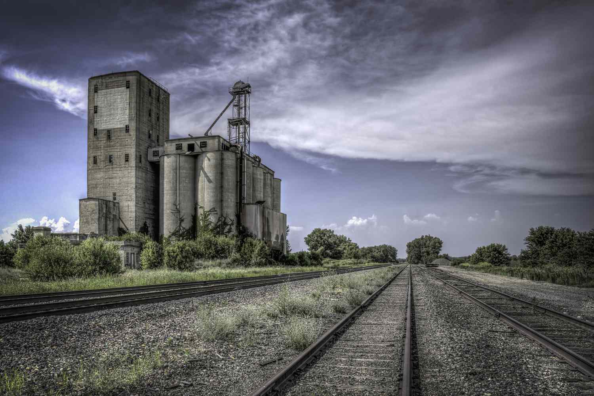

## Table of Contents

## What is a terminal elevator?

A terminal elevator is a big building used to store and move grain, like wheat or corn. Farmers bring their grain to the elevator, where it is weighed and checked for quality. The grain is then stored in large bins inside the elevator until it is ready to be sent to places like factories or other countries.

From the terminal elevator, the grain can be loaded onto trains, trucks, or ships to be transported. This helps make sure that the grain gets to where it needs to go, whether it's to make food or to be sold in different markets. Terminal elevators are important because they help manage the supply of grain and keep it safe until it's time to use it.

## How does a terminal elevator differ from a country elevator?

A terminal elevator and a country elevator are both used to store and move grain, but they have different jobs. A country elevator is usually found in farming areas. Farmers take their grain to the country elevator right after they harvest it. The country elevator stores the grain for a short time and then sends it to a terminal elevator or directly to places like mills or feed lots.

A terminal elevator is bigger and is often located near big cities, ports, or rail lines. It gets grain from country elevators or directly from farmers. The terminal elevator can store a lot of grain for a longer time. From there, the grain is sent to different places around the world, like other countries or big factories. So, while country elevators are more about collecting grain from farmers, terminal elevators are more about distributing grain to where it needs to go.

## What are the main functions of a terminal elevator?

A terminal elevator's main job is to store a lot of grain, like wheat or corn, for a long time. It is a big building that can hold grain from many farmers. When farmers have more grain than they need, they bring it to the terminal elevator. There, the grain is weighed and checked to make sure it is good. The elevator keeps the grain safe in big bins until it is time to move it.

The other main function of a terminal elevator is to send the grain to different places. It is usually located near big cities, ports, or train lines, so it can easily move the grain. From the terminal elevator, the grain can be loaded onto trains, trucks, or ships. This helps get the grain to factories where it is turned into food, or to other countries where it is sold. The terminal elevator helps make sure that there is enough grain where it is needed.

## Where are terminal elevators typically located?

Terminal elevators are usually found near big cities, ports, or train lines. They need to be in these places because they have to move a lot of grain to different parts of the world. Being close to a port means the grain can be put on ships and sent to other countries. Being near train lines means the grain can be loaded onto trains and moved across the country.

These locations help the terminal elevators do their job of storing and sending out grain. They can keep the grain safe in big bins until it is time to move it. Then, they can easily get the grain onto trucks, trains, or ships to go where it needs to go. This makes sure that the grain gets to factories to be turned into food or to markets where it can be sold.

## What types of grains are commonly handled at terminal elevators?

Terminal elevators handle many types of grains, but the most common ones are wheat, corn, and soybeans. These grains are important because they are used to make a lot of food. Wheat is used to make bread, pasta, and other baked goods. Corn is used for things like cornmeal, corn syrup, and animal feed. Soybeans are used for oil and protein products.

Sometimes, terminal elevators also handle other grains like oats, barley, and rye. Oats are used for oatmeal and animal feed. Barley is used for making beer and animal feed too. Rye is used for bread and whiskey. These grains are not as common as wheat, corn, and soybeans, but they are still important for different kinds of food and drinks.

All these grains are stored in big bins at the terminal elevator until they are ready to be sent to places like factories or other countries. The terminal elevator makes sure the grains stay safe and dry until it is time to move them.

## How does the process of grain handling work at a terminal elevator?

When grain arrives at a terminal elevator, it is first weighed and checked for quality. Farmers or trucks bring the grain to the elevator, where it is tested to make sure it is good. If the grain passes the test, it is moved into the elevator. Inside the elevator, there are big bins where the grain is stored. These bins keep the grain safe and dry until it is time to send it somewhere else. The elevator can hold a lot of grain from many different farmers.

When it is time to move the grain, workers at the terminal elevator load it onto trains, trucks, or ships. The elevator is usually near a port or train lines, so it is easy to get the grain where it needs to go. The grain can be sent to factories where it is turned into food, like bread or corn syrup. It can also be sent to other countries where it is sold. The terminal elevator helps make sure there is enough grain to go around and that it gets to the right places.

## What are the key components of a terminal elevator?

A terminal elevator has several important parts that help it do its job. The first part is the receiving area, where farmers or trucks bring the grain. Here, the grain is weighed and checked to make sure it is good. If it passes the test, it moves to the next part, which is the storage area. The storage area has big bins where the grain is kept safe and dry until it is time to send it somewhere else.

The second part of a terminal elevator is the loading area. This is where the grain is loaded onto trains, trucks, or ships to be sent to factories or other countries. The loading area needs to be near a port or train lines so it is easy to move the grain. The last part is the control room, where workers keep an eye on everything. They make sure the grain is stored and moved correctly, and they can fix any problems that come up. All these parts work together to help the terminal elevator store and move a lot of grain.

## What safety measures are implemented at terminal elevators?

At terminal elevators, safety is very important because they handle a lot of grain and big machines. Workers wear special gear like hard hats, safety glasses, and gloves to protect themselves. They also follow strict rules to make sure they stay safe. For example, they use signs and warnings to tell people about dangers, and they have to be trained to know how to work safely around the grain and machines. There are also emergency plans in case something goes wrong, so everyone knows what to do to stay safe.

Another important safety measure is keeping the elevator clean and well-maintained. Dust and spills can be dangerous, so workers clean up regularly to prevent accidents. Machines are checked often to make sure they are working right and not broken. There are also safety systems like fire alarms and sprinklers to help stop fires. All these things help make sure that the terminal elevator is a safe place to work and store grain.

## How do terminal elevators impact the local economy?

Terminal elevators can help the local economy a lot. They create jobs for people in the area. People work at the elevator to handle the grain, drive trucks, and manage the operations. This means more people have work and money to spend in their community. The elevator also brings in money from farmers who sell their grain there. This money helps the local economy grow because farmers can spend it on things they need, like supplies and services.

Terminal elevators also help the local economy by making it easier to move grain to other places. When grain is sent from the elevator to factories or other countries, it helps businesses in the area. These businesses can grow and create more jobs. Plus, the elevator can attract other businesses that need to be near it, like companies that make or sell things related to grain. This can bring more money and jobs to the local area, making the economy stronger.

## What are the environmental concerns associated with terminal elevators?

Terminal elevators can have some effects on the environment. One big concern is dust. When grain is moved around, it can create a lot of dust. This dust can make the air dirty and cause problems for people who live nearby. It can also harm plants and animals. Another concern is the energy that terminal elevators use. They need a lot of power to run their machines and move the grain. This can lead to more pollution from the energy sources, like coal or gas, that power the elevators.

There are also worries about what happens to the waste from the elevators. Sometimes, grain can get wet or go bad, and this waste needs to be thrown away. If it is not handled right, it can pollute the soil and water. Terminal elevators also take up a lot of space, which can mean less room for nature. Building and running these big elevators can change the land and affect the plants and animals that live there. People who run terminal elevators try to use ways to reduce these problems, but they are still important to think about.

## How has technology improved the efficiency of terminal elevators?

Technology has made terminal elevators work better in many ways. Computers and special software help keep track of the grain. They can tell how much grain is in each bin and when it needs to be moved. This means the grain is used in the best way possible. Machines that move the grain, like conveyor belts and loaders, are now faster and can be controlled by computers. This makes it easier to load the grain onto trucks, trains, or ships without wasting time or grain.

New technology also helps keep the grain safe and dry. Sensors can check the temperature and moisture of the grain all the time. If something is wrong, the sensors can tell workers right away so they can fix it. This helps stop the grain from going bad. Also, cameras and other tools help workers see what is happening in the elevator, even from far away. This makes it easier to find and fix problems quickly, making the whole process smoother and more efficient.

## What are the future trends and innovations expected in terminal elevator operations?

In the future, terminal elevators are expected to use more smart technology to work even better. This means using more computers and special programs to keep track of the grain and make sure it is moved and stored in the best way. They might use robots and drones to help with moving the grain around, making the job easier and faster. Also, new ways to check the grain, like better sensors and cameras, will help make sure it stays safe and dry. These new tools will help terminal elevators save time and money while making sure the grain is handled well.

Another big change coming to terminal elevators is a focus on being kinder to the environment. People are thinking of ways to use less energy and make less waste. This could mean using solar panels or wind power to run the elevators instead of dirty energy like coal or gas. There might also be new ways to handle the grain so less of it goes bad and turns into waste. These changes will help make terminal elevators more eco-friendly and help the planet.

## What is Basis Trading in Terminal Elevators?

Basis trading is a strategic approach utilized by terminal elevators to mitigate the risks associated with price [volatility](/wiki/volatility-trading-strategies) in the grain markets. This method leverages the difference between the spot price and the futures price of a commodity. Terminal elevators play a pivotal role by engaging in basis trading, allowing them to hedge against adverse price movements over designated time frames. 

When elevators conduct basis trading, they purchase futures contracts at the same time they sell the physical grain. This locks in prices ahead of time, ensuring profitability even when the market experiences fluctuations. The core advantage of this strategy is the ability to secure a predictable margin, thereby minimizing the financial impact of volatile commodity prices.

A formal representation of basis can be denoted as:

$$
\text{Basis} = \text{Spot Price} - \text{Futures Price}
$$

Favorable basis conditions are identified when the basis is strong (narrow or positive), indicating that the spot price is higher relative to the futures price. In contrast, a weak basis (wide or negative) suggests the futures price surpasses the spot price. Understanding these local basis variations becomes crucial for terminal elevators to make strategic decisions on positioning—either going long (buying futures) or short (selling futures) the basis.

Advanced decision-making in basis trading is often supported by algorithmic models that analyze historical data, market trends, and real-time information. By doing so, elevators can optimize the timing and hedging strategies to maximize profitability. The combination of these strategies not only provides a financial safety net against market unpredictability but also enhances the efficiency of grain market operations, contributing to a more stable supply chain for agricultural commodities. 

This risk management tool is essential for terminal elevators, enabling them to operate effectively despite the inherent market volatilities and ensuring continuous and reliable grain supply to the end markets.

## References & Further Reading

[1]: Saghaian, S., & Reed, M. (2004). ["Factors affecting the grain marketing margin: The case of corn and wheat market in the USA."](https://scholar.google.com/citations?user=1jqs4xQAAAAJ&hl=en) American Agricultural Economics Association.

[2]: Irwin, S. H., & Good, D. L. (1989). ["Market Efficiency and the Pricing of Agricultural Futures"](https://webdoc.agsci.colostate.edu/koontz/arec412/Resources/MORR_09-02.pdf). American Journal of Agricultural Economics, 71(2), 269-282.

[3]: Hull, J. C. (2018). ["Options, Futures, and Other Derivatives"](https://www.semanticscholar.org/paper/Options%2C-Futures%2C-and-Other-Derivatives-Hull/89bdee500c8623864fc9eb7a471546aa713acc44) (10th ed.). Pearson.

[4]: Lopez de Prado, M. (2018). ["Advances in Financial Machine Learning"](https://www.amazon.com/Advances-Financial-Machine-Learning-Marcos/dp/1119482089). Wiley.

[5]: Jansen, S. (2020). ["Machine Learning for Algorithmic Trading"](https://github.com/stefan-jansen/machine-learning-for-trading). Packt Publishing.