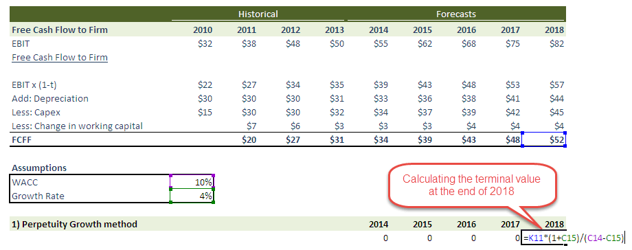

In finance, accurately valuing a company is crucial for making informed decisions, especially in the context of algorithmic trading. A key element in this valuation process is calculating the terminal value, which often comprises a significant portion of the enterprise's total value. The terminal value represents the present value of all future cash flows that a company expects to generate beyond a specified forecast period. 

This article examines the perpetuity growth model and the exit multiple approach, two primary methods for estimating terminal value. The perpetuity growth model, also known as the Gordon Growth Model, assumes that cash flows will increase at a constant rate indefinitely. In contrast, the exit multiple approach derives terminal value by applying a multiple based on comparable company analyses, reflecting the market's valuation of similar businesses.

Understanding these models is essential not just for fair enterprise valuation, but also for their application in algorithmic trading. By applying these valuation methods, algorithmic trading systems can enhance their trading strategies and optimize investment choices, potentially leading to better financial outcomes. This exploration provides insight into how terminal value calculations can support and improve decision-making processes within algorithmic trading platforms.

## Table of Contents

## Understanding Terminal Value in DCF Analysis

Discounted cash flow (DCF) analysis is a prevalent method for valuing investments and businesses by forecasting their future cash inflows and outflows. The core of DCF is to estimate the present value of projected cash flows, providing insights into a company’s potential financial performance. A crucial aspect of this process is the calculation of the terminal value, which extends forecasts beyond the explicit projection period, addressing the inherent uncertainty of longer-term cash flows. 

Mathematically, terminal value can be represented in various forms, but it primarily serves as a means to estimate the remaining value of an investment at the end of the projection period. Terminal value is a pivotal component, as it frequently comprises a substantial share—potentially up to 80%—of the total net present value (NPV) of a company. 

By incorporating terminal value, analysts can capture the entirety of a company’s valued cash flows, offering a more comprehensive assessment of its intrinsic value. Two primary methods prevail for calculating terminal value: the perpetuity growth model and the exit multiple approach, both of which aim to encapsulate ongoing company operations beyond immediate forecasts. The accuracy of terminal value greatly influences the reliability of the overall DCF analysis, empowering investors and financial professionals to make informed decisions based on a more complete financial picture.

## Exploring the Perpetuity Growth Model

The perpetuity growth model, often referred to as the Gordon Growth Model, provides a method for calculating the terminal value by assuming that a company’s cash flows will continue to grow at a constant rate indefinitely. This approach is useful for businesses with stable and predictable historical performance. The model is based on the formula:

$$

TV = \frac{FCF \times (1 + g)}{r - g} 
$$

where $TV$ represents the terminal value, $FCF$ stands for the free cash flow in the final forecasted year, $g$ is the perpetual growth rate, and $r$ symbolizes the discount rate or the company's cost of capital.

The perpetuity growth model often results in a higher terminal value compared to other methods due to the assumption of continuous growth into infinity. However, the accuracy of this valuation heavily hinges on the choice of the perpetual growth rate. Factors influencing this rate include the company’s historical growth patterns, industry dynamics, and overall economic conditions. Selecting an unrealistic growth rate can significantly skew valuation results.

Historically consistent and predictable growth enables the model to effectively estimate long-term value. Companies in mature industries with steady cash flow generation capabilities are prime candidates for applying this model. It is less applicable to sectors prone to rapid change or businesses with volatile earnings.

Although advantageous for its simplicity and straightforward application, the model’s reliance on perpetual growth assumptions can present challenges. Analysts must carefully select growth rates that are sustainable over the long term to avoid overestimating a company’s future financial potential. By appropriately balancing growth expectations with realistic economic considerations, the perpetuity growth model serves as a powerful tool in valuation processes.

## The Exit Multiple Approach

The [exit](/wiki/exit-strategy) multiple approach is a prominent method for calculating terminal value by applying a valuation multiple derived from the analysis of comparable companies. This approach involves assessing the company’s market valuation through widely used financial metrics such as EBITDA (Earnings Before Interest, Taxes, Depreciation, and Amortization) or EBIT (Earnings Before Interest and Taxes). The choice of multiple is crucial as it reflects the company's future potential for generating earnings, which investors need for estimating intrinsic value.

The process begins with identifying a group of similar companies within the same industry or operational niche. These comparable companies should ideally have similar growth prospects, risk profiles, and capital structures. By evaluating the market's current perception of these companies, an average or median multiple is calculated, which can then be applied to the subject company's financial metric (e.g., EBITDA). The formula used for this approach is:

$$
\text{Terminal Value} = \text{Multiple} \times \text{Metric}
$$

where the metric could be EBITDA or EBIT.

This method benefits from its relative nature. Unlike the perpetuity growth model, which projects indefinite future growth, the exit multiple approach hinges on tangible market benchmarks, making it relatively straightforward to implement and understand. However, because it is based on current market conditions, the reliability of this method is sensitive to fluctuations in market sentiment and economic cycles. Changes in industry trends, regulatory environments, or economic conditions can cause these multiples to vary, potentially skewing the terminal value.

In [algorithmic trading](/wiki/algorithmic-trading), the exit multiple approach can be used to evaluate and adjust trading strategies dynamically. Traders who incorporate real-time comparative analyses can update their algorithms to exploit discrepancies between the calculated and actual market multiples. However, it is crucial for quantitative models to account for the inherent [volatility](/wiki/volatility-trading-strategies) of market conditions that might affect the accuracy of exit multiple-derived valuations.

## Application in Algorithmic Trading

In algorithmic trading, the incorporation of valuation models such as the perpetuity growth model and exit multiple approach provides substantial analytical leverage. These models facilitate data-driven insights, enabling traders to enhance their trading strategies. 

Quantitative models in algorithmic trading rely heavily on these valuation measures to allocate capital efficiently, optimize portfolios, and establish trade targets. The precision of these models in determining terminal value significantly impacts decision-making processes, particularly in the allocation of resources to different asset classes. For example, traders can employ Python scripts to calculate terminal values, which in turn guide the allocation of assets. The integration of these calculations can efficiently match the investment objectives and risk tolerance of a trading strategy.

Understanding terminal value plays a crucial role in anticipating market movements. By obtaining a reliable estimate of a company's future cash flow potential, traders can identify discrepancies between market prices and intrinsic values. This knowledge enables more informed trade decisions. Accurate terminal value projections allow traders to identify undervalued or overvalued stocks, providing opportunities to capitalize on market mispricings.

Moreover, incorporating these valuation methodologies can yield insights into trend forecasting and risk management. Algorithmic models can simulate various market scenarios by adjusting growth rates and exit multiples, which help in foreseeing potential market shifts. Such foresight can be integral to devising hedging strategies and setting stop-loss parameters, thus mitigating potential risks associated with market volatility.

Ultimately, the ability of algorithmic traders to integrate and effectively use valuation models in predicting terminal value enhances their market engagement capabilities. By aligning algorithmic decisions with intrinsic value assessments, traders stand to potentially achieve higher returns while participating in an optimized trading environment.

## Comparing the Models: Benefits and Limitations

When comparing the perpetuity growth model and the exit multiple approach, it is essential to recognize the distinct characteristics each brings to terminal value estimation, alongside their inherent limitations.

The perpetuity growth model posits that cash flows grow at a constant rate indefinitely. This assumption simplifies modeling and is particularly effective for companies with predictable growth patterns. However, its simplicity can also be a limitation because the model's accuracy heavily relies on the appropriateness of the perpetual growth rate selected. If the growth rate is inaccurately projected or external factors disrupt the company's steady growth, this model could lead to significant misvaluation. For example, the formula for the perpetuity growth model is:

$$
\text{Terminal Value} = \frac{CF \times (1 + g)}{r - g}
$$

where $CF$ is the cash flow of the final forecasted period, $g$ is the perpetual growth rate, and $r$ is the discount rate.

On the other hand, the exit multiple approach calculates terminal value by applying a market-based multiple to financial metrics like EBITDA or EBIT. This method leverages contemporary market valuations of comparable companies to estimate terminal value, offering insights into a firm's position relative to its peers. Despite its utility, the model is vulnerable to fluctuations in market conditions, which can cause multiples to vary significantly, potentially leading to inaccurate valuations. The formula commonly used in this approach is:

$$
\text{Terminal Value} = \text{EBITDA} \times \text{Selected Multiple}
$$

Choosing the right model depends on the specific context and needs of the investment. For instance, the perpetuity growth model may be preferable for stable, mature companies with predictable cash flows, while the exit multiple approach could be better suited for volatile industries or when peer company data is readily available. Investors should consider their risk tolerance and the nature of the company being evaluated when selecting a model.

Given these factors, some practitioners advocate for using both approaches concurrently to calculate an average terminal value. This practice can provide a more balanced view by mitigating the limitations inherent in each model, potentially leading to a more nuanced and reliable valuation. By integrating different perspectives, investors are better equipped to handle the complexities of financial analysis and market dynamics.

## Conclusion

Calculating terminal value with accuracy is essential for robust financial analysis and effective algorithmic trading. Accurate terminal value estimates provide a reliable projection of a company's worth beyond the forecast period, which is crucial for assessing long-term investment potential. 

Understanding both the perpetuity growth model and the exit multiple approach empowers investors to make better strategic decisions. The perpetuity growth model, which relies on the assumption of constant growth in cash flows, is especially useful when a company exhibits stable and predictable performance. Conversely, the exit multiple approach, which estimates value based on current market valuations of similar businesses, provides a comparative analysis that reflects prevailing market conditions. The integration of these models offers a well-rounded perspective on the potential opportunities and risks of an investment.

Algorithmic traders benefit from these models by integrating calculated terminal values into their trading algorithms, potentially leading to higher returns and efficient market participation. By incorporating terminal value calculations, algorithmic trading systems can dynamically adapt to evolving market conditions and optimize portfolio allocations. This data-driven approach enables traders to anticipate market trends and make informed decisions, enhancing the precision and efficacy of their trading strategies. Ultimately, the informed application of these models contributes to more accurate valuations, promoting effective investment analysis and strategy development in the financial markets.

## References & Further Reading

[1]: Damodaran, A. (2012). ["Investment Valuation: Tools and Techniques for Determining the Value of Any Asset"](https://books.google.com/books/about/Investment_Valuation.html?id=5SRHAAAAQBAJ). John Wiley & Sons.

[2]: Koller, T., Goedhart, M., & Wessels, D. (2015). ["Valuation: Measuring and Managing the Value of Companies"](https://www.wiley.com/en-us/Valuation%3A+Measuring+and+Managing+the+Value+of+Companies%2C+7th+Edition-p-9781119610885). John Wiley & Sons.

[3]: Penman, S. H. (2012). ["Financial Statement Analysis and Security Valuation"](https://archive.org/details/financialstateme0000penm_r9u4). McGraw-Hill Education.

[4]: Gordon, M. J., & Shapiro, E. (1956). "Capital Equipment Analysis: The Required Rate of Profit." Management Science, 3(1), 102-110.

[5]: ["Valuation Techniques: Discounted Cash Flow, Earnings Quality, Measures of Value Added, and Real Options"](https://www.oreilly.com/library/view/valuation-techniques-discounted/9781118417607/) by David T. Larrabee and Jason C. Voss