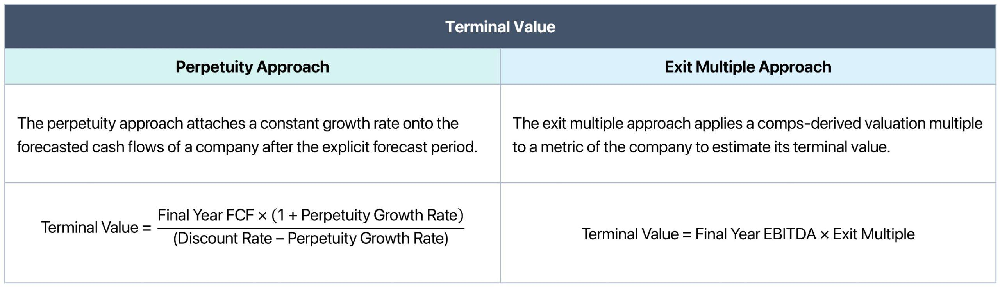

## Table of Contents

## What is terminal value and why is it important in financial valuation?

Terminal value is a key concept in financial valuation that represents the estimated value of a business or investment at the end of a specific period, usually after the forecast period in a discounted cash flow (DCF) analysis. It's like guessing what a company will be worth far into the future, beyond the years for which we can make detailed predictions. This value is important because it often makes up a large part of the total value of a company in a valuation model, especially for businesses expected to continue operating and generating cash flows indefinitely.

Understanding terminal value is crucial because it helps investors and analysts determine the long-term worth of a company. If you're trying to figure out if a company is a good investment, you need to consider not just the money it will make in the next few years, but also what it might be worth way down the line. By including terminal value in their calculations, analysts can get a fuller picture of a company's potential, making it easier to decide if buying, selling, or holding onto an investment is the right move.

## What are the different methods used to calculate terminal value?

There are two main ways to figure out terminal value: the Gordon Growth Model and the Exit Multiple Method. The Gordon Growth Model, also called the perpetuity growth model, assumes that a company will keep growing at a steady rate forever. To use this method, you take the last year's cash flow, guess a growth rate that's smaller than the economy's growth rate, and then use a formula to find out what all those future cash flows are worth today. It's like saying, "If this company keeps growing a little bit each year, what would it be worth in the end?"

The other way, the Exit Multiple Method, is a bit simpler. It involves looking at what similar companies are being sold for right now and using that information to guess what your company might be worth at the end of your forecast period. You take a financial measure like EBITDA (earnings before interest, taxes, depreciation, and amortization) from the last year of your forecast and multiply it by a number (the multiple) that you get from looking at other companies. This method is handy because it's based on real market data, but it can be tricky because the value of that multiple can change over time.

Both methods have their pros and cons. The Gordon Growth Model is great for companies that are expected to keep growing steadily, but it can be hard to pick the right growth rate. The Exit Multiple Method is easier to understand and use, but it depends a lot on what's happening in the market at the time. Choosing the right method depends on the company you're looking at and what you think will happen in the future.

## Can you explain the Perpetuity Growth Model for calculating terminal value?

The Perpetuity Growth Model, also known as the Gordon Growth Model, is a way to figure out what a company might be worth far into the future. It works by assuming that the company will keep making money and growing at a steady, slow rate forever. To use this model, you start with the cash flow the company is expected to make in the last year of your forecast. Then, you guess a growth rate that's smaller than the economy's growth rate. This growth rate should be realistic and not too high because it's supposed to go on forever.

Once you have the last year's cash flow and the growth rate, you use a formula to find the terminal value. The formula is: Terminal Value = Last Year's Cash Flow x (1 + Growth Rate) / (Discount Rate - Growth Rate). The discount rate is what you use to figure out how much future money is worth today. It's important because money you get in the future is worth less than money you get now. This model helps investors understand the long-term value of a company by showing what all those future cash flows might be worth today.

## How do you determine the appropriate growth rate for the Perpetuity Growth Model?

Picking the right growth rate for the Perpetuity Growth Model is important because it helps figure out how much a company will be worth way down the line. The growth rate should be small and realistic, usually between 1% and 3%. This is because the model assumes the company will keep growing at this rate forever, and it's hard to believe a company can grow really fast forever. A good way to pick this rate is to look at how fast the whole economy is growing. The company's growth rate should be less than the economy's growth rate because no single company can grow faster than the whole economy forever.

To find a good growth rate, you can also look at things like inflation rates and how fast the industry the company is in is growing. If the industry is growing faster than the economy, you might pick a slightly higher growth rate, but it still needs to be lower than the economy's growth rate. It's also a good idea to think about how the company has grown in the past and what might happen in the future. By considering all these things, you can come up with a growth rate that makes sense for the Perpetuity Growth Model and helps you guess what the company will be worth in the long run.

## What is the formula for the Perpetuity Growth Model and how is it applied?

The formula for the Perpetuity Growth Model to calculate terminal value is: Terminal Value = Last Year's Cash Flow x (1 + Growth Rate) / (Discount Rate - Growth Rate). This formula helps figure out what a company might be worth far into the future by assuming it will keep growing at a steady rate forever. The "Last Year's Cash Flow" is the money the company is expected to make in the last year of your forecast. The "Growth Rate" is a small, realistic number, usually between 1% and 3%, that shows how fast the company will keep growing. The "Discount Rate" is used to figure out how much future money is worth today, and it's important because money you get in the future is worth less than money you get now.

To use this formula, you start by finding the cash flow for the last year of your forecast. Then, you pick a growth rate that's smaller than the economy's growth rate. You can look at things like inflation rates and how fast the industry is growing to help you pick this rate. Once you have these numbers, you plug them into the formula. For example, if the last year's cash flow is $100, the growth rate is 2%, and the discount rate is 10%, the terminal value would be $100 x (1 + 0.02) / (0.10 - 0.02) = $1,300. This number shows what all the future cash flows might be worth today, helping investors understand the long-term value of the company.

## What are the limitations and assumptions of using the Perpetuity Growth Model?

The Perpetuity Growth Model makes some big assumptions that can affect how accurate it is. It assumes that the company will keep growing at the same small rate forever, which is hard to believe. In real life, companies can go through ups and downs, and their growth rates can change a lot. The model also assumes that the growth rate will always be less than the economy's growth rate, which might not always be true. Another assumption is that the discount rate, which is used to figure out how much future money is worth today, stays the same forever. But in real life, interest rates and other factors can change this rate over time.

These assumptions can make the Perpetuity Growth Model less useful in some situations. For example, if a company is in an industry that's changing fast, like technology, it might be hard to guess a good growth rate for the future. The model can also be sensitive to the numbers you put in. A small change in the growth rate or discount rate can make a big difference in the terminal value. This means that if you're not careful with your guesses, you could end up with a number that's way off. So, while the Perpetuity Growth Model can be a helpful tool for figuring out a company's long-term value, it's important to remember its limits and use it along with other ways of looking at a company's worth.

## Can you describe the Exit Approach for calculating terminal value?

The Exit Approach, also known as the Exit Multiple Method, is another way to figure out a company's terminal value. Instead of guessing how a company will grow forever, this method looks at what similar companies are being sold for right now. You take a number from the last year of your forecast, like EBITDA (which stands for earnings before interest, taxes, depreciation, and amortization), and multiply it by a multiple. This multiple comes from looking at what other companies in the same industry are being bought and sold for. So, if other companies are being sold for 8 times their EBITDA, you might use that multiple to guess what your company will be worth at the end of your forecast period.

One good thing about the Exit Approach is that it's based on real market data, which can make it seem more reliable. But it also has its downsides. The value of the multiple can change over time, depending on what's happening in the market. If the economy is doing well, multiples might be higher, but if things are tough, multiples could be lower. Also, finding the right multiple to use can be tricky because no two companies are exactly the same. So, while the Exit Approach can give you a good guess about a company's terminal value, it's important to use it carefully and think about what might happen in the future.

## How do you select an appropriate exit multiple for the Exit Approach?

Picking the right exit multiple for the Exit Approach means looking at what similar companies in the same industry are being sold for. You want to find companies that are a lot like the one you're trying to value, in terms of size, what they do, and how well they're doing. Then, you look at the multiples those companies are being bought and sold for. For example, if companies in the same industry are being sold for around 8 times their EBITDA, you might use that number as your exit multiple.

But choosing the right multiple isn't always easy. The value of multiples can change depending on what's happening in the economy and the industry. If the economy is doing well, multiples might be higher because people are willing to pay more for companies. But if things are tough, multiples could be lower. So, you need to think about what might happen in the future and adjust your multiple based on that. It's also a good idea to look at a range of multiples and maybe use an average to be on the safe side.

## What are the key differences between the Perpetuity Growth Model and the Exit Approach?

The Perpetuity Growth Model and the Exit Approach are two different ways to figure out a company's terminal value, and they work in different ways. The Perpetuity Growth Model assumes that a company will keep growing at a small, steady rate forever. To use this model, you take the last year's cash flow, guess a growth rate that's smaller than the economy's growth rate, and then use a formula to find out what all those future cash flows are worth today. This method is good for companies that are expected to keep growing steadily, but it can be hard to pick the right growth rate because it's supposed to go on forever.

On the other hand, the Exit Approach looks at what similar companies are being sold for right now. You take a number from the last year of your forecast, like EBITDA, and multiply it by a multiple that you get from looking at other companies in the same industry. This method is handy because it's based on real market data, but it can be tricky because the value of that multiple can change over time depending on what's happening in the economy. Both methods have their pros and cons, and which one you use depends on the company you're looking at and what you think will happen in the future.

## How do you choose between the Perpetuity Growth Model and the Exit Approach for a specific valuation?

Choosing between the Perpetuity Growth Model and the Exit Approach for a specific valuation depends on the company you're looking at and what you think will happen in the future. The Perpetuity Growth Model is good for companies that are expected to keep growing steadily over time. It works by guessing a small growth rate that the company will keep forever, and then figuring out what all those future cash flows are worth today. This method is useful if you believe the company will keep making money and growing at a steady pace, but it can be hard to pick the right growth rate because it's supposed to go on forever.

On the other hand, the Exit Approach is better if you want to use real market data to guess what the company might be worth. This method looks at what similar companies are being sold for and uses that information to figure out a multiple. You take a number like EBITDA from the last year of your forecast and multiply it by that multiple. This approach is handy because it's based on what's happening in the market right now, but it can be tricky because the value of that multiple can change over time depending on the economy. So, you should pick the method that fits best with the company's situation and your predictions about the future.

## What are some common pitfalls to avoid when calculating terminal value using these models?

When calculating terminal value using the Perpetuity Growth Model, one common pitfall is choosing a growth rate that's too high. The model assumes the company will grow at this rate forever, so if you pick a rate that's too big, you'll end up with a terminal value that's way off. The growth rate should be smaller than the economy's growth rate, usually between 1% and 3%. Another mistake is not thinking about how the discount rate might change over time. The discount rate is used to figure out how much future money is worth today, and if it changes, it can make a big difference in the terminal value.

When using the Exit Approach, a common pitfall is picking the wrong multiple. The multiple comes from looking at what similar companies are being sold for, but if you don't choose a multiple that fits well with the company you're valuing, your terminal value won't be accurate. The value of multiples can change depending on what's happening in the economy, so you need to think about what might happen in the future. Also, relying too much on one method without considering the other can lead to mistakes. It's a good idea to use both the Perpetuity Growth Model and the Exit Approach to get a better idea of the company's terminal value.

## How can sensitivity analysis be used to assess the impact of different assumptions on terminal value calculations?

Sensitivity analysis is a helpful way to check how different guesses about the future can change the terminal value of a company. When you're using the Perpetuity Growth Model, you might want to see how changing the growth rate or the discount rate affects the terminal value. For example, if you think the growth rate could be between 1% and 3%, you can try different numbers within that range to see how much the terminal value changes. This helps you understand which guesses are the most important and how much they can affect your final number. It's like playing around with different scenarios to see what might happen.

When you're using the Exit Approach, sensitivity analysis can help you figure out how different multiples can change the terminal value. If you're not sure which multiple to use, you can try a few different ones to see how they affect the value. For example, if you think the multiple could be between 6 and 10 times EBITDA, you can test different numbers in that range. This way, you can see how sensitive your terminal value is to changes in the multiple and make a better guess about what the company might be worth. By doing sensitivity analysis, you can get a better idea of how reliable your terminal value calculation is and what might happen if your guesses about the future are different.

## What is the Perpetuity Growth Model and how can it be explored?

The perpetuity growth model, often referred to as the Gordon Growth Model, provides a method for calculating the terminal value by assuming that a company’s cash flows will continue to grow at a constant rate indefinitely. This approach is useful for businesses with stable and predictable historical performance. The model is based on the formula:

$$

TV = \frac{FCF \times (1 + g)}{r - g} 
$$

where $TV$ represents the terminal value, $FCF$ stands for the free cash flow in the final forecasted year, $g$ is the perpetual growth rate, and $r$ symbolizes the discount rate or the company's cost of capital.

The perpetuity growth model often results in a higher terminal value compared to other methods due to the assumption of continuous growth into infinity. However, the accuracy of this valuation heavily hinges on the choice of the perpetual growth rate. Factors influencing this rate include the company’s historical growth patterns, industry dynamics, and overall economic conditions. Selecting an unrealistic growth rate can significantly skew valuation results.

Historically consistent and predictable growth enables the model to effectively estimate long-term value. Companies in mature industries with steady cash flow generation capabilities are prime candidates for applying this model. It is less applicable to sectors prone to rapid change or businesses with volatile earnings.

Although advantageous for its simplicity and straightforward application, the model’s reliance on perpetual growth assumptions can present challenges. Analysts must carefully select growth rates that are sustainable over the long term to avoid overestimating a company’s future financial potential. By appropriately balancing growth expectations with realistic economic considerations, the perpetuity growth model serves as a powerful tool in valuation processes.

## What is the Exit Multiple Approach?

The [exit](/wiki/exit-strategy) multiple approach is a prominent method for calculating terminal value by applying a valuation multiple derived from the analysis of comparable companies. This approach involves assessing the company’s market valuation through widely used financial metrics such as EBITDA (Earnings Before Interest, Taxes, Depreciation, and Amortization) or EBIT (Earnings Before Interest and Taxes). The choice of multiple is crucial as it reflects the company's future potential for generating earnings, which investors need for estimating intrinsic value.

The process begins with identifying a group of similar companies within the same industry or operational niche. These comparable companies should ideally have similar growth prospects, risk profiles, and capital structures. By evaluating the market's current perception of these companies, an average or median multiple is calculated, which can then be applied to the subject company's financial metric (e.g., EBITDA). The formula used for this approach is:

$$
\text{Terminal Value} = \text{Multiple} \times \text{Metric}
$$

where the metric could be EBITDA or EBIT.

This method benefits from its relative nature. Unlike the perpetuity growth model, which projects indefinite future growth, the exit multiple approach hinges on tangible market benchmarks, making it relatively straightforward to implement and understand. However, because it is based on current market conditions, the reliability of this method is sensitive to fluctuations in market sentiment and economic cycles. Changes in industry trends, regulatory environments, or economic conditions can cause these multiples to vary, potentially skewing the terminal value.

In [algorithmic trading](/wiki/algorithmic-trading), the exit multiple approach can be used to evaluate and adjust trading strategies dynamically. Traders who incorporate real-time comparative analyses can update their algorithms to exploit discrepancies between the calculated and actual market multiples. However, it is crucial for quantitative models to account for the inherent [volatility](/wiki/volatility-trading-strategies) of market conditions that might affect the accuracy of exit multiple-derived valuations.

## What are the benefits and limitations when comparing the models?

When comparing the perpetuity growth model and the exit multiple approach, it is essential to recognize the distinct characteristics each brings to terminal value estimation, alongside their inherent limitations.

The perpetuity growth model posits that cash flows grow at a constant rate indefinitely. This assumption simplifies modeling and is particularly effective for companies with predictable growth patterns. However, its simplicity can also be a limitation because the model's accuracy heavily relies on the appropriateness of the perpetual growth rate selected. If the growth rate is inaccurately projected or external factors disrupt the company's steady growth, this model could lead to significant misvaluation. For example, the formula for the perpetuity growth model is:

$$
\text{Terminal Value} = \frac{CF \times (1 + g)}{r - g}
$$

where $CF$ is the cash flow of the final forecasted period, $g$ is the perpetual growth rate, and $r$ is the discount rate.

On the other hand, the exit multiple approach calculates terminal value by applying a market-based multiple to financial metrics like EBITDA or EBIT. This method leverages contemporary market valuations of comparable companies to estimate terminal value, offering insights into a firm's position relative to its peers. Despite its utility, the model is vulnerable to fluctuations in market conditions, which can cause multiples to vary significantly, potentially leading to inaccurate valuations. The formula commonly used in this approach is:

$$
\text{Terminal Value} = \text{EBITDA} \times \text{Selected Multiple}
$$

Choosing the right model depends on the specific context and needs of the investment. For instance, the perpetuity growth model may be preferable for stable, mature companies with predictable cash flows, while the exit multiple approach could be better suited for volatile industries or when peer company data is readily available. Investors should consider their risk tolerance and the nature of the company being evaluated when selecting a model.

Given these factors, some practitioners advocate for using both approaches concurrently to calculate an average terminal value. This practice can provide a more balanced view by mitigating the limitations inherent in each model, potentially leading to a more nuanced and reliable valuation. By integrating different perspectives, investors are better equipped to handle the complexities of financial analysis and market dynamics.

## References & Further Reading

[1]: Damodaran, A. (2012). ["Investment Valuation: Tools and Techniques for Determining the Value of Any Asset"](https://books.google.com/books/about/Investment_Valuation.html?id=5SRHAAAAQBAJ). John Wiley & Sons.

[2]: Koller, T., Goedhart, M., & Wessels, D. (2015). ["Valuation: Measuring and Managing the Value of Companies"](https://www.wiley.com/en-us/Valuation%3A+Measuring+and+Managing+the+Value+of+Companies%2C+7th+Edition-p-9781119610885). John Wiley & Sons.

[3]: Penman, S. H. (2012). ["Financial Statement Analysis and Security Valuation"](https://archive.org/details/financialstateme0000penm_r9u4). McGraw-Hill Education.

[4]: Gordon, M. J., & Shapiro, E. (1956). "Capital Equipment Analysis: The Required Rate of Profit." Management Science, 3(1), 102-110.

[5]: ["Valuation Techniques: Discounted Cash Flow, Earnings Quality, Measures of Value Added, and Real Options"](https://www.oreilly.com/library/view/valuation-techniques-discounted/9781118417607/) by David T. Larrabee and Jason C. Voss