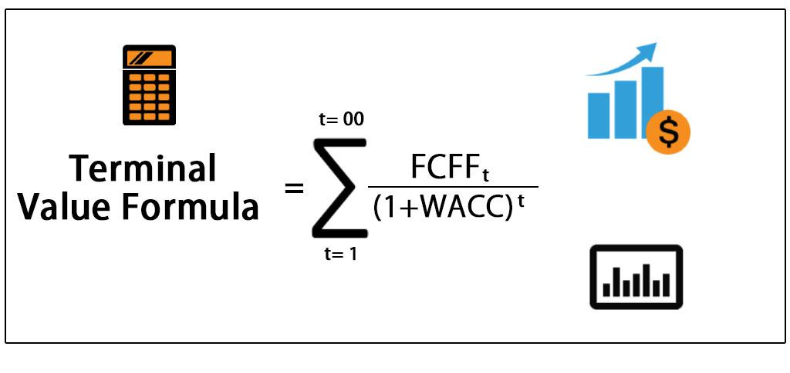

## Table of Contents

## What is terminal value in financial analysis?

Terminal value in financial analysis is a way to estimate what a business or investment will be worth in the future, after a certain period of time. It's like trying to guess the price of a house many years from now. Analysts use terminal value to figure out the total value of a company, especially when they are trying to decide if it's a good investment. They often look at the last year of their detailed financial forecasts and then use a simple formula to guess what happens after that.

There are two main ways to calculate terminal value. The first way is called the perpetuity growth method. This method assumes that the company will keep growing at a steady, small rate forever. It's like saying the company will always make a little more money each year. The second way is called the exit multiple method. This method uses a number, called a multiple, that is based on similar companies that have been sold recently. It's like comparing the company to others to see what it might be worth. Both methods help analysts make a guess about the future value of a company, which is important for making investment decisions.

## Why is terminal value important in valuing a company?

Terminal value is really important when figuring out how much a company is worth because it helps us guess what the company will be worth way into the future. When we value a company, we usually look at its money coming in and going out for a few years. But what about after that? That's where terminal value comes in. It's like a big guess about the company's value far into the future, after we've stopped making detailed predictions. This guess is important because it can make up a big part of the total value we think the company has.

Think of it this way: if you were buying a house, you wouldn't just look at what it's worth today. You'd also think about what it might be worth in 10 or 20 years. The same goes for a company. The terminal value helps us see the long-term picture. Without it, we might miss out on a big chunk of the company's value. That's why, when investors or analysts are trying to decide if a company is a good buy, they always include the terminal value in their calculations. It gives them a fuller picture of what the company might be worth down the road.

## How does terminal value differ from present value?

Terminal value and present value are two important ideas in figuring out how much a company is worth, but they look at different things. Terminal value is like a guess about what a company will be worth way into the future, after we've stopped making detailed predictions. It's a way to think about the long-term value of a company, assuming it keeps going and maybe even growing a little bit forever. On the other hand, present value is about what money is worth right now. It's the idea that a dollar today is worth more than a dollar in the future because you can use it right away or invest it to make more money.

The main difference between terminal value and present value is the time they focus on. Terminal value looks far into the future, often beyond the point where we can make detailed forecasts. It's a big part of the total value of a company because it tries to capture what the company might be worth many years from now. Present value, however, brings future money back to today's dollars. It uses a discount rate to figure out how much future earnings or cash flows are worth right now. So, while terminal value is about the future value of a company, present value is about making future money relevant to today.

## What are the common methods used to calculate terminal value?

There are two main ways to figure out the terminal value of a company. The first way is called the perpetuity growth method. This method assumes that the company will keep making money and growing at a small, steady rate forever. It's like saying the company will always make a little more money each year. To calculate it, you take the last year's cash flow, guess a small growth rate, and use a formula to find out what all those future cash flows are worth today. It's a way to guess what the company might be worth way into the future.

The second way to calculate terminal value is called the [exit](/wiki/exit-strategy) multiple method. This method looks at what similar companies have sold for recently and uses that information to guess what the company might be worth. It's like comparing the company to others to see what it might be worth. To use this method, you take a number, called a multiple, from similar companies and multiply it by the last year's earnings or cash flow of the company you're looking at. This gives you an idea of what the company might be worth if it were sold at that point in the future.

Both methods help analysts make a guess about the future value of a company, which is important for making investment decisions. The perpetuity growth method is good for companies that are expected to keep growing slowly over time, while the exit multiple method is useful when you can find good comparisons with other companies. Choosing the right method depends on the specific situation and the information available.

## Can you explain the perpetuity growth method for calculating terminal value?

The perpetuity growth method is a way to guess what a company will be worth far into the future. It assumes that the company will keep making money and growing at a small, steady rate forever. Imagine the company always makes a little more money each year, but not too much. To use this method, you take the cash flow from the last year of your detailed forecasts and guess a small growth rate. This growth rate should be less than the economy's growth rate because no company can grow faster than the economy forever. Then, you use a formula to figure out what all those future cash flows are worth today. The formula is: Terminal Value = Last Year's Cash Flow × (1 + Growth Rate) ÷ (Discount Rate - Growth Rate).

This method is useful because it helps us see the long-term value of a company. It's like trying to guess the price of a house many years from now. The discount rate in the formula is important because it brings future money back to today's dollars. It's the rate at which you think money loses value over time. If you think money loses value quickly, you use a higher discount rate, which makes the terminal value smaller. If you think money keeps its value well, you use a lower discount rate, which makes the terminal value bigger. The perpetuity growth method is good for companies that are expected to keep growing slowly over time, and it's a key part of figuring out if a company is a good investment.

## How does the exit multiple approach work in determining terminal value?

The exit multiple approach is a way to guess what a company might be worth in the future by looking at what similar companies have sold for recently. It's like comparing your company to others to see what it might be worth. To use this method, you take a number called a multiple, which is based on what other companies in the same industry have sold for. This multiple is often based on earnings or cash flow. You then multiply this multiple by the last year's earnings or cash flow of the company you're looking at. This gives you an idea of what the company might be worth if it were sold at that point in the future.

This method is useful because it uses real-world data from similar companies to make a guess about the future value of your company. It's like looking at the prices of similar houses in your neighborhood to guess what your house might be worth. The key to using the exit multiple approach well is finding good comparisons. If you can find companies that are very similar to yours and have been sold recently, your guess about the terminal value will be more accurate. This method is especially helpful when you can't easily guess a steady growth rate for the company, which is needed for the perpetuity growth method.

## What assumptions are critical when calculating terminal value?

When calculating terminal value, some important guesses need to be made. One big guess is about the growth rate. For the perpetuity growth method, you need to guess a small, steady rate at which the company will grow forever. This rate should be less than the economy's growth rate because no company can grow faster than the economy forever. For the exit multiple method, you need to guess a good multiple to use, which comes from looking at what similar companies have sold for recently. Both methods need these guesses to be as close to reality as possible to get a good idea of the company's future value.

Another important guess is about the discount rate. This rate is used to bring future money back to today's dollars. It's like figuring out how much less a dollar in the future is worth compared to a dollar today. The discount rate depends on how risky the company is and how much you think money loses value over time. If you think the company is very risky or that money loses value quickly, you use a higher discount rate, which makes the terminal value smaller. If you think the company is less risky or that money keeps its value well, you use a lower discount rate, which makes the terminal value bigger. Getting these guesses right is key to figuring out a good terminal value for the company.

## How can errors in estimating terminal value impact the overall valuation of a business?

Errors in estimating terminal value can really mess up how much a business is worth. If you guess the terminal value too high, the whole value of the business will seem bigger than it really is. This can make investors think the business is a better deal than it actually is, which might lead them to pay too much for it. On the other hand, if you guess the terminal value too low, the business might seem less valuable than it really is. This can make investors think the business isn't a good deal, and they might miss out on a good investment.

The main reasons for these errors are wrong guesses about the growth rate or the discount rate. If you think the company will grow faster than it really will, the terminal value will be too high. If you think it will grow slower than it really will, the terminal value will be too low. The same goes for the discount rate. If you think money loses value too quickly or the company is riskier than it really is, you'll use a higher discount rate, which will make the terminal value smaller. If you think money keeps its value well or the company is less risky than it really is, you'll use a lower discount rate, which will make the terminal value bigger. Getting these guesses right is super important because the terminal value can be a big part of the total value of a business.

## What are some best practices for forecasting terminal value in a financial model?

When forecasting terminal value in a financial model, it's important to be careful and use good information. Start by choosing the right method for your company. The perpetuity growth method is good for companies that will keep growing slowly over time. You need to guess a small growth rate that's less than the economy's growth rate. The exit multiple method is good when you can find similar companies that have been sold recently. You need to find a good multiple to use, based on what those companies sold for. Both methods need you to make smart guesses, so use as much good information as you can to make those guesses.

Another best practice is to be careful with your guesses about the growth rate and the discount rate. The growth rate should be small and realistic. Don't guess that the company will grow faster than the economy forever because that's not possible. The discount rate should match how risky the company is and how much you think money loses value over time. If the company is very risky, use a higher discount rate. If it's less risky, use a lower discount rate. Getting these guesses right is super important because the terminal value can be a big part of the total value of the business. Always check your work and see if your guesses make sense with what's happening in the real world.

## How do different industries approach the calculation of terminal value?

Different industries have different ways of figuring out terminal value because they have different kinds of businesses and different ways of making money. For example, in the tech industry, companies often grow very fast and can change a lot over time. So, when figuring out terminal value for a tech company, analysts might use the perpetuity growth method with a higher growth rate than they would for a company in a slower-growing industry. They might also look at other tech companies that have been sold recently to find a good multiple for the exit multiple method. The key is to use numbers that make sense for the fast-changing world of tech.

In industries like utilities or manufacturing, where things don't change as quickly, analysts might use a lower growth rate for the perpetuity growth method. These industries are often more stable, so the guesses about future growth can be more predictable. For the exit multiple method, they would look at what other utility or manufacturing companies have sold for recently. The main thing is to use numbers that fit with how these industries work and grow over time. Both methods need to be adjusted to match the specific industry and the kind of business being looked at.

## Can you discuss the limitations and criticisms of traditional terminal value calculation methods?

Traditional terminal value calculation methods, like the perpetuity growth method and the exit multiple method, have some big problems. One big problem is that they depend a lot on guesses about the future. For the perpetuity growth method, you have to guess a growth rate that's supposed to last forever. But it's really hard to know what will happen that far into the future. The economy can change a lot, and so can the company. The exit multiple method also has problems because it depends on finding good comparisons with other companies. But what if there aren't any good comparisons? Or what if the market changes a lot between now and when you're trying to guess the terminal value? These guesses can be way off, which can mess up the whole value of the business.

Another problem is that these methods can be too simple. The perpetuity growth method assumes the company will keep growing at a steady rate forever, which isn't realistic. Companies can grow, shrink, or even go out of business. The exit multiple method assumes that the company will be sold at some point in the future, but what if it isn't? What if the company keeps going and never gets sold? These methods don't take into account all the different things that can happen to a company over time. Critics say that because of these problems, traditional terminal value calculations can give a false sense of how much a company is really worth.

## What advanced techniques or models can be used to refine terminal value estimates in complex scenarios?

In complex scenarios, more advanced techniques can help make better guesses about a company's terminal value. One way is to use a Monte Carlo simulation. This method runs a lot of different guesses about the future, like what the growth rate might be or what the discount rate might be. By doing this many times, it can show a range of possible terminal values instead of just one number. This can help show how unsure the guess is and give a better idea of what might happen. Another way is to use real options valuation. This method looks at the choices a company might have in the future, like whether to start a new project or buy another company. By thinking about these choices, it can make the guess about the terminal value more realistic and detailed.

Another advanced technique is to use scenario analysis. This method looks at different stories about what might happen in the future, like a best-case scenario, a worst-case scenario, and a most-likely scenario. By figuring out the terminal value for each story, it can show how different things might affect the company's value. This can help investors see what might happen and make better decisions. All these methods try to make the guess about the terminal value more accurate by taking into account more of the things that can happen in the future. They can be more work to use, but they can give a better picture of what the company might be worth far into the future.

## What is Understanding Terminal Value (TV)?

Terminal value (TV) represents the value of an asset or business beyond the explicit forecast period within a financial model. It is an essential component of a company's valuation, especially in models like the discounted cash flow (DCF) analysis, which seeks to estimate the net present value (NPV) of expected future cash flows. 

A central assumption underlying terminal value is that the business will continue to generate cash flows indefinitely, typically at a constant growth rate. This assumption plays a pivotal role in determining the future value of the business, as even small changes in the assumed growth rate can significantly impact the valuation. In practice, terminal value often constitutes a substantial portion of the overall business valuation, making its accurate calculation critical for reliable financial analysis.

Terminal value is calculated primarily using two approaches: the Perpetuity Growth Model and the Exit Multiple Method. The Perpetuity Growth Model, often referred to as the Gordon Growth Model, calculates terminal value using the formula:

$$
\text{TV} = \frac{FCF \times (1 + g)}{r - g}
$$

where $FCF$ is the free cash flow in the final forecast year, $g$ is the perpetual growth rate, and $r$ is the discount rate. This formula hinges on the expectation that free cash flows will grow at a constant rate indefinitely and that the discount rate exceeds the growth rate.

Terminal value's accuracy is contingent upon the assumptions embedded within the model, including growth rate estimations, competitiveness, and market conditions. These assumptions must be rigorously evaluated to reduce the risks of overvaluation or undervaluation. Variations in assumptions such as discount rates and perpetual growth rates can lead to significant discrepancies in terminal value estimates. Sensitivity analyses are, therefore, crucial tools for understanding the robustness of these estimates and mitigating potential risks.

In conclusion, terminal value in financial models functions as a mechanism to extend a business's valuation beyond a finite forecast period. Its significance in the overall valuation makes understanding the assumptions and methodologies crucial for sound financial analysis and investment decisions.

## What are the methods for calculating terminal value?

There are two primary methods for calculating terminal value: the Perpetuity Growth Model and the Exit Multiple Method. Each method is grounded in different assumptions and suited for various financial analysis contexts.

The Perpetuity Growth Model, often referred to as the Gordon Growth Model, is a widely used approach that assumes a business will continue generating cash flows indefinitely, growing at a constant rate. This model calculates the terminal value using the formula:

$$
\text{TV} = \frac{\text{FCF} \times (1 + g)}{r - g}
$$

where:
- $\text{TV}$ is the terminal value,
- $\text{FCF}$ is the free cash flow projected at the end of the forecast period,
- $g$ is the perpetual growth rate, and
- $r$ is the discount rate or required rate of return.

The Perpetuity Growth Model is particularly suitable when a business is expected to sustain steady growth in perpetuity. The critical assumption here is the choice of the growth rate $g$, which must be realistic and typically should not exceed the long-term growth rate of the economy.

The Exit Multiple Method offers an alternative approach to estimating terminal value by applying a valuation multiple to a financial performance metric, such as EBITDA (Earnings Before Interest, Taxes, Depreciation, and Amortization) or sales from the final forecasted year. The formula can be expressed as:

$$
\text{TV} = \text{Metric} \times \text{Multiple}
$$

where:
- $\text{Metric}$ might be EBITDA, EBIT, sales, etc., from the last projected year,
- $\text{Multiple}$ is derived from comparable company analyses or industry averages.

The Exit Multiple Method is practical when the market provides reliable data on observed multiples for similar businesses. However, this method is highly contingent on the accuracy of the chosen multiple and can be influenced by market [volatility](/wiki/volatility-trading-strategies) and transactional comparables at the time of valuation.

Both methods [carry](/wiki/carry-trading) inherent limitations. The Perpetuity Growth Model may be overly simplistic in volatile or rapidly changing industries, while the Exit Multiple Method's accuracy is heavily dependent on the quality and relevance of the comparable data. Consequently, investors and analysts may choose different methods based on the specific context of the valuation, such as the industry dynamics, the business lifecycle stage, and macroeconomic factors. The selection significantly influences the calculated terminal value, impacting investment appraisals and strategic decision-making.

## References & Further Reading

[1]: Gordon, M. J. (1962). ["The Investment, Financing, and Valuation of the Corporation."](https://archive.org/details/investmentfinanc0000gord) Harvard University Press.

[2]: Damodaran, A. (2012). ["Investment Valuation: Tools and Techniques for Determining the Value of Any Asset (3rd Edition)."](https://books.google.com/books/about/Investment_Valuation.html?id=5SRHAAAAQBAJ) Wiley Finance.

[3]: Koller, T., Goedhart, M., & Wessels, D. (2015). ["Valuation: Measuring and Managing the Value of Companies (6th Edition)."](https://www.mckinsey.com/capabilities/strategy-and-corporate-finance/our-insights/valuation-measuring-and-managing-the-value-of-companies) Wiley Finance.

[4]: Berk, J., & DeMarzo, P. (2019). ["Corporate Finance (5th Edition)."](https://www.pearson.com/en-us/subject-catalog/p/corporate-finance/P200000005829/9780135635926) Pearson Education.

[5]: McKinsey & Company Inc. (2010). ["Valuation: Measuring and Managing the Value of Companies."](https://www.mckinsey.com/capabilities/strategy-and-corporate-finance/our-insights/valuation-measuring-and-managing-the-value-of-companies) McKinsey & Company Analysis.