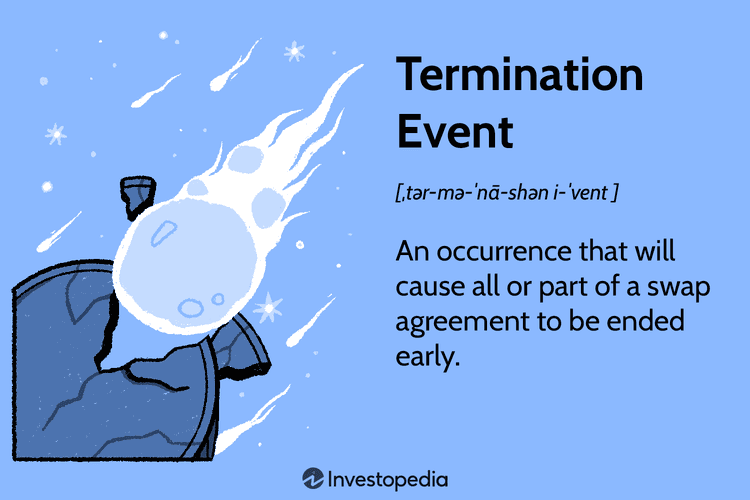

In today's digital age, algorithmic trading has become a dominant force in financial markets. This automated approach to trading uses high-speed computations and strategies driven by complex algorithms to execute trades, often within milliseconds. The allure of algorithmic trading lies in its capacity to process vast volumes of data rapidly, capitalize on market inefficiencies, and execute orders at optimal prices. However, with these advantages come significant responsibilities, particularly regarding the legal infrastructure required to support and safeguard trading activities.

Proper legal agreements form an essential backbone for any financial endeavor, and algorithmic trading is no exception. These agreements play a crucial role in protecting the interests of all parties involved, from traders and financial institutions to technology providers and clearinghouses. A well-structured legal framework is fundamental to ensuring that algorithmic trading operations are conducted smoothly and within the confines of applicable regulations.

In the complex structure of algorithmic trading agreements, termination clauses hold a critical position. These provisions are vital for establishing a clear path for dispute resolution or the ending of partnerships. Given the sometimes volatile nature of financial markets and the rapid pace at which algorithmic trading operates, it is imperative to have clearly defined parameters under which a contract can be terminated. This prevents prolonged disputes, minimizes financial losses, and provides a framework for possible remedial actions when things do not go as planned.

This article will explore the definition and importance of termination clauses in both standard financial contracts and those specifically tailored for automated trading. By understanding and implementing effective termination clauses, parties involved in algorithmic trading can mitigate risks and fully leverage the opportunities presented by this trading methodology. The knowledge and application of these contractual elements are essential steps toward ensuring robust risk management and maximizing the benefits of algorithmic trading in today's fast-paced markets.

## Table of Contents

## Understanding Termination Clauses

Termination clauses establish the conditions and procedures under which an agreement can be legally concluded. They hold significant importance in contracts related to financial trading, ensuring that any arising issues are addressed promptly and clearly. By defining the circumstances under which parties can terminate agreements, they help in preemptively managing conflicts and ensuring that the [exit](/wiki/exit-strategy) from a contract is as smooth as possible. Essential to this process is the inclusion of provisions for any damages incurred due to termination, which serves as a financial safeguard for involved parties.

In the context of financial trading, standard termination clauses frequently appear in master swap agreements. These agreements are fundamental frameworks that outline the basic legalities governing trading transactions between parties. The clauses provide a structured approach for ending these agreements, which is crucial given the inherently volatile nature of financial markets. They not only specify exit strategies but also detail the financial repercussions in a manner that promotes equitable resolutions.

Moreover, the ability to customize termination clauses is a vital aspect, particularly in [algorithmic trading](/wiki/algorithmic-trading). The automated nature of algorithmic trading presents unique scenarios that standard clauses may not adequately cover. Tailoring these clauses to fit the specific requirements and circumstances of algorithmic trading allows for greater adaptability and precision, addressing potential technical issues or unexpected market behaviors unique to automated environments. This customization ensures that contracts remain relevant and effective in the face of diverse challenges, ultimately contributing to a safer trading experience.

## Termination Clauses in Algorithmic Trading

Algorithmic trading presents distinct challenges and opportunities in the context of contract termination, necessitating precise legal frameworks to address these issues. One major consideration is the possibility of technical glitches. Software malfunctions, for instance, can significantly disrupt trading activities, and such situations might necessitate terminating a contract. Hence, contracts should explicitly outline the procedures to be followed in the event of a software breakdown. This includes specifying the criteria under which a malfunction constitutes grounds for termination and delineating the steps for resolving any associated disputes.

In addition to technical failures, unexpected market behaviors pose a significant risk to algorithmic trading. Sudden market fluctuations can adversely affect the performance of auto-trading algorithms, potentially leading to substantial financial losses. Contract termination clauses should therefore incorporate provisions for responding to such unexpected market events, ensuring both parties are aware of their rights and obligations in these scenarios.

Financial liabilities arising from system failures or connectivity issues are critical factors that must be addressed within termination clauses. For instance, a network outage leading to missed trading opportunities can incur significant costs. As such, the clauses should detail the allocation of financial responsibility in these situations, whether through compensation mechanisms or insurance policies.

To protect parties from unforeseen losses, robust protection mechanisms must be included. Dispute resolution processes are essential, providing a formalized means of addressing conflicts that arise from contract termination. This might involve arbitration or mediation options, which can offer a quicker and less costly alternative to litigation. Additionally, indemnification methods should be outlined to protect parties from financial harm resulting from the other party's negligence or failure to fulfill contractual obligations. By incorporating these protection strategies, parties can safeguard their interests and mitigate potential losses associated with the termination of algorithmic trading contracts.

## Components of a Robust Termination Clause

A robust termination clause is critical to safeguarding the interests of parties in algorithmic trading contracts. At its core, such a clause must establish the conditions under which a contract can be terminated early. Key conditions typically include default events, where a party fails to meet their contractual obligations, or regulatory changes that make the contract untenable.

Moreover, incorporating compensation guidelines within the clause is vital. These guidelines specify the compensation entitled to a non-breaching party if premature termination occurs, thereby mitigating financial setbacks. For instance, compensation might be calculated based on expected future profits lost due to termination. This not only protects parties financially but also incentivizes compliance with contract terms.

Another important component of a robust termination clause is the inclusion of acceleration provisions. These provisions facilitate the prompt settlement of outstanding obligations upon termination of the contract. By accelerating payment schedules or other obligations, parties can achieve a smoother and more efficient disengagement, minimizing disruption to their operations.

Additionally, a comprehensive termination clause should address scenarios involving tax impositions and changes in creditworthiness. Tax changes might affect the financial viability of a contract, while shifts in a party's creditworthiness could impact their ability to fulfill contractual obligations. Accounting for these factors ensures that the clause is resilient to a wide range of potential disruptions.

By addressing these elements, termination clauses enhance clarity and trust between parties involved in algorithmic trading. Clearly defined termination clauses reduce the likelihood of disputes and foster a cooperative trading environment, aligning with regulatory requirements and market standards. This comprehensive approach to termination clauses not only secures parties' interests but also contributes to the stability and predictability of algorithmic trading contracts.

## Best Practices for Incorporating Termination Clauses

Engaging legal expertise when incorporating termination clauses into algorithmic trading contracts ensures these clauses adhere to current regulations and industry standards. Legal professionals bring a wealth of knowledge that can help identify potential pitfalls and navigate the complex regulatory landscape. This alignment is critical, as non-compliance can lead to significant legal and financial repercussions.

It is equally important to regularly review and update contracts. The rapid evolution of technology and the dynamic nature of financial markets necessitate ongoing revisions to legal agreements. Periodic contract reviews can uncover outdated provisions and allow for the integration of new technologies or practices that may affect the termination process. For example, advances in blockchain technology could play a role in verifying trade authenticity, thereby influencing contract terms.

Integrating feedback loops is another effective strategy. Analyzing outcomes from past contract terminations can provide invaluable insights. This feedback can inform the drafting of future contracts, identifying common issues that arise during termination and taking proactive measures to mitigate these risks. Such a learning-oriented approach enhances the robustness of termination clauses over time.

Collaborative drafting of termination clauses with all involved parties ensures a mutual understanding and acceptance of the terms. Collaboration fosters transparency and trust, reducing the likelihood of disputes when a termination occurs. Each party's input can address specific concerns and lead to a comprehensive agreement that better accommodates all stakeholders' interests.

Finally, emphasizing transparency and clarity in the language of termination clauses is crucial for minimizing misunderstandings and potential legal disputes. Clear language helps ensure that all parties fully comprehend their rights, responsibilities, and the procedures for terminating the contract. A well-drafted clause will outline the specific conditions under which termination is permissible, ensuring a straightforward and unambiguous process. 

These best practices collectively enhance the effectiveness and reliability of termination clauses, safeguarding the interests of all parties in the fast-paced domain of algorithmic trading.

## Conclusion

Termination clauses hold critical importance in contract management, particularly within the unstable domain of algorithmic trading. These clauses offer a definitive mechanism for mitigating risks, safeguarding the interests of all parties, and facilitating equitable resolutions during contract termination. The dynamic nature of algorithmic trading requires traders to adopt and implement well-structured termination clauses to protect their investments and operations from potential disruptions.

Incorporating comprehensive termination clauses allows traders to navigate the complexities of the trading environment effectively. As algorithmic trading technologies evolve, so too must the legal frameworks that govern them. This constant evolution highlights the necessity for ongoing updates and revisions to termination clauses to address new challenges and opportunities presented by advancements in trading strategies and technologies.

Ultimately, the development of robust legal agreements, including termination clauses, ensures more seamless operations and enhances the potential for increased profitability within the ever-shifting landscape of digital trading. By securing the legal foundations of their partnerships, traders can better focus on optimizing their algorithmic strategies and leveraging market opportunities to their fullest advantage.

## References & Further Reading

[1]: ["Termination Clauses in Contracts: An Overview"](https://aaronhall.com/termination-clauses-in-contracts-what-you-need-to-know/) by Lexology

[2]: Mayer, P.N. (2018). ["The Essentials of Termination Clauses in Financial Contracts"](https://daniels.du.edu/assets/cv-mayer-don.pdf)

[3]: ["Algorithmic Trading and DMA: An Introduction to Direct Access Trading Strategies"](https://www.amazon.com/Algorithmic-Trading-DMA-introduction-strategies/dp/0956399207) by Barry Johnson

[4]: Lopez de Prado, M. (2018). ["Advances in Financial Machine Learning"](https://www.amazon.com/Advances-Financial-Machine-Learning-Marcos/dp/1119482089)

[5]: ["Mastering the Art of Risk Management in Financial Services"](https://www.msglobalfinance.org/single-post/mastering-the-art-of-risk-management-a-curriculum-for-finance-leaders) by Risk.net