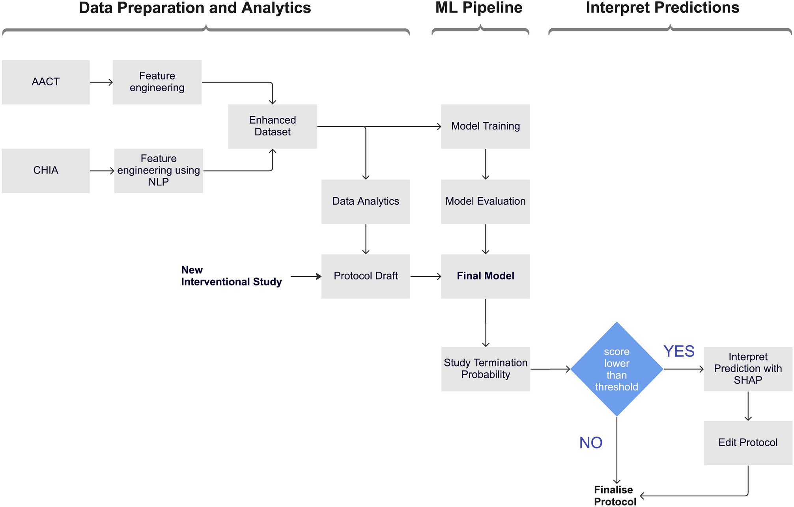

## Table of Contents

## What is a termination condition in machine learning?

A termination condition in machine learning is a rule that tells a computer program when to stop running. Imagine you are training a model, like teaching a dog new tricks. You wouldn't want to keep teaching the dog the same trick forever, right? The termination condition is like saying, "Okay, that's enough practice for now." It helps the computer know when the model has learned enough or when it's not improving anymore.

In machine learning, these conditions can be set in different ways. One common way is to stop the training when the model's performance stops getting better. For example, if the model's error rate, which is how often it makes mistakes, doesn't get lower after a certain number of tries, the training stops. Another way is to set a maximum number of training rounds, or epochs. Once the model goes through this number of rounds, the training stops, no matter how well it's doing. This helps to save time and computer resources.

## Why are termination conditions important in training machine learning models?

Termination conditions are crucial in training machine learning models because they help prevent the model from training indefinitely. Without a termination condition, a model might keep trying to learn, even when it's not getting any better. This can waste a lot of time and computer power. By setting a clear stopping point, we make sure the training stops when the model has learned enough or when further training won't help much.

Another reason termination conditions are important is that they help avoid overfitting. Overfitting happens when a model learns too much about the training data and doesn't work well with new data. A good termination condition can stop the training before the model starts to overfit. For example, if we see that the model's performance on a separate set of data, called the validation set, stops improving, we can use that as a signal to stop training. This helps the model perform better on new, unseen data.

## Can you explain the difference between early stopping and other termination conditions?

Early stopping is a special kind of termination condition used in [machine learning](/wiki/machine-learning). It's like hitting the brakes when you see that the model isn't getting any better at learning. Instead of training for a fixed number of rounds, early stopping looks at how well the model is doing on a separate set of data, called the validation set. If the model's performance on this validation set stops improving, the training stops. This helps prevent the model from learning too much about the training data and not working well with new data, which is called overfitting.

Other termination conditions might not pay as much attention to the model's performance. For example, one common termination condition is to set a maximum number of training rounds, or epochs. When the model finishes this number of rounds, the training stops, no matter how well it's doing. This is simpler but doesn't always stop at the best time for the model's learning. Another type might stop when the model's error rate, or how often it makes mistakes, doesn't get lower after a certain number of tries. This can be good, but it might not catch overfitting as well as early stopping does.

In short, early stopping is more focused on the model's actual learning progress and preventing overfitting, while other termination conditions might be based more on time or a set number of tries. Both types are useful, but early stopping is often preferred when you want to make sure your model performs well on new data.

## What are some common termination conditions used in machine learning algorithms?

Common termination conditions in machine learning help decide when to stop training a model. One popular condition is setting a maximum number of training rounds, or epochs. When the model finishes these rounds, the training stops, no matter how well it's doing. This is simple but might not always stop at the best time for the model's learning. Another condition is checking the model's error rate, which is how often it makes mistakes. If the error rate doesn't get lower after a certain number of tries, the training stops. This can be good, but it might not catch overfitting as well as other methods.

Early stopping is another common termination condition that pays more attention to the model's performance on a separate set of data, called the validation set. If the model's performance on this set stops improving, the training stops. This helps prevent the model from learning too much about the training data and not working well with new data, which is called overfitting. Early stopping is often preferred when you want to make sure your model performs well on new data. 

Some machine learning algorithms use a condition based on a specific performance metric, like accuracy or loss. For example, if the loss on the validation set doesn't decrease by a certain amount, like $$ \Delta \text{loss} < \epsilon $$, the training stops. This can be more precise but requires careful setting of the threshold. In summary, termination conditions are important tools that help make sure machine learning models train efficiently and effectively.

## How does the choice of termination condition affect the performance of a machine learning model?

The choice of termination condition can have a big impact on how well a machine learning model performs. If you pick a condition that stops the training too soon, the model might not learn enough to be useful. For example, if you set a low number of training rounds, the model might stop before it has a chance to improve its performance. On the other hand, if the termination condition lets the training go on for too long, the model might start to overfit. Overfitting happens when the model learns too much about the training data and doesn't work well with new data. A good example is setting a high number of epochs without checking the model's performance on a validation set, which can lead to overfitting.

Using early stopping as a termination condition can help balance these issues. Early stopping looks at how well the model is doing on a separate set of data, called the validation set. If the model's performance on this set stops improving, the training stops. This helps prevent overfitting because it stops the training before the model starts to learn too much about the training data. For instance, if the loss on the validation set doesn't decrease by a certain amount, like $$ \Delta \text{loss} < \epsilon $$, the training stops. This can lead to a model that performs better on new, unseen data. Choosing the right termination condition is important for making sure the model learns just enough to be effective without going too far.

## What are the potential risks of choosing an inappropriate termination condition?

Choosing an inappropriate termination condition can lead to problems with your machine learning model. If you stop the training too early, the model might not learn enough to be useful. For example, if you set the number of training rounds, or epochs, too low, the model might stop before it has a chance to improve its performance. This means the model won't be able to make good predictions because it hasn't learned enough from the data.

On the other hand, if the termination condition lets the training go on for too long, the model might start to overfit. Overfitting happens when the model learns too much about the training data and doesn't work well with new data. For instance, if you set a high number of epochs without checking the model's performance on a validation set, the model might keep learning until it fits the training data perfectly but fails on new data. This can be avoided by using early stopping, which stops the training when the model's performance on a validation set stops improving. If the loss on the validation set doesn't decrease by a certain amount, like $$ \Delta \text{loss} < \epsilon $$, the training stops. This helps ensure the model performs well on new, unseen data.

## How can one determine the optimal termination condition for a specific machine learning task?

Finding the best termination condition for a machine learning task can be tricky, but it's important to get it right. One way to do this is by using early stopping, which looks at how well the model is doing on a separate set of data called the validation set. If the model's performance on this set stops getting better, it's a good sign to stop training. You can set a small number, like $$ \Delta \text{loss} < \epsilon $$, to decide when the loss on the validation set isn't improving enough to keep going. This helps prevent the model from overfitting, which is when it learns too much about the training data and doesn't work well with new data.

Another way to find the right termination condition is by trying different settings and seeing what works best. You can train the model with different numbers of epochs or different thresholds for early stopping and then compare how well the model performs on a test set. This process, called hyperparameter tuning, can help you find the best balance between training long enough for the model to learn well and not so long that it starts to overfit. By carefully choosing and testing different termination conditions, you can make sure your model performs its best on new, unseen data.

## What role does validation data play in deciding when to terminate training?

Validation data is like a practice test for your machine learning model. It helps you decide when to stop training by showing how well the model is doing on data it hasn't seen before. If the model's performance on the validation data stops getting better, it might be a sign that the model has learned enough. This is important because it helps prevent the model from overfitting, which happens when it learns too much about the training data and doesn't work well with new data. By using validation data, you can stop training at the right time and make sure your model will be good at making predictions on new data.

One common way to use validation data is through a method called early stopping. With early stopping, you keep an eye on the model's performance on the validation data. If the model's performance, like its loss, doesn't improve by a small amount, say $$ \Delta \text{loss} < \epsilon $$, you stop the training. This helps you find the sweet spot where the model has learned enough but hasn't started to overfit. By using validation data in this way, you can make sure your model is trained just right for the task at hand.

## How do termination conditions vary between supervised and unsupervised learning algorithms?

In supervised learning, termination conditions often focus on how well the model is doing at predicting the right answers. One common way is to use early stopping, which checks the model's performance on a separate set of data called the validation set. If the model's performance, like its loss, doesn't get better by a small amount, say $$ \Delta \text{loss} < \epsilon $$, the training stops. This helps prevent the model from overfitting, which is when it learns too much about the training data and doesn't work well with new data. Another way is to set a maximum number of training rounds, or epochs. When the model finishes these rounds, the training stops, no matter how well it's doing. This is simpler but might not always stop at the best time for the model's learning.

In unsupervised learning, termination conditions can be a bit trickier because there are no right answers to check against. Instead, these conditions might look at how much the model's results change from one round to the next. For example, if the difference in the model's results, like the clustering of data points, doesn't change much, say $$ \Delta \text{result} < \epsilon $$, the training might stop. Another common approach is to set a maximum number of iterations, similar to epochs in supervised learning. Once the model goes through this number of iterations, the training stops. This helps to save time and computer resources, even if the model's performance might still be improving.

## Can you discuss any advanced techniques for dynamically adjusting termination conditions during training?

Advanced techniques for dynamically adjusting termination conditions during training can help make the process more efficient and effective. One method is called adaptive learning rate scheduling, which changes how quickly the model learns based on its performance. If the model's performance on the validation set stops improving, the learning rate can be decreased to help the model fine-tune its learning. This can be done using a formula like $$ \text{new learning rate} = \text{current learning rate} \times \text{decay [factor](/wiki/factor-investing)} $$. By adjusting the learning rate, the model can train for longer without overfitting, and the termination condition can be set to stop when the learning rate drops below a certain threshold.

Another technique is using curriculum learning, which changes the difficulty of the training data over time. At the start, the model is trained on easier examples, and as it gets better, harder examples are introduced. The termination condition can be adjusted to stop training when the model's performance on the hardest examples reaches a certain level. This helps the model learn more efficiently and can prevent it from overfitting by stopping at the right time. By dynamically adjusting the termination condition based on the model's progress through the curriculum, the training can be more tailored to the model's needs.

## What are the latest research trends concerning termination conditions in deep learning?

Recent research in [deep learning](/wiki/deep-learning) has focused on developing more adaptive and intelligent termination conditions. One trend is the use of meta-learning, where the model learns how to adjust its own termination conditions based on past training experiences. This approach can help the model stop training at the optimal time by dynamically adjusting parameters like the learning rate or the number of epochs. For example, researchers are exploring how to use meta-learning to set a condition that stops training when the model's performance on a validation set, measured by loss, doesn't improve by a small amount, like $$ \Delta \text{loss} < \epsilon $$. This helps prevent overfitting and can lead to better performance on new data.

Another trend is the integration of [reinforcement learning](/wiki/reinforcement-learning) techniques to dynamically adjust termination conditions. In this approach, the model is treated as an agent that learns to make decisions about when to stop training based on rewards, which could be based on performance metrics like accuracy or loss on a validation set. This can help the model find the right balance between training long enough to learn well and not so long that it starts to overfit. Researchers are also looking into using these techniques to adaptively set the number of training rounds or epochs, allowing the model to stop when it reaches a performance threshold, like when the accuracy on the validation set stops improving.

## How do termination conditions in reinforcement learning differ from those in traditional machine learning?

In reinforcement learning, termination conditions are a bit different from those in traditional machine learning. Traditional machine learning, like supervised or unsupervised learning, often uses conditions based on performance metrics, such as the model's loss or accuracy on a validation set. For example, if the loss on the validation set doesn't decrease by a certain amount, like $$ \Delta \text{loss} < \epsilon $$, the training might stop. This helps prevent overfitting and ensures the model performs well on new data. In contrast, reinforcement learning involves an agent that learns by interacting with an environment and receiving rewards. The termination condition in reinforcement learning might be based on reaching a certain level of performance or reward, or when the agent's policy stops improving.

In reinforcement learning, one common termination condition is when the agent reaches a target performance threshold, like a certain average reward over a number of episodes. Another condition might be based on the number of training episodes or steps, similar to epochs in traditional machine learning, but with a focus on the agent's interaction with the environment. For example, training might stop after a set number of episodes or when the agent's performance, measured by the cumulative reward, stops improving. These conditions help ensure the agent learns the optimal policy without training indefinitely, balancing the need to explore the environment and exploit learned knowledge effectively.

## References & Further Reading

[1]: Prechelt, L. (1998). ["Early Stopping — But When?"](https://link.springer.com/chapter/10.1007/978-3-642-35289-8_5) In Neural Networks: Tricks of the Trade. Springer.

[2]: Goodfellow, I., Bengio, Y., & Courville, A. (2016). [Deep Learning](https://www.deeplearningbook.org/). MIT Press. Chapter 7 discusses optimization strategies, including termination conditions.

[3]: Caruana, R., Lawrence, S., & Giles, C. L. (2001). ["Overfitting in Neural Nets: Backpropagation, Conjugate Gradient, and Early Stopping."](https://www.researchgate.net/publication/221620260_Overfitting_in_Neural_Nets_Backpropagation_Conjugate_Gradient_and_Early_Stopping) Advances in Neural Information Processing Systems.

[4]: Srivastava, N., Hinton, G., Krizhevsky, A., Sutskever, I., & Salakhutdinov, R. (2014). ["Dropout: A Simple Way to Prevent Neural Networks from Overfitting."](https://dl.acm.org/doi/abs/10.5555/2627435.2670313) Journal of Machine Learning Research, 15, 1929–1958.

[5]: Yao, Y., Rosasco, L., & Caponnetto, A. (2007). ["On Early Stopping in Gradient Descent Learning."](https://link.springer.com/article/10.1007/s00365-006-0663-2) Constructive Approximation, 26(2), 289-315.