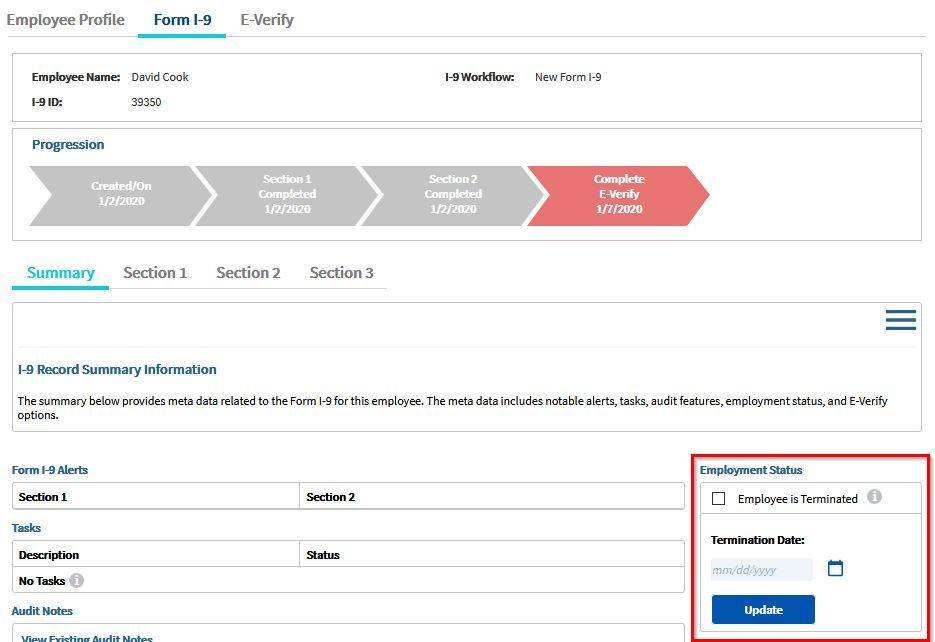

In the fast-paced world of financial markets and employment, understanding the nuances of contract terminations can have significant implications for both individuals and organizations. Employment contracts and financial agreements play vital roles in defining the parameters of professional and financial relationships, and their termination marks critical transitions affecting future prospects.

This article examines the intricacies surrounding the conclusion of employment contracts, the key concept of termination dates, and the increasingly important field of algorithmic trading. For professionals engaged in these fields, grasping these elements is crucial for informed decision-making and adept management of transitions.



A comprehensive guide to navigating these complex areas will be provided, with a discussion centered on key concepts, processes, and best practices. Whether dealing with the end of employment contracts or understanding how termination dates affect loan repayments and swaps in finance, clarity in these areas is pivotal. As algorithmic trading becomes more prevalent, incorporating technology and data into financial operations brings an additional layer of complexity, demanding specialized knowledge and strategic approaches.

This introduction sets the stage for a deeper exploration into how these topics intertwine, impacting employment patterns in financial services and influencing broader industry trends. By equipping professionals with this knowledge, the article aims to enhance their capacity to manage both financial obligations and career development effectively.

## Table of Contents

## Understanding Termination Dates

A termination date signifies the conclusion of a financial or employment contract, marking a critical juncture in both domains. In the financial landscape, a termination date is typically associated with the fulfillment of contractual obligations, such as the final repayment of a loan or the settlement of a derivative contract like a swap. In these contexts, the termination date is crucial for ensuring that all parties have completed their contractual duties, thereby facilitating smooth financial transactions and mitigating potential disputes. For example, in a swap contract, the termination date will be when the last exchange of cash flows occurs, signaling the contract’s end. This date is essential for financial institutions and investors to manage risk and plan future transactions. In Python, a swap's termination date could be calculated using libraries that handle dates and financial instruments, ensuring the schedule aligns with the contract's specifications.

In employment, the termination date indicates the end of an employee's tenure with a company. Whether resulting from voluntary resignation, retirement, or involuntary dismissal, the termination date holds significant implications for workforce planning and employee transition. It is the point at which an employee ceases to be subject to an employer’s directives and stops receiving remuneration. This date is key for employers to manage human resources effectively, particularly concerning payroll management, benefits discontinuation, and workforce realignment.

Understanding termination dates in both contexts is fundamental for effective contract management and planning. In finance, it enables precise forecasting and compliance with financial regulations, while in employment, it assists in managing legal requirements such as final pay and notice periods. Grasping these elements is essential for professionals who seek to navigate the complexities of contract terminations efficiently. In conclusion, the recognition and understanding of termination dates are pivotal in managing the closure of financial and employment contracts, providing a foundation for smooth transitions and future planning.

## Termination of Employment Contracts

Employment termination is a fundamental aspect of the employment lifecycle, characterized by either voluntary or involuntary actions, each with its distinct implications. A voluntary termination occurs when an employee decides to leave a company on their accord, typically through resignations or retirements. Resignations are generally prompted by personal reasons or better job opportunities, while retirements mark the end of an individual's active working period, often influenced by age, career length, or financial stability.

In contrast, involuntary termination is initiated by the employer and includes dismissals and redundancies. Dismissals, often a result of performance issues or misconduct, can have significant repercussions for the employee, including potential ineligibility for certain benefits. Redundancies, however, are not related to personal performance but reflect organizational restructuring or financial challenges, necessitating a reduction in workforce size.

Legal considerations form a critical component of employment terminations, requiring adherence to established processes to ensure fairness and compliance. Notice periods constitute an essential part of employment contracts, dictating the time frame required for an employee or employer to inform the other party of their intent to terminate the employment relationship. Severance pay, another crucial element, compensates employees for loss of employment and helps cushion them during their transition to new roles. The amount and eligibility for severance pay vary based on the employee's length of service, job role, and specific contractual stipulations.

Contractual obligations must be carefully reviewed during termination to ensure all legal requirements are met and to prevent potential disputes. These obligations may include non-compete clauses, confidentiality agreements, and any ongoing rights or duties that persist beyond the tenure of active employment.

Understanding these legal and procedural aspects is essential for both employers and employees to manage transitions effectively. Employers are encouraged to maintain transparent communication to foster goodwill and compliance, minimizing potential conflicts and ensuring a smoother transition for departing employees. At the same time, employees can benefit from being informed about their rights and obligations, enabling them to plan and manage their career progression effectively.

## Algorithmic Trading: An Overview

Algorithmic trading represents a sophisticated approach to financial market transactions, leveraging computer algorithms to automate and expedite the trade execution process. These algorithms harness the power of data and technology to make rapid, often split-second, decisions that human traders would be unable to achieve due to the sheer [volume](/wiki/volume-trading-strategy) and velocity required. 

The primary goal of [algorithmic trading](/wiki/algorithmic-trading) is to execute trades at the most favorable prices with minimal market impact. Algorithms are designed to analyze multiple market variables, such as pricing, [liquidity](/wiki/liquidity-risk-premium), and timing, thereby enabling the execution of trades at optimal moments. High-frequency trading ([HFT](/wiki/high-frequency-trading-strategies)) is a subset of algorithmic trading known for executing a large number of orders at extremely fast speeds. 

The reliance on historical and real-time data is pivotal for algorithmic trading. Algorithms are programmed to recognize specific market conditions or statistical patterns that trigger trade executions. Here’s a basic Python example illustrating a simplistic moving average crossover strategy, often used in algorithmic trading:

```python
import pandas as pd
import numpy as np

# Load historical price data
data = pd.read_csv('historical_prices.csv')

# Calculate the moving averages
data['short_mavg'] = data['Close'].rolling(window=40, min_periods=1).mean()
data['long_mavg'] = data['Close'].rolling(window=100, min_periods=1).mean()

# Generate signals
data['signal'] = 0
data['signal'][40:] = np.where(data['short_mavg'][40:] > data['long_mavg'][40:], 1, 0)
data['positions'] = data['signal'].diff()

print(data[['Date', 'Close', 'short_mavg', 'long_mavg', 'signal', 'positions']])
```

Understanding the critical role of contractual agreements is vital in algorithmic trading. Contracts govern the terms under which trades are executed, often addressing aspects like execution times, order types, and risk parameters. These agreements help ensure the automation process adheres to predefined strategies and regulatory requirements, highlighting the industry's operational reliability and efficiency.

Automation and optimization are essential in maintaining a competitive edge in algorithmic trading. Efficiently designed algorithms can process vast amounts of information with precision, minimizing human error and exploiting market inefficiencies. By automating the trading process, firms can reduce transaction costs and enhance their capacity to react swiftly to market changes, thus optimizing their trade outcomes.

In summary, algorithmic trading depends on the integration of advanced algorithms, real-time data analysis, and careful contract management to achieve effective and efficient market operations. Its growing prevalence underscores a transformative shift in financial markets, emphasizing the necessity for strategic automation and optimization.

## Connecting Employment Contracts and Algorithmic Trading

Both employment contracts and trading operations have termination dates that require strategic planning. For employment contracts, the termination date signifies the end of an employee's tenure, and planning for this date involves understanding notice periods, severance arrangements, and transition plans. In algorithmic trading, termination dates might relate to the lifespan of a trading algorithm or financial contracts, such as futures or options, that expire on specific dates. This aspect requires strategies to handle portfolio adjustments or rollovers to new contracts.

The influence of real-time data and algorithmic trading on employment patterns in finance can be significant. Algorithmic trading, which leverages high-speed data processing and automated decision-making, has created new roles and altered the demand for certain skills within the financial sector. The ability to interpret data, develop trading algorithms, and manage automated processes has become increasingly valuable. Consequently, companies involved in these activities may experience changes in their hiring practices, emphasizing technical skills and data proficiency.

The evolution of financial technology has also introduced new contract models, such as Evergreen Contracts, which can be relevant to algorithmic trading. Evergreen Contracts automatically renew after each term unless terminated by one of the parties. This model can be particularly advantageous in a trading environment where ongoing contractual agreements for data services or technological support are crucial. By maintaining continuous service and reducing administrative overhead associated with manual renewals, Evergreen Contracts can enhance operational efficiency in algorithmic trading.

Exploring these intersections offers unique perspectives on industry developments. The integration of automated trading strategies with adaptable employment and contract frameworks reflects a broader trend towards flexibility and efficiency in financial markets. As technology continues to advance, the convergence of employment practices and financial innovations will likely shape future employment models and trading strategies, presenting opportunities for growth and adaptation in the industry.

## Best Practices and Strategic Insights

Effective communication during employment termination is essential to fostering transparency and ensuring compliance with legal standards. Employers bear the responsibility of meticulously maintaining documentation that reflects all relevant aspects of the termination process. This includes accurately documenting notice periods, reasons for termination, severance packages, and any other contractual obligations. Clear communication aids in mitigating misunderstandings and potential legal disputes, promoting a smooth transition for all parties involved.

In the sphere of algorithmic trading, maintaining continuity through effective contract management is equally crucial. Algorithmic trading, characterized by high-frequency and high-volume transactions, demands meticulous contract oversight to prevent disruptions. Effective management encompasses regular updates and audits of trading algorithms, ensuring they comply with evolving market conditions and regulatory requirements. This systematic review and adjustment help in minimizing the risk of errors and ensuring that trading activities align with the strategic objectives of financial institutions.

For professionals navigating these multifaceted domains, staying informed about emerging trends and technological advancements is vital. The financial markets and employment landscapes are dynamic, continuously shaped by technological innovations and regulatory changes. Professionals should proactively engage with industry updates and leverage analytical tools and platforms to enhance their strategic decision-making processes. Staying abreast of these developments allows professionals to adapt their contract and trading strategies, ensuring they remain competitive and compliant in an ever-evolving environment.

Moreover, embracing a culture of learning and adaptability within organizations can further enhance resilience against the uncertainties associated with employment terminations and algorithmic trading. Encouraging continuous professional development and fostering an environment open to technological integration can lead to more robust and forward-thinking strategies, ultimately benefiting both organizational performance and career growth for individuals.

## Conclusion

Navigating the end of employment contracts and understanding termination dates involve navigating a multifaceted set of factors that demand a comprehensive understanding of both legal and operational dimensions. The intricacies become more pronounced when considering the technological dimension introduced by algorithmic trading, which necessitates specialized knowledge. 

Algorithmic trading operates at the intersection of technology and finance, utilizing advanced computational models and data analytics to execute trades with precision. This method requires not only a grasp of financial markets but also competence in programming and data analysis. As such, professionals with expertise in these areas are better positioned to manage both financial and career prospects, ensuring that they can adapt to rapidly changing environments and leverage new opportunities. 

Looking forward, the future suggests a trend toward a more profound integration between employment patterns and financial innovations. The advent of financial technology (FinTech) is reshaping how contracts are structured and executed, introducing concepts like smart contracts and real-time data analytics. These innovations have the potential to redefine employment dynamics, influencing how terms are negotiated and fulfilled. As these landscapes converge, professionals equipped with the right blend of legal knowledge, financial acumen, and technical skills will find themselves at a distinct advantage, able to navigate complex markets with confidence and foresight.

## References & Further Reading

[1]: Hull, J. C. (2018). ["Options, Futures, and Other Derivatives"](https://www.semanticscholar.org/paper/Options%2C-Futures%2C-and-Other-Derivatives-Hull/89bdee500c8623864fc9eb7a471546aa713acc44). Pearson Education.

[2]: Chan, E. P. (2009). ["Quantitative Trading: How to Build Your Own Algorithmic Trading Business"](https://github.com/ftvision/quant_trading_echan_book). Wiley.

[3]: Jansen, S. (2020). ["Machine Learning for Algorithmic Trading: Predictive Models to Extract Signals from Market and Alternative Data for Systematic Trading Strategies with Python"](https://www.amazon.com/Machine-Learning-Algorithmic-Trading-alternative/dp/1839217715). Packt Publishing.

[4]: Aronson, D. R. (2006). ["Evidence-Based Technical Analysis: Applying the Scientific Method and Statistical Inference to Trading Signals"](https://www.amazon.com/Evidence-Based-Technical-Analysis-Scientific-Statistical/dp/0470008741). Wiley.

[5]: Lopez de Prado, M. (2018). ["Advances in Financial Machine Learning"](https://www.amazon.com/Advances-Financial-Machine-Learning-Marcos/dp/1119482089). Wiley.