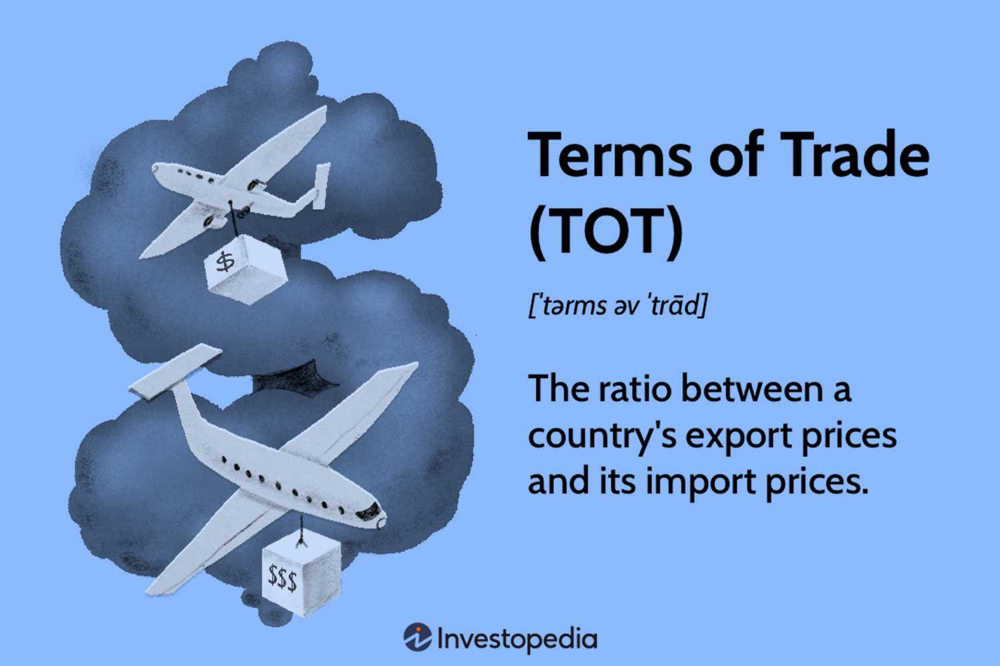

## Table of Contents

## What are terms of trade and why are they important?

Terms of trade refer to the rate at which one country's goods can be exchanged for another country's goods. It is usually measured by the ratio of export prices to import prices. If a country can export a lot of its goods to get a small amount of another country's goods, it has good terms of trade. If it has to export a lot to get just a little in return, its terms of trade are not as good.

Terms of trade are important because they affect a country's economy. If a country has good terms of trade, it can buy more imports for the same amount of exports. This can help the country's economy grow because it can get more resources from other countries. On the other hand, if a country's terms of trade get worse, it might have to export more to get the same amount of imports. This can make it harder for the country to grow its economy. So, terms of trade are a key part of understanding how well a country is doing in the global market.

## How are terms of trade calculated?

Terms of trade are calculated by comparing the prices of a country's exports to the prices of its imports. This comparison is usually done using an index, which is a way to measure changes over time. The formula for terms of trade is simple: it's the index of export prices divided by the index of import prices, and then multiplied by 100. If the result is more than 100, it means the country's terms of trade are improving. If it's less than 100, the terms of trade are getting worse.

For example, if the index of export prices is 120 and the index of import prices is 100, the terms of trade would be (120/100) * 100 = 120. This means the country is getting better terms of trade because it can export its goods for a higher price compared to what it pays for imports. On the other hand, if the index of export prices is 90 and the index of import prices is 110, the terms of trade would be (90/110) * 100 = 81.8, indicating that the country's terms of trade are worsening because it has to export more to get the same amount of imports.

## What is the difference between terms of trade and trade balance?

Terms of trade and trade balance are two different things that help us understand how a country is doing in the world market. Terms of trade look at the price of what a country sells to other countries compared to the price of what it buys from them. It's like a ratio that shows if a country is getting a good deal. If a country can sell its stuff for a high price and buy other stuff for a low price, its terms of trade are good.

Trade balance, on the other hand, is about the difference between what a country sells and what it buys. It's like keeping track of money coming in and going out. If a country sells more than it buys, it has a trade surplus, which is good. If it buys more than it sells, it has a trade deficit, which can be a problem. So, while terms of trade focus on the prices, trade balance focuses on the amounts of goods and services traded.

## Can you explain the concept of the terms of trade index?

The terms of trade index is a way to see if a country is getting a good deal when it trades with other countries. It compares the prices of what a country sells (exports) to the prices of what it buys (imports). If the index goes up, it means the country is getting more for what it sells compared to what it buys. If the index goes down, the country is getting less for its exports compared to its imports.

This index is important because it helps us understand how well a country is doing in the world market. If the terms of trade index is high, the country can buy more from other countries with the money it makes from its exports. This can help the country's economy grow. But if the index is low, the country has to work harder to get the same amount of imports, which can make it harder for the economy to grow.

## What are the main factors that influence terms of trade?

Several things can change a country's terms of trade. One big thing is the price of what the country sells to other countries. If the price of these exports goes up, the terms of trade get better. But if the price goes down, the terms of trade get worse. Another thing that matters is the price of what the country buys from other countries. If the price of these imports goes up, the terms of trade get worse. But if the price goes down, the terms of trade get better.

Changes in the world market can also affect terms of trade. For example, if there is a lot of demand for what a country sells, the price of those exports can go up, making the terms of trade better. But if there is not much demand, the price can go down, making the terms of trade worse. Also, if a country can make things more cheaply than other countries, it can sell them for less and still make money, which can help its terms of trade. But if it costs a lot to make things, the country might have to charge more, which can hurt its terms of trade.

## How do commodity prices affect a country's terms of trade?

Commodity prices can have a big impact on a country's terms of trade. If a country sells a lot of commodities like oil, minerals, or farm products, the price of these things can change how well the country does in trade. When the prices of these commodities go up, the country can sell them for more money. This makes the country's terms of trade better because it can buy more from other countries with the money it makes from selling its commodities.

On the other hand, if the prices of commodities go down, it can hurt a country's terms of trade. The country will make less money from selling its commodities, so it can't buy as much from other countries. This makes the terms of trade worse. Countries that rely a lot on selling commodities need to watch the prices carefully because they can make a big difference in how well the country does in the world market.

## What role do exchange rates play in determining terms of trade?

Exchange rates are important for figuring out a country's terms of trade. They show how much one country's money is worth compared to another country's money. If a country's money gets stronger compared to other countries' money, it means the country can buy more from other places with the same amount of its own money. This can make the country's terms of trade better because it gets more for what it sells and pays less for what it buys.

But if a country's money gets weaker, it can hurt the terms of trade. When the money is weaker, the country has to pay more for things it buys from other places. This means it gets less for what it sells and has to spend more on what it buys. So, changes in exchange rates can make a big difference in how well a country does in trading with other countries.

## How do technological advancements impact terms of trade?

Technological advancements can make a big difference in a country's terms of trade. When a country uses new technology to make things, it can often do it faster and cheaper. This means the country can sell its stuff for less money and still make a profit. If a country can sell its things for less, it can trade more easily with other countries. This can make the country's terms of trade better because it gets more for what it sells compared to what it buys.

Also, technology can help a country make new kinds of things that other countries want to buy. If a country can make something new and useful, it can sell it for a good price. This can make the country's terms of trade even better. But if other countries also get the new technology and start making the same things, it might not be so special anymore. Then, the prices might go down, and the terms of trade might not be as good. So, technology can help a country's terms of trade, but it depends on how other countries use it too.

## What are the economic implications of improving terms of trade for a country?

When a country's terms of trade get better, it means the country can buy more from other countries with the same amount of its own stuff. This can help the country's economy grow because it can get more resources and goods from other places. More resources can help businesses make more things and create more jobs. When people have jobs, they can spend more money, which helps the economy grow even more. Also, if a country can sell its stuff for more money, it can make more profit. This extra money can be used to invest in new projects or to improve things like schools and hospitals, which can make the country a better place to live.

But improving terms of trade isn't always perfect. Sometimes, if a country relies too much on selling one thing, like oil or minerals, and the price of that thing goes up, it might not be good in the long run. If the price goes down later, the country's terms of trade can get worse quickly. Also, if a country's money gets stronger because of better terms of trade, it might make the country's stuff more expensive for other countries to buy. This can hurt the country's exports and make it harder to keep the good terms of trade. So, while better terms of trade can help a country's economy, it's important to think about the long-term effects and not rely too much on just one thing.

## How can changes in global demand affect a country's terms of trade?

Changes in what people around the world want to buy can really affect a country's terms of trade. If more people want to buy what a country sells, like cars or computers, the price of those things can go up. When the price goes up, the country can sell its stuff for more money. This makes the country's terms of trade better because it can buy more from other countries with the money it makes from its exports. For example, if a country sells a lot of oil and the world suddenly needs more oil, the price of oil can go up, making the country's terms of trade better.

But if fewer people want to buy what a country sells, the price can go down. When the price goes down, the country makes less money from selling its stuff. This makes the country's terms of trade worse because it can't buy as much from other countries with the money it makes from its exports. For instance, if a country sells a lot of wheat and the world suddenly needs less wheat, the price of wheat can go down, making the country's terms of trade worse. So, changes in what people around the world want to buy can make a big difference in how well a country does in trading with other countries.

## What strategies can countries employ to improve their terms of trade?

Countries can do a few things to make their terms of trade better. One way is to make their stuff cheaper and better. They can do this by using new technology or finding new ways to make things. When a country can make things cheaper and better, it can sell them for less money and still make a profit. This makes it easier for the country to trade with other countries because its stuff is more attractive. Another way is to find new things to sell that other countries want to buy. If a country can make something new and useful, it can sell it for a good price. This can make the country's terms of trade better because it gets more for what it sells.

Another strategy is to work on making the country's money stronger. If a country's money is worth more compared to other countries' money, it can buy more from other places with the same amount of its own money. This can make the country's terms of trade better because it gets more for what it sells and pays less for what it buys. But countries need to be careful because if their money gets too strong, it might make their stuff more expensive for other countries to buy. This can hurt the country's exports and make it harder to keep the good terms of trade. So, countries need to find a balance and think about the long-term effects of their strategies.

## How do terms of trade relate to a country's overall economic development and living standards?

Terms of trade are really important for a country's economic development and how well people live. If a country can sell its stuff for a lot of money and buy things from other countries for less, its terms of trade are good. This means the country can get more resources and goods from other places with the money it makes from selling its own stuff. More resources can help businesses make more things and create more jobs. When people have jobs, they can spend more money, which helps the economy grow. This growth can lead to better schools, hospitals, and other services, making life better for everyone in the country.

But if a country's terms of trade get worse, it can be hard for the economy to grow. When a country has to sell a lot of its stuff to buy just a little from other countries, it makes less money. This means the country might not have enough resources to help businesses grow or to create jobs. When people don't have jobs, they can't spend as much money, which can slow down the economy. If the economy isn't doing well, it can be hard to improve things like schools and hospitals, which can make life harder for people in the country. So, having good terms of trade is really important for a country's economic development and the living standards of its people.

## What is meant by Understanding Terms of Trade?

The terms of trade (ToT) is defined as the ratio of export prices to import prices, serving as an essential measure of a country's trading capabilities and overall economic vitality. Mathematically, it can be expressed as:

$$
\text{Terms of Trade (ToT)} = \frac{\text{Index of Export Prices}}{\text{Index of Import Prices}} \times 100
$$

A higher ToT indicates that a country can purchase more imports for a given level of exports, reflecting a favorable trade condition. Conversely, a declining ToT implies that a country must export more to acquire the same amount of imports, potentially leading to economic strain.

Factors influencing the terms of trade include changes in global demand and supply, exchange rate fluctuations, and international policy adjustments. For instance, an increase in global demand for a country's exports can drive up export prices, improving the ToT. Similarly, if import prices fall due to improved efficiency or decreased demand, a country's ToT would also improve.

The importance of ToT extends to policy-making and economic strategies. Governments closely monitor ToT to assess the economic impact of foreign trade policies and external shocks. For example, a prolonged unfavorable ToT might prompt a government to implement trade protection measures or diversify its export base to stabilize its economy.

Moreover, terms of trade affect other macroeconomic variables such as the trade balance and national income. A favorable ToT can lead to a surplus in the trade balance, enhancing national income and fostering economic growth. Conversely, an unfavorable ToT may result in trade deficits, necessitating policy interventions to mitigate adverse economic impacts. Understanding these dynamics aids in formulating policies that strive for sustainable economic development.

## What are the key economic indicators in trade?

Economic indicators are essential tools that provide vital insights into a nation's economic health and trade performance. Among the vast array of these indicators, the trade balance, GDP growth rate, and inflation stand out as pivotal elements that significantly influence trade dynamics and economic policymaking.

### Trade Balance

The trade balance, representing the difference between a country's exports and imports, is a direct reflection of its economic interactions with the rest of the world. A positive trade balance, or trade surplus, occurs when exports exceed imports, contributing to national economic growth by inflating the domestic currency's value and potentially increasing foreign reserves. Conversely, a trade deficit, where imports surpass exports, can lead to currency depreciation and highlight underlying issues within the economy, such as competitiveness or reliance on foreign goods. Policymakers closely monitor the trade balance to make informed decisions about tariffs, currency adjustments, and trade agreements.

### GDP Growth Rate

Gross Domestic Product (GDP) is the total market value of all goods and services produced in a country over a specific period and is a cornerstone indicator of economic performance. The GDP growth rate measures how fast an economy is growing and can offer insights into the country's economic stability and potential for future trade expansion. A healthy GDP growth rate typically signals robust economic activity, encouraging foreign investment and trade. Policymakers use the GDP growth rate to develop strategies to stimulate economic activities, negotiate trade partnerships, and plan long-term economic reforms. The rate can be calculated using:

$$
\text{GDP Growth Rate} = \frac{\text{GDP}_{\text{current year}} - \text{GDP}_{\text{previous year}}}{\text{GDP}_{\text{previous year}}} \times 100
$$

### Inflation

Inflation, the rate at which the general level of prices for goods and services rises, eroding purchasing power, fundamentally impacts trade by influencing cost structures and consumption patterns. Moderate inflation is generally considered a sign of a healthy economy, stimulating spending and investment. However, high inflation can deter trade by increasing costs and creating economic uncertainty, whereas deflation can slow economic growth and trade by decreasing consumer spending. Policymakers and traders must comprehend and anticipate inflation trends to establish beneficial trade agreements, set tariffs, and ensure price stability.

### Implications for Traders and Policymakers

Economic indicators, such as trade balance, GDP growth rate, and inflation, play a crucial role in forming trade policies and economic strategies at both national and international levels. By offering unique insights into a country's economic trajectory, these indicators help stakeholders identify opportunities for growth, address economic challenges, and align with global economic trends. For traders, understanding these indicators aids in making strategic decisions regarding market entry, pricing, and risk management. For policymakers, they are instrumental in crafting policies that promote economic stability, competitive markets, and favorable trade conditions.

In conclusion, these key economic indicators are indispensable for comprehending and navigating the complexities of global trade and economic policymaking, highlighting their critical role in shaping the future of international commerce.

## What trade factors are influencing markets?

Several factors fundamentally influence markets, shaping international trade dynamics and economic relationships among nations. Currency exchange rates, tariffs, and trade agreements are among the primary determinants of trade flows and market adaptability.

### Currency Exchange Rates:
Currency exchange rates are a pivotal element affecting international trade. They determine the relative price of goods between countries, influencing export competitiveness and import costs. When a nation's currency appreciates, its exports become more expensive to foreign buyers, potentially reducing demand, while imports become cheaper for domestic consumers. Conversely, a depreciating currency can bolster export demand while increasing the expense of imports. The formula for exchange rate impact on trade balance is often represented as:

$$
\text{Trade Balance} = \text{Exports} - \frac{\text{Imports}}{\text{Exchange Rate}}
$$

### Tariffs and Trade Agreements:
Tariffs, taxes imposed on imported goods, are tools for protecting domestic industries from foreign competition. However, they can lead to trade wars and increase the cost of goods for consumers. Trade agreements, on the other hand, are negotiated to reduce or eliminate tariffs and other trade barriers, facilitating smoother and more cost-effective international trade. Agreements like NAFTA (now USMCA) or the European Union single market exemplify how policy can significantly impact trade flows by altering the cost and flow of goods and services across borders.

### Global Events and Geopolitical Issues:
Events such as political instability, wars, or natural disasters can severely disrupt trade. For instance, a geopolitical dispute might lead to sanctions that hinder trade with direct economic consequences for affected countries. Similarly, ports and supply chains can be significantly impacted by such global events, causing delays and increased costs.

### Technological Advancements:
Technology plays a crucial role in enhancing trade efficiency. Innovations in logistics and supply chain management, such as blockchain technology and AI-driven analytics, improve tracking, reduce errors, and optimize routes. Technologies that enhance communication and safety in transportation also contribute by minimizing delays and damages.

### Supply Chain Efficiency:
An efficient supply chain is vital for minimizing costs and maximizing the speed of trade. Factors such as transportation infrastructure, labor costs, and inventory management directly affect supply chain efficiency. Companies increasingly leverage technology to improve these areas, using sophisticated software to predict demand, manage resources, and optimize procurement processes.

Understanding these factors and their interplay is crucial for countries and businesses aiming to develop effective trade strategies and navigate the complexities of the global market. Each element presents unique challenges, and strategic adaptation is essential for gaining competitive advantages in international trade.

## References & Further Reading

[1]: ["Advances in Financial Machine Learning"](https://www.amazon.com/Advances-Financial-Machine-Learning-Marcos/dp/1119482089) by Marcos Lopez de Prado

[2]: ["Evidence-Based Technical Analysis: Applying the Scientific Method and Statistical Inference to Trading Signals"](https://www.amazon.com/Evidence-Based-Technical-Analysis-Scientific-Statistical/dp/0470008741) by David Aronson

[3]: ["Machine Learning for Algorithmic Trading"](https://github.com/stefan-jansen/machine-learning-for-trading) by Stefan Jansen

[4]: ["Quantitative Trading: How to Build Your Own Algorithmic Trading Business"](https://www.amazon.com/Quantitative-Trading-Build-Algorithmic-Business/dp/1119800064) by Ernest P. Chan

[5]: Blecker, R. A., & Ibarra, C. A. (2013). ["Trade liberalization and the balance of payments constraint with intermediate imports: The case of Mexico revisited."](http://fs2.american.edu/blecker/www/research/Blecker_Ibarra_Mexico_2013.pdf) World Economy, 36(10), 1387-1407.

[6]: Goldberg, P. K., & Knetter, M. M. (1997). ["Goods prices and exchange rates: What have we learned?"](https://www.jstor.org/stable/2729977) Journal of Economic Literature, 35(3), 1243-1272.