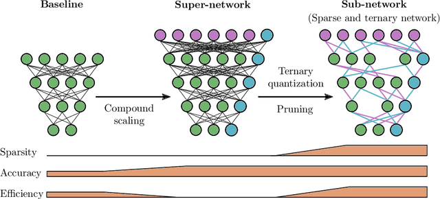

## Table of Contents

## What is ternarization in the context of machine learning?

Ternarization in machine learning is a technique used to simplify neural network models by reducing the precision of the weights and activations from floating-point numbers to three possible values: -1, 0, and 1. This process helps in making the models more efficient in terms of memory usage and computational speed, which is particularly useful for deploying models on resource-constrained devices like mobile phones or embedded systems. By using only three values, ternarization reduces the amount of data that needs to be stored and processed, leading to faster inference times and lower energy consumption.

The process of ternarizing a neural network involves mapping the original weights and activations to the nearest ternarized value. For example, if a weight in the original model is 0.7, it might be mapped to 1 in the ternarized model. This mapping can be done using a simple threshold-based approach, where weights above a certain positive threshold are set to 1, weights below a certain negative threshold are set to -1, and weights in between are set to 0. While this simplification can lead to a slight loss in model accuracy, the benefits in terms of efficiency often outweigh this drawback, making ternarization a popular choice for optimizing neural networks for practical applications.

## How does ternarization differ from binarization in neural networks?

Ternarization and binarization are both techniques used to simplify neural networks by reducing the precision of weights and activations. The main difference is in the number of values used. Binarization uses only two values, typically -1 and 1, while ternarization uses three values: -1, 0, and 1. This means that ternarization keeps a bit more information than binarization because it includes zero as an option, which can help maintain some of the model's accuracy that might be lost with binarization.

In practice, binarization can lead to more significant reductions in memory and computation requirements because it uses fewer bits to represent each value. However, this can also result in a larger drop in model performance compared to ternarization. Ternarization strikes a balance, offering a middle ground where the model can still be significantly more efficient than a full-precision model but with less accuracy loss than a binarized model. For example, if a weight in the original model is close to zero, ternarization can represent this more accurately than binarization, which would force it to be either -1 or 1.

## What are the benefits of using ternarization in machine learning models?

Using ternarization in [machine learning](/wiki/machine-learning) models can make them work faster and use less memory. Instead of using many different numbers, ternarization simplifies things by using only three numbers: -1, 0, and 1. This means that the computer doesn't need to store as much information or do as many calculations. This is really helpful when you want to use these models on small devices like phones or in places where you don't have a lot of computing power.

Another benefit is that ternarization can help save energy. Because the computer does fewer calculations and uses less memory, it uses less power. This is important for things like battery-powered devices, where you want the model to run for a long time without needing to recharge. While ternarization might make the model a little less accurate than using full numbers, the trade-off is often worth it because of the big improvements in speed and efficiency.

## Can you explain the process of Ternary Weight Splitting?

Ternary Weight Splitting is a way to make neural networks simpler and faster by using only three numbers for the weights: -1, 0, and 1. This method splits the original weights into two parts: a scaling [factor](/wiki/factor-investing) and a ternary value. The scaling factor is a single number that helps keep the model accurate, while the ternary value is either -1, 0, or 1. By doing this, the model can still work well but uses less memory and runs faster.

To ternarize a weight, you first find the scaling factor, which is usually the average of the absolute values of the weights in a layer. Then, you divide each weight by this scaling factor to get a number between -1 and 1. After that, you turn this number into a ternary value: if it's bigger than a certain positive number, it becomes 1; if it's smaller than a certain negative number, it becomes -1; and if it's in between, it becomes 0. This way, the model keeps some of its accuracy but becomes much more efficient.

## What are the challenges faced when implementing ternarization in deep learning?

Implementing ternarization in [deep learning](/wiki/deep-learning) can be tricky because it simplifies the model by using only three values for weights and activations. This simplification can make the model less accurate because it loses some of the detailed information that full-precision numbers provide. For example, if a weight in the original model is 0.3, ternarization might turn it into 0, which can change how the model works. This loss of precision can be a big problem, especially for tasks that need very accurate results. Researchers have to find a good balance between making the model efficient and keeping it accurate enough for the job it needs to do.

Another challenge is figuring out the best way to ternarize the weights and activations. There are different methods to do this, and each one can affect the model's performance in different ways. For instance, deciding the thresholds for turning weights into -1, 0, or 1 can be hard. If the thresholds are too strict, the model might lose too much information. If they're too relaxed, the model might not become as efficient as hoped. Also, training a ternarized model can be more complicated because the usual training methods might not work well with the limited values. Researchers need to come up with new training techniques or adjust existing ones to make ternarization work effectively.

## How does ternarization affect the accuracy of a neural network?

Ternarization simplifies a [neural network](/wiki/neural-network) by using only three values for weights and activations: -1, 0, and 1. This simplification can make the model less accurate because it loses some of the detailed information that full-precision numbers provide. For example, if a weight in the original model is 0.3, ternarization might turn it into 0, which can change how the model works. This loss of precision can be a big problem, especially for tasks that need very accurate results. Researchers have to find a good balance between making the model efficient and keeping it accurate enough for the job it needs to do.

To manage the impact on accuracy, researchers use different methods to ternarize the weights and activations. They have to decide the best thresholds for turning weights into -1, 0, or 1. If the thresholds are too strict, the model might lose too much information. If they're too relaxed, the model might not become as efficient as hoped. Also, training a ternarized model can be more complicated because the usual training methods might not work well with the limited values. Researchers need to come up with new training techniques or adjust existing ones to make ternarization work effectively while trying to keep the model's accuracy as high as possible.

## What types of neural networks are most suitable for ternarization?

Neural networks that are most suitable for ternarization are those where a small loss in accuracy can be tolerated in exchange for significant gains in efficiency. This often includes models used in edge computing or on devices with limited resources, like mobile phones or IoT devices. For example, convolutional neural networks (CNNs) used for image classification tasks can benefit from ternarization because they often have a large number of weights, and reducing their precision can lead to substantial savings in memory and computation without severely impacting the model's performance.

Another type of neural network that can be suitable for ternarization is recurrent neural networks (RNNs) used in natural language processing tasks. While RNNs are more sensitive to weight precision due to their sequential nature, ternarization can still be applied if the task allows for some degradation in performance. The key is to carefully choose the thresholds for ternarization and possibly retrain the model to adapt to the new weight representation, ensuring that the model remains functional and efficient.

## How can ternarization be applied to convolutional neural networks?

Ternarization can be applied to convolutional neural networks (CNNs) by turning the weights of the network into three values: -1, 0, and 1. This makes the model simpler and faster to use. To do this, you first find a scaling factor, which is the average of the absolute values of the weights in a layer. Then, you divide each weight by this scaling factor to get a number between -1 and 1. After that, you turn this number into a ternary value: if it's bigger than a certain positive number, it becomes 1; if it's smaller than a certain negative number, it becomes -1; and if it's in between, it becomes 0. This way, the model can still work well but uses less memory and runs faster.

Applying ternarization to CNNs can be tricky because it can make the model less accurate. The key is to find the right balance between making the model efficient and keeping it accurate enough for the job it needs to do. You might need to adjust the thresholds for turning weights into -1, 0, or 1, and possibly retrain the model to adapt to the new weight representation. This helps ensure that the model remains functional and efficient, even with the simplified weights.

## What are the hardware advantages of using ternarized models?

Using ternarized models on hardware can make them work faster and use less memory. Instead of using many different numbers for the weights, ternarized models use only three numbers: -1, 0, and 1. This means that the computer doesn't need to store as much information or do as many calculations. This is really helpful when you want to use these models on small devices like phones or in places where you don't have a lot of computing power. For example, a device with limited memory can store more ternarized models than full-precision models, making it possible to run multiple tasks at the same time.

Another advantage is that ternarized models can help save energy. Because the computer does fewer calculations and uses less memory, it uses less power. This is important for things like battery-powered devices, where you want the model to run for a long time without needing to recharge. While ternarization might make the model a little less accurate than using full numbers, the trade-off is often worth it because of the big improvements in speed and efficiency. This makes ternarized models a good choice for applications where energy efficiency is a priority.

## How does ternarization impact the training time and inference speed of models?

Ternarization can make training a neural network take longer because it changes how the weights are represented. Instead of using many different numbers, ternarization uses only three numbers: -1, 0, and 1. This means that the usual training methods might not work well with these limited values. Researchers need to come up with new training techniques or adjust existing ones to make ternarization work effectively. This extra work can make the training process longer, but it's done to make sure the model can still learn and perform well with the simpler weights.

On the other hand, ternarization can make the model run much faster during inference. When the model is used to make predictions, it uses less memory and does fewer calculations because it's working with only three values instead of many different numbers. This makes the model more efficient and can help it run quickly on devices with limited computing power, like phones or small computers. While ternarization might make the model a little less accurate, the big improvements in speed and efficiency often make it a good trade-off for many applications.

## What advanced techniques can be used to optimize ternarized neural networks?

To optimize ternarized neural networks, one advanced technique is to use quantization-aware training. This means training the model while knowing it will be ternarized later. During training, the model learns to work well with the simplified weights. This can help the model keep more of its accuracy even after ternarization. Another technique is to use different thresholds for different layers of the network. Some layers might need more precision than others, so adjusting the thresholds can help balance efficiency and accuracy. This way, the model can still be fast and use less memory but also perform well on its tasks.

Another method is to use techniques like knowledge distillation. This involves training a smaller, ternarized model to mimic a larger, more accurate model. The smaller model learns from the larger one, which helps it perform better even with the simpler weights. This can be especially useful for tasks where accuracy is important but resources are limited. Additionally, researchers can use techniques like pruning to remove unnecessary weights from the model before ternarizing it. This can make the model even more efficient and help it run faster on devices with limited computing power.

## How can one evaluate the effectiveness of ternarization in a specific application?

To evaluate the effectiveness of ternarization in a specific application, you need to look at how well the ternarized model performs compared to the original full-precision model. This involves measuring the accuracy of the model on a test dataset. If the ternarized model can still make good predictions, even if they are a bit less accurate than the original model, then ternarization might be a good choice. You should also consider how much faster the ternarized model runs and how much less memory it uses. If the speed and memory savings are big enough to make up for any small drop in accuracy, then ternarization can be very effective for your application.

Another important thing to check is how well the ternarized model works in the real world. This means testing it on the actual devices or systems where it will be used, like phones or small computers. You want to see if the model can still do its job well, even with the simpler weights. If the model runs quickly and uses less power on these devices, and if it can still make accurate enough predictions, then ternarization is a good solution. It's all about finding the right balance between making the model efficient and keeping it accurate enough for what you need it to do.