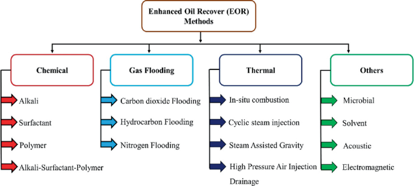

## Table of Contents

## What is tertiary recovery in the context of oil and gas extraction?

Tertiary recovery is a method used in the oil and gas industry to extract more oil from a reservoir after primary and secondary recovery methods have been used. Primary recovery uses the natural pressure of the reservoir to bring oil to the surface, while secondary recovery involves injecting water or gas to push more oil out. When these methods are no longer effective, tertiary recovery, also known as enhanced oil recovery (EOR), is used to get even more oil.

Tertiary recovery uses advanced techniques to change the properties of the oil or the reservoir rock. Common methods include injecting steam to heat the oil and make it flow more easily, using chemicals to reduce the oil's viscosity, or injecting gases like carbon dioxide to mix with the oil and help it move. These techniques can be expensive and complex, but they can significantly increase the amount of oil that can be extracted from a reservoir, making them worthwhile for many oil companies.

## How does tertiary recovery differ from primary and secondary recovery methods?

Primary recovery is the first step in getting oil out of the ground. It uses the natural pressure inside the earth to push the oil up to the surface. This method is simple and doesn't need much extra help. But, it only gets out about 10 to 15 percent of the oil in the reservoir. When the natural pressure starts to drop, less oil comes out, and that's when we move to secondary recovery.

Secondary recovery helps get more oil out by adding water or gas into the reservoir. This pushes the oil towards the wells where it can be pumped out. This method can increase the amount of oil recovered to about 20 to 40 percent. But, after a while, even this method stops working well, and that's when we use tertiary recovery.

Tertiary recovery, also called enhanced oil recovery, uses special techniques to get even more oil out. It might involve heating the oil with steam, using chemicals to make the oil flow better, or injecting gases like carbon dioxide to mix with the oil. These methods are more complex and costly, but they can boost the recovery rate up to 30 to 60 percent or more. Tertiary recovery is used when primary and secondary methods are no longer effective.

## What are the main mechanisms involved in tertiary recovery?

Tertiary recovery uses special ways to get more oil out of the ground. One way is by using heat. This means injecting steam into the oil reservoir. The heat makes the oil less thick and easier to move. It's like warming up honey to make it flow better. Another way is by using chemicals. These chemicals can make the oil less sticky or help it mix with water so it can be pushed out more easily. It's like using soap to clean oil off your hands.

Another important method is using gases, like carbon dioxide. When carbon dioxide is injected into the reservoir, it mixes with the oil. This mixing helps the oil move towards the wells where it can be pumped out. It's like stirring oil and vinegar together to make them blend. All these methods change how the oil or the rock around it behaves, making it possible to get more oil out than with just the natural pressure or water pushing.

These techniques are more complex and expensive than primary and secondary recovery, but they can make a big difference. They can help get out a lot more oil, sometimes up to 60 percent or more of what's in the reservoir. This makes it worth the extra effort and cost for many oil companies.

## Can you explain the role of enhanced oil recovery (EOR) in tertiary recovery?

Enhanced oil recovery, or EOR, is a big part of tertiary recovery. It's what we do when the easy ways to get oil out of the ground aren't working anymore. EOR uses special tricks to pull more oil from the earth. It can heat up the oil with steam, use chemicals to make the oil flow better, or pump in gases like carbon dioxide to mix with the oil. These methods help the oil move and get pushed out of the ground.

EOR is important because it can get a lot more oil out of the ground than just using the natural pressure or water pushing. While it's more expensive and tricky, it can make a big difference. Sometimes, EOR can help get out up to 60 percent or more of the oil that's left in the reservoir. This makes it worth the extra effort and cost for many oil companies.

## What are the common chemical methods used in tertiary recovery?

Chemical methods in tertiary recovery help get more oil out of the ground by changing how the oil behaves. One common way is using surfactants. These are like soaps that make the oil less sticky and easier to mix with water. When surfactants are added to the reservoir, they help the oil break into smaller drops and move through the rock more easily. This makes it easier to push the oil out.

Another method is using polymers. Polymers are like thick liquids that can be added to the water that's injected into the reservoir. They make the water thicker, so it can push the oil more effectively. It's like using a thicker broom to sweep up more oil. By using polymers, the water can move the oil towards the wells where it can be pumped out.

Sometimes, a mix of chemicals is used, like combining surfactants and polymers. This can make the oil even easier to move and increase the amount of oil that can be recovered. These chemical methods are more complex and costly, but they can help get a lot more oil out of the ground when other methods aren't working well anymore.

## How do thermal methods enhance oil recovery in tertiary stages?

Thermal methods help get more oil out of the ground by making the oil less thick and easier to move. One way to do this is by injecting steam into the oil reservoir. The heat from the steam warms up the oil, making it flow better, just like how honey flows more easily when it's warm. This helps the oil move towards the wells where it can be pumped out. Another way is called in-situ combustion, where air is pumped into the reservoir and then set on fire. The heat from the fire makes the oil less thick, and the burning also creates gases that help push the oil out.

These thermal methods are really helpful because they can get a lot more oil out of the ground than just using the natural pressure or water pushing. They work especially well in places where the oil is very thick and hard to move. Even though these methods can be expensive and tricky to do, they can make a big difference. Sometimes, they can help get out up to 60 percent or more of the oil that's left in the reservoir. This makes it worth the extra effort and cost for many oil companies.

## What is the significance of gas injection in tertiary recovery?

Gas injection is a big deal in getting more oil out of the ground during tertiary recovery. It works by pumping gases like carbon dioxide, nitrogen, or natural gas into the oil reservoir. The gas mixes with the oil, making it easier to move. It's like stirring oil and vinegar together to make them blend. This mixing helps the oil flow towards the wells where it can be pumped out. Carbon dioxide is especially good at this because it can dissolve into the oil and make it less thick.

Using gas injection can make a huge difference in how much oil we can get out of the ground. It can help recover up to 30 to 60 percent or more of the oil that's left in the reservoir. This is a lot more than what we can get with just the natural pressure or water pushing. Even though it's more expensive and tricky, gas injection is worth it for many oil companies because it helps them get a lot more oil out of the ground.

## How do microbial methods contribute to tertiary oil recovery?

Microbial methods in tertiary oil recovery use tiny living things called microbes to help get more oil out of the ground. These microbes are put into the oil reservoir where they eat some of the oil and make gases and chemicals. The gases can push the oil towards the wells, and the chemicals can make the oil less thick and easier to move. It's like having little helpers inside the earth that work to make the oil flow better.

Using microbes can be a good way to get more oil out, especially when other methods aren't working well anymore. It's not as common as using heat, chemicals, or gases, but it can still make a difference. Microbial methods can help increase the amount of oil recovered by a few percent, which can be a lot when you're talking about big oil fields. Even though it takes time for the microbes to work, it can be worth it because it's another way to get more oil out of the ground.

## What are the economic considerations when implementing tertiary recovery techniques?

When oil companies think about using tertiary recovery techniques, they have to consider the cost. These methods, like using heat, chemicals, or gases, are more expensive than the simple ways of getting oil out. They need special equipment and a lot of energy, which can add up quickly. But, the good thing is that they can get a lot more oil out of the ground. If the price of oil is high, it might be worth it to spend the extra money because the company can make a lot more money from the extra oil they get.

Another thing to think about is how much oil is left in the ground. If there's a lot of oil still there, it might make sense to use these more expensive methods. But if there's not much oil left, it might not be worth the cost. Oil companies also have to think about how long it will take to get the oil out. Some methods, like using microbes, can take a long time to work. So, they need to weigh the cost of waiting against the extra oil they might get. In the end, it's all about figuring out if the extra oil they can get will make up for the extra money and time they have to spend.

## What are the environmental impacts associated with tertiary recovery?

Tertiary recovery methods can have a big impact on the environment. One way they affect the environment is by using a lot of energy. For example, when steam is used to heat the oil, it takes a lot of energy to make the steam. This energy often comes from burning fossil fuels, which puts more carbon dioxide into the air and can make climate change worse. Another way is by using chemicals. These chemicals can get into the water and soil around the oil field, which can harm plants and animals.

Another thing to think about is what happens to the stuff that's used in tertiary recovery. When gases like carbon dioxide are pumped into the ground, they can leak out and affect the air quality. Also, if the oil field is near water, the chemicals and gases can get into the water and make it hard for fish and other water animals to live. Even though tertiary recovery can get more oil out of the ground, it's important to think about how it might hurt the environment and try to find ways to do it that are safer for the planet.

## How can the effectiveness of tertiary recovery methods be measured and optimized?

The effectiveness of tertiary recovery methods can be measured by looking at how much more oil is produced compared to what was coming out before. Companies keep track of the oil production rates before, during, and after using these methods. They also watch the costs, like how much money is spent on steam, chemicals, or gases. If the extra oil produced makes up for the extra costs, then the method is considered effective. Another way to measure effectiveness is by doing tests in small parts of the oil field first, to see if the method works well before using it everywhere.

To optimize tertiary recovery, companies can try different methods and see which one works best for their specific oil field. They might change the amount of steam, chemicals, or gases they use, or try different combinations of these. They can also use computer models to predict how the oil will move and figure out the best way to get it out. By keeping a close eye on the results and making changes as needed, companies can make sure they are getting as much oil out of the ground as possible without wasting too much money or time.

## What are the latest advancements and future trends in tertiary recovery technologies?

The latest advancements in tertiary recovery technologies are focusing on making these methods more effective and less harmful to the environment. One big trend is using carbon dioxide for enhanced oil recovery. This not only helps get more oil out of the ground but also stores the carbon dioxide underground, which can help fight climate change. Another advancement is in using nanotechnology. Tiny particles called nanoparticles can be added to the chemicals used in tertiary recovery. These particles can help the chemicals work better and get more oil out. Scientists are also working on new ways to use microbes that can break down the oil and make it easier to move, which is a more natural and less harmful way to do tertiary recovery.

Looking into the future, we can expect more smart technologies to be used in tertiary recovery. This includes using artificial intelligence and big data to predict how the oil will move and find the best ways to get it out. There's also a lot of interest in making these methods greener. This means finding ways to use less energy and fewer harmful chemicals. For example, using solar power to make steam for thermal recovery can cut down on the use of fossil fuels. As we learn more about the earth and how oil moves, we'll keep finding new and better ways to get the oil out while taking care of the environment.

## References & Further Reading

[1]: Thomas, S. "Enhanced oil recovery: An overview." Oil & Gas Science and Technology 63, no. 1 (2008): 9-19. [Link to article](https://www.semanticscholar.org/paper/Enhanced-Oil-Recovery-An-Overview-Thomas/3e23310b5fb2b142342de4118accd733c4618d61)

[2]: Lake, L. W., Johns, R. T., Rossen, W. R., & Pope, G. A. "Fundamentals of enhanced oil recovery." Society of Petroleum Engineers. 2014. [Link to book](https://www.semanticscholar.org/paper/Fundamentals-of-Enhanced-Oil-Recovery-Lake-Johns/35d7f51a8c0ead1c96e6a56fbb68c028ebfc6f9c)

[3]: Green, D. W., & Willhite, G. P. "Enhanced Oil Recovery." Society of Petroleum Engineers Textbook Series, 1998. [Link to book](https://onepetro.org/books/book/37/Enhanced-Oil-Recovery)

[4]: Argonne National Laboratory. "The Use of CO2 for Enhanced Oil Recovery and Sequestration." [Link to report](https://en.wikipedia.org/wiki/Chicago_Pile-1)

[5]: Shah, A. R., Fishwick, R., Wood, J., Leeke, G., Rigby, S. P., & Greaves, M. "A review of novel techniques for heavy oil and bitumen extraction and upgrading." Energy & Environmental Science 3, no. 6 (2010): 700-714. [Link to article](https://researchportal.bath.ac.uk/en/publications/a-review-of-novel-techniques-for-heavy-oil-and-bitumen-extraction)

[6]: Elder, J. "Algorithmic Trading and the Importance of Speed." IEEE Spectrum. [Link to article](https://ieeexplore.ieee.org/abstract/document/5696713)

[7]: Hull, J. C. "Options, Futures, and Other Derivatives." Pearson; 11th edition (2020). [Link to book](https://www.pearson.com/en-us/subject-catalog/p/options-futures-and-other-derivatives/P200000005938/9780136939917)

[8]: Sadorsky, P. "Oil price shocks and stock market activity." Energy Economics 21, no. 5 (1999): 449-469. [Link to article](https://www.sciencedirect.com/science/article/pii/S0140988399000201)