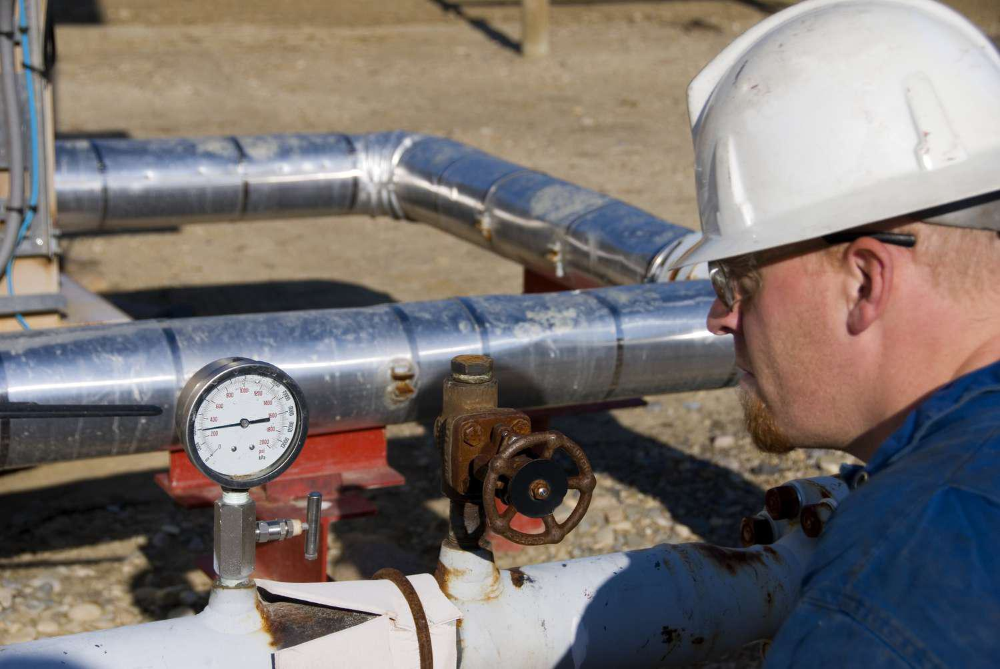

Enhanced oil recovery (EOR), also known as tertiary recovery, is a crucial technique in the oil industry designed to optimize oil extraction processes once primary and secondary methods have reached their limits. Primary recovery typically relies on the natural pressure of the reservoir, while secondary recovery involves injecting water or gas to displace oil and drive it to the surface. However, these methods generally extract only about 30-40% of the oil in a reservoir. EOR techniques are implemented to target the remaining oil, often increasing the extraction rate by an additional 10% to 20%. 

In this context, EOR employs advanced methodologies such as thermal, gas, and chemical injections, each tailored to alter the original properties of the oil, thus facilitating its movement and extraction. The economic and operational benefits of EOR are significant, as it enables continued production from wells that might otherwise be abandoned, thereby maximizing the value of existing assets.



Parallel advancements in algorithmic trading frameworks have become integral to the oil markets, facilitating prompt decision-making through automated systems that react to market data with high speed and precision. The dynamic nature of oil prices and the volatility of market conditions necessitate strategies that can rapidly adjust to fluctuations, offering investors and stakeholders tools to refine their production and investment choices effectively.

Understanding EOR technologies, coupled with efficient trading systems, is fundamental for stakeholders aiming to enhance oil production and optimize investment strategies, balancing economic imperatives with sustainability concerns. As the global demand for energy continues to rise, EOR stands as a key driver in extending the life cycle of oil fields and addressing future energy needs.

## Table of Contents

## Understanding Enhanced Oil Recovery (EOR)

Enhanced oil recovery (EOR), or tertiary recovery, marks the third stage in the oil extraction process, executed after the primary and secondary recovery methods have been fully utilized. Primary recovery typically relies on the natural pressure of the reservoir or gravity drainage to extract oil, capturing only about 10 to 20% of the oil in place. Secondary recovery involves injecting water or gas to displace oil and drive it to a production wellbore, enhancing extraction to around 30 to 50%.

Despite these efforts, a significant amount of oil remains trapped within reservoirs. EOR techniques are designed to target this remaining oil by altering its properties to facilitate extraction. The primary methods include:

1. **Thermal Injection**: This technique involves injecting steam or hot water to reduce the viscosity of heavy oils, allowing them to flow more easily towards the production wells. The injected steam heats the crude oil, thereby reducing its thickness and improving its mobility. Thermal EOR is often applied in up to 50% of EOR projects worldwide due to its effectiveness in heavy oil reserves.

2. **Gas Injection**: Carbon dioxide (CO2), nitrogen, or natural gas is injected to mix with the oil, reducing its viscosity and improving its flow. This method maintains reservoir pressure and induces oil swelling and viscosity reduction. Gas injection is particularly suitable for light to medium crude oils and has the additional benefit of allowing CO2 sequestration, contributing to environmental management.

3. **Chemical Injection**: This involves the use of chemicals such as surfactants, polymers, and alkaline agents to lower the surface tension between water and oil, enhancing the ability of the water to displace the oil. Polymer flooding, for instance, increases the viscosity of the water used, improving its sweep efficiency and therefore the recovery factor. Chemical methods are generally more expensive and are chosen based on specific reservoir conditions.

The economic viability of EOR is intrinsically linked to oil prices. The higher operational and capital costs make these methods more challenging to justify when oil prices are low. An economic analysis should consider factors such as initial investment, operational costs, expected recoveries, and projected oil prices. Advances in technology and fluctuations in market dynamics can shift the balance between feasibility and profitability.

In summary, EOR extends the productive life of mature oil fields by employing advanced physical and chemical methods. While these processes increase overall extraction costs, they provide a crucial means to access untapped resources, especially when conventional methods no longer suffice. These technologies represent a significant opportunity for the energy sector to optimize resource utilization, aligning with economic incentives in favorable market conditions.

## Techniques in Tertiary Oil Extraction

Enhanced oil recovery (EOR), or tertiary recovery, encompasses advanced techniques designed to extract additional oil from reserves that have been depleted using primary and secondary methods. Three main techniques in tertiary oil extraction include thermal injection, gas injection, and chemical injection. These methods aim to alter the physical or chemical properties of the oil, thereby enhancing its mobility and facilitating easier extraction.

1. **Thermal Injection**: This method focuses on reducing the viscosity of crude oil, primarily through the use of steam. By injecting steam into the oil reservoir, the temperature is increased, which decreases the viscosity of the oil. Consequently, this enables the oil to flow more freely toward the production wells. Steam-assisted gravity drainage (SAGD) and cyclic steam stimulation (CSS) are common thermal injection methods. These approaches are particularly effective in heavy oil and tar sand deposits, where the oil is generally thicker and more resistant to flow.

2. **Gas Injection**: In gas injection, gases such as carbon dioxide (CO2), nitrogen, or natural gas are injected into the reservoir. This process can maintain the reservoir pressure and initiate a miscible or immiscible displacement process. When gas is miscible, it mixes with the oil, effectively reducing its viscosity and density, enhancing flow toward the production wells. An immiscible process, on the other hand, does not result in a complete mixing with the oil but still aids in displacing the oil by maintaining reservoir pressure. CO2 injection is a widely used variant due to its abundance and ability to mix well with oil, enhancing recovery rates significantly.

3. **Chemical Injection**: This technique involves the use of chemicals to improve oil recovery. Chemicals such as surfactants, polymers, and alkalis can be injected into the reservoir to alter the properties of the oil-water interface. Surfactants reduce interfacial tension, making it easier for oil to be displaced by water. Polymers increase the viscosity of water, helping to sweep the oil more effectively toward production wells. Alkalis can react with certain crude oils to form natural surfactants, further improving oil displacement.

In conclusion, these EOR techniques significantly enhance the extraction efficiency of mature oil fields, allowing for increased recovery of hydrocarbon resources that would otherwise remain inaccessible. As such, the choice of technique often depends on the specific characteristics of the oil reservoir and economic evaluations relative to current oil market conditions.

## Pros and Cons of Enhanced Oil Recovery

Enhanced oil recovery (EOR) offers a range of advantages and drawbacks that stakeholders must consider when assessing its applications in oil production.

**Pros:**

1. **Increased Oil Recovery:** The primary benefit of EOR is the significant increase in the volume of recoverable oil. Traditional extraction methods leave a substantial amount of oil in reservoirs; however, EOR methods can transform exhausted wells into productive sites. By utilizing methods like thermal, gas, and chemical injections, EOR can potentially recover 30-60% of a reservoir's oil, which is considerably higher than primary and secondary recovery methods.

2. **CO2 Sequestration:** EOR not only facilitates oil recovery but also provides environmental benefits through CO2 sequestration. Particularly in gas injection methods, CO2 is used to enhance oil recovery and is subsequently trapped in the reservoir. This process aids in reducing the greenhouse effect by lowering atmospheric CO2 levels, thereby contributing to climate change mitigation efforts.

**Cons:**

1. **High Costs:** The implementation of EOR techniques is associated with significant expense, often exceeding the costs of primary and secondary recovery. These costs stem from the need for sophisticated equipment, specialized materials, and increased operational complexity. The economic viability of EOR is closely tied to oil prices, necessitating careful evaluation of market conditions before deployment.

2. **Environmental Risks:** While EOR can mitigate some environmental impacts via CO2 sequestration, it poses various environmental risks. The potential for chemical spills during chemical injections, increased CO2 emissions from thermal methods, and the disturbance of local ecologies are prominent concerns. These environmental risks underscore the importance of stringent regulatory oversight and the development of advanced technologies to mitigate adverse ecological effects.

3. **Complex and Controversial Techniques:** The complexity of EOR techniques can lead to resource waste and enhance societal impacts. The intricate processes involved in EOR not only require skilled labor but also elevate the possibility of operational inefficiencies and mishandling, resulting in wasted resources. Furthermore, public opposition due to environmental concerns can impede the adoption of EOR practices, highlighting the need for transparent communication and responsible management.

In evaluating EOR, the balance between maximizing oil recovery and minimizing economic and environmental impacts remains a crucial [factor](/wiki/factor-investing) for stakeholders in the oil industry.

## Environmental Considerations in EOR

Enhanced oil recovery (EOR) presents several environmental considerations that must be addressed to minimize negative impacts. The processes involved in EOR, particularly chemical, gas, and thermal injections, have potential consequences that require careful management.

One significant environmental concern is the risk of chemical spills. Chemical injections typically involve the use of surfactants, polymers, or alkaline substances. If not managed properly, these chemicals can contaminate soil and water systems, posing a threat to local ecosystems and human health. Implementing robust containment and monitoring systems is essential to prevent such incidents. 

Moreover, CO2 emissions are another critical issue associated with certain EOR methods, particularly CO2 injection. While this technique can also sequester CO2 as part of the process, any leakage from storage sites can negate these benefits and contribute to atmospheric greenhouse gas levels. Therefore, it is vital to ensure the integrity of storage sites and monitor them continuously using advanced technologies such as 4D seismic monitoring for detecting and mitigating leaks.

Ecological degradation can also result from the physical disruption of landscapes and habitats due to EOR operations. The construction of infrastructure and increased water usage can affect local environments. To mitigate these effects, operators can adopt best practices such as using less invasive drilling techniques and recycling process water to reduce freshwater demand. Additionally, conducting thorough environmental impact assessments before commencing EOR projects can help identify and manage potential risks.

As the demand for energy resources persists, strategies to enhance the sustainability of EOR practices become increasingly important. Techniques such as employing biodegradable chemicals, optimizing the timing and [volume](/wiki/volume-trading-strategy) of injections, and utilizing renewable energy sources to power operations can contribute to more sustainable EOR methods. Research into alternative EOR technologies, such as microbial EOR, which employs bacteria to alter the properties of the oil, holds promise for reducing environmental impacts.

Ultimately, aligning EOR practices with environmental sustainability requires a comprehensive approach that integrates technology, regulation, and continuous innovation. This ensures that the pursuit of increased oil recovery does not compromise ecological integrity, fostering a balance between energy needs and environmental preservation.

## Role of Algo Trading in Oil Markets

Algorithmic trading, commonly known as algo trading, refers to the use of automated software to execute trading decisions at speeds and frequencies that are beyond human capability. In oil markets, algo trading systems are employed to manage and execute trades with the objective of optimizing both the timing and pricing of oil transactions. Such systems analyze market data, identify trading opportunities, and determine the best strategies to achieve profitable outcomes, thus providing a competitive edge in the highly volatile energy markets.

At the core of algo trading is the ability to process large volumes of data quickly and transform this information into actionable insights. Traders rely on mathematical models and complex algorithms to interpret market signals and fluctuations. These systems incorporate real-time data inputs from various sources, including market prices, trading volumes, and even geopolitical events that may influence oil supply and demand dynamics. By utilizing advanced statistical techniques and [machine learning](/wiki/machine-learning) algorithms, algo traders can predict market movements and respond instantly, minimizing risks while maximizing returns.

The interplay between algo trading and Enhanced Oil Recovery (EOR) initiatives presents unique opportunities for optimizing investment strategies. As EOR technologies evolve, they introduce varying levels of uncertainty and cost implications within oil extraction processes. By integrating algo trading mechanisms, stakeholders can perform real-time analysis of the financial impacts of EOR projects, adjusting their trading strategies dynamically to account for factors such as fluctuating oil prices and extraction costs.

For instance, a Python-based algorithm may be used to model the relationship between oil market trends and EOR project outcomes. Below is a simple example of a trading algorithm that utilizes moving averages to make buy/sell decisions based on historical oil prices:

```python
import pandas as pd

# Load historical oil price data
data = pd.read_csv('oil_prices.csv')  # Replace with path to data file
data['SMA_10'] = data['Close'].rolling(window=10).mean()
data['SMA_50'] = data['Close'].rolling(window=50).mean()

# Generate trading signals
data['Signal'] = 0
data['Signal'][data['SMA_10'] > data['SMA_50']] = 1  # Buy signal
data['Signal'][data['SMA_10'] < data['SMA_50']] = -1 # Sell signal

# Calculate returns based on signals
data['Returns'] = data['Close'].pct_change()
data['Strategy_Returns'] = data['Signal'].shift(1) * data['Returns']

# Output strategy performance
cumulative_returns = (1 + data['Strategy_Returns']).cumprod() - 1
print("Cumulative strategy returns:", cumulative_returns.iloc[-1])
```

This simplified algorithm illustrates how moving averages can guide buy or sell decisions, aiming to capitalize on price trends. By focusing on metrics pertinent to EOR activities, such algorithms could be tailored to support decision-making processes, ensuring that market positions align with the operational and economic realities of ongoing EOR projects.

Overall, the integration of algo trading within the oil market ecosystem offers significant potential to enhance decision-making efficacy. As oil companies and traders continue to harness technological advances, the capacity for data-driven strategies will become increasingly pivotal in managing supply chain complexities and navigating financial risks associated with oil extraction and trading activities.

## Future of Enhanced Oil Recovery

Innovations in Enhanced Oil Recovery (EOR) technologies are pivotal in addressing the dual challenges of cost reduction and environmental impact mitigation. As the energy sector evolves, advancing EOR methodologies is essential for increasing the economic viability of oil extraction.

One promising development lies in the use of nanotechnology. Nanoparticles can be engineered to alter the wettability of reservoir rocks, enhancing oil displacement efficiency. This could lead to more precise and effective recovery processes, minimizing resource waste. For instance, silica-based nanoparticles can be tailored to interact favorably with specific reservoir conditions, potentially reducing the need for large volumes of traditional chemical injectants.

Additionally, biotechnology advancements offer innovative solutions for EOR. The application of microbial enhanced oil recovery (MEOR) leverages the metabolic processes of microorganisms. These microbes can produce biosurfactants and biopolymers that improve oil mobility and reduce interfacial tension. MEOR has the potential to be more environmentally benign than conventional chemical methods and can be particularly effective in high-temperature or high-salinity reservoirs where traditional chemicals fall short.

The integration of [artificial intelligence](/wiki/ai-artificial-intelligence) (AI) and machine learning (ML) provides new avenues to optimize EOR processes. These technologies can analyze vast datasets from drilling, production, and reservoir characteristics to predict the most efficient EOR strategies and adaptively manage operations in real-time. For example, machine learning algorithms can identify patterns and correlations that may not be readily apparent, allowing for dynamic adjustments in EOR tactics and thus optimizing recovery rates.

Moreover, there is an increasing focus on carbon capture and utilization (CCU) within EOR frameworks. CO2 injection, a type of gas injection EOR, can be synergistic with carbon sequestration efforts. By capturing CO2 emissions from industrial sources and injecting them into oil reservoirs, it's possible to simultaneously enhance oil recovery and reduce overall carbon emissions. Advances in CO2 capture technologies that lower costs and improve efficiency could significantly enhance this approach.

The exploration of advanced materials also promises to redefine EOR. For example, smart polymers can adjust their properties in response to reservoir conditions, offering higher efficiency in mobilizing trapped oil. These materials can provide tailored solutions, adapting to specific reservoir challenges without the need for frequent human intervention.

As these innovations unfold, the future of EOR will likely witness a paradigm shift toward sustainability and efficiency. With continued research and development, the boundaries of economically and ecologically viable oil extraction could expand, offering new opportunities for energy production while addressing pressing environmental concerns.

## Conclusion

Enhanced oil recovery (EOR) is vital for accessing untapped oil reserves, thereby prolonging the life cycle of oil fields. This advanced approach enables the extraction of oil that traditional primary and secondary methods leave behind, significantly increasing the total recoverable volume. By employing EOR, oil companies can optimize the production potential of mature reservoirs, contributing to the energy supply and enhancing the economic value derived from existing wells.

The integration of EOR with emerging technologies like [algorithmic trading](/wiki/algorithmic-trading) presents new opportunities for both economic and environmental advances in the energy sector. Algorithmic trading, which utilizes automated systems for rapid and precise trading decisions, can enhance the economic viability of EOR. By providing real-time data analysis and decision-making capabilities, it aids in reducing costs and improving market efficiencies, particularly crucial in the volatile oil markets. This synergy allows stakeholders to make well-informed investment decisions and fully capitalize on EOR's potential benefits.

However, navigating these complexities requires a nuanced understanding of both EOR techniques and the technological tools available. Stakeholders, ranging from oil companies to investors and policymakers, must strategize to balance the economic gains with the environmental impacts. As the industry increasingly prioritizes sustainability, efforts must focus on minimizing ecological footprints while maximizing oil recovery. Embracing innovation will be key to achieving these dual objectives, ensuring that oil production processes remain economically viable and environmentally responsible. The future of EOR lies in its ability to adapt and integrate with cutting-edge technologies, enabling a sustainable path forward for oil extraction practices.

## References & Further Reading

[1]: Thomas, S. "Enhanced oil recovery: An overview." Oil & Gas Science and Technology 63, no. 1 (2008): 9-19. [Link to article](https://www.semanticscholar.org/paper/Enhanced-Oil-Recovery-An-Overview-Thomas/3e23310b5fb2b142342de4118accd733c4618d61)

[2]: Lake, L. W., Johns, R. T., Rossen, W. R., & Pope, G. A. "Fundamentals of enhanced oil recovery." Society of Petroleum Engineers. 2014. [Link to book](https://www.semanticscholar.org/paper/Fundamentals-of-Enhanced-Oil-Recovery-Lake-Johns/35d7f51a8c0ead1c96e6a56fbb68c028ebfc6f9c)

[3]: Green, D. W., & Willhite, G. P. "Enhanced Oil Recovery." Society of Petroleum Engineers Textbook Series, 1998. [Link to book](https://onepetro.org/books/book/37/Enhanced-Oil-Recovery)

[4]: Argonne National Laboratory. "The Use of CO2 for Enhanced Oil Recovery and Sequestration." [Link to report](https://en.wikipedia.org/wiki/Chicago_Pile-1)

[5]: Shah, A. R., Fishwick, R., Wood, J., Leeke, G., Rigby, S. P., & Greaves, M. "A review of novel techniques for heavy oil and bitumen extraction and upgrading." Energy & Environmental Science 3, no. 6 (2010): 700-714. [Link to article](https://researchportal.bath.ac.uk/en/publications/a-review-of-novel-techniques-for-heavy-oil-and-bitumen-extraction)

[6]: Elder, J. "Algorithmic Trading and the Importance of Speed." IEEE Spectrum. [Link to article](https://ieeexplore.ieee.org/abstract/document/5696713)

[7]: Hull, J. C. "Options, Futures, and Other Derivatives." Pearson; 11th edition (2020). [Link to book](https://www.pearson.com/en-us/subject-catalog/p/options-futures-and-other-derivatives/P200000005938/9780136939917)

[8]: Sadorsky, P. "Oil price shocks and stock market activity." Energy Economics 21, no. 5 (1999): 449-469. [Link to article](https://www.sciencedirect.com/science/article/pii/S0140988399000201)