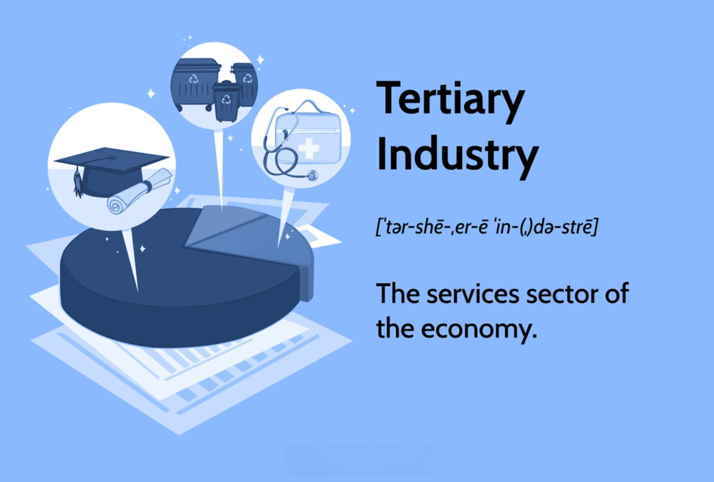

The tertiary sector, also known as the service industry, is integral to the modern economic framework, profoundly influencing the structure and growth of global markets. Unlike the primary sector, which focuses on raw materials, and the secondary sector, dedicated to manufacturing, the tertiary sector is centered around providing services rather than physical goods. These services, ranging from healthcare and education to financial and retail, have become fundamental to not only individual consumption but also economic development.

This article examines the pivotal role of service industries within the tertiary sector and highlights the growing impact of algorithmic trading across various economic sectors. Algorithmic trading, an advanced and automated approach to executing trades, has turned financial markets by employing algorithms to analyze and act on trading opportunities with remarkable precision and speed. As digital transformation sweeps across industries, the fusion of service industry dynamics with algorithmic trading opens new avenues for optimizing investments and enhancing economic outcomes.

Understanding the convergence of these areas reveals insights into leveraging sector-based opportunities for economic growth. Companies and investors are increasingly recognizing the importance of harnessing the capabilities of algorithmic trading strategies to realize substantial returns. As service industries continue to expand, and technology plays an ever-more crucial role, the synergy between these industries and advanced trading methodologies presents significant opportunities for economic advancement. By embracing these dynamics, stakeholders can effectively navigate the complexities of the contemporary market landscape, ensuring sustained growth and competitive advantage.

## Table of Contents

## Understanding the Tertiary Sector and Service Industries

The tertiary sector, often referred to as the service sector, is a crucial component of modern economies, significantly contributing to GDP growth and employment. This sector encompasses a vast array of industries that provide services rather than tangible products. Unlike the primary sector, which involves the extraction of raw materials, and the secondary sector, which focuses on manufacturing, the tertiary sector offers intangible value through services such as healthcare, education, financial services, entertainment, and retail.

### Characteristics of the Tertiary Sector

1. **Intangibility**: Services in the tertiary sector are intangible and cannot be stored or seen before they are purchased. This characteristic differentiates them from products in the primary and secondary sectors.

2. **Inseparability**: Production and consumption of services often occur simultaneously, such as in healthcare or education. The provider and consumer typically interact during the service delivery process.

3. **Heterogeneity**: Services are highly diverse and can vary in quality and form. This variability makes standardization challenging, requiring businesses to focus on consistent quality delivery.

4. **Perishability**: Services cannot be stored for future use. Once rendered, services perishable, necessitating effective demand management to optimize capacity utilization.

### Economic Importance of the Tertiary Sector

The tertiary sector is a critical driver of economic growth, especially in advanced economies where the demand for services is increasing. It provides numerous benefits:

- **Employment Generation**: As economies develop, the service sector becomes a primary employer, absorbing labor from declining primary and secondary sectors. Many countries experience a structural shift towards services as they grow, reflecting the sector's capacity to generate jobs.

- **Contribution to GDP**: The growing contribution of the tertiary sector to GDP is evident globally, with developed nations increasingly relying on services for economic prosperity. For instance, in countries like the United States and the United Kingdom, the service sector accounts for over 70% of GDP.

- **Innovation and Technology**: The service sector is a hub for innovation, particularly through information technology and digital services. This encourages further economic development by fostering new business models and technological advancements.

- **Globalization and Trade**: Services are increasingly traded across borders, contributing to international economic integration. Sectors like finance and telecommunications have become foundational to global business operations, enhancing connectivity and economic interplay between nations.

### Examples of Service Industries

1. **Healthcare Services**: Including hospitals, clinics, and medical professionals, this industry plays a significant role in improving population health and well-being.

2. **Educational Services**: Encompassing schools, colleges, and online learning platforms, education services are essential for skill development and economic competitiveness.

3. **Financial Services**: Banks, insurance companies, and investment firms provide critical financial intermediation that supports economic activities and personal wealth management.

4. **Hospitality and Tourism**: Hotels, restaurants, and travel services contribute to cultural exchange and economic development, especially in regions reliant on tourism.

5. **Information Technology**: IT services, including software development, data processing, and cloud computing, are key drivers of innovation and efficiency across various sectors.

The service industries that constitute the tertiary sector are foundational to modern economies, fostering economic growth, innovation, and employment. Understanding their dynamics is essential for stakeholders aiming to harness the potential of these industries for sustainable development and economic resilience.

## Algorithmic Trading: Revolutionizing Financial Market Dynamics

Algorithmic trading, commonly referred to as algo trading, is a method of executing orders using automated and pre-defined trading instructions. This approach leverages mathematical models and advanced software to time the execution of market transactions. By employing algorithms, traders can handle large volumes of data with greater speed and accuracy than manual trading allows, which significantly transforms the dynamics of modern financial markets.

At its core, [algorithmic trading](/wiki/algorithmic-trading) relies on the continuous analysis of real-time market data, considering variables like price, [volume](/wiki/volume-trading-strategy), and timing, to optimize trade execution. This system reduces the potential for human error, ensuring more consistent and efficient decision-making processes. The ability to execute trades at a rapid pace and in large numbers allows for enhanced [liquidity](/wiki/liquidity-risk-premium) in the markets, minimizing the price impact of individual trades.

A key benefit of algorithmic trading is its capacity to improve trading efficiency. Algorithms can scan various market indicators quickly and execute trades at optimal prices. This means capturing [arbitrage](/wiki/arbitrage) opportunities, hedging positions more effectively, and enabling high-frequency trading strategies which are unattainable through conventional methods. For instance, arbitrage strategies, which involve taking advantage of price discrepancies between markets, can be executed near-instantaneously through algorithmic means.

Technological integration plays a critical role in shaping algorithmic trading systems. Modern platforms utilize APIs (Application Programming Interfaces) to connect traders to market data and order execution services, facilitating seamless and instantaneous trade processing. Furthermore, the incorporation of [machine learning](/wiki/machine-learning) algorithms and big data analytics can strengthen these systems by providing predictive insights and adaptive learning from historical trading patterns.

In light of these technological advancements, the strategic implementation of algorithms across various economic sector classifications has revolutionized the decision-making process. By categorizing real-time data within structured frameworks like the Global Industry Classification Standard (GICS), trading algorithms can be tailored to specific sector dynamics, allowing for a more nuanced and informed approach to investment decisions.

Ultimately, algorithmic trading redefines how market participants interact with financial data and execute trades. Its blend of technology, precision, and speed offers profound advantages, ensuring it remains a cornerstone of modern trading strategies and financial market operations.

## The Role of Economic Sector Classifications in Investing

Economic sector classifications are crucial tools that organize economic activities into structured frameworks, facilitating both business analytics and investment strategies. These classifications enable investors to analyze and interpret market trends, assess risk, and diversify their portfolios more effectively. Two of the most widely recognized sector classification systems are the Global Industry Classification Standard (GICS) and the Standard Industrial Classification (SIC).

The GICS, developed by MSCI and Standard & Poor's, divides the market into 11 sectors, 24 industry groups, 69 industries, and 158 sub-industries. This system reflects a company's primary business activity and is designed to enhance the investment process by making it easier for investors to identify and assess companies within specific industries or sectors. By providing a common global standard, GICS facilitates international comparison and investment, accommodating the demands of a globalized economy.

The SIC system, established by the U.S. government in the 1930s, organizes industries on a four-digit numerical code basis, classifying them into broader categories. Although gradually being replaced by systems like the North American Industry Classification System (NAICS), SIC remains a valuable tool for historical analysis and U.S.-centric economic studies.

Understanding these classifications is vital for several reasons. Firstly, they allow investors to categorize companies based on business activity, enabling them to perform sector-specific analysis. This capability is essential for comparative analysis, benchmarking, and tactical asset allocation, where investors may choose to overweight or underweight certain sectors based on macroeconomic forecasts.

Moreover, sector classifications help in diversifying investment portfolios. By spreading investments across various sectors, investors can mitigate risk associated with economic downturns in specific areas. This strategy reduces exposure to sector-specific market [volatility](/wiki/volatility-trading-strategies) and enhances the potential for stable returns.

An essential aspect of sector classifications is that they underpin many algorithmic trading strategies. Algorithmic trading systems rely on these classifications to analyze market data and execute trades efficiently. The structured nature of sector data allows algorithms to identify patterns, predict market movements, and optimize trading decisions in real-time.

In conclusion, economic sector classifications are fundamental to organizing economic activities, enabling efficient data analysis, and supporting robust investment strategies. By understanding and utilizing systems like GICS and SIC, investors can make more informed decisions, enhancing their ability to respond to market dynamics and opportunities. These frameworks serve as a critical foundation for both traditional investment approaches and modern algorithmic trading methodologies, ensuring a comprehensive understanding of the economic landscape.

## Integration of Sector Classification with Algo Trading Tools

Integrating sector classifications into algorithmic trading systems is pivotal for enhancing trading precision and effectiveness. This process involves utilizing economic sector classifications such as the Global Industry Classification Standard (GICS) and the Standard Industrial Classification (SIC) to inform trading algorithms, thus enabling more targeted investment strategies.

Key platforms and tools within this integration framework leverage real-time data to optimize sector-based algo trading strategies. For instance, many trading platforms offer APIs (Application Programming Interfaces) that allow for the seamless integration of sector data into trading algorithms. These APIs facilitate the constant flow of real-time sector-specific data, which is essential for executing informed and timely trade decisions. For example, Python libraries such as `pandas` and `NumPy` can be used in conjunction with trading APIs to analyze sector-based datasets and develop predictive models.

Community tools, often found in open-source platforms, play a significant role in the integration process. These tools provide frameworks and community-driven libraries that support the customization and enhancement of algorithmic strategies according to sector-specific dynamics. They allow the sharing of strategies and insights among traders and developers, fostering an environment of continuous improvement and innovation.

Backtesting capabilities are another critical feature of successful integration. Backtesting involves simulating an algorithm’s performance using historical data to estimate how it might perform in live markets. By leveraging sector classifications, [backtesting](/wiki/backtesting) can be fine-tuned to reflect sector-specific behaviors and cyclical trends, thus providing a more accurate assessment of potential trading outcomes. Platforms such as QuantConnect and Backtrader offer robust backtesting environments where traders can input sector-specific criteria to validate their strategies before deployment.

Moreover, the advancing technological landscape, including AI and machine learning, is significantly impacting the integration of sector classifications in algorithmic trading. These technologies allow for more sophisticated pattern recognition and predictive analytics, enhancing the capability to adjust trading strategies swiftly in response to sector developments and market shifts.

Overall, the integration of sector classifications with algorithmic trading tools is evolving rapidly, driven by technological advancements and increased data availability. Investors and traders who effectively utilize these integrations can achieve improved trading accuracy and strategic advantage in dynamic market environments.

## Case Studies: Impact and Successes in Sector-Based Algo Trading

Algorithmic trading has significantly impacted various economic sectors, particularly technology and healthcare. These sectors have experienced improved market dynamics through the implementation of algorithmic strategies, which optimize trading efficiency and facilitate informed investment decisions.

### Technology Sector

In the technology sector, algorithmic trading has provided an edge by swiftly processing vast amounts of data to identify trading opportunities. For instance, tech companies often exhibit high volatility due to rapid innovations and market changes. Algorithmic trading systems can effectively manage such volatility by utilizing machine learning algorithms to predict stock movements with greater accuracy. A prominent case from the technology sector involved a leading tech firm leveraging sentiment analysis of news articles and social media feeds. By integrating these data sources into their trading algorithms, the firm achieved improved forecasting abilities, resulting in a substantial increase in their trading profits.

One challenge encountered in the technology sector is data quality. Poor data can mislead algorithms, resulting in erroneous trading signals. Therefore, trading systems must be equipped with advanced data cleansing and validation processes to ensure the accuracy of input data. Additionally, technology sector investments are often hampered by misclassification, where companies might not fit neatly into predefined categories. This necessitates dynamic algorithms capable of adjusting to evolving classifications for accurate sector analysis.

### Healthcare Sector

The healthcare sector presents unique opportunities and challenges for algorithmic trading due to its regulatory constraints and data sensitivity. An exemplary case in this sector involved a healthcare investment fund that developed predictive models based on patient data and pharmaceutical sales trends. Their algorithms highlighted unforeseen investment prospects by analyzing large datasets from medical research publications and clinical trials, leading to successful acquisitions and portfolio gains.

However, healthcare data presents challenges due to its sensitive nature and regulatory restrictions such as the Health Insurance Portability and Accountability Act (HIPAA) in the U.S. Algorithms must navigate these legal complexities while ensuring their trading strategies comply with privacy regulations. Moreover, the healthcare sector's diverse nature, ranging from pharmaceuticals to biotechnology, requires algorithms to be adaptable to sector-specific idiosyncrasies, considering factors like drug approval processes and research breakthroughs.

Both sectors underscore the importance of understanding sector-specific characteristics to enhance the effectiveness of algorithmic strategies. By learning from these case studies, businesses and investors can refine their trading systems to address challenges such as misclassification and data quality. The continued adaptation of algorithmic technology is crucial to capitalizing on inherent opportunities within each sector, thereby driving economic success.

## Future Trends in Sector-Based Algo Trading

As the financial world continues to evolve, algorithmic trading is increasingly adapting to accommodate emerging sectors, such as Environmental, Social, and Governance ([ESG](/wiki/esg-investing)) criteria and renewable energies. These sectors are gaining prominence due to a rising emphasis on sustainable and responsible investing practices. The integration of ESG components and renewable energy assets into algorithmic trading frameworks is driven by both regulatory developments and investor demand for transparency and sustainability.

Technological advancements play a crucial role in this integration. Artificial Intelligence (AI) and big data analytics, in particular, are transforming sector-based trading strategies by enhancing decision-making capabilities and improving data processing speeds. AI algorithms enable traders to analyze vast datasets efficiently, identifying patterns and trends that may not be apparent through traditional methods. For example, machine learning models can predict stock movements based on historical ESG performance metrics, allowing for more informed investment decisions.

Big data analytics facilitate the discernment of complex market signals from diverse sources, such as social media sentiment and news articles, to evaluate sector performance. This real-time processing capability is essential for adapting to fast-changing market conditions and adjusting trading strategies accordingly. The integration of Natural Language Processing (NLP) further assists in understanding qualitative ESG factors from various publicly available documents and reports.

Regulatory changes are also impacting the trajectory of sector-based algorithmic trading. Stricter regulations requiring detailed reporting of ESG-related activities compel financial institutions to adapt their trading algorithms to include these considerations. Compliance with these regulations ensures that algorithmic trading strategies align with government policies and global sustainability goals, reducing the risk of legal repercussions.

Moreover, evolving investor interests are reshaping the focus of algorithmic trading. As investors increasingly prioritize ESG criteria, trading algorithms are being developed to [factor](/wiki/factor-investing) in ESG ratings and renewable energy involvement in their operations. This shift not only aligns investment portfolios with personal or institutional values but also mitigates risks associated with environmentally or socially detrimental business practices.

The future of sector-based algorithmic trading will likely see further integration of sophisticated technologies like quantum computing, which promises unparalleled processing power and speed, allowing for even more complex analyses and precise trading strategies. Additionally, collaborations between fintech companies and traditional financial institutions could introduce innovative trading platforms that offer customized solutions based on ESG and renewable energy metrics.

In summary, the future of sector-based algorithmic trading is set to be shaped by the convergence of new technological tools and changing regulatory and investor landscapes, demanding more adaptive, precise, and responsible trading practices.

## Conclusion

Sector classifications and algorithmic trading have established themselves as pivotal elements in shaping the landscape of contemporary economic activities and investment strategies. These components work in tandem to provide a structured and efficient framework for analyzing economic trends and optimizing investment portfolios. Given their significant influence, it is imperative for businesses and investors to remain agile and responsive to the ongoing evolution of these elements.

The dynamic nature of market conditions necessitates a strategic approach to leverage the capabilities of sector classifications and algorithmic trading systems. As algorithms continue to harness vast amounts of real-time data, their potential to safeguard against market volatility becomes increasingly evident. This reliance on data-driven insights not only helps in mitigating risks but also enhances overall economic performance by enabling more precise and timely investment decisions.

Stakeholders are encouraged to adopt a proactive stance by integrating insights derived from sector classifications alongside advancements in algorithmic trading. Such integration can optimize economic outcomes and provide a competitive edge in fluctuating markets. As technology continues to advance, aligning investment strategies with these innovations will be crucial for sustained economic growth and profitability. Through the active incorporation of these methodologies, economic participants can capitalize on the opportunities present in modern financial markets, ultimately driving enhanced returns and contributing to a more robust economic landscape.

## References & Further Reading

[1]: Bergstra, J., Bardenet, R., Bengio, Y., & Kégl, B. (2011). ["Algorithms for Hyper-Parameter Optimization."](https://dl.acm.org/doi/10.5555/2986459.2986743) Advances in Neural Information Processing Systems 24.

[2]: ["Advances in Financial Machine Learning"](https://www.amazon.com/Advances-Financial-Machine-Learning-Marcos/dp/1119482089) by Marcos Lopez de Prado

[3]: ["Evidence-Based Technical Analysis: Applying the Scientific Method and Statistical Inference to Trading Signals"](https://www.amazon.com/Evidence-Based-Technical-Analysis-Scientific-Statistical/dp/0470008741) by David Aronson

[4]: ["Machine Learning for Algorithmic Trading"](https://github.com/stefan-jansen/machine-learning-for-trading) by Stefan Jansen

[5]: ["Quantitative Trading: How to Build Your Own Algorithmic Trading Business"](https://www.amazon.com/Quantitative-Trading-Build-Algorithmic-Business/dp/1119800064) by Ernest P. Chan