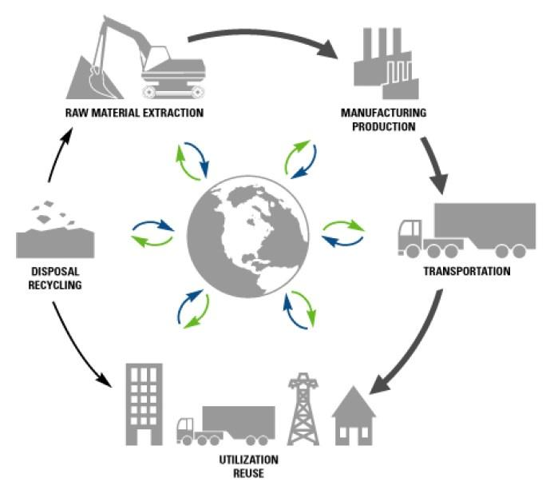

## Table of Contents

## What is the tertiary sector?

The tertiary sector is the part of the economy that provides services rather than goods. This includes things like restaurants, schools, and shops. These services help people in their daily lives and make things easier for them. The tertiary sector is very important because it creates many jobs and helps the economy grow.

In many countries, the tertiary sector is the largest part of the economy. This is because as countries get richer, people spend more money on services. For example, they might go out to eat more often or hire someone to clean their house. The growth of the tertiary sector shows that a country is developing and that people have more money to spend on things they want, not just things they need.

## What are some examples of tertiary sector industries?

Tertiary sector industries include things like shops and stores where you can buy things. For example, supermarkets where you buy food, or clothing stores where you buy clothes. Another example is restaurants and cafes where you can eat out. These places provide services that help people get the things they need or want without having to make them themselves.

There are also services like schools and hospitals. Schools help people learn and get an education, while hospitals help people when they are sick or hurt. Other examples include banks, where people can save or borrow money, and travel agencies, which help people plan trips and vacations. All these services make life easier and more convenient for people.

Lastly, there are entertainment and leisure services. This includes movie theaters where you can watch films, gyms where you can exercise, and beauty salons where you can get a haircut or a massage. These services help people relax and enjoy their free time. The tertiary sector is very important because it covers so many different kinds of services that people use every day.

## How does the tertiary sector differ from the primary and secondary sectors?

The primary sector is all about getting raw materials from nature. This includes things like farming, where people grow food, fishing, where people catch fish, and mining, where people dig up minerals from the ground. The primary sector is the first step in making things that people need. The secondary sector takes those raw materials and turns them into finished products. For example, factories might use cotton from farms to make clothes, or they might use iron from mines to make cars. The secondary sector is all about manufacturing and construction.

The tertiary sector is different because it's all about services, not making things. Instead of growing food or building cars, the tertiary sector includes things like shops where you can buy things, restaurants where you can eat, and schools where you can learn. These services help people in their daily lives and make things easier for them. The tertiary sector is important because it creates many jobs and helps the economy grow. As countries get richer, people spend more money on services, so the tertiary sector often becomes the biggest part of the economy.

## What is the role of the tertiary sector in the economy?

The tertiary sector plays a big role in the economy. It includes all the services that people use every day, like shops, restaurants, schools, and hospitals. These services help people get the things they need or want without having to make them themselves. The tertiary sector creates a lot of jobs because it needs many people to work in these service places. This helps the economy grow because when people have jobs, they can spend money on things they need and want.

As countries get richer, the tertiary sector often becomes the biggest part of the economy. This is because people start spending more money on services instead of just buying goods. For example, they might go out to eat more often or hire someone to clean their house. The growth of the tertiary sector shows that a country is developing and that people have more money to spend on things they want, not just things they need. This makes the economy stronger and helps everyone in the country.

## How has the tertiary sector evolved over time?

The tertiary sector has changed a lot over time. In the past, most people worked in farming or making things in factories. But as countries got richer, more people started working in services like shops, restaurants, and schools. This happened because people had more money to spend on things they wanted, not just things they needed. So, the tertiary sector grew bigger and became very important for the economy.

Today, the tertiary sector is even more important. With the internet and new technology, there are many new kinds of services. For example, you can order food online, take classes on the internet, or get help from a doctor without leaving your home. These new services have made life easier and more convenient for people. The tertiary sector keeps growing and changing, and it will keep being a big part of the economy in the future.

## What are the key characteristics of tertiary sector jobs?

Tertiary sector jobs are all about providing services to people. These jobs can be found in places like shops, restaurants, schools, and hospitals. People who work in the tertiary sector help others by selling things, cooking food, teaching, or taking care of people when they are sick. These jobs often need good people skills because workers have to talk to customers or clients a lot. They also need to be good at solving problems and making sure people are happy with the service they get.

Many tertiary sector jobs are in cities where there are lots of people who need services. These jobs can be full-time or part-time, and some might need special training or education. For example, a teacher needs to go to school to learn how to teach, and a nurse needs to go to nursing school. But other jobs, like working in a shop or a restaurant, might not need as much training. The tertiary sector is important because it creates a lot of jobs and helps the economy grow by giving people the services they need and want.

## How do tertiary sector industries contribute to GDP?

Tertiary sector industries help grow the GDP by providing services that people pay for. When people go to restaurants, shops, or use services like schools and hospitals, they spend money. This money counts towards the GDP because it shows how much people are spending on services. The more people spend on services, the bigger the tertiary sector gets, and the more it adds to the GDP.

As countries get richer, people have more money to spend on services instead of just buying goods. This makes the tertiary sector a big part of the GDP. In many rich countries, the tertiary sector is the largest part of the economy. This shows that the tertiary sector is very important for making the economy strong and helping it grow.

## What are the challenges faced by tertiary sector industries?

Tertiary sector industries face many challenges. One big challenge is competition. There are often many businesses offering the same services, like lots of restaurants or shops in one area. This means they have to work hard to make their services better or cheaper to attract customers. Another challenge is keeping up with new technology. For example, many people now shop online instead of going to stores. Businesses have to use the internet and new technology to stay competitive.

Another challenge is finding and keeping good workers. Many jobs in the tertiary sector need people with good skills, like being friendly and good at solving problems. It can be hard to find enough people with these skills, and it can be expensive to train them. Also, the cost of running a service business can be high. Things like rent, utilities, and supplies can add up, and if prices go up, it can be hard to keep services affordable for customers.

Lastly, the tertiary sector can be affected by changes in the economy. When the economy is not doing well, people might not have as much money to spend on services. This can hurt businesses that rely on people spending money. Also, rules and regulations can change, and businesses have to follow them, which can be hard and costly. All these challenges make it important for tertiary sector industries to be flexible and ready to change to keep doing well.

## How does technology impact the tertiary sector?

Technology has a big impact on the tertiary sector. It makes services easier and faster for people to use. For example, with the internet, people can now shop online from home instead of going to a store. They can also order food from restaurants or take classes on the internet. This means businesses in the tertiary sector have to use technology to stay competitive. They need to have good websites and apps so people can use their services easily.

But technology also brings challenges. Businesses have to keep up with new technology or they might lose customers. It can be expensive to use new technology, and they need to train their workers to use it. Also, technology can change how people work. For example, with online shopping, fewer people might be needed to work in stores. So, businesses have to find new ways to use technology to make their services better and keep their workers happy.

## What trends are currently shaping the tertiary sector?

Technology is a big trend shaping the tertiary sector. More and more people are using the internet to get services. They shop online, order food from restaurants, and even take classes on the internet. This means businesses have to have good websites and apps to stay competitive. They also need to use new technology like [artificial intelligence](/wiki/ai-artificial-intelligence) and data to make their services better. But it can be hard and expensive to keep up with all these changes.

Another trend is the focus on customer experience. Businesses are trying to make their services better so people will keep coming back. They do this by being friendly, solving problems quickly, and making things easy for customers. This is important because there is a lot of competition in the tertiary sector. If one business does not give good service, people can just go to another one.

Lastly, there is a trend towards more sustainable and ethical practices. People care more about the environment and want businesses to be good to the planet. They also want businesses to treat their workers well and be fair. So, businesses in the tertiary sector are trying to use less energy, recycle more, and make sure their workers are happy. This helps them attract customers who care about these things.

## How do government policies affect the tertiary sector?

Government policies can really change how the tertiary sector works. They can make rules about how businesses should treat their workers, like making sure they get paid enough and have safe places to work. These rules can make it more expensive for businesses to run, but they also help make sure workers are treated well. Governments can also give money to businesses in the tertiary sector to help them grow. This can help create more jobs and make the economy stronger. But if the government changes these policies, it can be hard for businesses to keep up.

Another way government policies affect the tertiary sector is through taxes. If the government raises taxes on businesses, it can make it harder for them to make money. This might mean they have to charge more for their services or cut back on what they offer. On the other hand, if the government lowers taxes, it can help businesses grow and create more jobs. Governments can also make rules about how businesses should use the environment, like using less energy or recycling more. These rules can help the planet, but they can also make it more expensive for businesses to run. So, government policies can have a big impact on the tertiary sector, helping it grow or making it harder for businesses to succeed.

## What are the future prospects for growth in the tertiary sector?

The future looks bright for the tertiary sector. As more people live in cities and have more money to spend, they will want more services. This means businesses like shops, restaurants, and schools will keep growing. Technology will also help the tertiary sector grow. More people will use the internet to shop, learn, and get services, so businesses will need good websites and apps. This will create new jobs and make the economy stronger.

But there will also be challenges. Businesses will have to keep up with new technology and find ways to make their services better. They will also need to be more sustainable and treat their workers well. Governments might make new rules that businesses have to follow, which could make things harder. Still, if businesses can solve these problems, the tertiary sector will keep growing and be a big part of the economy in the future.

## References & Further Reading

[1]: Bergstra, J., Bardenet, R., Bengio, Y., & Kégl, B. (2011). ["Algorithms for Hyper-Parameter Optimization."](https://dl.acm.org/doi/10.5555/2986459.2986743) Advances in Neural Information Processing Systems 24.

[2]: ["Advances in Financial Machine Learning"](https://www.amazon.com/Advances-Financial-Machine-Learning-Marcos/dp/1119482089) by Marcos Lopez de Prado

[3]: ["Evidence-Based Technical Analysis: Applying the Scientific Method and Statistical Inference to Trading Signals"](https://www.amazon.com/Evidence-Based-Technical-Analysis-Scientific-Statistical/dp/0470008741) by David Aronson

[4]: ["Machine Learning for Algorithmic Trading"](https://github.com/stefan-jansen/machine-learning-for-trading) by Stefan Jansen

[5]: ["Quantitative Trading: How to Build Your Own Algorithmic Trading Business"](https://www.amazon.com/Quantitative-Trading-Build-Algorithmic-Business/dp/1119800064) by Ernest P. Chan