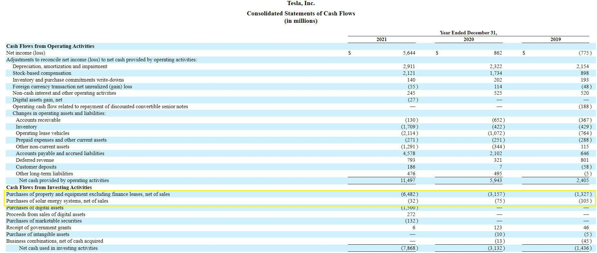

Tesla, Inc. has emerged as a pivotal player in the global stock market, thanks to its revolutionary advancements in electric vehicles (EVs) and renewable energy solutions. Renowned for disrupting the automotive sector, Tesla's journey from a high-debt startup to a thriving enterprise has captivated investors and analysts alike. 

This article examines Tesla's financial condition, focusing on its capital structure and the influence of algorithmic trading on its stock movements. We will assess how Tesla's financial strategies, both historical and contemporary, have influenced its market standing. Tesla's commitment to technological innovation and strategic financial management has been central to its growth, reinforcing its role as a leader in sustainable transportation and energy. The company's adept maneuvering through financial challenges and strategic capital decisions continue to shape its robust market presence and investor confidence.



## Table of Contents

## Overview of Tesla's Financial Performance

Tesla, Inc. has demonstrated substantial financial growth in recent years, highlighted by its reported revenue of $96.77 billion for 2023, representing an 18.80% increase from the previous year. This growth underscores Tesla's ability to enhance its production capabilities and expand its market reach even amidst fluctuating economic conditions.

A key component of Tesla's financial performance is its net income, which stood at $15 billion in 2023, a 19.20% increase compared to the previous year. This rise in net income reflects Tesla's effective cost management and emphasis on improving production efficiency. By optimizing manufacturing processes and maintaining strict cost control, Tesla has managed to bolster its profitability.

Tesla's financial growth can be attributed to several strategic initiatives. Firstly, the company has expanded its global footprint by increasing production capacity in existing facilities and establishing new factories in strategically significant locations. This expansion allows Tesla to meet growing demand for electric vehicles while minimizing logistical constraints.

Furthermore, Tesla's focus on innovation in manufacturing techniques, such as the use of advanced robotics and automated production lines, has contributed to reducing production costs. This efficiency not only sustains profitability but also positions Tesla competitively in a market increasingly influenced by cost pressures.

Overall, Tesla's financial performance in 2023 reflects a balance of strategic market expansion and operational efficiency, enabling the company to achieve robust revenue growth and improved profitability. As Tesla continues to adapt to market demands and enhance its production methodologies, its financial trajectory is poised for further strengthening.

## Tesla's Capital Structure

Analyzing Tesla's capital structure reveals a significant transformation over recent years. By the end of 2023, Tesla reduced its debt-to-equity ratio to 0.68, marking a drastic change from previous years. This ratio is calculated using the formula:

$$
\text{Debt-to-Equity Ratio} = \frac{\text{Total Liabilities}}{\text{Shareholders' Equity}}
$$

A lower debt-to-equity ratio implies that Tesla has been successful in managing its debt relative to its equity, indicating a more balanced financial approach. Historically, Tesla's financial strategy involved substantial borrowing to finance its growth and expansion. However, the recent shift in its capital structure demonstrates a strategic effort to enhance financial leverage and cash management.

Tesla's ability to reduce its debt while increasing equity reflects its commitment to financial resilience. This transformation can be attributed to several factors, including improved operational efficiencies, increased revenue from its growing market share, and robust cash flow management. Additionally, Tesla's focus on optimizing its production processes and expanding its market presence has contributed to a healthier balance sheet.

The reduction in the debt-to-equity ratio also signifies Tesla's enhanced capacity to withstand economic fluctuations and external financial pressures, providing a buffer against market uncertainties. This strategic financial restructuring positions Tesla to reinforce its competitive edge in the dynamic automotive industry, ensuring long-term sustainability and growth potential.

## The Role of Debt in Tesla's Growth

Tesla's growth trajectory has been closely linked to its ability to manage debt effectively. During its initial growth phases, the company faced the challenge of funding capital-intensive manufacturing processes required for developing innovative electric vehicles (EVs). This phase necessitated substantial borrowing, enabling Tesla to scale production capacities and expand its market presence. As a result, Tesla incurred significant liabilities, which were pivotal for supporting large-scale investments in manufacturing plants, such as the Gigafactories.

By the end of 2023, Tesla's financial framework highlighted approximately $43.2 billion in liabilities, underscoring the critical role of debt in facilitating its expansion efforts. However, Tesla's financial strategy has consistently emphasized balancing this debt with robust cash reserves, which stood at more than $29 billion in 2023. This strategic reserve ensures that Tesla remains agile and can address unforeseen financial exigencies, thereby maintaining overall financial stability.

Efficient debt management has been at the core of Tesla's ability to continually fund innovation while sustaining financial health. The company's approach involves optimizing its debt-to-equity ratio and leveraging its strong market position to secure favorable financing terms. Such strategies not only support ongoing research and development but also enhance Tesla's ability to weather economic fluctuations.

Moreover, Tesla's disciplined approach to managing its capital structure has allowed it to invest in next-generation technologies and expand its product lineup without compromising financial integrity. This approach reflects a keen understanding of the dynamic automotive industry landscape and the importance of maintaining flexibility through prudent financial planning. Overall, Tesla's adept handling of debt has been instrumental in reinforcing its position as a leading figure in the automotive sector, allowing it to push the boundaries of innovation and growth.

## Tesla's Stock Splits and Market Impact

In 2020, Tesla, Inc. executed a 5-for-1 stock split, and in 2022, a further 3-for-1 split was implemented. These splits were strategic decisions aimed at increasing [liquidity](/wiki/liquidity-risk-premium) and making Tesla's stock more affordable to a wider array of investors, particularly retail investors who might find high share prices prohibitive.

A stock split increases the number of shares outstanding while proportionally decreasing the price per share, without changing the company's market capitalization. For investors, this means each share's stake in the company remains constant, as demonstrated by the formula:

$$
\text{New Share Price} = \frac{\text{Old Share Price}}{\text{Split Ratio}}
$$

For example, if Tesla's share price was $1,500 before the 5-for-1 split in 2020, the post-split price was $300 ($1,500 ÷ 5).

The impact of these stock splits on market dynamics can be observed in two key areas: stock liquidity and investor base expansion. First, by lowering the price per share, stock splits can lead to increased trading volumes, which enhances liquidity. Liquidity is essential as it facilitates quicker buying and selling without significantly affecting the stock price. Enhanced liquidity can attract a larger number of traders, thereby maintaining or potentially increasing demand for the stock.

Secondly, the reduction in share price through stock splits made Tesla's stock more accessible to retail investors, who often have smaller amounts of capital to invest compared to institutional investors. This influx of retail investors can diversify the shareholder base and potentially stabilize stock prices by distributing ownership among a larger, more varied group of investors.

The strategic implementation of stock splits has been interpreted positively by the market, often leading to a rise in stock prices post-split. This rise can be attributed to psychological factors where lower share prices are perceived as more attainable. Furthermore, the influx of new retail investors can create a demand surge that propels a temporary increase in prices post-split.

In summary, Tesla's stock splits are a testament to the company's influential role in the stock market, improving both liquidity and accessibility, and underscoring Tesla's recognition of the importance of engaging a broad spectrum of investors.

## Algorithmic Trading and Tesla Stock

Algorithmic trading is integral to the trading dynamics of Tesla's stock, significantly influencing its market behavior. These trading algorithms, known for their ability to process vast amounts of market data in real-time, make decisions at speeds unmatched by human traders. This capability amplifies stock movements and contributes to the substantial [volatility](/wiki/volatility-trading-strategies) often observed in Tesla's stock prices.

The foundation of [algorithmic trading](/wiki/algorithmic-trading) lies in its use of predefined sets of rules or instructions, often based on timing, price, quantity, or a mathematical model. For instance, an algorithm might be programmed to execute a buy order once Tesla's stock hits a specific price point, or to sell if the stock drops below a certain threshold. These decisions consider a multitude of factors, from historical data patterns to current market conditions.

In the case of Tesla, the high volatility of its stock makes it an attractive target for algorithmic trading. The rapid swings in Tesla's stock price provide numerous opportunities for algorithms to capitalize on price discrepancies and market inefficiencies. High-frequency trading ([HFT](/wiki/high-frequency-trading-strategies)) firms, in particular, utilize sophisticated algorithms to exploit these fleeting opportunities, further contributing to the stock's volatility.

A basic algorithm for trading Tesla stock could involve a moving average crossover strategy, where the algorithm buys when a short-term moving average crosses above a long-term moving average, and sells when it crosses below. In Python, a simple version of this algorithm might look like:

```python
import numpy as np
import pandas as pd

# Simulated stock data
data = pd.Series([800, 805, 810, 807, 812], name="TSLA")

# Calculate moving averages
short_window = 3
long_window = 5

signals = pd.DataFrame(index=data.index)
signals['price'] = data
signals['short_mavg'] = data.rolling(window=short_window, min_periods=1).mean()
signals['long_mavg'] = data.rolling(window=long_window, min_periods=1).mean()

# Generate buy/sell signals
signals['signal'] = 0
signals['signal'][short_window:] = np.where(signals['short_mavg'][short_window:] > signals['long_mavg'][short_window:], 1, 0)
signals['positions'] = signals['signal'].diff()

print(signals)
```

This algorithm simulates simple trading signals based on moving averages. When implemented in more advanced systems, incorporating factors like [volume](/wiki/volume-trading-strategy) weighted average price (VWAP), relative strength index (RSI), or even natural language processing (NLP) for sentiment analysis from social media and news may be used to refine trading decisions.

Understanding these trading mechanisms is crucial for investors seeking to navigate the complexities of Tesla's stock. A grasp of how algorithmic trading influences market movements aids in explaining the rapid price fluctuations often seen with Tesla's stock, providing a clearer picture of market dynamics and potential investment strategies.

## Tesla's Competitive Landscape

A shrinking market share from 62% to 55% by 2023 highlights the increasing competition Tesla faces in the electric vehicle (EV) sector. This shift in market dynamics is driven by the entry of major automotive players into the EV market, eager to capitalize on the growing demand for sustainable transportation. Companies such as General Motors, Ford, Volkswagen, and newer entrants like Rivian and Lucid Motors are rapidly expanding their EV offerings, introducing vehicles that directly challenge Tesla's models in terms of performance, innovation, and price.

Despite the heightened competition, Tesla's strengths in innovation and brand reputation have maintained its status as a formidable entity within the industry. The company's dedication to technological advancements in battery technology, autonomous driving, and energy efficiency continues to set industry standards. Tesla's Supercharger network, recognized as the most extensive and fast-charging infrastructure, provides a significant competitive advantage, ensuring convenience for Tesla owners relative to competitors whose charging networks are emerging.

Furthermore, Tesla's robust brand equity is amplified by its association with sustainability and cutting-edge technology, which attracts a loyal customer base. This loyalty is supported by the company's commitment to continuous improvement in software and over-the-air updates, enhancing vehicle performance and user experience over time.

Ultimately, Tesla's adaptability in addressing competitor advancements while maintaining a leading edge in technology and infrastructure fosters its resilience in an evolving automotive market. As competitors expand their EV line-up, Tesla's strategy focuses on scaling production, reducing costs, and expanding internationally to sustain its growth trajectory. Investors and market analysts alike continue to closely monitor Tesla's responses to the competitive pressures and its strategic maneuvers to retain industry leadership.

## Conclusion

Tesla's financial trajectory, transitioning from a high-debt startup to a remarkably profitable enterprise, underscores its strategic agility and foresight. Initially fraught with the challenges of securing capital-intensive manufacturing capabilities, Tesla adeptly leveraged borrowing to finance its growth and innovation. Over the years, its strategic focus on improving production efficiency, expanding into new markets, and maintaining optimal cash reserves has fundamentally enhanced its financial stability. For example, by reducing its debt-to-equity ratio to 0.68 by the end of 2023, Tesla has demonstrated significant financial restructuring efforts that have increased its resilience against market fluctuations.

The landscape for electric vehicles is rapidly changing, with increased competition from established automotive manufacturers entering the sector. This heightened competition has contributed to a decline in Tesla's market share from 62% to 55% in 2023. Despite these competitive pressures, Tesla's steadfast commitment to groundbreaking innovation and maintaining a strong brand presence ensures its continued prominence in the industry. The company's initiatives such as launching new models, enhancing battery technology, and expanding its Supercharger network further consolidate its competitive edge.

For investors and traders, Tesla remains a key focus, reflecting broader market trends and technological advancements in the automotive industry. The company's ability to navigate a rapidly evolving market environment, marked by economic uncertainties and technological disruptions, will be crucial. As Tesla continues to adapt and innovate, its financial strategies and market conduct will be influential determinants of its future success, making it an essential player to watch in the coming years.

## References & Further Reading

[1]: ["Tesla's Impact on the Automotive Sector"](https://www.topspeed.com/how-tesla-reshaped-automotive-industry/) - Forbes

[2]: ["The Machine That Changed The World: The Story of Lean Production"](https://books.google.com/books/about/The_Machine_That_Changed_the_World.html?id=9NHmNCmDUUoC) by James P. Womack, Daniel T. Jones, and Daniel Roos.

[3]: ["Financial Management for Decision Makers"](https://books.google.com/books/about/Financial_Management_for_Decision_Makers.html?id=Mn--DwAAQBAJ) by Peter Atrill.

[4]: ["The Current State of Algorithmic Trading"](https://bookmap.com/blog/the-future-of-algorithmic-trading-trends-to-watch-in-2024) - Investopedia

[5]: ["The Impact of CEO Elon Musk's Tweets on Tesla's Stock Performance"](https://www.ft.com/content/8b3ef8f4-5062-4dea-8103-81a7165c3b9b) - Reuters

[6]: ["Tesla's Competitive Edge through Technological Innovation"](https://hbr.org/2020/02/lessons-from-teslas-approach-to-innovation) - Financial Times

[7]: ["Understanding Stock Splits and Their Market Impacts"](https://www.markets.com/education-centre/stock-split/) - Nasdaq 

[8]: ["Capital Structure in the Modern Corporation"](https://link.springer.com/book/10.1007/978-3-319-30713-8) - Journal of Financial Economics

[9]: ["High-Frequency Trading and the New Stock Market"](https://onlinelibrary.wiley.com/doi/10.1111/jacf.12260) by Michael Lewis.