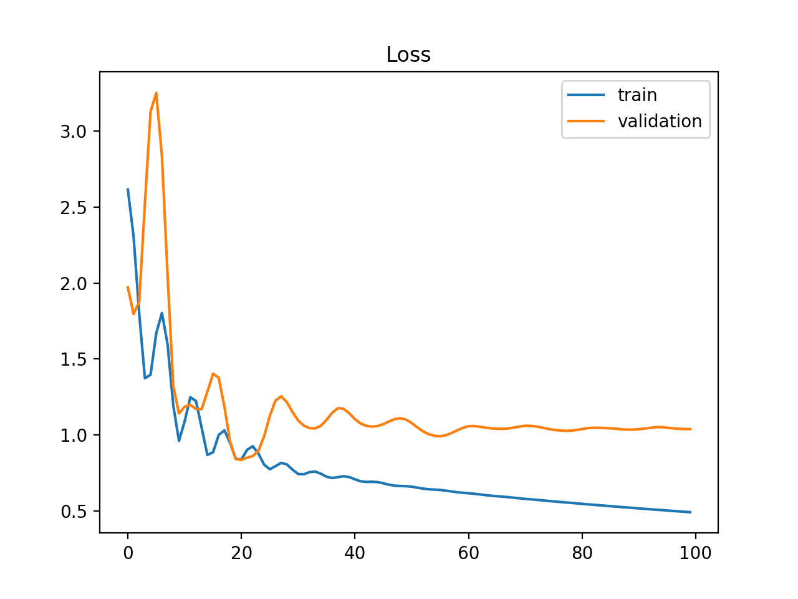

## Table of Contents

## What is test loss in machine learning?

Test loss in machine learning is a measure of how well a model performs on a set of data it hasn't seen before, called the test dataset. It's like a final exam for the model, where it shows how well it has learned from the training data. The test loss is calculated by comparing the model's predictions to the actual outcomes in the test dataset. If the test loss is low, it means the model is doing a good job at making accurate predictions on new data.

The formula for calculating test loss can vary depending on the type of model and the specific loss function used. For example, in regression problems, a common loss function is the mean squared error (MSE), which measures the average of the squares of the errors between predicted and actual values. The formula for MSE is $$ \text{MSE} = \frac{1}{n} \sum_{i=1}^{n} (y_i - \hat{y}_i)^2 $$, where $y_i$ is the actual value, $\hat{y}_i$ is the predicted value, and $n$ is the number of observations. A lower MSE indicates better model performance on the test set.

## How is test loss different from training loss?

Test loss and training loss are two different ways to check how well a machine learning model is doing. Training loss is like the score a student gets while studying for a test. It shows how well the model is learning from the data it's being trained on. If the training loss is low, it means the model is doing a good job at understanding the training data.

On the other hand, test loss is like the score a student gets on a final exam. It shows how well the model can use what it learned to make predictions on new data it hasn't seen before. If the test loss is low, it means the model is good at making accurate predictions on new data. The difference between the two helps us see if the model is just memorizing the training data (which is called overfitting) or if it's actually learning useful patterns that apply to new situations.

## Why is it important to monitor test loss?

Monitoring test loss is important because it tells us how well our [machine learning](/wiki/machine-learning) model works on new data it hasn't seen before. Think of it like a final exam for the model. If the test loss is low, it means the model is doing a good job at making accurate predictions on new data. This is crucial because the real world is full of new situations, and we want our model to be useful in those situations, not just on the data it was trained on.

Another reason to keep an eye on test loss is to avoid a problem called overfitting. Overfitting happens when a model learns the training data too well, including any noise or random patterns, and then fails to perform well on new data. By comparing the test loss to the training loss, we can see if the model is overfitting. If the training loss is much lower than the test loss, it's a sign that the model might be overfitting, and we might need to adjust our approach, like using more data or changing the model's complexity.

## What does a high test loss indicate?

A high test loss means that the machine learning model is not doing a good job at making predictions on new data. When the test loss is high, it shows that there's a big difference between what the model predicts and what actually happens in the test dataset. This is important because it tells us that the model might not be useful in real-world situations where it encounters new data.

One reason for a high test loss could be that the model is overfitting. Overfitting happens when the model learns the training data too well, including any random patterns or noise, but then fails to perform well on new data. You can check for overfitting by comparing the test loss to the training loss. If the training loss is much lower than the test loss, it's a sign that the model might be overfitting. To fix this, you might need to use more data, simplify the model, or use techniques like regularization.

Another reason for a high test loss could be that the model is underfitting. Underfitting means the model is too simple to capture the patterns in the data. If both the training loss and the test loss are high, it might mean the model isn't complex enough to learn from the data. In this case, you might need to make the model more complex or use a different type of model that can better capture the data's patterns.

## How can you calculate test loss?

Test loss is calculated by comparing the model's predictions to the actual outcomes in the test dataset. This is done using a loss function, which measures how far off the model's predictions are from the true values. A common loss function for regression problems is the mean squared error (MSE). The formula for MSE is $$ \text{MSE} = \frac{1}{n} \sum_{i=1}^{n} (y_i - \hat{y}_i)^2 $$, where $y_i$ is the actual value, $\hat{y}_i$ is the predicted value, and $n$ is the number of observations. The lower the MSE, the better the model is at making accurate predictions on the test data.

To calculate the test loss in practice, you would typically use a programming language like Python. Here's a simple example using Python and the scikit-learn library to calculate the MSE on a test dataset:

```python
from sklearn.metrics import mean_squared_error
import numpy as np

# Assume y_true and y_pred are your actual and predicted values
y_true = np.array([3, -0.5, 2, 7])
y_pred = np.array([2.5, 0.0, 2, 8])

# Calculate the test loss using mean squared error
test_loss = mean_squared_error(y_true, y_pred)

print("Test Loss (MSE):", test_loss)
```

This code snippet shows how you can easily compute the test loss, giving you a clear measure of how well your model performs on new data.

## What are common techniques to reduce test loss?

To reduce test loss, one common technique is to use more data for training. When a model has more examples to learn from, it can better understand the patterns in the data and make more accurate predictions on new data. Another approach is to adjust the model's complexity. If the model is too simple, it might not capture all the important patterns in the data, leading to high test loss. On the other hand, if the model is too complex, it might overfit the training data and perform poorly on the test data. Finding the right balance is key.

Another technique to reduce test loss is regularization. Regularization adds a penalty to the model's loss function to discourage it from fitting the training data too closely. This helps prevent overfitting and can lead to better performance on the test data. Common types of regularization include L1 and L2 regularization. L2 regularization, for example, adds a term to the loss function that is proportional to the square of the model's weights: $$ \text{Loss} = \text{MSE} + \lambda \sum_{i=1}^{n} w_i^2 $$, where $\lambda$ is a hyperparameter that controls the strength of the regularization, and $w_i$ are the model's weights.

Finally, using techniques like cross-validation and ensemble methods can also help reduce test loss. Cross-validation involves splitting the data into different subsets and training the model multiple times, each time using a different subset as the test set. This helps ensure that the model's performance is consistent across different data samples. Ensemble methods combine the predictions of multiple models to make more accurate predictions. For example, a random forest is an ensemble of decision trees that can often outperform a single decision tree on test data.

## How does overfitting affect test loss?

Overfitting happens when a machine learning model learns the training data too well, including any noise or random patterns. When a model overfits, it performs really well on the training data but does poorly on new data it hasn't seen before. This means the test loss, which measures how well the model does on new data, will be high. A high test loss shows that the model isn't good at making accurate predictions on new data, even though it might have a low training loss.

To spot overfitting, you can compare the training loss to the test loss. If the training loss is much lower than the test loss, it's a sign that the model might be overfitting. For example, if the training loss is calculated using mean squared error (MSE) and is very low, like $$ \text{MSE}_{\text{train}} = 0.1 $$, but the test loss is much higher, like $$ \text{MSE}_{\text{test}} = 10.0 $$, it suggests that the model isn't generalizing well to new data. To fix overfitting, you might need to use more data, simplify the model, or use techniques like regularization to help the model learn useful patterns that apply to new situations.

## Can test loss be used to compare different models?

Yes, test loss can be used to compare different models. It tells you how well each model makes predictions on new data it hasn't seen before. When you have different models, you can look at their test losses to see which one does the best job. If one model has a lower test loss than another, it means that model is better at making accurate predictions on new data. For example, if you have two models and one has a test loss of $$ \text{MSE} = 2.0 $$ and the other has a test loss of $$ \text{MSE} = 5.0 $$, the first model is better because its predictions are closer to the actual values.

However, test loss alone might not give you the whole picture. Sometimes, other factors like how long it takes to make predictions or how easy the model is to understand can be important too. Also, the type of loss function you use can affect how you compare models. For instance, mean squared error (MSE) works well for regression problems, but for classification problems, you might use a different loss function like cross-entropy. So, while test loss is a good way to compare models, it's best to consider other things too to make sure you pick the right model for your needs.

## What role does the test dataset play in evaluating test loss?

The test dataset is like a final exam for a machine learning model. It's a set of data that the model hasn't seen during training. When we calculate the test loss, we use this test dataset to see how well the model can predict new, unseen data. The test loss tells us if the model is good at making accurate predictions on data it hasn't been trained on. If the test loss is low, it means the model is doing a good job and can be trusted to work well in real-world situations.

To calculate the test loss, we compare the model's predictions to the actual outcomes in the test dataset using a loss function. For example, in regression problems, we might use the mean squared error (MSE) as the loss function. The formula for MSE is $$ \text{MSE} = \frac{1}{n} \sum_{i=1}^{n} (y_i - \hat{y}_i)^2 $$, where $y_i$ is the actual value, $\hat{y}_i$ is the predicted value, and $n$ is the number of observations. A lower MSE on the test dataset means the model is better at making accurate predictions on new data. By using the test dataset to evaluate the model, we can see if it's overfitting, underfitting, or just right, helping us improve the model's performance.

## How does the choice of loss function impact test loss?

The choice of loss function is really important because it decides how we measure how well the model is doing. Different loss functions are used for different types of problems. For example, in regression problems where we predict numbers, we often use mean squared error (MSE). The formula for MSE is $$ \text{MSE} = \frac{1}{n} \sum_{i=1}^{n} (y_i - \hat{y}_i)^2 $$. If we use MSE to calculate the test loss, a lower number means the model's predictions are closer to the actual values. But if we choose a different loss function, like mean absolute error (MAE), the test loss might look different even if the model's predictions are the same.

In classification problems, where we predict categories, we might use a loss function like cross-entropy. Cross-entropy measures how well the model's predicted probabilities match the actual outcomes. If we use cross-entropy to calculate the test loss, a lower number means the model is better at predicting the right categories. So, the choice of loss function can change how we see the model's performance on the test dataset. It's important to pick the right loss function for the problem we're trying to solve, because it affects how we understand and improve the model's test loss.

## What advanced methods can be used to further minimize test loss?

One advanced method to minimize test loss is to use techniques like dropout and early stopping. Dropout is a regularization method that helps prevent overfitting by randomly "dropping out" a certain percentage of neurons during training. This forces the model to learn more robust features that are less dependent on any single neuron. Early stopping, on the other hand, involves monitoring the model's performance on a validation set during training and stopping the training process when the performance starts to degrade. This helps prevent the model from overfitting by stopping the training before the model starts to memorize the training data too closely.

Another advanced method is to use ensemble techniques, such as bagging and boosting. Bagging, or bootstrap aggregating, involves training multiple models on different subsets of the training data and then combining their predictions. For example, a random forest is an ensemble of decision trees that can often achieve lower test loss than a single decision tree. Boosting, on the other hand, involves training models sequentially, where each new model tries to correct the errors of the previous ones. A popular boosting algorithm is gradient boosting, which can be implemented using libraries like XGBoost or LightGBM. These ensemble methods can significantly reduce test loss by leveraging the strengths of multiple models to make more accurate predictions on new data.

Finally, advanced optimization techniques like learning rate scheduling and adaptive optimizers can also help minimize test loss. Learning rate scheduling involves adjusting the learning rate during training to help the model converge more quickly and accurately. For example, a common approach is to start with a high learning rate and gradually decrease it as training progresses. Adaptive optimizers, such as Adam or RMSprop, automatically adjust the learning rate based on the gradient information, which can lead to faster convergence and lower test loss. By carefully tuning these optimization techniques, you can improve the model's ability to generalize to new data, resulting in a lower test loss.

## How can test loss be used in conjunction with other metrics to improve model performance?

Test loss is like a final exam score for a machine learning model, showing how well it predicts new data. But it's not the only way to check how good a model is. Other metrics, like accuracy, precision, recall, and F1 score, can give us more information about the model's performance. For example, if we're trying to predict whether an email is spam or not, accuracy tells us how often the model is right, while precision and recall tell us how good it is at finding all the spam emails and not missing any. By looking at all these metrics together, we can get a better picture of how well the model is doing and where it might need improvement.

Using test loss along with these other metrics can help us make the model better. If the test loss is high but the accuracy is good, it might mean the model is overfitting, where it's too focused on the training data and not good at new data. We can use techniques like regularization or more data to fix this. On the other hand, if the test loss and other metrics like precision or recall are all low, it could mean the model is too simple and not capturing the patterns in the data well. In this case, we might need to make the model more complex or try a different type of model. By looking at all these metrics together, we can make smarter choices to improve the model's performance on new data.