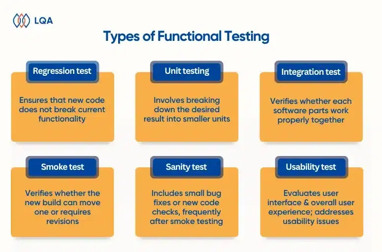

## Table of Contents

## What is a test?

A test is a way to check if something works well or if someone knows something. It can be a school exam to see what students have learned, or it can be a check to see if a new toy or machine works right. Tests help us find out what is good and what needs to be better.

There are many kinds of tests. Some tests are written, like quizzes and exams. Others are practical, like driving a car to see if you can do it safely. Tests can also be used to check health, like a doctor's test to see if you are sick. No matter the type, tests help us learn and improve.

## Why are tests important?

Tests are important because they help us see how well we are doing. In school, tests show if students have learned the lessons. This helps teachers know if they need to teach something again or if the class can move on to new topics. Outside of school, tests like driving tests make sure people can drive safely. Without tests, we wouldn't know if someone is ready for a new challenge or if a product is safe to use.

Tests also help us find out what we need to work on. If you do badly on a math test, it tells you that you need to practice more math. This can lead to better learning and improvement. In the same way, if a new toy fails a safety test, the people who make it can fix the problems before it goes to stores. Tests give us important feedback that helps us get better at things and make safer, better products.

## What are the basic types of tests?

There are a few basic types of tests. One type is the written test. This is like a quiz or an exam where you answer questions on paper or on a computer. These tests check what you know about a subject, like math or history. Another type is the practical test. This is when you show that you can do something, like driving a car or cooking a meal. Practical tests check your skills and how well you can use what you've learned.

Another basic type of test is the performance test. This is used to see how well something works, like a new machine or a computer program. Performance tests help find out if the thing is fast enough or strong enough for what it needs to do. There are also health tests, which doctors use to check if you are sick or healthy. These can be blood tests, X-rays, or other checks to see what is going on inside your body.

All these types of tests help us learn and improve. They tell us what we know, what we can do, how well things work, and if we are healthy. By using tests, we can make better choices and keep getting better at things.

## How does testing contribute to quality assurance?

Testing is a big part of making sure things are good quality. When we test things, we find out if they work well and if they are safe to use. For example, if a toy company makes a new toy, they test it to see if it breaks easily or if it has any sharp edges. By doing these tests, the company can fix any problems before the toy goes to stores. This way, people get a toy that is safe and fun to play with.

Testing also helps in other areas, like software and health care. When a computer program is being made, it gets tested a lot to see if it works right and doesn't crash. If there are bugs, the people making the program can fix them. In health care, doctors do tests to check if a patient is sick or healthy. These tests help doctors decide the best way to help the patient. So, testing is important for making sure products and services are of high quality and safe for everyone to use.

## What is the difference between a test and an assessment?

A test is a specific tool used to measure something, like how much you know about a topic or how well a product works. It usually has a set of questions or tasks that you need to complete. For example, a math test might have problems to solve, and a driving test might ask you to show you can drive safely. Tests are often used to see if someone has reached a certain level of knowledge or skill.

An assessment is a broader term that can include tests but also other ways to check someone's progress or performance. Assessments can be formal, like a written exam, or informal, like a teacher watching students work on a project. They can also include things like self-assessments, where you think about your own learning, or peer assessments, where classmates give feedback to each other. Assessments help to understand someone's abilities and needs in a more complete way than just using tests.

## What are the key elements of a well-designed test?

A well-designed test has clear goals. It should be easy to understand what the test is trying to find out. For example, if it's a math test, it should check if students can solve math problems. The questions or tasks in the test should match these goals. They should be fair and not too hard or too easy. This way, the test can really show what someone knows or can do.

Another important part of a good test is how it is set up. The test should have enough time for everyone to finish, but not so much time that it's boring. The instructions should be clear so everyone knows what to do. Also, a good test should be the same for everyone taking it, so it's fair. This means the questions should not be too different or harder for some people than others. By keeping these things in mind, a well-designed test can give useful and fair results.

## How do you develop a test?

To develop a test, you first need to figure out what you want to check. Are you testing to see if students understand math, or if a new toy is safe? Once you know your goal, you can start making questions or tasks that match it. For a math test, you might write problems that test different math skills. For a safety test, you might try to break the toy in different ways to see if it's strong enough. Make sure the questions or tasks are clear and fair for everyone who will take the test.

After you have your questions or tasks, you need to set up the test. Decide how long the test should take. It should be long enough for everyone to finish, but not so long that it's boring. Write clear instructions so everyone knows what to do. Make sure the test is the same for everyone, so it's fair. You might also want to try out the test with a small group first to see if it works well. If you find any problems, you can fix them before giving the test to everyone. By following these steps, you can make a good test that helps you learn what you need to know.

## What are the common challenges faced during testing?

One common challenge during testing is making sure the test is fair for everyone. Sometimes, the questions or tasks might be too hard for some people or too easy for others. This can make the test results not very useful. Another challenge is making the test clear and easy to understand. If the instructions are confusing, people might not know what to do, and this can mess up the test results. Time can also be a problem. If the test is too short, some people might not finish. If it's too long, it can be boring and tiring.

Another challenge is making sure the test really checks what it's supposed to check. For example, if you're testing math skills, the questions should be about math and not about reading or something else. Sometimes, it's hard to make questions that only check one thing. Also, testing can be stressful for people. This stress can make them not do as well as they could. It's important to think about these challenges when making a test so it can give good and fair results.

## How can test results be interpreted and used effectively?

Test results help us understand what someone knows or how well something works. When you look at the results, you need to see if they match what the test was trying to check. For example, if it's a math test, the results should show how well someone can solve math problems. You should also think about if the test was fair and if everyone had the same chance to do well. If the results are good, it means the person or thing being tested did well. If they're not so good, it might mean there's something that needs to be worked on or fixed.

Using test results well means taking action based on what you learn. If a student does badly on a math test, the teacher might need to go over the lessons again or give the student more practice. If a new toy fails a safety test, the people making it can fix the problems before selling it. It's important to use the results to make things better, not just to judge. By looking at test results carefully and using them to help improve, we can learn a lot and make things safer and better for everyone.

## What advanced testing methodologies exist?

Advanced testing methods help us check things in new and better ways. One method is automated testing, where computers do the testing instead of people. This is often used for checking computer programs. The computer can run the test many times quickly and find problems that might be hard for people to see. Another method is called A/B testing. This is when you test two different versions of something, like a website, to see which one works better. By comparing the results, you can choose the best version.

Another advanced method is stress testing, which checks how well something works under hard conditions. For example, you might test a phone to see if it still works when it's very hot or cold. This helps make sure the phone is strong and reliable. There's also usability testing, where you watch people use something to see if it's easy to use. This can help make things like apps or machines better for everyone. By using these advanced methods, we can make sure things are safe, work well, and are easy to use.

## How does automation impact testing processes?

Automation makes testing faster and more accurate. When computers do the testing instead of people, they can run the same test many times without getting tired. This means they can find small problems that might be hard for people to see. For example, in software testing, automated tools can check a program over and over again to make sure it works right every time. This saves a lot of time and helps find bugs quickly.

Automation also makes testing more reliable. When people do tests, they might make mistakes or miss something. Computers follow the same steps every time, so the results are always the same. This makes it easier to trust the test results. Plus, automated testing can run tests at times when people are not working, like at night or on weekends. This means testing can happen all the time, making it easier to keep improving things without slowing down work.

## What are the future trends in testing and evaluation?

In the future, testing and evaluation will use more smart technology. Computers and [artificial intelligence](/wiki/ai-artificial-intelligence) will help make tests better and faster. For example, AI can look at test results and find patterns that people might miss. This can help teachers know what students need to learn more about. Also, more tests will be done online, making it easier for people to take them from home or anywhere. This can make testing more fair because everyone can take the test in the same way, no matter where they live.

Another trend will be personalized testing. This means tests will be made just for each person, based on what they need to learn or check. For example, if a student is good at math but needs help with reading, the test can focus more on reading. This can make learning better because the tests are more helpful for each person. Also, there will be more focus on testing skills that are important for the future, like problem-solving and working with others. By using these new ways of testing, we can help people learn and grow in the best way possible.

## What are the types of tests for algorithmic trading?

Algorithmic trading relies on several testing types to ensure that trading strategies are effective and robust before committing capital in live markets. Here we explore the key tests used in this domain.

### Backtesting

Backtesting assesses a trading strategy using historical market data, allowing traders to simulate how a strategy would have performed in the past. The primary goal is to validate if the strategy could have been profitable and to understand its risk characteristics. Key metrics such as return, [volatility](/wiki/volatility-trading-strategies), the Sharpe ratio, and maximum drawdown are calculated during [backtesting](/wiki/backtesting) to evaluate performance. A comprehensive backtest avoids overfitting by using both in-sample and out-of-sample datasets. A simplified backtest in Python can be achieved using libraries like `pandas` and `numpy` to manipulate historical data and calculate strategy performance:

```python
import pandas as pd
import numpy as np

def backtest_strategy(data):
    # Example simple moving average strategy
    data['SMA50'] = data['Close'].rolling(window=50).mean()
    data['Signal'] = np.where(data['Close'] > data['SMA50'], 1, -1)
    data['Returns'] = data['Signal'].shift(1) * data['Close'].pct_change()
    total_return = np.exp(data['Returns'].sum())
    return total_return

# Example execution
data = pd.read_csv('historical_data.csv')
strategy_return = backtest_strategy(data)
print(f'Strategy Return: {strategy_return:.2f}')
```

### Forward Testing

Forward testing, or paper trading, complements backtesting by evaluating a strategy in real-time, without risking actual capital. It involves executing trades in a simulated environment as if they were live, considering factors such as slippage, latency, and order fill rates. This step helps traders to fine-tune strategies and adjust them to match current market dynamics, aiding in strategy validation before live execution.

### Robustness Testing

Robustness testing ensures that a strategy remains reliable under varying market conditions and stress scenarios. Methods like Walk Forward Analysis divide historical data into multiple segments, testing and optimizing the strategy on each segment iteratively to validate consistency across different periods. Liquidity Testing evaluates the strategy’s ability to maintain performance during changes in market [liquidity](/wiki/liquidity-risk-premium). Noise Testing involves introducing randomized data to the model inputs to detect overfitting tendencies.

### Statistical Tests

Statistical tests, including hypothesis testing and t-tests, play a crucial role in trading strategy validation. These tests examine if a strategy's performance metrics, such as its mean returns, deviate significantly from a benchmark or other strategies. The hypothesis tested might be whether the strategy's mean return is greater than zero, supporting the strategy's effectiveness with a significance level, typically set at 0.05.

$$
t = \frac{\bar{X} - \mu_0}{s / \sqrt{n}}
$$

Where:
- $\bar{X}$ is the sample mean.
- $\mu_0$ is the population mean under the null hypothesis.
- $s$ is the sample standard deviation.
- $n$ is the sample size.

### Monte Carlo Simulation

Monte Carlo Simulation is used to evaluate the potential future outcomes of a trading strategy by generating a large number of random market scenarios. It helps in assessing the risk and optimizing strategy parameters through statistical inference. This stochastic technique offers insights into a strategy's behavior under diverse possible conditions, providing a robust framework for estimating future returns and risks.

By employing these testing strategies, traders enhance the reliability and robustness of their trading algorithms, significantly reducing the risk of unexpected losses in live trading scenarios.

## What is backtesting and what are its benefits?

Backtesting is a fundamental component in the validation process of trading strategies within [algorithmic trading](/wiki/algorithmic-trading). By utilizing historical market data, traders can systematically evaluate the past performance of their algorithms, thereby gaining insights into the potential future efficacy of these strategies.

One of the primary benefits of backtesting is its ability to aid in refining algorithms. This process involves identifying any inherent flaws in the strategy logic and uncovering potential trading opportunities before implementing the strategy in real-world scenarios. By analyzing how a strategy would have performed historically, traders can make necessary adjustments to enhance its effectiveness, thus reducing financial risk during live trading.

Evaluating strategy performance in backtesting relies on various key metrics. The Sharpe ratio, for instance, measures the risk-adjusted return of an investment strategy, providing a way to compare the strategy’s performance relative to a risk-free asset. It is calculated as:

$$
\text{Sharpe Ratio} = \frac{E[R] - R_f}{\sigma_R}
$$

where $E[R]$ is the expected return of the portfolio, $R_f$ is the risk-free rate, and $\sigma_R$ is the standard deviation of the portfolio's excess return. Another critical metric is the maximum drawdown, which assesses the peak-to-trough decline in the portfolio value, helping traders understand the potential downside risk.

Comprehensive backtesting requires the use of both in-sample and out-of-sample datasets to prevent overfitting, a common pitfall where a model is too complex and captures noise along with the underlying data patterns. In-sample data is used for initial model training, while out-of-sample data serves as an independent test for model validation. This dual approach ensures that the strategy performs well on new, unseen data, which is crucial for its reliability and robustness.

Through the establishment of a track record of past performance via backtesting, traders can gain confidence in their strategies. This historical validation not only supports the trader's decision-making process but also instills trust in the strategy's potential to succeed under various market conditions. By employing thorough backtesting practices, traders are better positioned to mitigate risks and capitalize on market opportunities.

## What role do statistical tests play in trading strategy validation?

Statistical tests are essential tools for validating assumptions in trading strategies, offering a methodical approach to enhance decision-making and strategy refinement. Two prevalent tests used in this context are hypothesis tests and t-tests, which aid in determining whether a trading strategy's performance significantly deviates from established benchmarks or alternative models.

Hypothesis testing in trading involves establishing a null hypothesis, typically that a specific strategy does not outperform a benchmark index, and an alternative hypothesis suggesting superior performance. For example, if a trader wants to test a strategy's average return against a benchmark's average return, they would use historical performance data to assess the likelihood of observing the obtained results if the null hypothesis is true. Rejecting the null hypothesis suggests that the strategy may indeed offer a significant performance advantage.

T-tests are particularly useful when comparing the means of two datasets, such as the returns of a trading strategy versus those of a benchmark. The test calculates the t-statistic, which helps determine the probability that any observed difference in means arises purely by chance. The formula for a t-test is:

$$

t = \frac{\bar{X}_1 - \bar{X}_2}{\sqrt{\frac{s_1^2}{n_1} + \frac{s_2^2}{n_2}}} 
$$

where $\bar{X}_1$ and $\bar{X}_2$ are the sample means, $s_1^2$ and $s_2^2$ are the sample variances, and $n_1$ and $n_2$ are the sample sizes. A significant t-statistic indicates a meaningful difference between the strategy's performance and the benchmark.

Checking variances is another critical aspect of statistical testing. Strategies must show consistent variance levels compared to benchmarks to confirm robustness and reliability. High variance in strategy returns compared to a benchmark may indicate increased risk or instability.

By employing these statistical methods, traders obtain objective evidence regarding the effectiveness of their strategies. The results inform decisions such as whether to implement, modify, or discard a strategy, thus supporting evidence-based decision-making. Statistical tests provide rigor and precision, ensuring that trading strategies are not only optimized but also possess a higher reliability when exposed to real market conditions. Understanding and applying these techniques enhances the analytical foundation upon which robust and successful trading strategies are built.

## References & Further Reading

[1]: Bergstra, J., Bardenet, R., Bengio, Y., & Kégl, B. (2011). ["Algorithms for Hyper-Parameter Optimization."](https://dl.acm.org/doi/10.5555/2986459.2986743) Advances in Neural Information Processing Systems 24.

[2]: ["Advances in Financial Machine Learning"](https://www.amazon.com/Advances-Financial-Machine-Learning-Marcos/dp/1119482089) by Marcos Lopez de Prado

[3]: ["Evidence-Based Technical Analysis: Applying the Scientific Method and Statistical Inference to Trading Signals"](https://www.amazon.com/Evidence-Based-Technical-Analysis-Scientific-Statistical/dp/0470008741) by David Aronson

[4]: ["Machine Learning for Algorithmic Trading"](https://github.com/stefan-jansen/machine-learning-for-trading) by Stefan Jansen

[5]: ["Quantitative Trading: How to Build Your Own Algorithmic Trading Business"](https://www.amazon.com/Quantitative-Trading-Build-Algorithmic-Business/dp/1119800064) by Ernest P. Chan