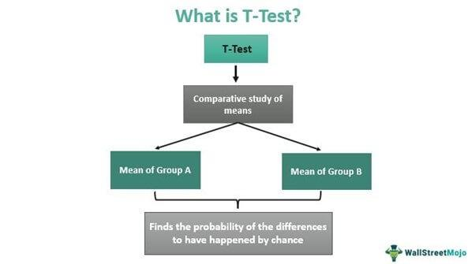

In algorithmic trading, testing is a pivotal aspect of strategy development and implementation. With markets being inherently unpredictable, the success of trading algorithms largely depends on their ability to adapt and handle various market scenarios. Testing serves as a critical tool in refining these algorithms to improve their success rates and ensure robustness.

The application of different types of tests allows traders to meticulously assess and fine-tune their strategies before deploying them in live environments. By examining how strategies perform under a range of conditions, traders can identify potential weaknesses and strengths, thereby enhancing overall performance. This approach not only boosts the effectiveness of trading algorithms but also increases their resilience against market shifts and unforeseen events.



This article aims to explore the purpose and methodology of testing within algorithmic trading, illustrating its significance in enhancing trading performance. By gaining a comprehensive understanding of these testing techniques, traders can develop more adaptive and robust strategies, which are better equipped to withstand the challenges posed by dynamic market conditions. Through diligent testing, the probability of achieving consistent success in algorithmic trading is significantly improved.

## Table of Contents

## Purpose of Testing in Algorithmic Trading

Testing in algorithmic trading is a critical process that ensures a trading strategy is viable before it is deployed in live markets. A well-constructed testing regimen can identify potential issues that might not be obvious during the strategy's initial development phase. This identification of issues is key to reducing risks and enhancing decision-making capabilities, ensuring that the trading algorithms function correctly when exposed to the unpredictable nature of financial markets.

One of the core aspects of testing is its ability to ascertain whether a strategy can effectively manage various market conditions, such as fluctuations in volatility and changes in liquidity. By assessing how a strategy performs under different scenarios, traders can determine its robustness and adaptability. A strategy that can handle diverse market conditions is likely to be more reliable and profitable over time.

The ultimate goal of testing is to validate that the strategy's logic holds up in both historical and real-time scenarios. This typically involves backtesting, where the strategy is applied to historical market data to assess hypothetical performance, and forward testing, where the strategy is tested in real-time without financial risk. These testing methods help in verifying that the strategy's assumptions and decisions align with actual market behavior, minimizing the chances of unexpected outcomes in live environments.

Furthermore, rigorous testing can serve as a safeguard against substantial financial losses. By identifying weaknesses and refining the strategy before live trading, traders can avoid pitfalls that could lead to significant financial setbacks. Overall, a comprehensive testing strategy is indispensable in enhancing the resilience and effectiveness of trading algorithms, helping traders achieve more consistent and successful outcomes in the competitive landscape of [algorithmic trading](/wiki/algorithmic-trading).

## Types of Tests for Algorithmic Trading

Algorithmic trading relies on several testing types to ensure that trading strategies are effective and robust before committing capital in live markets. Here we explore the key tests used in this domain.

### Backtesting

Backtesting assesses a trading strategy using historical market data, allowing traders to simulate how a strategy would have performed in the past. The primary goal is to validate if the strategy could have been profitable and to understand its risk characteristics. Key metrics such as return, [volatility](/wiki/volatility-trading-strategies), the Sharpe ratio, and maximum drawdown are calculated during [backtesting](/wiki/backtesting) to evaluate performance. A comprehensive backtest avoids overfitting by using both in-sample and out-of-sample datasets. A simplified backtest in Python can be achieved using libraries like `pandas` and `numpy` to manipulate historical data and calculate strategy performance:

```python
import pandas as pd
import numpy as np

def backtest_strategy(data):
    # Example simple moving average strategy
    data['SMA50'] = data['Close'].rolling(window=50).mean()
    data['Signal'] = np.where(data['Close'] > data['SMA50'], 1, -1)
    data['Returns'] = data['Signal'].shift(1) * data['Close'].pct_change()
    total_return = np.exp(data['Returns'].sum())
    return total_return

# Example execution
data = pd.read_csv('historical_data.csv')
strategy_return = backtest_strategy(data)
print(f'Strategy Return: {strategy_return:.2f}')
```

### Forward Testing

Forward testing, or paper trading, complements backtesting by evaluating a strategy in real-time, without risking actual capital. It involves executing trades in a simulated environment as if they were live, considering factors such as slippage, latency, and order fill rates. This step helps traders to fine-tune strategies and adjust them to match current market dynamics, aiding in strategy validation before live execution.

### Robustness Testing

Robustness testing ensures that a strategy remains reliable under varying market conditions and stress scenarios. Methods like Walk Forward Analysis divide historical data into multiple segments, testing and optimizing the strategy on each segment iteratively to validate consistency across different periods. Liquidity Testing evaluates the strategy’s ability to maintain performance during changes in market [liquidity](/wiki/liquidity-risk-premium). Noise Testing involves introducing randomized data to the model inputs to detect overfitting tendencies.

### Statistical Tests

Statistical tests, including hypothesis testing and t-tests, play a crucial role in trading strategy validation. These tests examine if a strategy's performance metrics, such as its mean returns, deviate significantly from a benchmark or other strategies. The hypothesis tested might be whether the strategy's mean return is greater than zero, supporting the strategy's effectiveness with a significance level, typically set at 0.05.

$$
t = \frac{\bar{X} - \mu_0}{s / \sqrt{n}}
$$

Where:
- $\bar{X}$ is the sample mean.
- $\mu_0$ is the population mean under the null hypothesis.
- $s$ is the sample standard deviation.
- $n$ is the sample size.

### Monte Carlo Simulation

Monte Carlo Simulation is used to evaluate the potential future outcomes of a trading strategy by generating a large number of random market scenarios. It helps in assessing the risk and optimizing strategy parameters through statistical inference. This stochastic technique offers insights into a strategy's behavior under diverse possible conditions, providing a robust framework for estimating future returns and risks.

By employing these testing strategies, traders enhance the reliability and robustness of their trading algorithms, significantly reducing the risk of unexpected losses in live trading scenarios.

## Backtesting and Its Benefits

Backtesting is a fundamental component in the validation process of trading strategies within algorithmic trading. By utilizing historical market data, traders can systematically evaluate the past performance of their algorithms, thereby gaining insights into the potential future efficacy of these strategies.

One of the primary benefits of backtesting is its ability to aid in refining algorithms. This process involves identifying any inherent flaws in the strategy logic and uncovering potential trading opportunities before implementing the strategy in real-world scenarios. By analyzing how a strategy would have performed historically, traders can make necessary adjustments to enhance its effectiveness, thus reducing financial risk during live trading.

Evaluating strategy performance in backtesting relies on various key metrics. The Sharpe ratio, for instance, measures the risk-adjusted return of an investment strategy, providing a way to compare the strategy’s performance relative to a risk-free asset. It is calculated as:

$$
\text{Sharpe Ratio} = \frac{E[R] - R_f}{\sigma_R}
$$

where $E[R]$ is the expected return of the portfolio, $R_f$ is the risk-free rate, and $\sigma_R$ is the standard deviation of the portfolio's excess return. Another critical metric is the maximum drawdown, which assesses the peak-to-trough decline in the portfolio value, helping traders understand the potential downside risk.

Comprehensive backtesting requires the use of both in-sample and out-of-sample datasets to prevent overfitting, a common pitfall where a model is too complex and captures noise along with the underlying data patterns. In-sample data is used for initial model training, while out-of-sample data serves as an independent test for model validation. This dual approach ensures that the strategy performs well on new, unseen data, which is crucial for its reliability and robustness.

Through the establishment of a track record of past performance via backtesting, traders can gain confidence in their strategies. This historical validation not only supports the trader's decision-making process but also instills trust in the strategy's potential to succeed under various market conditions. By employing thorough backtesting practices, traders are better positioned to mitigate risks and capitalize on market opportunities.

## Forward Testing and Real-Time Analysis

Forward testing, also known as paper trading, plays a critical role in complementing backtesting by evaluating a trading strategy under live market conditions without actual financial risks. This process allows traders to observe how strategies perform when exposed to the complexities and unpredictability of real-time markets.

Implemented within a simulated environment, forward testing enables traders to assess adaptability and execution efficiency in live scenarios. Unlike backtesting, which deals with historical data, forward testing provides insight into how a strategy might operate in current market conditions, taking into account factors such as slippage, latency, and fill rates. These factors are vital to realistic outcome projections. Slippage, the difference between the expected price of a trade and the actual price, can significantly affect returns. Analyzing latency, the delay before the transfer of data begins following an instruction for its transfer, and fill rates, the percentage of orders executed at the desired price, ensures that traders account for the practicalities of execution.

By employing forward testing, traders can pinpoint hidden issues that may not have been evident during backtesting. These can include unexpected market reactions or operational inefficiencies. Identifying and addressing such issues allows traders to fine-tune their strategies, ensuring that they are robust and more aligned with prevailing market conditions.

A successful forward testing phase not only verifies the practical application of the strategy but also bolsters its readiness for actual deployment. This readiness is crucial, as a strategy must be both effective and executable to succeed in the live markets. By ensuring a strategy's performance under simulated real-time conditions, traders gain a crucial layer of assurance, potentially increasing both the execution quality and reliability of their trading systems. Engaging in this methodical approach harnesses the full potential of algorithmic trading, bridging the gap between theoretical strategy design and practical, profitable application.

## Robustness Testing Techniques

Robust strategies in algorithmic trading are designed to withstand fluctuations and shocks in market conditions, ensuring reliability and performance consistency. Various testing methodologies assess the robustness of a strategy, each offering insights into different aspects of algorithmic stability and adaptability.

Walk Forward Analysis is a powerful technique used to evaluate a strategy's consistency over time. By partitioning data into multiple, successive segments, traders can sequentially optimize the strategy on one segment (in-sample data) and then test its performance on the subsequent segment (out-of-sample data). This iterative process helps identify overfitting and adapt the strategy to changing market conditions effectively.

Liquidity Testing examines how a trading strategy would perform with varying liquidity levels. This is crucial because even a highly profitable strategy can fail if it cannot execute trades without significantly affecting market prices. By simulating different liquidity scenarios, traders can gauge a strategy's resilience to slippage and market impact, often using metrics like the bid-ask spread or [order book](/wiki/order-book-trading-strategies) depth.

Noise Testing is another essential component of robustness testing. This method involves introducing random noise into the market data used for strategy development to assess the strategy's sensitivity to data irregularities and overfitting. By doing so, traders can ensure that the strategy's performance is not predominantly dependent on specific patterns or anomalies that may not persist in future market conditions.

Monte Carlo Simulations play a pivotal role in robustness testing by generating numerous synthetic data paths based on statistical properties of historical market data. This approach helps in evaluating the potential variability in a strategy's performance under a wide range of hypothetical future market scenarios. For instance, through Python, a trader might simulate thousands of possible price trajectories and analyze the strategy's performance across these scenarios:

```python
import numpy as np

def monte_carlo_simulation(strategy, init_capital, num_simulations, num_periods, drift, volatility):
    results = []
    for _ in range(num_simulations):
        price_paths = np.exp((drift - 0.5 * volatility**2) * np.range(num_periods) +
                             volatility * np.random.normal(0, 1, num_periods).cumsum())
        results.append(strategy.evaluate(price_paths, init_capital))
    return np.percentile(results, [5, 50, 95])  # 5th, 50th, and 95th percentiles

# Example usage assuming 'strategy' is a pre-defined trading strategy object
performance_percentiles = monte_carlo_simulation(strategy, 10000, 1000, 252, 0.05, 0.2)
```

By integrating these robustness checks into the development cycle, traders can improve the probability of long-term success in the dynamic environments characteristic of financial markets. These methods collectively enhance the strategy's ability to maintain consistent performance, even when facing adverse or unexpected events.

## Statistical Tests in Trading Strategy Validation

Statistical tests are essential tools for validating assumptions in trading strategies, offering a methodical approach to enhance decision-making and strategy refinement. Two prevalent tests used in this context are hypothesis tests and t-tests, which aid in determining whether a trading strategy's performance significantly deviates from established benchmarks or alternative models.

Hypothesis testing in trading involves establishing a null hypothesis, typically that a specific strategy does not outperform a benchmark index, and an alternative hypothesis suggesting superior performance. For example, if a trader wants to test a strategy's average return against a benchmark's average return, they would use historical performance data to assess the likelihood of observing the obtained results if the null hypothesis is true. Rejecting the null hypothesis suggests that the strategy may indeed offer a significant performance advantage.

T-tests are particularly useful when comparing the means of two datasets, such as the returns of a trading strategy versus those of a benchmark. The test calculates the t-statistic, which helps determine the probability that any observed difference in means arises purely by chance. The formula for a t-test is:

$$

t = \frac{\bar{X}_1 - \bar{X}_2}{\sqrt{\frac{s_1^2}{n_1} + \frac{s_2^2}{n_2}}} 
$$

where $\bar{X}_1$ and $\bar{X}_2$ are the sample means, $s_1^2$ and $s_2^2$ are the sample variances, and $n_1$ and $n_2$ are the sample sizes. A significant t-statistic indicates a meaningful difference between the strategy's performance and the benchmark.

Checking variances is another critical aspect of statistical testing. Strategies must show consistent variance levels compared to benchmarks to confirm robustness and reliability. High variance in strategy returns compared to a benchmark may indicate increased risk or instability.

By employing these statistical methods, traders obtain objective evidence regarding the effectiveness of their strategies. The results inform decisions such as whether to implement, modify, or discard a strategy, thus supporting evidence-based decision-making. Statistical tests provide rigor and precision, ensuring that trading strategies are not only optimized but also possess a higher reliability when exposed to real market conditions. Understanding and applying these techniques enhances the analytical foundation upon which robust and successful trading strategies are built.

## Conclusion

Testing is indispensable in algorithmic trading for optimizing and validating strategies. Through the systematic application of various types of tests, traders can effectively measure and enhance the performance of their algorithms. Backtesting serves as the foundational step, providing historical perspective and quantifiable metrics such as the Sharpe ratio and maximum drawdown to gauge the strategy's past performance. Forward testing further complements this by subjecting strategies to current market conditions, allowing traders to simulate real-time execution and analyze adaptability without financial risk.

Robustness checks are equally vital, as they assess the reliability of strategies by exposing them to varying market scenarios and stress tests. Techniques like Walk Forward Analysis and Monte Carlo Simulations ensure that strategies maintain consistent performance even under unexpected market fluctuations. Statistical tests such as hypothesis testing and t-tests provide a data-driven approach to validate whether a strategy meaningfully improves on a benchmark or another trading model, ensuring that decisions are based on sound statistical evidence.

Together, these tests offer a comprehensive framework for assessing strategy viability, allowing traders to identify weaknesses, reduce risks, and maximize profitability. By embedding rigorous testing processes into strategy development, traders not only safeguard against significant financial losses but also increase the robustness of their trading operations. Furthermore, ongoing education and the application of these methodologies are crucial for maintaining adaptability and achieving sustained success in the ever-evolving landscape of algorithmic trading.

## References & Further Reading

[1]: Bergstra, J., Bardenet, R., Bengio, Y., & Kégl, B. (2011). ["Algorithms for Hyper-Parameter Optimization."](https://dl.acm.org/doi/10.5555/2986459.2986743) Advances in Neural Information Processing Systems 24.

[2]: ["Advances in Financial Machine Learning"](https://www.amazon.com/Advances-Financial-Machine-Learning-Marcos/dp/1119482089) by Marcos Lopez de Prado

[3]: ["Evidence-Based Technical Analysis: Applying the Scientific Method and Statistical Inference to Trading Signals"](https://www.amazon.com/Evidence-Based-Technical-Analysis-Scientific-Statistical/dp/0470008741) by David Aronson

[4]: ["Machine Learning for Algorithmic Trading"](https://github.com/stefan-jansen/machine-learning-for-trading) by Stefan Jansen

[5]: ["Quantitative Trading: How to Build Your Own Algorithmic Trading Business"](https://www.amazon.com/Quantitative-Trading-Build-Algorithmic-Business/dp/1119800064) by Ernest P. Chan