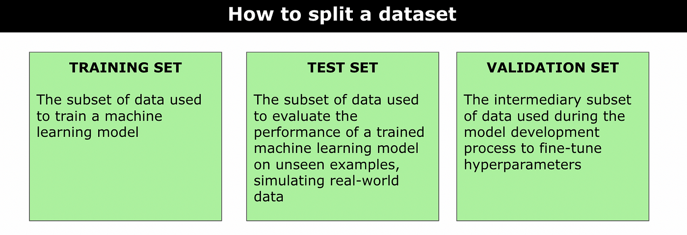

## Table of Contents

## What is a test set in machine learning?

A test set in machine learning is a portion of a dataset that is used to evaluate the performance of a trained model. After a model has been trained on a training set, it is important to see how well it performs on new, unseen data. This is where the test set comes in. By using data that the model has not seen during training, we can get a good idea of how well the model will generalize to new situations.

The test set should be representative of the data the model will encounter in real-world scenarios. This means it should have similar characteristics and be drawn from the same population as the training data. If the test set is too easy or too different from the training data, the evaluation might not be accurate. A common practice is to split the entire dataset into three parts: training set, validation set, and test set. The validation set is used during the training process to tune the model's parameters, while the test set is kept separate until the final evaluation.

## Why is a test set important in the machine learning process?

A test set is really important in machine learning because it helps us check how well our model works on new data. When we train a model, we use a training set, but we need to see if it can handle data it hasn't seen before. That's where the test set comes in. By using the test set, we can see if our model is good at guessing or predicting things it hasn't learned about yet. This helps us know if our model will work well in real life, not just with the data we used to train it.

If we didn't use a test set, we might think our model is better than it really is. This is because the model might just be memorizing the training data instead of learning to make good guesses. By using a test set, we can catch this problem and make sure our model is actually learning useful patterns. This makes our model more reliable and useful for real-world situations, where it will need to handle all sorts of new data.

## How is a test set different from a training set and a validation set?

A training set is the part of the data we use to teach our [machine learning](/wiki/machine-learning) model. We show the model lots of examples from the training set, and it learns from them. This is where the model figures out patterns and relationships in the data. The goal is for the model to get good at making predictions or decisions based on what it has learned.

A validation set is different because we use it to check how well the model is doing while we are still training it. We can try out different settings or changes to the model and see which ones work best by looking at the results on the validation set. This helps us make the model better without using the test set, which we save for the very end.

The test set is special because we only use it once, at the very end, to see how well our model works on completely new data. We don't use the test set during training or to make changes to the model. It's like a final exam for the model to see if it can handle new situations well. This helps us know if our model will be useful in real life, not just with the data it was trained on.

## What are the best practices for creating a test set?

When creating a test set, it's important to make sure it's a good representation of the data your model will see in the real world. This means the test set should have similar characteristics to your training data and come from the same population. A common way to do this is to split your entire dataset into three parts: training, validation, and test sets. A good rule of thumb is to use about 60-80% of your data for training, 10-20% for validation, and the remaining 10-20% for testing. This helps ensure your model is trained on enough data and tested on a good sample of new data.

Another best practice is to use random sampling when splitting your data. This helps avoid any bias that might come from splitting the data in a non-random way. For example, if your data is sorted by time, you might accidentally put all the newer data into the test set, which wouldn't be a good test of how your model will work on all kinds of data. Using a random split helps make sure your test set is a fair sample of all the data you have. Also, make sure to keep the test set completely separate from the training and validation processes, so you don't accidentally use it to make changes to your model.

## How do you determine the size of a test set?

When deciding how big your test set should be, think about how much data you have in total and what you need it for. A good starting point is to use about 10-20% of your data for the test set. This leaves enough data for training and validation while still giving you a good sample to check your model's performance. If you have a lot of data, you might be able to use a smaller percentage for the test set and still get reliable results. But if you have less data, you might need to use a bigger percentage to make sure your test set is big enough to be useful.

The size of the test set also depends on how complex your model is and how much you want to trust the results. A bigger test set can give you more confidence that your model will work well in the real world. But, making the test set too big means you'll have less data for training, which could make your model worse. A common split is to use 60-80% of your data for training, 10-20% for validation, and the rest for testing. This balance helps make sure your model is trained well and tested fairly.

## What metrics are typically used to evaluate a model on a test set?

When we evaluate a model on a test set, we use different metrics depending on what kind of problem we're working on. For classification problems, where we're trying to put things into different groups, we often use accuracy, precision, recall, and the F1 score. Accuracy tells us the percentage of correct predictions out of all predictions. Precision measures how many of the positive predictions were actually correct. Recall looks at how many of the actual positives were caught by the model. The F1 score is a way to combine precision and recall into one number, which is useful when we want to balance both. For example, the F1 score is calculated as $$F1 = 2 \times \frac{\text{precision} \times \text{recall}}{\text{precision} + \text{recall}}$$.

For regression problems, where we're trying to predict a number, common metrics include Mean Absolute Error (MAE), Mean Squared Error (MSE), and Root Mean Squared Error (RMSE). MAE is the average of the absolute differences between the predicted and actual values. MSE is the average of the squared differences, which gives more weight to bigger errors. RMSE is the square root of MSE, which brings the error back to the same units as the original values. These metrics help us understand how close our predictions are to the real numbers.

Sometimes, we also look at other metrics like the Area Under the Receiver Operating Characteristic Curve (AUC-ROC) for classification problems. This measures how well the model can distinguish between different classes. For example, in a medical test, it can show how well the test can tell sick people from healthy ones. The choice of metrics depends on what's important for the specific problem we're trying to solve, and using the right ones helps us know if our model is good enough for real-world use.

## How can overfitting be detected using a test set?

Overfitting happens when a model learns the training data too well, including its noise and random errors, instead of learning the general patterns that will help it make good predictions on new data. To detect overfitting, we can compare the model's performance on the training set with its performance on the test set. If the model does much better on the training set than on the test set, it's a sign that the model has overfit. For example, if a model's accuracy on the training set is 95% but only 70% on the test set, this big difference suggests the model isn't generalizing well to new data.

To make this clearer, let's say we're using accuracy as our metric. If the model's accuracy on the training set is $$A_{train}$$ and on the test set is $$A_{test}$$, a big difference between these two numbers, like $$A_{train} - A_{test} > 0.15$$, can be a red flag for overfitting. To fix this, we might need to simplify the model, use more training data, or apply techniques like regularization to help the model learn the important patterns without getting too caught up in the details of the training data.

## What are common challenges when using test sets in machine learning?

One common challenge when using test sets in machine learning is making sure the test set is a good representation of the data the model will see in real life. If the test set is too different from the training data, the model's performance might not be a good indicator of how it will do in the real world. For example, if the training data is mostly from one group of people and the test data is from a different group, the model might not work well for everyone. This can happen if the data is split in a way that's not random, like if it's sorted by time or location.

Another challenge is avoiding data leakage, where information from the test set accidentally gets used during the training process. This can make the model seem better than it really is because it's already seen the test data. To prevent this, it's important to keep the test set completely separate from the training and validation sets. If data leakage happens, the model's performance on the test set won't be a true measure of how well it can handle new data. For example, if $$A_{train}$$ is the accuracy on the training set and $$A_{test}$$ is the accuracy on the test set, data leakage might make $$A_{test}$$ artificially high, which can be misleading.

## How does the choice of test set impact model generalization?

The choice of test set is really important for figuring out how well a model will work in the real world. If the test set is a good mix of different kinds of data, it can show us if the model can handle new situations well. For example, if the test set is similar to the training data but includes new examples, we can see if the model has learned the right patterns. If the test set's accuracy, $$A_{test}$$, is close to the training set's accuracy, $$A_{train}$$, it means the model is generalizing well. But if the test set is too different from the training data, it might not be a fair test of the model's abilities.

A big challenge is making sure the test set is a good match for the real-world data the model will see. If the test set only has certain types of data, the model might do well on the test but fail in real life. For example, if the training data is all from one place and the test data is from another, the model might not work well everywhere. To avoid this, we need to make sure the test set is a random sample of all the data we have. This way, we can trust that the model's performance on the test set, $$A_{test}$$, will be a good sign of how it will do in the real world.

## Can you explain the concept of test set leakage and how to avoid it?

Test set leakage happens when information from the test set accidentally gets used during the training process. This can make the model seem better than it really is because it's already seen the test data. For example, if we use the test set to help tune the model or if some of the test data gets mixed into the training data, the model's performance on the test set won't be a true measure of how well it can handle new data. If $$A_{train}$$ is the accuracy on the training set and $$A_{test}$$ is the accuracy on the test set, test set leakage might make $$A_{test}$$ artificially high, which can be misleading.

To avoid test set leakage, it's important to keep the test set completely separate from the training and validation sets. This means never using the test set during the training process or to make any changes to the model. A good way to do this is to split the data into training, validation, and test sets right at the beginning and make sure the split is random. This helps make sure the model is only learning from the training data and not getting any sneak peeks at the test data. By keeping everything separate, we can trust that the model's performance on the test set is a fair and accurate measure of how well it will work in the real world.

## What advanced techniques can be used to improve test set evaluation?

One advanced technique to improve test set evaluation is using cross-validation. Instead of using just one split of the data into training and test sets, cross-validation splits the data into several parts and trains the model many times. Each time, a different part of the data is used as the test set. This helps make sure the model's performance is reliable and not just good because of one lucky split of the data. For example, if we use k-fold cross-validation, we split the data into k parts, and the model's performance is the average of its performance on each of the k test sets. This way, we can trust the results more because we're testing the model on many different sets of data.

Another technique is using stratified sampling when splitting the data. This means making sure each part of the data, like the training, validation, and test sets, has the same mix of different types of data. For example, if we're trying to predict whether someone will buy a product and we know that 30% of our data is from people who bought the product, we want to make sure that 30% of our test set is also from people who bought the product. This helps make sure the test set is a good representation of the whole dataset. By using stratified sampling, we can be more confident that the model's performance on the test set will be a good indicator of how it will work in the real world.

## How do you handle class imbalance in a test set?

When we have a test set with class imbalance, it means that some groups or classes in the data are much bigger than others. This can make it hard to see if our model is doing a good job with the smaller groups. To fix this, we can use something called stratified sampling. This means we make sure that the test set has the same mix of different classes as the whole dataset. For example, if 10% of the whole data is from one class, we want 10% of the test set to be from that class too. By doing this, we can trust that the model's performance on the test set will be a good sign of how it will work in the real world.

Another way to handle class imbalance in the test set is by using different evaluation metrics that are better at dealing with imbalanced data. Instead of just looking at accuracy, we can use metrics like precision, recall, and the F1 score. These metrics help us see how well the model is doing with the smaller classes. For example, the F1 score is calculated as $$F1 = 2 \times \frac{\text{precision} \times \text{recall}}{\text{precision} + \text{recall}}$$. By using these metrics, we can get a better idea of how the model is handling all the different classes, not just the big ones.