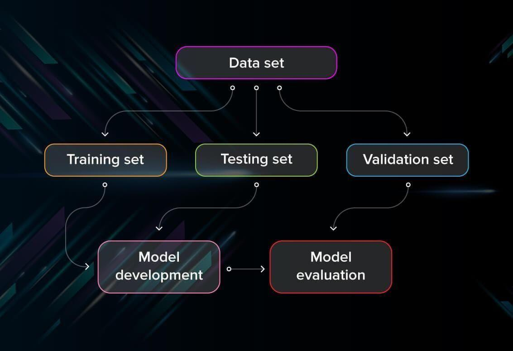

## Table of Contents

## What is test machine learning?

Testing machine learning models is important to make sure they work well and do what they are supposed to do. When you test a machine learning model, you use a set of data that the model hasn't seen before. This helps you see how well the model can predict or classify new information. You compare the model's predictions to the actual results to see if the model is accurate. If the model makes a lot of mistakes, you might need to change it or train it with more data.

There are different ways to test machine learning models. One common way is to split your data into two parts: a training set and a test set. You use the training set to teach the model, and then you use the test set to see how well it learned. Another way is called cross-validation, where you divide your data into several smaller sets and test the model multiple times with different combinations of these sets. This helps make sure your model works well with different kinds of data. Testing helps you trust that your model will work well when you use it in the real world.

## Why is testing important in machine learning?

Testing is important in machine learning because it helps us check if our model works well. When we test a model, we use new data that the model hasn't seen before. This helps us see if the model can make good guesses or decisions with information it hasn't been trained on. If the model makes a lot of mistakes, we know we need to fix it or train it with more data. Testing is like a report card for our model, showing us how well it's doing and what we need to improve.

There are different ways to test [machine learning](/wiki/machine-learning) models. One common way is to split our data into a training set and a test set. We use the training set to teach the model, and then we use the test set to see how well it learned. Another way is called cross-validation. In cross-validation, we divide our data into several smaller sets and test the model many times with different combinations of these sets. This helps make sure our model works well with different kinds of data. By testing our model in these ways, we can trust that it will work well when we use it in the real world.

## What are the basic types of tests used in machine learning?

In machine learning, there are a few basic types of tests that help us check how well our model works. One common type is the train-test split. We divide our data into two parts: a training set and a test set. We use the training set to teach our model, and then we use the test set to see how well it learned. This helps us see if our model can make good guesses with new data it hasn't seen before. If the model does well on the test set, we know it's learning the right things.

Another important type of test is cross-validation. In cross-validation, we split our data into several smaller sets. We then test our model many times, using different combinations of these smaller sets. This helps us make sure our model works well with different kinds of data. Cross-validation is like giving our model many different tests to see if it can do well every time. By using these tests, we can trust that our model will work well in the real world.

A third type of test is called a validation set. Sometimes, we use three sets of data: a training set, a validation set, and a test set. We use the training set to teach our model, the validation set to fine-tune it, and the test set to see how well it performs. The validation set helps us make small changes to our model to improve it without using the test set too early. This way, we can be more confident that our model will work well when we finally use the test set to check its performance.

## How do you split a dataset for training and testing?

To split a dataset for training and testing, you typically use a part of your data to train your model and another part to test how well it works. A common way to do this is to use a 70-30 split, where 70% of your data is used for training and 30% is used for testing. This can be done easily with tools like Python's `scikit-learn` library. For example, you can use the `train_test_split` function to split your data. This function randomly shuffles your data and then divides it into two parts according to the ratio you choose.

Here's an example of how you might use `train_test_split` in Python:

```python
from sklearn.model_selection import train_test_split

# Assume 'X' is your feature data and 'y' is your target data
X_train, X_test, y_train, y_test = train_test_split(X, y, test_size=0.3, random_state=42)
```

In this code, `test_size=0.3` means that 30% of the data will be used for testing, and `random_state=42` ensures that the split is reproducible. By using this method, you can make sure your model is trained on a good portion of your data and then tested on a separate set to see how well it performs on new, unseen data.

## What is cross-validation and why is it used?

Cross-validation is a way to test machine learning models by using different parts of your data to train and test the model many times. Instead of just splitting your data once into a training set and a test set, you divide it into several smaller sets. You then train your model on some of these sets and test it on the others, switching which sets you use for training and testing each time. This process helps make sure your model works well with different kinds of data.

We use cross-validation because it gives us a more reliable way to check how good our model is. If we only use one split of our data, our model might do well just because it got lucky with that particular split. But with cross-validation, we test the model many times with different data, so we can trust that it will work well in the real world. For example, in k-fold cross-validation, you split your data into k parts, and you train and test your model k times, using a different part for testing each time. This helps us see how well our model performs on average, not just on one specific set of data.

## What are overfitting and underfitting, and how can testing help identify them?

Overfitting happens when a machine learning model learns too much from the training data, including the small mistakes and random patterns. This means the model works really well on the training data but not so well on new data it hasn't seen before. It's like memorizing a test instead of learning the subject. Underfitting, on the other hand, is when a model doesn't learn enough from the training data. It's too simple and can't make good predictions, even on the training data. It's like trying to use a simple math formula $$y = mx + b$$ to predict something very complex.

Testing helps us find out if our model is overfitting or underfitting. When we use a test set, we can see how well our model works on new data. If the model does much worse on the test set than on the training set, it's probably overfitting. It learned the training data too well but can't handle new data. If the model does poorly on both the training and test sets, it's likely underfitting. It's not learning enough from the data. By looking at these results, we can decide if we need to make our model simpler to avoid overfitting or more complex to avoid underfitting.

## How do you evaluate the performance of a machine learning model?

Evaluating the performance of a machine learning model involves using different metrics to see how well it works. Common metrics include accuracy, which tells you the percentage of correct predictions out of all predictions made. Precision and recall are also important, especially for classification tasks. Precision measures how many of the positive predictions were actually correct, while recall measures how many of the actual positives were correctly identified. For example, in a medical test, precision would tell you how many of the people diagnosed with a disease actually have it, and recall would tell you how many people with the disease were correctly diagnosed. Other metrics like F1-score, which is the harmonic mean of precision and recall, can be used when you want to balance both metrics. The choice of metric depends on what you're trying to achieve with your model.

Testing is key to evaluating a model's performance. You can split your data into a training set and a test set, using the training set to teach your model and the test set to see how well it learned. If your model does well on the training set but poorly on the test set, it might be overfitting, meaning it learned the training data too well but can't handle new data. On the other hand, if it does poorly on both sets, it might be underfitting, meaning it's too simple to capture the patterns in the data. By using methods like cross-validation, where you divide your data into several smaller sets and test the model multiple times, you can get a more reliable estimate of how well your model will perform in the real world. This helps you trust that your model will work well with new data it hasn't seen before.

## What are some common metrics used in testing machine learning models?

When testing machine learning models, common metrics help us understand how well the model is doing. One simple metric is accuracy, which tells us the percentage of correct predictions out of all predictions made. For example, if a model correctly predicts 90 out of 100 cases, its accuracy is 90%. Accuracy is easy to understand but might not be the best choice for all situations, especially if the data is imbalanced. Precision and recall are also important metrics, especially for classification tasks. Precision tells us how many of the positive predictions were actually correct. If a model says 100 people have a disease and 90 of them really do, the precision is 90%. Recall tells us how many of the actual positives were correctly identified. If 100 people have the disease and the model correctly identifies 90 of them, the recall is 90%.

Another useful metric is the F1-score, which is the harmonic mean of precision and recall. The F1-score helps when you want to balance both precision and recall. You can calculate it using the formula $$F1 = 2 \times \frac{\text{precision} \times \text{recall}}{\text{precision} + \text{recall}}$$. For regression tasks, common metrics include Mean Absolute Error (MAE), which is the average of the absolute differences between predicted and actual values, and Mean Squared Error (MSE), which squares the differences before averaging them. These metrics help us see how far off the model's predictions are from the real values. By using these metrics, we can better understand and improve our model's performance.

## How can you use A/B testing in machine learning?

A/B testing in machine learning is a way to compare two different versions of a model to see which one works better. You might have two models, Model A and Model B, and you want to know which one makes better predictions. To do this, you split your data into two groups. One group gets predictions from Model A, and the other group gets predictions from Model B. Then, you compare how well each model does using metrics like accuracy, precision, or recall. If Model A does better, you might choose to use it. If Model B does better, you might choose that one instead. This helps you make sure you're using the best model for your needs.

For example, if you're trying to predict whether customers will buy a product, you could use A/B testing to see which model makes more accurate predictions. You would split your customer data into two groups and use Model A to predict purchases for one group and Model B for the other. Then, you would compare the results. If Model A predicts with 80% accuracy and Model B with 75% accuracy, you might decide to use Model A. A/B testing helps you make data-driven decisions about which model to use, making your machine learning project more effective.

## What is the role of a validation set in machine learning?

A validation set is used in machine learning to help fine-tune a model after it has been trained but before it is tested on a final test set. When you train a model, you use a training set to teach it how to make predictions. After that, you can use the validation set to make small changes to the model to improve its performance. This is important because it helps you adjust the model without using the test set too early. By doing this, you can make sure the model is as good as it can be before you see how it does on the test set.

For example, if you're trying to predict whether it will rain tomorrow, you might use a training set to teach your model about weather patterns. Then, you could use a validation set to try different settings or parameters to see if the model can predict rain more accurately. If the model does better on the validation set with certain changes, you can keep those changes. This way, when you finally use the test set to check the model's performance, you can be more confident that it will work well in the real world.

## How do you handle class imbalance during testing?

Class imbalance happens when one type of data in your set is much more common than the others. For example, if you're trying to predict whether an email is spam or not, you might have a lot more "not spam" emails than "spam" emails. This can make your model think that most emails are not spam, even if it's wrong. To handle this during testing, you can use different ways to balance your data. One way is to use a technique called oversampling, where you make more copies of the less common class. Another way is undersampling, where you remove some of the more common class to make the numbers more even.

When you test your model, you can also use special metrics that work better with imbalanced data. Accuracy might not be the best metric because it can be high even if your model is bad at predicting the less common class. Instead, you can use metrics like precision, recall, and the F1-score. Precision tells you how many of the positive predictions were correct. Recall tells you how many of the actual positives were found. The F1-score is a mix of both, calculated with the formula $$F1 = 2 \times \frac{\text{precision} \times \text{recall}}{\text{precision} + \text{recall}}$$. By using these metrics, you can get a better idea of how well your model works, even when your data is imbalanced.

## What advanced techniques can be used to improve model testing and evaluation?

One advanced technique to improve model testing and evaluation is using ensemble methods. Ensemble methods combine the predictions of multiple models to make better predictions. For example, you can use techniques like bagging, where you train many models on different parts of your data and then average their predictions. Another technique is boosting, where you train models one after the other, with each new model focusing on the mistakes of the previous ones. By using ensemble methods, you can make your model more accurate and reliable. This is because different models might be good at different things, and by combining them, you can get the best of all worlds.

Another technique is using advanced metrics like the Area Under the Receiver Operating Characteristic Curve (AUC-ROC). The AUC-ROC helps you see how well your model can tell the difference between positive and negative classes, which is especially useful when your data is imbalanced. The AUC-ROC score is the area under a curve that plots the true positive rate against the false positive rate at different thresholds. A score closer to 1 means your model is doing a great job at telling the classes apart. You can calculate it using the formula $$AUC = \int_{-\infty}^{\infty} TPR(FPR) \, dFPR$$, where TPR is the true positive rate and FPR is the false positive rate. By using AUC-ROC, you can get a better understanding of how well your model is performing, especially in situations where accuracy might not be the best metric.

A third advanced technique is using techniques like stratified k-fold cross-validation. This method helps make sure that each fold of your data has the same proportion of each class as the whole dataset. This is especially important when dealing with imbalanced data. In stratified k-fold cross-validation, you split your data into k parts, making sure each part has the same balance of classes. Then, you train your model k times, each time using a different part as the test set. This way, you can get a more reliable estimate of how well your model will work on new data. By using these advanced techniques, you can make your model testing and evaluation more accurate and trustworthy.

## References & Further Reading

[1]: Bishop, C. M. (2006). ["Pattern Recognition and Machine Learning"](https://www.cs.uoi.gr/~arly/courses/ml/tmp/Bishop_book.pdf). Springer.

[2]: Hastie, T., Tibshirani, R., & Friedman, J. (2009). ["The Elements of Statistical Learning: Data Mining, Inference, and Prediction"](https://link.springer.com/book/10.1007/978-0-387-84858-7). Springer.

[3]: Géron, A. (2019). ["Hands-On Machine Learning with Scikit-Learn, Keras, and TensorFlow"](https://www.amazon.com/Hands-Machine-Learning-Scikit-Learn-TensorFlow/dp/1098125975). O'Reilly Media.

[4]: Goodfellow, I., Bengio, Y., & Courville, A. (2016). ["Deep Learning"](https://link.springer.com/article/10.1007/s10710-017-9314-z). MIT Press.

[5]: Kuhn, M., & Johnson, K. (2013). ["Applied Predictive Modeling"](https://link.springer.com/book/10.1007/978-1-4614-6849-3). Springer.

[6]: Pedregosa, F., Varoquaux, G., Gramfort, A., Michel, V., Thirion, B., Grisel, O., ... & Duchesnay, É. (2011). ["Scikit-learn: Machine Learning in Python"](https://dl.acm.org/doi/10.5555/1953048.2078195). Journal of Machine Learning Research, 12, 2825-2830.

[7]: Chollet, F. (2018). ["Deep Learning with Python"](https://www.amazon.com/Deep-Learning-Python-Francois-Chollet/dp/1617294438). Manning Publications.

[8]: Provost, F., & Fawcett, T. (2013). ["Data Science for Business: What You Need to Know about Data Mining and Data-Analytic Thinking"](https://www.researchgate.net/publication/256438799_Data_Science_for_Business). O'Reilly Media.