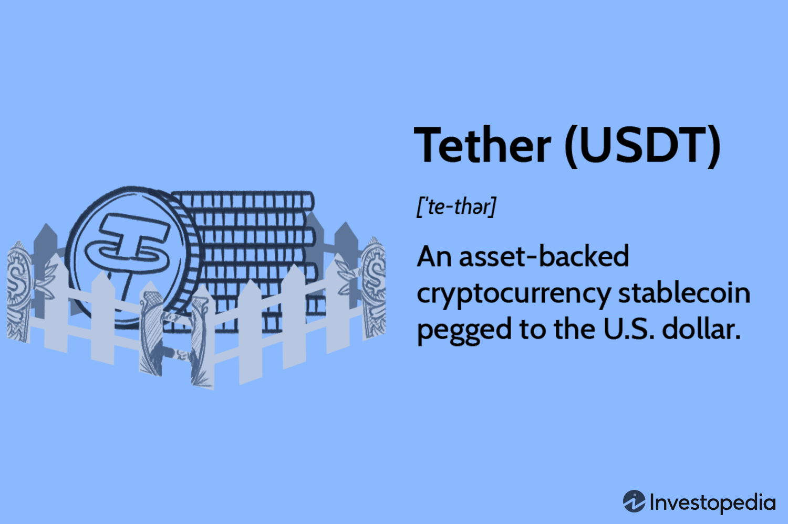

Cryptocurrencies have fundamentally transformed the financial landscape, offering a plethora of opportunities for both traders and investors. Among these digital currencies, USDT Tether stands out as a preeminent stablecoin, bridging the gap between the volatile nature of cryptocurrencies and the stability of traditional fiat currencies. Tether’s USDT is pegged to the U.S. dollar, essentially providing a digital proxy for the standard currency and ensuring price stability which is a critical feature for financial transactions. 

Simultaneously, algorithmic trading has surged in popularity, capitalizing on technological advancements to automate and refine trading strategies. This approach allows for execution that is not only rapid and precise but also free from the emotional biases that can affect human traders. By leveraging algorithms to process vast amounts of data, traders can make informed decisions quickly, optimizing their investments. This technological evolution presents new dynamics for traders aiming to maximize profitability.



This article embarks on an exploration of the intersection between USDT Tether and algorithmic trading, showcasing their growing significance in the digital economy. The fusion of a stable cryptocurrency with advanced algorithmic techniques offers unique benefits, particularly in reducing the risks associated with volatility and in enhancing strategic trade execution. Through this convergence, investors can effectively utilize USDT Tether in their algorithmic trading activities to advance their investment portfolios and accomplish their financial objectives.

## Table of Contents

## Understanding USDT Tether

USDT Tether is a pioneering stablecoin that plays a crucial role in the cryptocurrency ecosystem by providing a stable asset pegged to the U.S. dollar. Introduced by Tether, a prominent company in the blockchain sphere, USDT aims to deliver the price stability traditionally found in fiat currencies while preserving the advantages of cryptocurrencies such as decentralization and security. 

### Stability and Pegging Mechanism

USDT's primary feature is its stability, achieved by pegging its value to the U.S. dollar on a 1:1 basis. This means that one USDT is equivalent to one U.S. dollar, making it an attractive choice for traders seeking to mitigate volatility inherent in many other cryptocurrencies. The pegging mechanism involves holding reserves of assets equivalent to the amount of USDT in circulation, ensuring that each token is backed and redeemable for fiat currency.

### Utility in Financial Transactions

USDT enhances financial transactions by facilitating seamless transfers between cryptocurrencies and fiat currencies. This ability to bridge different types of currency reduces the [volatility](/wiki/volatility-trading-strategies) typically associated with digital assets and streamlines the conversion process, thereby enhancing [liquidity](/wiki/liquidity-risk-premium) in the market. Its utility is particularly notable in the trading environment, where swift and stable transactions are often critical.

### Transparency and Reserves

A notable advantage of USDT is the transparency that Tether promotes by regularly updating its reserve holdings. Tether asserts that all USDT tokens are fully backed by equivalent assets, which may include cash and cash equivalents, thereby bolstering confidence among users. These updates aim to provide assurance to the community about the security and legitimacy of USDT, countering concerns about the collateralization of stablecoins.

### Market Position

USDT stands as the world's largest stablecoin by market capitalization, a testament to its widespread adoption and trust within the [cryptocurrency](/wiki/cryptocurrency) market. Its dominance is reflected in its extensive use across a wide array of platforms and exchanges worldwide, reinforcing its role as a cornerstone in digital finance.

In summary, USDT Tether effectively combines the stability of the U.S. dollar with the innovative features of blockchain technology. Through its stable value, seamless transactional capabilities, transparency, and significant market presence, USDT establishes itself as an integral component of the cryptocurrency trading ecosystem.

 to Algorithmic Trading

Algorithmic trading, often referred to as algo trading, leverages preprogrammed software to execute trading strategies based on clearly defined criteria. This method is distinguished by several advantages, including remarkable speed, precision, and the capacity to process extensive datasets and conduct high-frequency trades. Such features are crucial in today's fast-paced financial markets, where milliseconds can make a significant difference in profitability.

Speed and accuracy are two of the most significant benefits of [algorithmic trading](/wiki/algorithmic-trading). Algorithms can perform trades much faster than human traders, and their precise execution minimizes the risks associated with human error. This capability is particularly essential in high-frequency trading ([HFT](/wiki/high-frequency-trading-strategies)), where algorithms execute numerous trades within fractions of a second to capitalize on small price discrepancies.

Algorithmic trading also reduces emotional biases, which often lead to suboptimal decision-making. Emotional responses to market fluctuations can result in impulsive trading actions that might not align with a trader’s long-term strategies. By automating the trading process, traders can ensure that decisions are made based on data-driven analyses and predefined strategies, not on emotional reactions.

The integration of sophisticated algorithms and [artificial intelligence](/wiki/ai-artificial-intelligence) has further advanced the field of algorithmic trading. Machine learning, a subset of AI, enables algorithms to learn from historical data and adapt to changing market conditions. This adaptability allows for the development of more complex and refined trading strategies that can potentially result in higher profitability.

Key principles of algorithmic trading include data analysis, strategy formulation, and risk management. Data analysis involves collecting and processing large volumes of historical and real-time market data. Traders utilize technical indicators, statistical models, and other analytic tools to identify opportunities and develop strategies. Once these strategies are formulated, they are coded into algorithms, which then monitor market conditions and execute trades when specific criteria are met. 

Risk management is another critical component of algorithmic trading systems. Effective risk management strategies, such as stop-loss orders and position sizing, are embedded into algorithms to control potential losses and manage exposure. These mechanisms help protect traders from adverse market movements and improve long-term profitability.

A basic setup for algorithmic trading could involve the following Python code snippet to develop a simple moving average crossover strategy:

```python
import pandas as pd
import numpy as np

def simple_moving_average(data, period):
    return data.rolling(window=period).mean()

def generate_signals(data, short_period, long_period):
    signals = pd.DataFrame(index=data.index)
    signals['price'] = data['close']
    signals['short_mavg'] = simple_moving_average(data['close'], short_period)
    signals['long_mavg'] = simple_moving_average(data['close'], long_period)
    signals['signal'] = 0.0
    signals['signal'][short_period:] = np.where(signals['short_mavg'][short_period:] > signals['long_mavg'][short_period:], 1.0, 0.0)
    signals['positions'] = signals['signal'].diff()
    return signals

# Example usage with historical price data in a pandas DataFrame named 'price_data'
short_window = 40
long_window = 100
signals = generate_signals(price_data, short_window, long_window)
```

This simple example demonstrates the basic framework of algorithmic trading where trades are executed automatically based on the relationship between moving averages of different periods.

Understanding these key principles and components sets a strong foundation for integrating algorithmic trading with USDT Tether, leveraging its stability and liquidity to refine and improve trading outcomes.

## Why Use USDT Tether in Algo Trading?

USDT Tether, with its stable value pegged to the U.S. dollar, provides a reliable asset base in algorithmic trading, significantly mitigating risks associated with the volatility of other cryptocurrencies. This stability is critical for algorithmic traders who rely on precise predictions and analyses to make informed trading decisions. By anchoring against a stable asset like USDT, traders can avoid unexpected slippage and improve the accuracy of algorithm [backtesting](/wiki/backtesting), which is crucial for developing robust and profitable strategies.

The liquidity and convertibility of USDT enhance the operational efficiency of algorithmic trading. Given USDT's widespread acceptance and substantial market capitalization, traders can execute high-frequency trades without concerns about insufficient liquidity. This is particularly advantageous in scenarios requiring rapid trade execution to capitalize on fleeting market opportunities. For instance, an algorithm can quickly shift USDT into desired cryptocurrency positions or back to USDT based on predefined market signals, owing to its liquid nature.

Utilizing USDT also affords algorithmic trading systems greater reliability. The consistent value of USDT serves as a peg, facilitating the development of algorithms that require stable input values. These stable input values reduce the noise in data analysis and enable traders to focus on strategy logic without compensating for erratic price shifts. Consequently, automated systems leveraging USDT can achieve higher confidence in their profitability forecasts and more effective execution.

Case studies illustrate the successful integration of USDT in algorithmic trading environments. For example, trading bots have incorporated USDT to maintain portfolio balance during volatile market conditions, effectively hedging against cryptocurrency price drops while still allowing participation in upward trends. Additionally, USDT's stability enables accurate scenario simulations, allowing traders to thoroughly test algorithms under various market conditions, ensuring adaptability and resilience in live trading situations.

Algorithmic trading with USDT facilitates a more structured and disciplined approach, providing a hedge against volatility while ensuring efficiency and effectiveness. As algorithmic trading continues to evolve, the stablecoin's role in these systems is expected to grow, offering strategic advantages to traders aiming to maximize returns while minimizing exposure to crypto market fluctuations.

## Developing an Effective Algo Trading Strategy with USDT

To develop an effective algorithmic trading strategy with USDT, it is essential to start by clearly defining your trading goals and setting parameters that reflect your risk tolerance and the prevailing market conditions. This foundational step ensures that your strategy aligns with your broader financial objectives and helps in maintaining discipline during execution.

Incorporating real-time data feeds and robust technical analysis tools is crucial for optimizing trade execution in USDT-based strategies. These tools allow traders to analyze price movements, identify trends, and make informed decisions promptly, enhancing the strategy's responsiveness to market changes. Modern trading platforms often provide APIs that can be integrated into trading systems to access live market data, which is vital for the accurate and timely execution of trades.

Backtesting algorithms using historical USDT pricing data is a critical step in evaluating the robustness and profitability of a trading strategy. By simulating the algorithm against past market conditions, traders can identify potential weaknesses and refine their strategies before deploying them in live markets. Tools such as Python's `pandas` library can be utilized to retrieve and manipulate historical data, while `[backtrader](/wiki/backtrader)` or similar libraries can facilitate the backtesting process.

```python
import pandas as pd
import backtrader as bt

# Load historical USDT data
data = pd.read_csv('usdt_historical_data.csv', parse_dates=True, index_col='date')

# Define a simple moving average crossover strategy
class SmaCross(bt.SignalStrategy):
    def __init__(self):
        sma1 = bt.ind.SMA(period=10)  # Short-term moving average
        sma2 = bt.ind.SMA(period=30)  # Long-term moving average
        self.signal_add(bt.SIGNAL_LONG, sma1 > sma2)

# Instantiate Cerebro engine
cerebro = bt.Cerebro()
cerebro.addstrategy(SmaCross)

# Feed data
data_feed = bt.feeds.PandasData(dataname=data)
cerebro.adddata(data_feed)

# Run backtest
cerebro.run()
cerebro.plot()
```

Implementing risk management and stop-loss frameworks is essential to safeguard investments and exploit market opportunities effectively. By setting predefined [exit](/wiki/exit-strategy) points, traders can limit potential losses and capture gains, even in volatile market conditions. This approach mitigates emotional decision-making, ensuring that trades are executed based on strategic considerations rather than reactions to market fluctuations.

Staying updated with regulatory changes and market trends is crucial, as these factors can significantly impact USDT usage and trading dynamics. Regulatory developments can influence market sentiment and liquidity, necessitating adjustments to trading strategies. By following updates from reliable financial news sources and regulatory bodies, traders can anticipate changes and adapt their strategies accordingly.

In conclusion, a methodical approach involving goal setting, technical integration, rigorous backtesting, and stringent risk management is indispensable for developing a resilient algorithmic trading strategy with USDT. Maintaining a keen awareness of the regulatory landscape and market trends further enhances the adaptability and effectiveness of such strategies in dynamic trading environments.

## Challenges and Considerations

USDT Tether, while providing stability as a leading stablecoin, poses distinct challenges and considerations for algorithmic traders. One primary concern involves regulatory scrutiny. Given the evolving regulations around cryptocurrencies globally, traders must remain informed about legal frameworks that may affect their operations. Changes in regulatory landscapes can have significant implications for both the availability and the perceived security of USDT, impacting market confidence and trading strategies.

Moreover, liquidity risks are inherent in trading with USDT. While USDT generally offers high liquidity, certain market conditions can lead to reduced accessibility or increased transaction costs. Traders must continuously assess the liquidity conditions of USDT across various exchanges to ensure effective strategy implementation. The dynamic and high-speed nature of algorithmic trading further necessitates continuous monitoring and adjustment of strategies. As algorithmic systems execute trades based on predefined conditions, the volatility in cryptocurrency markets requires adaptability to maintain performance and prevent automated errors.

Market news and economic events significantly influence USDT's utility in trading. Sudden developments, such as announcements from Tether or changes in economic indicators, can impact USDT's value and liquidity. Traders incorporating USDT in their algorithms must be equipped to swiftly analyze and integrate such information to mitigate risks.

Technical complexities present another consideration. Building robust algorithmic trading systems necessitates understanding advanced programming and securities protocols. Maintaining secure and resilient systems is vital to counteract potential breaches that could compromise trading operations. The importance of rigorous testing and risk management measures cannot be understated in ensuring systems function as intended under various conditions.

Lastly, considering alternative stablecoins and digital assets is invaluable for diversification and risk management. Cryptocurrencies like USD Coin (USDC) and Binance USD (BUSD) offer additional avenues for algorithmic traders to explore. Diversifying across different digital assets can mitigate the risks associated with relying solely on USDT and provide traders with strategic flexibility as market conditions evolve. This diversification strategy could be instrumental in enhancing overall portfolio resilience against market volatility and regulatory changes.

## Conclusion

USDT Tether has established itself as a stable and reliable asset for algorithmic trading, significantly enhancing the strategic execution capabilities available to traders. By integrating USDT into algorithmic trading systems, traders can effectively balance the pursuit of growth opportunities with the mitigation of volatility risks inherent in the cryptocurrency market. The inherent stability of USDT, pegged to the U.S. dollar, provides a consistent value reference that is crucial for precise algorithmic decision-making and strategy backtesting.

The effectiveness of USDT in algorithmic trading stems not only from its stable nature but also from leveraging insights from stablecoin market dynamics and continued advancements in algorithmic trading technologies. These advancements enable traders to optimize trade performance through better data analysis, execution speeds, and risk management practices. The ability to utilize complex algorithms and [machine learning](/wiki/machine-learning) models offers a competitive edge, enhancing both strategic execution and profitability.

As the cryptocurrency and financial technology landscapes evolve at a rapid pace, continual learning and adaptation become essential. Staying informed about regulatory changes, technological developments, and market trends directly influences the success of trading strategies. The ongoing development of innovative trading strategies employing USDT Tether and sophisticated algorithmic technologies is crucial for maintaining a competitive position in the digital assets market.

Embracing such strategies not only fosters enhanced trade performance but also ensures that traders can remain ahead in the ever-evolving digital asset landscape. USDT Tether, combined with algorithmic technologies, provides a platform for executing effective and efficient trades, paving the way for future advancements in cryptocurrency trading.

## References & Further Reading

[1]: Bergstra, J., Bardenet, R., Bengio, Y., & Kégl, B. (2011). ["Algorithms for Hyper-Parameter Optimization."](https://papers.nips.cc/paper/4443-algorithms-for-hyper-parameter-optimization) Advances in Neural Information Processing Systems 24.

[2]: ["Advances in Financial Machine Learning"](https://www.amazon.com/Advances-Financial-Machine-Learning-Marcos/dp/1119482089) by Marcos Lopez de Prado

[3]: ["Evidence-Based Technical Analysis: Applying the Scientific Method and Statistical Inference to Trading Signals"](https://www.amazon.com/Evidence-Based-Technical-Analysis-Scientific-Statistical/dp/0470008741) by David Aronson

[4]: ["Machine Learning for Algorithmic Trading"](https://github.com/stefan-jansen/machine-learning-for-trading) by Stefan Jansen

[5]: ["Quantitative Trading: How to Build Your Own Algorithmic Trading Business"](https://www.amazon.com/Quantitative-Trading-Build-Algorithmic-Business/dp/1119800064) by Ernest P. Chan