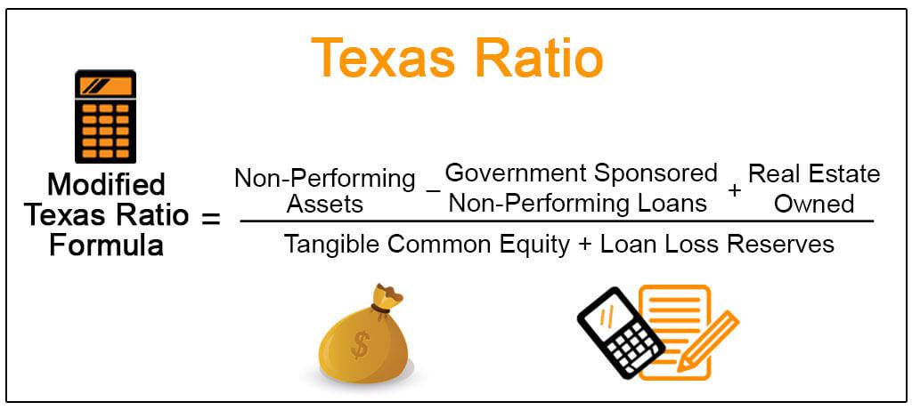

The Texas Ratio is an essential metric for evaluating the financial health of banks, primarily by assessing the risk inherent in their loan portfolios. Developed in the 1980s to address the banking crises in Texas, this ratio has proven instrumental in predicting bank failures, hence its enduring relevance. By focusing on the proportion of non-performing assets relative to a bank's tangible common equity and loan loss reserves, the Texas Ratio provides a clear indication of potential solvency issues. It acts as a critical indicator for investors and regulators aiming to gauge a bank's financial stability. As this article will explore, understanding how to calculate and interpret the Texas Ratio is crucial. Furthermore, its implications extend beyond basic financial analysis, being utilized in algorithmic trading for assessing risk levels in banking stocks. Additionally, by comparing the Texas Ratio to other liquidity metrics, stakeholders can obtain a comprehensive evaluation of a bank's capacity to manage financial disruptions effectively. Consequently, a solid grasp of the Texas Ratio empowers investors and regulators to better navigate the financial landscape, assessing risks and identifying early signs of distress in banking institutions.

## Table of Contents



## Understanding the Texas Ratio

The Texas Ratio is a financial metric used to evaluate the risk associated with a bank's loan portfolios by calculating the proportion of non-performing assets relative to the bank’s financial buffer. It is defined as:

$$

\text{Texas Ratio} = \frac{\text{Non-Performing Assets (NPA)}}{\text{Tangible Common Equity (TCE)} + \text{Loan Loss Reserves (LLR)}} 
$$

**Non-Performing Assets (NPA):** These are loans or assets on which the borrower is not making interest payments or repaying any principal. Non-performing assets pose a high risk of loss for the bank as they do not generate expected cash flows.

**Tangible Common Equity (TCE):** This component includes the bank's core capital, which primarily consists of common stock and retained earnings, excluding intangible assets like goodwill. TCE acts as a financial cushion to absorb potential losses.

**Loan Loss Reserves (LLR):** These reserves are the funds set aside by the bank to cover potential loan losses. LLR represents the bank's readiness to counteract the risk associated with problematic loans.

A high Texas Ratio indicates a concerning scenario where a bank has a substantial amount of non-performing assets relative to the tangible resources it can deploy to manage these assets. Specifically, when the ratio exceeds 100%, it implies that non-performing assets surpass the bank's ability to absorb potential losses, signaling heightened risk of solvency issues. Such a condition suggests that the bank may struggle to maintain its operations without external intervention or recapitalization.

During periods of economic stress, the Texas Ratio serves as a critical indicator of a bank's credit risk. Institutions with elevated Texas Ratios may require close monitoring as they are more vulnerable to financial instability. By focusing on the ratio's components, regulators, investors, and analysts can better understand a bank's risk profile and ability to withstand economic shocks. The Texas Ratio emphasizes the importance of sound loan management and maintaining a robust equity base to safeguard against potential default scenarios.

## The Role of the Texas Ratio in Banking Analysis

The Texas Ratio plays a pivotal role in banking analysis by serving as an early warning tool for potential financial distress within banks. Developed to evaluate the health of banks' loan portfolios, the Texas Ratio calculates the proportion of non-performing assets (NPAs) relative to the resources available to absorb potential losses, namely tangible common equity and loan loss reserves. The formula for the Texas Ratio is:

$$
\text{Texas Ratio} = \frac{\text{Non-Performing Assets}}{\text{Tangible Common Equity} + \text{Loan Loss Reserves}}
$$

A high Texas Ratio suggests that a bank may struggle to cover its obligations, as its NPAs exceed the protective buffer formed by its equity and reserves. This provides a crucial insight into the credit risk and potential solvency issues of a financial institution, especially during periods of economic uncertainty.

By incorporating the Texas Ratio alongside other financial metrics, stakeholders can obtain a comprehensive understanding of a bank's risk management strategies. This holistic approach allows for a more accurate assessment of a bank’s ability to withstand economic challenges and maintain financial stability. For instance, when combined with metrics such as the capital adequacy ratio or return on assets, the Texas Ratio can reveal potential discrepancies in how a bank manages its risk exposure.

For investors, the Texas Ratio is a valuable tool for making informed decisions regarding bank stocks. By assessing the ratio, investors can weigh the potential risks against the expected rewards. A bank with a high Texas Ratio may indicate heightened risk, deterring investment unless the potential return justifies the risk. Conversely, a low Texas Ratio may signify a more stable investment opportunity with lower associated risk.

Overall, the Texas Ratio enables banking analysts and investors to gauge the financial health of banks efficiently, facilitating better decision-making and proactive risk management. Its integration into banking analysis underscores its significance as a straightforward yet powerful indicator of a bank's financial stability.

## Algorithmic Trading and Financial Analysis

Algorithmic traders integrate the Texas Ratio into quantitative models to assess the risk levels of banking stocks effectively. The Texas Ratio is calculated as:

$$
\text{Texas Ratio} = \frac{\text{Non-performing Assets}}{\text{Tangible Common Equity} + \text{Loan Loss Reserves}}
$$

Given its simplicity, the Texas Ratio can be seamlessly included in automated trading algorithms designed to exploit market inefficiencies. By evaluating banks' non-performing assets relative to their capital reserves, traders can gauge the risk associated with each financial institution. This analysis enables them to make informed decisions regarding the buying or selling of banking stocks.

Incorporating the Texas Ratio within an [algorithmic trading](/wiki/algorithmic-trading) framework involves creating a model that continuously monitors and updates the ratio as new financial data becomes available. Here's a basic example in Python:

```python
def calculate_texas_ratio(non_performing_assets, tangible_common_equity, loan_loss_reserves):
    return non_performing_assets / (tangible_common_equity + loan_loss_reserves)

# Example data
non_performing_assets = 1000000  # In dollars
tangible_common_equity = 500000  # In dollars
loan_loss_reserves = 300000  # In dollars

# Calculate Texas Ratio
texas_ratio = calculate_texas_ratio(non_performing_assets, tangible_common_equity, loan_loss_reserves)

print(f'The Texas Ratio is: {texas_ratio:.2f}')
```

Algorithmic traders use the Texas Ratio as a key input, frequently alongside other financial ratios, to predict potential financial distress in banks. This can give them a competitive advantage in the financial markets by identifying banks that may be undervalued or overvalued based on their risk profile.

Moreover, in high-frequency trading environments where decisions are made within milliseconds, the Texas Ratio's straightforward calculation ensures it does not overly burden computational resources. Its integration into trading algorithms allows traders to swiftly adjust their portfolios in response to evolving financial situations, enhancing their capability to capitalize on emerging opportunities and mitigate risks efficiently. This strategic use of the Texas Ratio underscores its importance in modern financial analysis and algorithmic trading strategies.

## Comparing the Texas Ratio with Other Liquidity Metrics

The Texas Ratio, while a crucial tool for evaluating the risk level associated with a bank's loan portfolio, should not be used in isolation. To thoroughly evaluate a bank's financial health and ability to endure economic disturbances, it is essential to compare it with other [liquidity](/wiki/liquidity-risk-premium) metrics such as the Liquidity Coverage Ratio (LCR) and the Net Stable Funding Ratio (NSFR).

The Liquidity Coverage Ratio is designed to ensure that a financial institution maintains an adequate level of high-quality liquid assets that can be converted into cash to meet its liquidity needs over a 30-day stress period. The formula for calculating the LCR is:

$$
\text{LCR} = \frac{\text{High-Quality Liquid Assets}}{\text{Total Net Cash Outflows over 30 days}}
$$

A higher LCR indicates that a bank is better equipped to handle short-term liquidity demands, thereby providing a measure of resilience against financial disruptions.

The Net Stable Funding Ratio, introduced as part of the Basel III reforms, aims to promote a more stable funding structure by requiring banks to maintain a stable funding profile relative to the composition of their assets and off-balance sheet activities. The NSFR is calculated as follows:

$$
\text{NSFR} = \frac{\text{Available Stable Funding (ASF)}}{\text{Required Stable Funding (RSF)}}
$$

An NSFR of 100% or higher suggests that an institution has a stable funding base to support its operations over the long term, thereby mitigating the risks of liquidity mismatch.

By juxtaposing the Texas Ratio with these liquidity metrics, investors and regulators gain insights into the adequacy of a bank's asset management and funding strategies. The Texas Ratio helps highlight potential solvency issues due to non-performing loans, while LCR and NSFR demonstrate the institution's liquidity position over varying time horizons. Together, these metrics provide a more comprehensive view of a bank's capacity to withstand economic stress and maintain operational stability. 

To conclude, incorporating these metrics into financial analysis provides stakeholders with a multifaceted perspective on a bank's robustness, enhancing the assessment and management of financial risks.

## Case Studies and Practical Applications

The Texas Ratio has proven to be a reliable indicator for assessing the financial stability of banks, particularly in times of financial distress. Historical examples illustrate its efficacy in predicting bank failures, providing insights into its practical application. 

One notable case study is the fall of Washington Mutual, which was the largest bank failure in U.S. history at the time of its collapse in 2008. Washington Mutual had a staggering Texas Ratio, indicating a severe imbalance between its non-performing assets and its available capital. This high ratio was a warning signal of the underlying risk and potential insolvency issues, which eventually led to the bank's downfall. The financial institution's rapid expansion and aggressive mortgage lending practices contributed significantly to its accumulation of non-performing assets. Consequently, when borrowers defaulted during the subprime mortgage crisis, Washington Mutual was left with insufficient resources to cover its liabilities, resulting in its failure.

The Texas Ratio's formula, given by:

$$
\text{Texas Ratio} = \frac{\text{Non-Performing Assets}}{\text{Tangible Common Equity} + \text{Loan Loss Reserves}}
$$

highlights its focus on a bank’s ability to cover non-performing loans with available capital and reserves. For Washington Mutual, the numerator, representing non-performing assets, dramatically increased as a result of defaulting mortgages, while the denominator was not sufficiently robust to absorb these losses.

In another example, during the savings and loan crisis of the 1980s, numerous banks in Texas exhibited high Texas Ratios, foreshadowing their impending financial distress. The economic downturn and collapse of the real estate market significantly impacted these banks' assets, ultimately leading to their failures. Financial analysts utilized the Texas Ratio to identify early warning signs of instability, underscoring its utility in real-world banking crises.

These case studies demonstrate that the Texas Ratio serves as a crucial tool for both regulators and investors in evaluating the health of banking institutions. By highlighting potential risk exposures and solvency issues, the metric aids in the proactive management of financial risks, fostering a more stable banking environment.

## Improving Bank Liquidity Using the Texas Ratio

Banks can significantly improve their Texas Ratio by implementing strategies aimed at enhancing liquidity and stability. An important approach is diversifying loan portfolios. This involves allocating resources across a broad spectrum of asset classes and industries. By doing so, banks can reduce the likelihood that a downturn in a specific sector will lead to a substantial increase in non-performing assets, thereby optimizing their Texas Ratio.

Another crucial measure is enhancing underwriting standards. Strengthening the criteria for evaluating borrowers can reduce the default rate on loans. Improved credit assessments, rigorous verification processes, and a thorough analysis of borrowers' financial health can lower the incidence of non-performing loans, directly impacting the Texas Ratio positively. Banks can adopt advanced risk assessment tools to make more informed lending decisions, minimizing the risk of extending credit to potentially defaulting clients.

Managing non-performing assets effectively is also vital. Banks can explore methods such as restructuring troubled loans, selling non-performing assets to third parties, or writing off bad loans. Loan restructuring can provide borrowers with more manageable repayment terms, which could avert defaults and convert non-performing assets into performing ones. Alternatively, selling these assets shifts the credit risk to purchasers willing to take on higher-risk investments, effectively improving the bank's balance sheet.

In addition to these measures, banks might leverage technology and data analytics to monitor asset performance and quickly identify loans that might become problematic. Real-time data analysis and predictive modeling can enable banks to proactively manage their asset portfolios, ensuring optimal performance and thereby maintaining a healthier Texas Ratio.

These strategies collectively aim to fortify a bank’s financial foundation, reflecting positively on their ability to maintain adequate liquidity and withstand financial pressures. By focusing on diversification, stringent underwriting, and proactive asset management, banks can achieve a more favorable Texas Ratio, indicating a stable and resilient financial position.

## Limitations and Future of the Texas Ratio

The Texas Ratio, while valuable, is not without its limitations. One primary concern is its reliance on the accuracy of reported financial data. Banks' non-performing assets and tangible common equity figures must be precisely reported to ensure the Texas Ratio is an effective measure. Inaccuracies or intentional misreporting, whether due to oversight or deliberate actions to improve financial presentation, can skew the Texas Ratio, thereby undermining its reliability.

Furthermore, the Texas Ratio is inherently backward-looking, focusing on the current and historical state of a bank's loan portfolio and capital reserves. It does not account for a bank's potential future earnings or changes in market conditions, which might influence its financial health positively or negatively. This limitation means that while the Texas Ratio can signal current stress or stability, it cannot predict future performance or resilience. 

Looking ahead, the landscape of financial analysis is evolving with the integration of advanced technologies. Machine learning and real-time data analytics present promising opportunities to enhance traditional metrics like the Texas Ratio. Machine learning algorithms can analyze vast datasets and detect patterns not apparent to human analysts, potentially identifying indicators of financial distress or stability that the Texas Ratio alone might miss. For example, algorithms can process real-time market data and adjust risk assessments dynamically, offering a more nuanced view of financial health.

Python code, leveraging [machine learning](/wiki/machine-learning) libraries such as scikit-learn, can be employed to analyze a bank's financial data more comprehensively. Here's a simple example:

```python
import pandas as pd
from sklearn.model_selection import train_test_split
from sklearn.ensemble import RandomForestRegressor

# Assuming df is a DataFrame containing bank financial data
data = df.drop(['future_performance_metric'], axis=1)
target = df['future_performance_metric']

# Split data into training and test sets
X_train, X_test, y_train, y_test = train_test_split(data, target, test_size=0.2, random_state=42)

# Create a RandomForest model
model = RandomForestRegressor(n_estimators=100, random_state=42)

# Train the model
model.fit(X_train, y_train)

# Predict future performance
predictions = model.predict(X_test)

# Evaluate model accuracy
accuracy = model.score(X_test, y_test)
```

Incorporating such advanced techniques can offer a multi-faceted analysis, where the Texas Ratio is one of several tools used to assess bank stability. By integrating quantitative measures with predictive analytics, financial analysts can develop a more dynamic understanding of risk, navigating complex economic environments with greater accuracy.

## Conclusion

The Texas Ratio remains an essential metric in the financial analysis of banks, especially for identifying early signs of credit risk. It provides a quantitative measure of a bank's exposure to non-performing assets relative to its available capital cushion. By presenting a clear indicator of potential solvency issues, the Texas Ratio enables stakeholders to make informed decisions regarding the stability and risk profile of banking institutions.

Understanding the underlying components of the Texas Ratio—non-performing assets, tangible common equity, and loan loss reserves—offers valuable insights into a bank's risk management practices. High Texas Ratios usually suggest that a bank's non-performing loans outweigh its ability to cover them with existing capital, signaling a need for further scrutiny and potential intervention.

As a tool, the Texas Ratio supports investors, regulators, and analysts in navigating the intricate financial landscape by providing a straightforward means to assess and compare the financial health of different banks. Its application has proven effective in past financial crises as a predictor of banking failures, underscoring its continued relevance in modern financial analysis.

While the Texas Ratio is a powerful tool, it should be used in conjunction with other financial metrics and analyses to offer a comprehensive view of a bank's financial condition. As technologies evolve, incorporating real-time data and advanced analytics will likely enhance traditional metrics like the Texas Ratio for even greater precision in financial assessments.

## References & Further Reading

[1]: Clarke, R., & Jennings, W. W. (2008). ["The Texas Ratio and Bank Risk."](https://onlinelibrary.wiley.com/doi/abs/10.1002/ace.306) The Journal of Portfolio Management, 34(3), 105-112.

[2]: Barr, R. S., Seiford, L. M., & Siems, T. F. (1994). ["Forecasting Bank Failure: A Non-parametric Frontier Estimation Approach."](https://s2.smu.edu/~barr/pubs/bss-core.pdf) Research in International Business and Finance, 11(2), 139-157.

[3]: Lopez de Prado, M. (2018). ["Advances in Financial Machine Learning."](https://www.amazon.com/Advances-Financial-Machine-Learning-Marcos/dp/1119482089) Wiley.

[4]: Federal Deposit Insurance Corporation (FDIC). ["Statistics at a Glance: Deposit Insurance."](https://www.fdic.gov/analysis/bank-data-statistics) Accessed October 2023.

[5]: Jansen, S. (2020). ["Machine Learning for Algorithmic Trading: Second Edition."](https://www.amazon.com/Machine-Learning-Algorithmic-Trading-alternative/dp/1839217715) Packt Publishing.