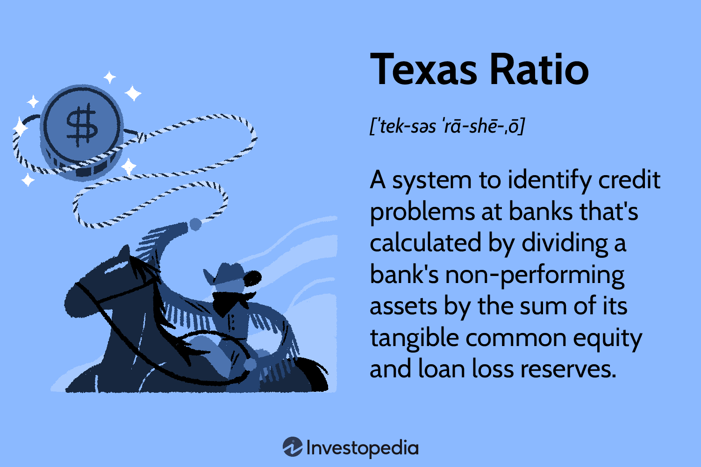

## Table of Contents

## What is the Texas Ratio?

The Texas Ratio is a financial measure used to assess the health of banks and credit unions. It compares the amount of a bank's non-performing assets (like loans that are not being repaid) to its tangible common equity and loan loss reserves. If the ratio is high, it means the bank might be in trouble because it has a lot of bad loans compared to the money it has set aside to cover losses.

The Texas Ratio was first used during the 1980s when many banks in Texas were failing. A ratio over 100% is often seen as a warning sign that a bank could fail. However, it's not a perfect measure. Some banks with high Texas Ratios survive, while others with lower ratios can still fail. It's just one tool among many that people use to check how safe their bank is.

## Who developed the Texas Ratio and why?

The Texas Ratio was developed by a man named Gerard Cassidy. He worked at a company called RBC Capital Markets. Gerard came up with this idea in the 1980s when many banks in Texas were having big problems. He wanted to find a simple way to see which banks were in danger of failing. So, he created the Texas Ratio to help people understand if a bank was in trouble by looking at its bad loans and the money it had to cover those losses.

The reason Gerard focused on Texas was because the state was going through a tough time with its economy. Oil prices had dropped a lot, and this hurt many banks that had made loans to oil companies. These loans were not being paid back, and the banks were struggling. By using the Texas Ratio, Gerard and others could quickly see which banks were at risk of failing because they had too many bad loans compared to the money they had set aside. This helped people make better decisions about where to keep their money.

## How is the Texas Ratio calculated?

The Texas Ratio is calculated by dividing a bank's non-performing assets by the sum of its tangible common equity and loan loss reserves. Non-performing assets are things like loans that people aren't paying back. Tangible common equity is the money the bank has that belongs to its owners, not counting any special types of stock. Loan loss reserves are money the bank sets aside to cover loans that might not get paid back.

To find the Texas Ratio, you add up all the non-performing assets. Then, you add the tangible common equity and the loan loss reserves together. After that, you divide the total non-performing assets by the total of tangible common equity and loan loss reserves. If the result is over 100%, it might mean the bank is in trouble because it has a lot of bad loans compared to the money it has to cover those losses.

## What do the components of the Texas Ratio represent?

The Texas Ratio uses three main parts to check how healthy a bank is. Non-performing assets are the first part. These are things like loans that people or businesses aren't paying back. When a bank has a lot of these, it can be a sign of trouble because it means the bank isn't getting the money it expected.

The other two parts are tangible common equity and loan loss reserves. Tangible common equity is the money that belongs to the bank's owners, but it doesn't count any special types of stock. This money is important because it shows how much the bank can use to cover losses. Loan loss reserves are money the bank sets aside on purpose to cover loans that might not get paid back. By adding these two together, the bank has a cushion to protect itself from bad loans.

So, the Texas Ratio compares the bad loans (non-performing assets) to the money the bank has to cover them (tangible common equity plus loan loss reserves). If the ratio is high, it means the bank might be in danger because it has too many bad loans compared to its safety net.

## What is considered a 'healthy' Texas Ratio?

A 'healthy' Texas Ratio is usually one that is below 100%. This means the bank has more money set aside to cover bad loans than it has in bad loans. If the Texas Ratio is low, it shows that the bank is in good shape because it can handle the loans that people aren't paying back.

If the Texas Ratio goes over 100%, it can be a warning sign that the bank might be in trouble. However, the Texas Ratio is just one way to check a bank's health. A bank can still be safe even if its Texas Ratio is a bit high, and sometimes a bank with a low Texas Ratio can still have problems. It's always good to look at other things too, like how well the bank is making money and how it's doing compared to other banks.

## How can the Texas Ratio be used to assess the financial health of a bank?

The Texas Ratio helps people see if a bank is in good shape by comparing its bad loans to the money it has to cover those bad loans. Bad loans are ones that people or businesses aren't paying back. The money to cover these bad loans comes from the bank's own money and special funds set aside for this purpose. If the Texas Ratio is below 100%, it means the bank has enough money to handle its bad loans, which is a good sign. A low Texas Ratio shows that the bank is healthy and less likely to have big problems.

However, if the Texas Ratio goes above 100%, it might mean the bank is in trouble. This is because the bank has more bad loans than the money it has set aside to cover them. But the Texas Ratio is just one tool, and it's not perfect. Sometimes, a bank can still be okay even if its Texas Ratio is a bit high. It's important to look at other things too, like how much money the bank is making and how it's doing compared to other banks. Using the Texas Ratio along with other checks can give a better picture of a bank's health.

## What are the limitations of using the Texas Ratio?

The Texas Ratio is a helpful tool, but it has some limits. One big problem is that it only looks at bad loans and the money set aside to cover them. It doesn't tell you about other important things like how much money the bank is making or how well it's run. So, even if a bank has a high Texas Ratio, it might still be doing okay in other ways. Also, the Texas Ratio can be different for different types of banks. What's a bad number for one bank might not be so bad for another.

Another limit is that the Texas Ratio can be slow to show changes. If a bank starts having more bad loans, it might take a while for the Texas Ratio to show that. This means the ratio might not be the best for seeing problems right away. Plus, banks can change how they report their numbers, which can make the Texas Ratio less accurate. So, while the Texas Ratio can give you a quick idea about a bank's health, it's best to use it with other checks to get a full picture.

## How does the Texas Ratio compare to other financial health metrics?

The Texas Ratio is a simple tool that looks at a bank's bad loans compared to the money it has to cover those loans. It's easy to understand and gives a quick idea about a bank's health. But it's not the only way to check how a bank is doing. Other metrics, like the bank's profit, how much money it has in reserve, and how well it's run, can give a fuller picture. For example, a bank might have a high Texas Ratio but still be making a lot of money and have good management, which means it might not be in as much trouble as the Texas Ratio suggests.

Other financial health metrics include the Return on Assets (ROA), which shows how well a bank is using its money to make a profit, and the Capital Adequacy Ratio (CAR), which checks if a bank has enough money to cover its risks. These metrics look at different parts of a bank's health and can help balance out the limits of the Texas Ratio. For instance, a bank with a low Texas Ratio might still have problems if its ROA is low or its CAR is not meeting the required standards. So, while the Texas Ratio is useful, it's best used along with other metrics to get a complete view of a bank's financial health.

## Can the Texas Ratio predict bank failures accurately?

The Texas Ratio can help spot banks that might be in trouble, but it's not perfect at predicting bank failures. It looks at bad loans and the money a bank has to cover those loans. If the Texas Ratio is over 100%, it's a warning sign that the bank might fail. But even with this warning, some banks with high Texas Ratios don't fail, and some with low Texas Ratios do fail. So, while it can give a quick idea about a bank's health, it doesn't always get it right.

Other things can affect whether a bank fails, like how well it's run and how much money it's making. The Texas Ratio only looks at one part of the bank's health. To get a better idea, you need to use it with other checks, like looking at the bank's profit and how much money it has in reserve. By using the Texas Ratio along with these other measures, you can get a fuller picture of whether a bank might fail.

## How has the Texas Ratio been used historically during financial crises?

The Texas Ratio was first used during the 1980s when many banks in Texas were failing. Back then, the economy in Texas was struggling because oil prices had dropped a lot. Many banks had made loans to oil companies, and when those companies couldn't pay back the loans, the banks were in trouble. Gerard Cassidy, who worked at RBC Capital Markets, came up with the Texas Ratio to help figure out which banks were at risk of failing. By looking at the ratio, people could see if a bank had too many bad loans compared to the money it had set aside to cover those losses.

During the 2008 financial crisis, the Texas Ratio was used again to check the health of banks. This time, the problem was not just in Texas but all over the country. Many banks had given out loans for houses that people couldn't pay back. The Texas Ratio helped people see which banks were in the most danger because of these bad loans. While the ratio couldn't predict all bank failures, it was a useful tool that gave a quick warning about which banks might be in trouble.

## What adjustments might be necessary when applying the Texas Ratio to different types of financial institutions?

When using the Texas Ratio for different types of financial institutions, like banks and credit unions, you might need to make some changes. Banks and credit unions can have different ways of handling their money and loans. For example, a credit union might have more money set aside for bad loans because they have different rules about how much they need to save. So, when you use the Texas Ratio for a credit union, you might need to look at what the normal range is for them, not just what it is for banks.

Also, the size of the financial institution can make a difference. A small community bank might have a higher Texas Ratio than a big national bank, but that doesn't always mean it's in more trouble. Small banks might have fewer loans overall, so one bad loan can make their Texas Ratio look worse than it really is. When using the Texas Ratio, it's important to think about the type and size of the institution to get a fair idea of its health.

## Are there any case studies or examples where the Texas Ratio was pivotal in decision-making?

During the 1980s, the Texas Ratio was very important when many banks in Texas were failing. The state's economy was struggling because oil prices had dropped a lot. Banks had given out loans to oil companies, but when those companies couldn't pay back the loans, the banks were in trouble. Gerard Cassidy, who worked at RBC Capital Markets, created the Texas Ratio to help figure out which banks were at risk. By looking at the ratio, people could see if a bank had too many bad loans compared to the money it had set aside to cover those losses. This helped people decide whether to keep their money in those banks or move it to safer ones.

In the 2008 financial crisis, the Texas Ratio was used again to check the health of banks across the country. Many banks had given out loans for houses that people couldn't pay back. The Texas Ratio helped people see which banks were in the most danger because of these bad loans. For example, IndyMac Bank had a very high Texas Ratio, which showed it was in trouble. In 2008, IndyMac failed, and the Texas Ratio was one of the signs that helped people see it coming. While the Texas Ratio couldn't predict all bank failures, it was a useful tool that gave a quick warning about which banks might be in trouble.

## What is the Texas Ratio and how can it be understood?

The Texas Ratio is a financial metric used to evaluate the risk associated with a bank's loan portfolios by calculating the proportion of non-performing assets relative to the bank’s financial buffer. It is defined as:

$$

\text{Texas Ratio} = \frac{\text{Non-Performing Assets (NPA)}}{\text{Tangible Common Equity (TCE)} + \text{Loan Loss Reserves (LLR)}} 
$$

**Non-Performing Assets (NPA):** These are loans or assets on which the borrower is not making interest payments or repaying any principal. Non-performing assets pose a high risk of loss for the bank as they do not generate expected cash flows.

**Tangible Common Equity (TCE):** This component includes the bank's core capital, which primarily consists of common stock and retained earnings, excluding intangible assets like goodwill. TCE acts as a financial cushion to absorb potential losses.

**Loan Loss Reserves (LLR):** These reserves are the funds set aside by the bank to cover potential loan losses. LLR represents the bank's readiness to counteract the risk associated with problematic loans.

A high Texas Ratio indicates a concerning scenario where a bank has a substantial amount of non-performing assets relative to the tangible resources it can deploy to manage these assets. Specifically, when the ratio exceeds 100%, it implies that non-performing assets surpass the bank's ability to absorb potential losses, signaling heightened risk of solvency issues. Such a condition suggests that the bank may struggle to maintain its operations without external intervention or recapitalization.

During periods of economic stress, the Texas Ratio serves as a critical indicator of a bank's credit risk. Institutions with elevated Texas Ratios may require close monitoring as they are more vulnerable to financial instability. By focusing on the ratio's components, regulators, investors, and analysts can better understand a bank's risk profile and ability to withstand economic shocks. The Texas Ratio emphasizes the importance of sound loan management and maintaining a robust equity base to safeguard against potential default scenarios.

## What is the Role of the Texas Ratio in Banking Analysis?

The Texas Ratio plays a pivotal role in banking analysis by serving as an early warning tool for potential financial distress within banks. Developed to evaluate the health of banks' loan portfolios, the Texas Ratio calculates the proportion of non-performing assets (NPAs) relative to the resources available to absorb potential losses, namely tangible common equity and loan loss reserves. The formula for the Texas Ratio is:

$$
\text{Texas Ratio} = \frac{\text{Non-Performing Assets}}{\text{Tangible Common Equity} + \text{Loan Loss Reserves}}
$$

A high Texas Ratio suggests that a bank may struggle to cover its obligations, as its NPAs exceed the protective buffer formed by its equity and reserves. This provides a crucial insight into the credit risk and potential solvency issues of a financial institution, especially during periods of economic uncertainty.

By incorporating the Texas Ratio alongside other financial metrics, stakeholders can obtain a comprehensive understanding of a bank's risk management strategies. This holistic approach allows for a more accurate assessment of a bank’s ability to withstand economic challenges and maintain financial stability. For instance, when combined with metrics such as the capital adequacy ratio or return on assets, the Texas Ratio can reveal potential discrepancies in how a bank manages its risk exposure.

For investors, the Texas Ratio is a valuable tool for making informed decisions regarding bank stocks. By assessing the ratio, investors can weigh the potential risks against the expected rewards. A bank with a high Texas Ratio may indicate heightened risk, deterring investment unless the potential return justifies the risk. Conversely, a low Texas Ratio may signify a more stable investment opportunity with lower associated risk.

Overall, the Texas Ratio enables banking analysts and investors to gauge the financial health of banks efficiently, facilitating better decision-making and proactive risk management. Its integration into banking analysis underscores its significance as a straightforward yet powerful indicator of a bank's financial stability.

## What is Algorithmic Trading and Financial Analysis?

Algorithmic traders integrate the Texas Ratio into quantitative models to assess the risk levels of banking stocks effectively. The Texas Ratio is calculated as:

$$
\text{Texas Ratio} = \frac{\text{Non-performing Assets}}{\text{Tangible Common Equity} + \text{Loan Loss Reserves}}
$$

Given its simplicity, the Texas Ratio can be seamlessly included in automated trading algorithms designed to exploit market inefficiencies. By evaluating banks' non-performing assets relative to their capital reserves, traders can gauge the risk associated with each financial institution. This analysis enables them to make informed decisions regarding the buying or selling of banking stocks.

Incorporating the Texas Ratio within an [algorithmic trading](/wiki/algorithmic-trading) framework involves creating a model that continuously monitors and updates the ratio as new financial data becomes available. Here's a basic example in Python:

```python
def calculate_texas_ratio(non_performing_assets, tangible_common_equity, loan_loss_reserves):
    return non_performing_assets / (tangible_common_equity + loan_loss_reserves)

# Example data
non_performing_assets = 1000000  # In dollars
tangible_common_equity = 500000  # In dollars
loan_loss_reserves = 300000  # In dollars

# Calculate Texas Ratio
texas_ratio = calculate_texas_ratio(non_performing_assets, tangible_common_equity, loan_loss_reserves)

print(f'The Texas Ratio is: {texas_ratio:.2f}')
```

Algorithmic traders use the Texas Ratio as a key input, frequently alongside other financial ratios, to predict potential financial distress in banks. This can give them a competitive advantage in the financial markets by identifying banks that may be undervalued or overvalued based on their risk profile.

Moreover, in high-frequency trading environments where decisions are made within milliseconds, the Texas Ratio's straightforward calculation ensures it does not overly burden computational resources. Its integration into trading algorithms allows traders to swiftly adjust their portfolios in response to evolving financial situations, enhancing their capability to capitalize on emerging opportunities and mitigate risks efficiently. This strategic use of the Texas Ratio underscores its importance in modern financial analysis and algorithmic trading strategies.

## How does the Texas Ratio compare with other liquidity metrics?

The Texas Ratio, while a crucial tool for evaluating the risk level associated with a bank's loan portfolio, should not be used in isolation. To thoroughly evaluate a bank's financial health and ability to endure economic disturbances, it is essential to compare it with other [liquidity](/wiki/liquidity-risk-premium) metrics such as the Liquidity Coverage Ratio (LCR) and the Net Stable Funding Ratio (NSFR).

The Liquidity Coverage Ratio is designed to ensure that a financial institution maintains an adequate level of high-quality liquid assets that can be converted into cash to meet its liquidity needs over a 30-day stress period. The formula for calculating the LCR is:

$$
\text{LCR} = \frac{\text{High-Quality Liquid Assets}}{\text{Total Net Cash Outflows over 30 days}}
$$

A higher LCR indicates that a bank is better equipped to handle short-term liquidity demands, thereby providing a measure of resilience against financial disruptions.

The Net Stable Funding Ratio, introduced as part of the Basel III reforms, aims to promote a more stable funding structure by requiring banks to maintain a stable funding profile relative to the composition of their assets and off-balance sheet activities. The NSFR is calculated as follows:

$$
\text{NSFR} = \frac{\text{Available Stable Funding (ASF)}}{\text{Required Stable Funding (RSF)}}
$$

An NSFR of 100% or higher suggests that an institution has a stable funding base to support its operations over the long term, thereby mitigating the risks of liquidity mismatch.

By juxtaposing the Texas Ratio with these liquidity metrics, investors and regulators gain insights into the adequacy of a bank's asset management and funding strategies. The Texas Ratio helps highlight potential solvency issues due to non-performing loans, while LCR and NSFR demonstrate the institution's liquidity position over varying time horizons. Together, these metrics provide a more comprehensive view of a bank's capacity to withstand economic stress and maintain operational stability. 

To conclude, incorporating these metrics into financial analysis provides stakeholders with a multifaceted perspective on a bank's robustness, enhancing the assessment and management of financial risks.

## What are some case studies and practical applications?

The Texas Ratio has proven to be a reliable indicator for assessing the financial stability of banks, particularly in times of financial distress. Historical examples illustrate its efficacy in predicting bank failures, providing insights into its practical application. 

One notable case study is the fall of Washington Mutual, which was the largest bank failure in U.S. history at the time of its collapse in 2008. Washington Mutual had a staggering Texas Ratio, indicating a severe imbalance between its non-performing assets and its available capital. This high ratio was a warning signal of the underlying risk and potential insolvency issues, which eventually led to the bank's downfall. The financial institution's rapid expansion and aggressive mortgage lending practices contributed significantly to its accumulation of non-performing assets. Consequently, when borrowers defaulted during the subprime mortgage crisis, Washington Mutual was left with insufficient resources to cover its liabilities, resulting in its failure.

The Texas Ratio's formula, given by:

$$
\text{Texas Ratio} = \frac{\text{Non-Performing Assets}}{\text{Tangible Common Equity} + \text{Loan Loss Reserves}}
$$

highlights its focus on a bank’s ability to cover non-performing loans with available capital and reserves. For Washington Mutual, the numerator, representing non-performing assets, dramatically increased as a result of defaulting mortgages, while the denominator was not sufficiently robust to absorb these losses.

In another example, during the savings and loan crisis of the 1980s, numerous banks in Texas exhibited high Texas Ratios, foreshadowing their impending financial distress. The economic downturn and collapse of the real estate market significantly impacted these banks' assets, ultimately leading to their failures. Financial analysts utilized the Texas Ratio to identify early warning signs of instability, underscoring its utility in real-world banking crises.

These case studies demonstrate that the Texas Ratio serves as a crucial tool for both regulators and investors in evaluating the health of banking institutions. By highlighting potential risk exposures and solvency issues, the metric aids in the proactive management of financial risks, fostering a more stable banking environment.

## References & Further Reading

[1]: Clarke, R., & Jennings, W. W. (2008). ["The Texas Ratio and Bank Risk."](https://onlinelibrary.wiley.com/doi/abs/10.1002/ace.306) The Journal of Portfolio Management, 34(3), 105-112.

[2]: Barr, R. S., Seiford, L. M., & Siems, T. F. (1994). ["Forecasting Bank Failure: A Non-parametric Frontier Estimation Approach."](https://s2.smu.edu/~barr/pubs/bss-core.pdf) Research in International Business and Finance, 11(2), 139-157.

[3]: Lopez de Prado, M. (2018). ["Advances in Financial Machine Learning."](https://www.amazon.com/Advances-Financial-Machine-Learning-Marcos/dp/1119482089) Wiley.

[4]: Federal Deposit Insurance Corporation (FDIC). ["Statistics at a Glance: Deposit Insurance."](https://www.fdic.gov/analysis/bank-data-statistics) Accessed October 2023.

[5]: Jansen, S. (2020). ["Machine Learning for Algorithmic Trading: Second Edition."](https://www.amazon.com/Machine-Learning-Algorithmic-Trading-alternative/dp/1839217715) Packt Publishing.