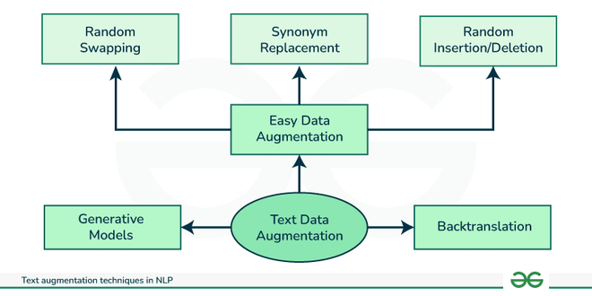

## Table of Contents

## What is text augmentation in the context of machine learning?

Text augmentation in machine learning is a technique used to increase the amount of training data by creating new, modified versions of existing text data. This is done to help machine learning models, especially those used in natural language processing, learn better and perform more accurately. By introducing variations of the text, the model can see different ways the same information can be expressed, making it more robust and able to handle a wider range of inputs.

For example, if you have a sentence like "The cat is on the mat," text augmentation might change it to "The feline is on the rug" or "The kitty sits atop the carpet." These changes help the model understand that "cat," "feline," and "kitty" all refer to the same thing, and that "mat," "rug," and "carpet" can be used interchangeably in this context. This variety helps the model generalize better, reducing the risk of overfitting to the specific examples it was trained on.

## Why is text augmentation important for training machine learning models?

Text augmentation is important for training machine learning models because it helps make the models better at understanding language. When we train a model, we want it to learn from many different examples. But sometimes, we don't have enough examples. Text augmentation lets us create more examples by changing the words or sentences we already have. This means the model can see the same idea written in different ways, which helps it understand that language can be flexible.

For example, if we have a sentence like "The dog is happy," we can change it to "The pooch is joyful" or "The canine feels delighted." By doing this, the model learns that "dog," "pooch," and "canine" all mean the same thing, and that "happy," "joyful," and "delighted" are similar feelings. This helps the model be more accurate when it sees new sentences it hasn't seen before. Text augmentation makes the model more flexible and able to handle a wider range of language, which is really helpful for tasks like understanding what people are saying or writing.

## What are some common techniques used in text augmentation?

Text augmentation uses several common techniques to create new versions of text. One technique is called synonym replacement, where words in a sentence are swapped with their synonyms. For example, "The cat is happy" could become "The cat is joyful." Another technique is random insertion, where new words are added to the sentence. So, "The cat is happy" might become "The cat is very happy." These methods help the model see different ways to say the same thing.

Another technique is random deletion, where some words are removed from the sentence. For instance, "The cat is happy" could be changed to "The cat happy." There's also random swap, where the order of words in the sentence is changed. So, "The cat is happy" might become "Happy is the cat." These changes help the model learn that the meaning of a sentence can stay the same even if the words are in a different order or some are missing.

Back translation is another useful technique. Here, a sentence is translated into another language and then translated back into the original language. For example, "The cat is happy" might be translated to Spanish as "El gato está feliz" and then back to English as "The cat is glad." This can create new, natural-sounding variations of the original sentence. All these techniques help make the model better at understanding and working with language.

## How does MixText approach text augmentation?

MixText is a special way of doing text augmentation that mixes different texts together to make new ones. It's a bit like making a smoothie with different fruits. Instead of just changing words in one sentence, MixText takes pieces from many sentences and puts them together. This helps the model see a lot of different ways to say things, which makes it better at understanding language.

For example, if you have two sentences like "The dog is happy" and "The cat is sleeping," MixText might mix them to make "The dog is sleeping" or "The cat is happy." By doing this, the model learns that "dog" and "cat" are both animals, and "happy" and "sleeping" are both states they can be in. This mixing helps the model learn from a wider range of examples, making it more flexible and accurate when it sees new sentences.

## What are the benefits of using Augmented SBERT for text augmentation?

Augmented SBERT, or Sentence-BERT, is a way to make text augmentation better for understanding sentences. It uses a special method to change sentences in a smart way. When we use Augmented SBERT, it helps the model see different ways to say the same thing. This makes the model better at understanding and working with language. For example, if we have a sentence like "The dog is happy," Augmented SBERT might change it to "The pooch is joyful." By doing this, the model learns that "dog" and "pooch" mean the same thing, and "happy" and "joyful" are similar feelings.

One big benefit of using Augmented SBERT is that it makes the model more accurate. When we train a model with lots of different examples, it can understand new sentences better. Augmented SBERT helps create these different examples by changing the sentences in a smart way. This means the model can handle a wider range of language, which is really helpful for tasks like understanding what people are saying or writing. By using Augmented SBERT, we can make our models more flexible and better at their jobs.

## Can you explain how to implement a simple text augmentation technique?

One simple text augmentation technique is synonym replacement. This method involves taking a sentence and replacing some of its words with their synonyms. For example, if you have the sentence "The dog is happy," you could replace "happy" with "joyful" to get "The dog is joyful." To do this, you can use a thesaurus or a word embedding model like Word2Vec to find synonyms. A simple way to implement this in Python is by using the NLTK library, which has a built-in list of synonyms.

Here's how you can do it: First, you need to tokenize the sentence into words. Then, for each word, you can check if it has any synonyms in the NLTK library. If it does, you can randomly choose one of the synonyms to replace the original word. This creates a new sentence that means the same thing but uses different words. Here's a basic code example to show how you might do this:

```python
import nltk
from nltk.corpus import wordnet
import random

nltk.download('wordnet')
nltk.download('punkt')

def synonym_replacement(sentence, n=1):
    words = nltk.word_tokenize(sentence)
    new_words = words.copy()
    random_word_list = list(set([word for word in words if wordnet.synsets(word)]))
    random.shuffle(random_word_list)
    num_replaced = 0
    for random_word in random_word_list:
        synonyms = [lemma.name() for syn in wordnet.synsets(random_word) for lemma in syn.lemmas()]
        if synonyms:
            synonym = random.choice(synonyms)
            new_words = [synonym if word == random_word else word for word in new_words]
            num_replaced += 1
        if num_replaced >= n:
            break
    return ' '.join(new_words)

# Example usage
original_sentence = "The dog is happy"
augmented_sentence = synonym_replacement(original_sentence)
print(f"Original: {original_sentence}")
print(f"Augmented: {augmented_sentence}")
```

This code will take the original sentence and replace one word with a synonym, creating a new sentence that means the same thing but is expressed differently. This helps the model see different ways to say the same thing, making it better at understanding language.

## What are the challenges faced when applying text augmentation to natural language processing tasks?

Applying text augmentation to natural language processing tasks can be tricky. One big challenge is keeping the meaning of the sentences the same after changing them. For example, if we change "The dog is happy" to "The dog is ecstatic," the new sentence might be too different from the original. This can confuse the model because it might not understand that "ecstatic" means the same as "happy" but is stronger. Also, some words don't have good synonyms, or the synonyms might not fit well in the sentence. This can make the new sentences sound weird or wrong, which doesn't help the model learn.

Another challenge is making sure the augmented text still follows the rules of grammar and language. If we change words randomly, we might end up with sentences that don't make sense. For example, changing "The cat is on the mat" to "The feline is atop the carpet" might be okay, but changing it to "The feline is atop the mat" sounds off. Also, some languages have different rules and structures, so what works for English might not work for other languages. This means we need to be careful and smart about how we change the text to make sure it helps the model learn better, not worse.

## How does text augmentation help in dealing with imbalanced datasets?

Text augmentation helps in dealing with imbalanced datasets by creating more examples for the classes that have fewer examples. When we have a dataset where some categories have a lot of examples and others have only a few, the model might learn better about the categories with more examples and not as well about the others. By using text augmentation, we can make more examples for the categories with fewer examples. For example, if we have a lot of sentences about dogs but only a few about cats, we can change the sentences about cats to make more examples. This helps the model see more about cats and learn better about them, making the dataset more balanced.

This method also helps the model understand the language better because it sees the same idea written in different ways. For example, if we have a sentence like "The cat is happy," we can change it to "The feline is joyful" or "The kitty feels delighted." By doing this, the model learns that "cat," "feline," and "kitty" all mean the same thing, and "happy," "joyful," and "delighted" are similar feelings. This variety helps the model learn from a wider range of examples, making it more flexible and accurate when it sees new sentences. So, text augmentation not only helps balance the dataset but also makes the model better at understanding language.

## What metrics should be used to evaluate the effectiveness of text augmentation?

To evaluate the effectiveness of text augmentation, we can use several metrics that help us understand how well it's working. One important metric is accuracy. This tells us how often the model gets the right answer after being trained on the augmented data. If the model's accuracy goes up after using text augmentation, it means the technique is helping the model learn better. Another useful metric is the F1 score, which is a way to measure both precision and recall. Precision tells us how many of the model's positive predictions are correct, and recall tells us how many of the actual positive examples the model finds. The F1 score combines these two to give us a single number that shows how well the model is doing overall. If the F1 score improves after using text augmentation, it's a good sign that the technique is helping.

Another metric to consider is the confusion matrix, which shows how the model's predictions match up with the actual results. By looking at the confusion matrix, we can see if the model is making fewer mistakes on the classes that had fewer examples before augmentation. This can help us understand if text augmentation is balancing the dataset well. Additionally, we can use metrics like the area under the ROC curve (AUC-ROC) to see how well the model can distinguish between different classes. If the AUC-ROC score improves after using text augmentation, it means the model is better at telling the classes apart, which is especially helpful for imbalanced datasets. By looking at these metrics, we can get a good idea of how effective text augmentation is for our [machine learning](/wiki/machine-learning) tasks.

## How can text augmentation be integrated into a machine learning pipeline?

Text augmentation can be integrated into a machine learning pipeline by adding it as a step before the model training process. When you have your dataset ready, you can use text augmentation techniques like synonym replacement, random insertion, or back translation to create new examples. For example, if you have a sentence like "The dog is happy," you can change it to "The pooch is joyful" or "The canine feels delighted." This helps increase the size of your dataset and makes it more diverse, which can help the model learn better. You can use libraries like NLTK or spaCy to apply these techniques automatically. After augmenting the text, you can then use the new, larger dataset to train your model, which should improve its performance and ability to handle different kinds of language.

To make sure text augmentation works well in your pipeline, you need to check if it's helping your model. You can do this by looking at metrics like accuracy, F1 score, or the confusion matrix. If these metrics get better after using text augmentation, it means the technique is working. For example, if your model's accuracy goes up from 80% to 85% after using augmented data, that's a good sign. You can also use tools like cross-validation to see if the model's performance stays good even when you use different parts of the dataset for training and testing. By carefully adding text augmentation to your pipeline and checking its impact, you can make your machine learning model better at understanding and working with language.

## What advanced techniques can be used to further enhance text augmentation?

One advanced technique for enhancing text augmentation is using contextual embeddings like BERT or RoBERTa. These models understand the context of words in a sentence, which means they can create more natural and meaningful changes. For example, if you have the sentence "The dog is happy," BERT might change it to "The pooch is joyful" or "The canine feels delighted." These changes keep the meaning the same but use different words that fit well in the context. By using these models, you can make your augmented text sound more like real language, which helps the machine learning model learn better.

Another technique is using generative models like GPT to create new sentences from scratch. These models can generate new text that follows the patterns of the original data, making the augmented dataset even more diverse. For instance, if you have a sentence like "The cat is sleeping," a generative model might create "The feline is napping peacefully" or "The kitty dozes off on the couch." This helps the model see different ways to express the same idea, making it more flexible and accurate. By combining these advanced techniques with traditional methods like synonym replacement, you can create a more powerful text augmentation pipeline that helps your machine learning model perform better.

## How do you compare the performance of models trained with and without text augmentation?

To compare the performance of models trained with and without text augmentation, you need to look at several metrics. One simple way is to check the accuracy of both models. If the model trained with augmented data has a higher accuracy, like going from 80% to 85%, it means the text augmentation helped the model learn better. You can also use the F1 score, which combines precision and recall into one number. If the F1 score is better for the model with augmented data, it shows that the model is not only more accurate but also better at finding all the correct examples. Another useful tool is the confusion matrix, which shows how the model's predictions match up with the actual results. By comparing the confusion matrices of both models, you can see if the model with augmented data makes fewer mistakes, especially on the classes that had fewer examples before.

You can also use more advanced methods to compare the models. For example, you can use cross-validation to see if the model's performance stays good even when you use different parts of the dataset for training and testing. If the model trained with augmented data performs better in cross-validation, it's a strong sign that text augmentation is helping. Another way is to look at the area under the ROC curve (AUC-ROC), which shows how well the model can tell different classes apart. If the AUC-ROC score is higher for the model with augmented data, it means the model is better at distinguishing between classes, which is especially helpful for imbalanced datasets. By carefully comparing these metrics, you can see how much text augmentation improves your model's performance and understanding of language.

## References & Further Reading

[1]: Wei, J., Huang, X., Gao, K., & Chen, Y. (2019). ["EDA: Easy Data Augmentation Techniques for Boosting Performance on Text Classification Tasks"](https://pubmed.ncbi.nlm.nih.gov/30673269/). arXiv preprint arXiv:1901.11196.

[2]: Feng, S., Ghosh, S., & Bhattacharya, I. (2021). ["A Survey on Text Classification from Imbalanced Data."](https://dl.acm.org/doi/abs/10.1145/3495162) ACM Computing Surveys (CSUR).

[3]: Devlin, J., Chang, M.-W., Lee, K., & Toutanova, K. (2019). ["BERT: Pre-training of Deep Bidirectional Transformers for Language Understanding."](https://aclanthology.org/N19-1423/) In Proceedings of NAACL-HLT.

[4]: Liu, Y., Ott, M., Goyal, N., Du, J., Joshi, M., Chen, D., Levy, O., Lewis, M., Zettlemoyer, L., & Stoyanov, V. (2019). ["RoBERTa: A Robustly Optimized BERT Pretraining Approach."](https://arxiv.org/abs/1907.11692) arXiv preprint arXiv:1907.11692.

[5]: Sun, C., Qiu, X., Xu, Y., & Huang, X. (2019). ["How to Fine-Tune BERT for Text Classification?"](https://arxiv.org/abs/1905.05583) Chinese Science Bulletin, 64, 1550-1556.

[6]: Vaswani, A., Shazeer, N., Parmar, N., Uszkoreit, J., Jones, L., Gomez, A. N., Kaiser, Ł., & Polosukhin, I. (2017). ["Attention is All You Need."](https://arxiv.org/abs/1706.03762) In Advances in Neural Information Processing Systems.

[7]: Wang, E., Kolter, J. Z., & Morency, L. (2021). ["Back-Translation as an Efficient Approach for Parallel Data Collection."](https://arxiv.org/abs/1906.00295) Journal of Artificial Intelligence Research.