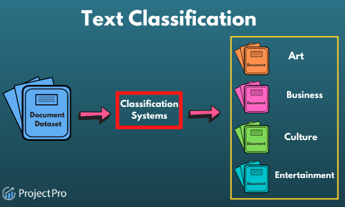

## Table of Contents

## What is text classification in machine learning?

Text classification is a way computers learn to sort and label pieces of text, like emails or news articles, into different groups. It's like teaching a computer to understand what a piece of text is about and then deciding if it belongs in a category like "sports," "politics," or "spam." To do this, computers use special math formulas and algorithms that look at the words in the text and figure out patterns.

One common method for text classification is using a model called a "Naive Bayes classifier." This model uses something called probability to guess which category a new piece of text might belong to. It looks at how often certain words appear in texts that are already labeled and uses that information to make its guesses. For example, if the word "goal" often appears in sports articles, the model might think a new text with the word "goal" is probably about sports.

Another popular approach is using "deep learning" techniques, which involve creating complex networks that can learn from lots of text data. These networks, often called neural networks, can find very detailed patterns in text that simpler methods might miss. They are good at understanding context and can improve their accuracy over time as they see more examples. Both methods help computers get better at sorting and understanding text, making them useful for tasks like filtering spam emails or organizing news feeds.

## What are some common applications of text classification?

Text classification is used a lot in sorting emails. It helps decide if an email is important or if it's just spam. When you get an email, the computer looks at the words in it and decides where it should go. If the email has words like "free" or "click here," the computer might think it's spam and move it to the spam folder. This makes your email inbox cleaner and helps you find the important messages faster.

Another common use is in organizing news articles or social media posts. When you go to a news website, the articles are often sorted into categories like "sports," "politics," or "entertainment." Text classification helps put each article in the right category. This way, if you're interested in sports, you can easily find all the sports news in one place. On social media, text classification can help show you posts that match your interests, making your feed more enjoyable.

Text classification is also used in customer service. When you send a message to a company asking for help, text classification can figure out what your problem is and send your message to the right person. For example, if you're having trouble with a product, the computer can see the words you use and know to send your message to the product support team. This makes it quicker for you to get the help you need.

## How does a basic text classification model work?

A basic text classification model works by first turning words into numbers that a computer can understand. Imagine you have a bunch of emails, and you want to know if they are spam or not. The computer looks at the words in each email and counts how many times certain words appear. For example, if the word "free" shows up a lot in emails that are already marked as spam, the computer remembers that. It then uses a simple math formula to guess if a new email is spam based on the words it contains. One common formula used is called Naive Bayes, which calculates the probability of an email being spam like this: $$ P(\text{Spam} \mid \text{Words}) = \frac{P(\text{Words} \mid \text{Spam}) \cdot P(\text{Spam})}{P(\text{Words})} $$. This formula helps the computer decide if the new email should go into the spam folder or not.

After the computer has turned the words into numbers and used the math formula, it makes a decision. If the probability of the email being spam is high, the email goes into the spam folder. If it's low, the email stays in the main inbox. Over time, the computer gets better at this by learning from more emails. If it makes a mistake and puts an important email in the spam folder, you can tell it that it was wrong, and it will adjust its calculations for the next time. This way, the computer keeps improving and gets better at sorting emails correctly.

## What is the difference between binary and multi-class text classification?

Binary text classification is when you sort text into just two groups. For example, you might want to know if an email is spam or not spam. The computer looks at the words in the email and decides which of the two groups it fits into. It's like a yes or no question - is this email spam? If the computer thinks the email is more likely to be spam, it goes into the spam folder. If not, it stays in the main inbox. A common way to do this is with a formula called Naive Bayes, which calculates the probability like this: $$ P(\text{Spam} \mid \text{Words}) = \frac{P(\text{Words} \mid \text{Spam}) \cdot P(\text{Spam})}{P(\text{Words})} $$. This helps the computer decide if the email should go into the spam folder or not.

Multi-class text classification is when you sort text into more than two groups. For example, you might want to sort news articles into categories like sports, politics, or entertainment. The computer looks at the words in each article and decides which category it fits into best. It's like having multiple choices instead of just yes or no. If an article has a lot of words about soccer, the computer might put it in the sports category. If it has words about elections, it might go into the politics category. Multi-class classification can be more complicated because the computer has to choose from many options, but it's very useful for organizing lots of different types of text.

## What are some popular algorithms used for text classification?

One popular algorithm for text classification is the Naive Bayes classifier. This method uses probability to guess which category a piece of text belongs to. It looks at how often certain words appear in texts that are already labeled and uses that information to make its guesses. For example, if the word "goal" often appears in sports articles, the model might think a new text with the word "goal" is probably about sports. The formula used by Naive Bayes is simple but effective: $$ P(\text{Category} \mid \text{Words}) = \frac{P(\text{Words} \mid \text{Category}) \cdot P(\text{Category})}{P(\text{Words})} $$. This helps the computer decide the most likely category for a new piece of text.

Another widely used algorithm is the Support Vector Machine (SVM). SVM works by finding the best line or hyperplane that separates different categories of text in a high-dimensional space. It's good at handling complex patterns in text data. SVMs are often used for both binary and multi-class classification tasks. They can be more accurate than Naive Bayes but might take longer to train, especially with large datasets.

Deep learning techniques, particularly neural networks, are also popular for text classification. These models can learn very detailed patterns in text and are good at understanding context. A common type of neural network used for text classification is the Convolutional Neural Network (CNN) or the Recurrent Neural Network (RNN), especially with Long Short-Term Memory (LSTM) units. These models can improve their accuracy over time as they see more examples, making them powerful tools for tasks like sentiment analysis or topic categorization.

## How does feature extraction impact text classification models?

Feature extraction is like finding the important parts of a text that help a computer decide what it's about. When you want to sort emails into spam or not spam, the computer needs to know which words matter the most. If it sees words like "free" or "click here" a lot in spam emails, it will use those words as features to guess if a new email is spam. Good feature extraction makes the computer's guesses more accurate. If the computer misses important words or includes too many unimportant ones, it might make more mistakes.

Different ways of doing feature extraction can change how well a text classification model works. One common method is called "bag of words," where the computer counts how often each word appears in a text. Another method is "TF-IDF," which stands for Term Frequency-Inverse Document Frequency. This method not only counts how often a word appears but also how important it is across all the texts. Using TF-IDF can make the computer focus on the words that really matter for sorting the text correctly. The choice of feature extraction method can make a big difference in how well the model works, so it's important to pick the right one for the job.

## What are the advantages of using MixText for text classification?

MixText is a way to make text classification models better by mixing different texts together. Imagine you have a bunch of news articles about sports and politics. MixText takes pieces from these articles and combines them to create new examples that the computer can learn from. This mixing helps the model see more variety in the text and learn to recognize patterns better. By using MixText, the model can get better at sorting new texts into the right categories, like knowing if a new article is about sports or politics.

One big advantage of MixText is that it can make the model work well even if you don't have a lot of labeled data. Sometimes, you might not have enough examples of sports articles to teach the computer well. MixText can take the few examples you have and mix them with other texts to create more examples. This means the model can learn more from less data, saving time and effort. Using MixText can also help the model be more accurate because it sees a wider range of text patterns, making it better at understanding and classifying new texts.

## How does DualCL improve upon traditional text classification methods?

DualCL, or Dual Contrastive Learning, is a way to make text classification models better by comparing texts in a smart way. It works by looking at how similar or different texts are to each other. For example, if you have a bunch of news articles, DualCL can see how a sports article is different from a politics article. By doing this, the model learns to focus on the important words and patterns that really matter for sorting texts correctly. This helps the model be more accurate when it sees new texts because it has a better understanding of what makes each category unique.

One big advantage of DualCL is that it can improve the model's performance even when you don't have a lot of labeled data. Sometimes, you might not have enough examples of each category to teach the computer well. DualCL can use the few examples you have and compare them to others to learn more from them. This means the model can get better results with less data, saving time and effort. By using DualCL, the model becomes more reliable and can sort new texts into the right categories more accurately.

## What makes Lbl2Vec unique among text classification models?

Lbl2Vec is special because it learns about words and categories at the same time. Imagine you have a bunch of news articles about sports and politics. Lbl2Vec looks at the words in these articles and figures out which ones are important for each category. It does this by creating something called "word embeddings," which are like little maps that show how words relate to each other and to different categories. By learning these maps, Lbl2Vec can understand the context of words better, making it really good at sorting new texts into the right groups.

Another thing that makes Lbl2Vec unique is that it can work well even if you don't have a lot of labeled data. Sometimes, you might not have enough examples of sports articles to teach the computer well. Lbl2Vec can use the few examples you have and still learn a lot from them. This means you don't need a huge amount of data to get good results, which saves time and effort. By using Lbl2Vec, the model becomes more accurate and reliable at sorting new texts into the right categories.

## How does ALDEN address the challenges of imbalanced datasets in text classification?

ALDEN, which stands for Active Learning for Data-efficient imbalanced text classification, is a smart way to deal with datasets where some categories have a lot more examples than others. Imagine you're sorting emails into spam and not spam, but you have way more spam emails than not spam emails. This can make it hard for the computer to learn about the not spam category because it doesn't see enough examples. ALDEN helps by picking the most useful examples to label next, so the computer can learn more about the categories that don't have many examples. This way, even with an imbalanced dataset, the computer can get better at sorting new emails correctly.

ALDEN does this by using a method called active learning. It looks at the emails it already knows about and tries to find the ones that will help it learn the most about the not spam category. If it sees an email that it's not sure about, it might ask a person to label it. This helps the computer learn from the most important examples, making it better at understanding the less common categories. By focusing on these key examples, ALDEN makes sure the computer can sort emails accurately, even when some categories are underrepresented.

## What enhancements does Lbl2TransformerVec bring to text classification?

Lbl2TransformerVec improves text classification by combining the power of transformers, which are good at understanding the context of words, with the smart way Lbl2Vec learns about words and categories at the same time. Transformers are like super smart computers that can read a whole sentence and understand how each word relates to the others. When you mix this with Lbl2Vec's way of learning, the model gets even better at figuring out which words are important for each category. This means Lbl2TransformerVec can sort new texts into the right groups more accurately because it has a deeper understanding of the words and their context.

Another great thing about Lbl2TransformerVec is that it can work well even if you don't have a lot of labeled data. Sometimes, you might not have enough examples of each category to teach the computer well. Lbl2TransformerVec can use the few examples you have and learn a lot from them, thanks to the transformer's ability to understand context and Lbl2Vec's smart learning. This means you don't need a huge amount of data to get good results, which saves time and effort. By using Lbl2TransformerVec, the model becomes more reliable and can sort new texts into the right categories more accurately.

## How can one evaluate and compare the performance of advanced text classification models like MixText, DualCL, Lbl2Vec, ALDEN, and Lbl2TransformerVec?

To evaluate and compare the performance of advanced text classification models like MixText, DualCL, Lbl2Vec, ALDEN, and Lbl2TransformerVec, you can use common metrics like accuracy, precision, recall, and F1-score. Accuracy tells you how often the model gets the right answer out of all the guesses it makes. Precision and recall focus on how well the model does with specific categories. Precision looks at how many of the model's guesses for a category are correct, while recall checks how many of the actual examples in that category the model finds. The F1-score is a way to balance precision and recall into one number, which can be useful when you want to see how well the model does overall. You can calculate the F1-score like this: $$ F1 = 2 \times \frac{\text{precision} \times \text{recall}}{\text{precision} + \text{recall}} $$. By using these metrics, you can see which model is better at sorting texts into the right categories and how they handle different challenges, like imbalanced datasets or limited labeled data.

Another way to compare these models is by looking at how they perform with different amounts of data. Some models, like ALDEN, are designed to work well even when you don't have a lot of labeled examples. You can test this by training the models on small datasets and then seeing how well they do. You can also look at how the models improve as you give them more data. This can help you understand which model is more data-efficient and which one might need a lot of examples to work well. Additionally, you can use cross-validation, which means splitting your data into different parts and training the model multiple times to see how consistent its performance is. By doing all these tests, you can get a good picture of which model is best for your specific needs, whether it's dealing with imbalanced data, working with limited labeled examples, or needing to understand the context of words deeply.