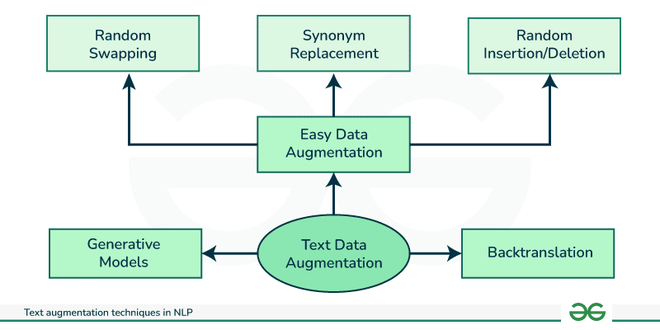

## Table of Contents

## What is text data augmentation in machine learning?

Text data augmentation in machine learning is a technique used to increase the amount of training data by creating new, modified versions of existing text data. This is important because having more data can help machine learning models learn better and perform more accurately. For example, if you're training a model to understand customer reviews, you might not have enough reviews to train the model well. By using text data augmentation, you can create more reviews by slightly changing the existing ones, like changing words or rearranging sentences.

There are many ways to do text data augmentation. One common method is synonym replacement, where you replace some words in a sentence with their synonyms. Another method is back-translation, where you translate a sentence into another language and then translate it back to the original language. This often results in a slightly different version of the original text. These techniques help to make the model more robust by exposing it to a wider variety of text, which can improve its ability to understand and process new, unseen data.

## Why is text data augmentation important for machine learning models?

Text data augmentation is important for machine learning models because it helps to increase the amount of data available for training. When you have more data, your model can learn better and make fewer mistakes. Imagine you're teaching a child new words. If you only show them a few examples, they might not learn as well as if you showed them many different examples. By using text data augmentation, you can create more examples for your model to learn from, which can make it smarter and more accurate.

Another reason text [data augmentation](/wiki/data-augmentation) is important is that it helps the model to be more flexible and handle different types of text better. For example, if you're training a model to understand customer reviews, the reviews might come in many different styles and use different words. By changing the existing reviews a bit, like using different words or rearranging sentences, you can teach the model to understand a wider variety of reviews. This makes the model more useful because it can handle new, unseen text better.

## What are some common techniques used for text data augmentation?

One common technique for text data augmentation is synonym replacement. This means you take a sentence and replace some of its words with similar words that mean the same thing. For example, if you have the sentence "The cat is sleeping," you could change it to "The feline is slumbering." This helps the model learn different ways to say the same thing, making it better at understanding different texts. Another technique is back-translation. Here, you translate a sentence into another language and then translate it back to the original language. This often results in a slightly different version of the original text. For example, "The dog is barking" might become "The dog is making noise" after back-translation.

Random insertion is another technique where you add new words into a sentence. You might add synonyms or related words to make the sentence longer and more varied. For instance, "The sky is blue" could become "The sky is beautifully blue." Random deletion involves removing some words from a sentence, which can help the model learn to understand sentences even if some words are missing. For example, "The bird is singing" might be changed to "The bird singing." These techniques help the model learn from different versions of the same text, making it more robust and better at handling new data.

## How does the DART method work for text data augmentation?

The DART method, which stands for "Data Augmentation using Replacement and Transformation," is a way to make more text data for training [machine learning](/wiki/machine-learning) models. It works by changing parts of the original text in a smart way. DART uses a special kind of language model called a masked language model, like BERT, to figure out which words to change. It looks at each word in a sentence and decides if it should be replaced with another word that makes sense in that spot. This helps create new sentences that are similar to the original but different enough to be useful for training.

For example, if you have the sentence "The cat is sleeping," DART might decide to replace "cat" with "feline" because it knows that "feline" fits well in that sentence. It does this by using the masked language model to predict what word should go in the place of "cat." This way, DART can make many new sentences from just one original sentence, giving the machine learning model more data to learn from. By using DART, the model can learn to understand different ways of saying the same thing, which makes it better at handling new text it hasn't seen before.

## What are the advantages of using AEDA for text data augmentation?

AEDA, or "Augmented Embedding-based Data Augmentation," is a simple but effective method for text data augmentation. It works by randomly inserting, deleting, swapping, or replacing characters within words. This randomness helps create new versions of the text that are similar to the original but different enough to be useful for training machine learning models. Because AEDA is easy to use and doesn't need a lot of computing power, it's a good choice for people who want to improve their text data without spending too much time or money.

One big advantage of using AEDA is that it can make your machine learning model better at understanding text that has typos or other small mistakes. Since AEDA changes words by altering characters, it can help the model learn to handle text that isn't perfect. This is especially helpful for things like understanding social media posts or text messages, where people often make small errors. By training the model with AEDA-augmented text, it becomes more flexible and able to deal with real-world text that might not be exactly correct.

## Can you explain how SynthesizRR generates synthetic text data?

SynthesizRR is a tool that makes new text data by mixing and changing parts of existing text. It works by breaking down sentences into smaller pieces, like phrases or individual words, and then putting them back together in new ways. For example, if you have the sentences "The cat is sleeping" and "The dog is barking," SynthesizRR might mix them to create "The cat is barking" or "The dog is sleeping." This helps create lots of new sentences that are similar to the original ones but different enough to be useful for training machine learning models.

By using SynthesizRR, you can make your machine learning model better at understanding different kinds of text. It's like giving the model more examples to learn from, which can help it make fewer mistakes. Since SynthesizRR can create many new sentences quickly, it's a good way to increase the amount of training data without needing to collect more real text. This makes it easier and faster to train models that can handle a wide variety of text.

## What are the challenges faced when implementing text data augmentation?

Implementing text data augmentation can be tricky because it's hard to make sure the new text still makes sense. When you change words or mix sentences, you might end up with text that doesn't sound right or is hard to understand. For example, if you use a method like synonym replacement, you might replace a word with one that doesn't fit well in the sentence. This can confuse the machine learning model instead of helping it learn. Also, some methods need a lot of computing power, which can be a problem if you don't have strong computers or if you're working on a big project.

Another challenge is making sure the new text is different enough to be useful but not so different that it doesn't help the model learn. If the new text is too similar to the original, it won't add much value to the training data. On the other hand, if it's too different, the model might not be able to learn anything useful from it. Finding the right balance can be hard. Plus, some methods might work well for one type of text but not for another. For example, a method that works well for customer reviews might not work as well for medical reports. This means you might need to try different methods and see what works best for your specific data.

## How can text data augmentation help in improving model performance on imbalanced datasets?

Text data augmentation can help a lot when you have an imbalanced dataset, which means you have more of one type of data than another. For example, if you're training a model to tell if a message is spam or not, you might have way more non-spam messages than spam messages. By using text data augmentation, you can create more spam messages by changing the ones you already have. This helps balance out the dataset so the model can learn better from both types of messages. When the dataset is more balanced, the model is less likely to make mistakes because it has seen enough examples of each type of data.

One way text data augmentation helps is by making the model more flexible. When you change the text a bit, like replacing words or mixing sentences, you're showing the model different ways to say the same thing. This makes the model better at understanding new messages that might be a bit different from what it has seen before. For example, if you have a few spam messages, you can use augmentation to create more by changing words or adding typos. This way, the model learns to recognize spam even if it's written differently. By doing this, you can improve how well the model works on imbalanced datasets, making it more accurate and useful.

## What metrics should be considered to evaluate the effectiveness of text data augmentation?

When you want to know if text data augmentation is helping your machine learning model, you should look at some important numbers. One key number is accuracy, which tells you how often your model gets things right. Another important number is the F1 score, which is a mix of precision and recall. Precision shows how many of the things your model said were correct actually were correct, and recall shows how many of the correct things your model found. The F1 score is good because it balances both precision and recall. You can calculate it with this formula: $$F1 = 2 \times \frac{\text{precision} \times \text{recall}}{\text{precision} + \text{recall}}$$. If these numbers go up after you use text data augmentation, it means your model is doing better.

Another thing to check is how well your model works on different types of text, especially if your data is imbalanced. You can use metrics like the area under the ROC curve (AUC-ROC) to see how good your model is at telling different types of text apart. If your dataset has more of one type of text than another, like more non-spam messages than spam messages, you want to make sure your model doesn't just get good at recognizing the type of text it sees more often. By looking at these numbers before and after you use text data augmentation, you can see if it's helping your model understand all types of text better.

## How do you choose the right text data augmentation technique for a specific NLP task?

Choosing the right text data augmentation technique for a specific NLP task depends on what you want your model to do and what kind of text you are working with. If you're trying to improve a model that understands customer reviews, you might want to use techniques like synonym replacement or back-translation. These methods can help the model learn different ways people might say the same thing, which is common in reviews. On the other hand, if you're working with medical reports, you might need more careful techniques like SynthesizRR, which mixes and changes parts of sentences in a way that keeps the meaning clear and accurate. The key is to think about what kind of changes will help your model learn better without making the text too confusing or wrong.

Another important thing to consider is how much computing power you have and how much time you can spend on augmentation. Some methods, like AEDA, are simple and don't need a lot of computing power, so they're good if you're working on a big project with limited resources. Other methods, like DART, which uses masked language models, might need more powerful computers but can create very smart changes to the text. You should also try different techniques and see which one helps your model's performance the most. You can check this by looking at metrics like accuracy, F1 score ($$F1 = 2 \times \frac{\text{precision} \times \text{recall}}{\text{precision} + \text{recall}}$$), and AUC-ROC before and after using the augmentation technique. By doing this, you can find the best way to help your model learn from your specific text data.

## What are the potential risks of overfitting when using text data augmentation?

When you use text data augmentation, there's a risk that your model might overfit. Overfitting happens when a model learns the training data too well, including all the little details and mistakes. This can make the model do great on the training data but not so well on new, unseen data. With text data augmentation, if you create too many similar versions of the same text, your model might start to learn these specific examples instead of learning general patterns. This means it might not work as well when it sees new text that's a bit different from what it was trained on.

To avoid overfitting, it's important to make sure the new text you create with augmentation is different enough from the original. You can check if your model is overfitting by looking at how it does on a separate set of data that it hasn't seen during training. If the performance on this new data is a lot worse than on the training data, it might be overfitting. You can also try to use different augmentation techniques and see which one helps your model learn better without overfitting. By keeping an eye on metrics like accuracy, F1 score ($$F1 = 2 \times \frac{\text{precision} \times \text{recall}}{\text{precision} + \text{recall}}$$), and AUC-ROC, you can make sure your model is learning the right things and not just memorizing the training data.

## How can advanced text data augmentation techniques be integrated into a machine learning pipeline?

To integrate advanced text data augmentation techniques into a machine learning pipeline, you first need to decide which techniques will work best for your specific task. For example, if you're working on a sentiment analysis model for customer reviews, you might choose synonym replacement or back-translation to help your model understand different ways people express their feelings. Once you've picked your techniques, you can add them to your data preprocessing step. This means before you feed your text data into the model, you'll use the augmentation techniques to create new versions of your text. This can be done using libraries like NLTK or spaCy in Python, which have tools to help with text manipulation.

After you've added the augmentation step to your pipeline, you need to make sure it's working well. You can do this by training your model with the augmented data and then checking its performance on a separate set of data that it hasn't seen before. Metrics like accuracy, F1 score ($$F1 = 2 \times \frac{\text{precision} \times \text{recall}}{\text{precision} + \text{recall}}$$), and AUC-ROC will help you see if the augmentation is helping your model learn better. If you find that your model is overfitting, you might need to adjust your augmentation techniques or try different ones. By carefully integrating and monitoring the use of advanced text data augmentation, you can improve your model's ability to handle a wide variety of text data.

## References & Further Reading

[1] Wei, J., Zou, K. ["EDA: Easy Data Augmentation Techniques for Boosting Performance on Text Classification Tasks."](https://aclanthology.org/D19-1670/) arXiv preprint arXiv:1901.11196, 2019.

[2] Fadaee, M., Bisazza, A., & Monz, C. (2017). ["Data Augmentation for Low-Resource Neural Machine Translation."](https://aclanthology.org/P17-2090/) Proceedings of the 55th Annual Meeting of the Association for Computational Linguistics (Volume 2: Short Papers).

[3] Kobayashi, S. (2018). ["Contextual Augmentation: Data Augmentation by Words with Paradigmatic Relations."](https://aclanthology.org/N18-2072/) arXiv preprint arXiv:1805.06201.

[4] Sennrich, R., Haddow, B., & Birch, A. (2016). ["Improving Neural Machine Translation Models with Monolingual Data."](https://aclanthology.org/P16-1009/) Proceedings of the 54th Annual Meeting of the Association for Computational Linguistics (Volume 1: Long Papers).

[5] Johnson, R., & Zhang, T. (2017). ["Deep Pyramid Convolutional Neural Networks for Text Categorization."](https://aclanthology.org/P17-1052/) Proceedings of the 55th Annual Meeting of the Association for Computational Linguistics (Volume 1: Long Papers).