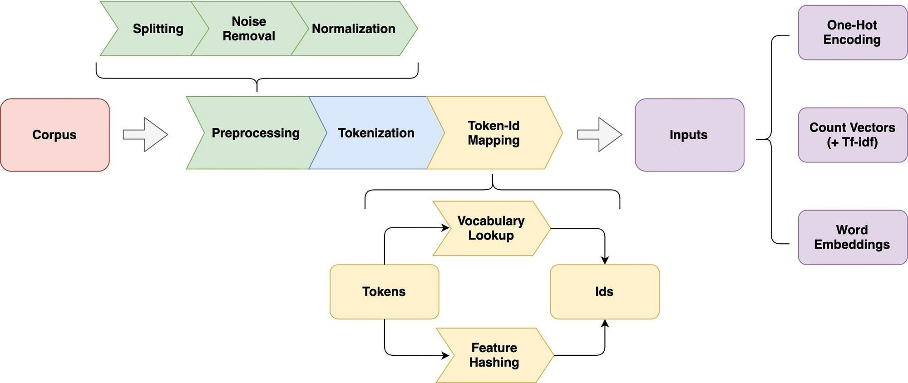

## Table of Contents

## What is a text instance representation in machine learning?

In machine learning, a text instance representation is how we turn words or sentences into numbers that a computer can understand and work with. Imagine you want to teach a computer to recognize different animals from pictures. You would need to convert those pictures into numbers first. Similarly, with text, we convert words into numbers so that machine learning models can process and learn from them.

There are different ways to represent text as numbers. One common method is called "bag of words," where we count how many times each word appears in a text. For example, if you have a sentence like "The cat sat on the mat," you would count the occurrences of each word: "the" appears twice, "cat" once, "sat" once, "on" once, and "mat" once. This simple counting can help machines understand and categorize text. Another method is "word embeddings," where words are represented as vectors in a high-dimensional space, capturing semantic relationships between words. For instance, the word "king" might be represented as a vector $$v_{king}$$ and "queen" as $$v_{queen}$$, and the difference between these vectors could capture the concept of gender.

## Why are text instance representations important in natural language processing?

Text instance representations are important in natural language processing because they allow computers to understand and work with human language. When we type or speak, we use words and sentences, but computers need numbers to process information. By turning text into numbers, we can teach machines to recognize patterns, understand meaning, and even generate new text. This is crucial for tasks like sentiment analysis, where we want to know if a text is positive or negative, or machine translation, where we need to convert text from one language to another.

Different methods of text representation can affect how well a machine learning model performs. For example, the "bag of words" method is simple and counts how many times each word appears in a text. This can be useful for some tasks but might not capture the order or context of words. On the other hand, word embeddings represent words as vectors in a high-dimensional space, like $$v_{king}$$ for "king" and $$v_{queen}$$ for "queen". These vectors can capture semantic relationships, making them more powerful for understanding language nuances. Choosing the right representation method is key to building effective natural language processing systems.

## What are some common methods for creating text instance representations?

One common method for creating text instance representations is the "bag of words" approach. This method involves counting how many times each word appears in a text. For example, if you have the sentence "The cat sat on the mat," you would count the occurrences of each word: "the" appears twice, "cat" once, "sat" once, "on" once, and "mat" once. This simple counting can help machines understand and categorize text. However, the bag of words method does not consider the order of words or their context, which can be a limitation for some tasks.

Another popular method is "word embeddings," where words are represented as vectors in a high-dimensional space. These vectors can capture semantic relationships between words. For instance, the word "king" might be represented as a vector $$v_{king}$$ and "queen" as $$v_{queen}$$. The difference between these vectors could capture the concept of gender. Word embeddings are more powerful than the bag of words approach because they can understand the meaning and context of words better. This makes them useful for tasks like machine translation and sentiment analysis.

A third method is "TF-IDF" (Term Frequency-Inverse Document Frequency), which takes into account not just how often a word appears in a single document, but also how rare it is across a collection of documents. This helps to highlight words that are important in a specific document but not common in the overall collection. For example, if "cat" appears frequently in one document but rarely in others, it might be considered more significant in that document. TF-IDF can be useful for tasks like information retrieval and text classification.

## How does Fourier Contour Embedding work as a text instance representation?

Fourier Contour Embedding is a way to turn text into numbers that can be used by computers. It works by looking at the shape of the text, like how the letters curve and twist. Imagine drawing the outline of a word and then using math to describe that outline. This method uses something called the Fourier transform, which is a way to break down shapes into simpler parts. By doing this, Fourier Contour Embedding can capture not just what words are in the text, but also how they look.

This method is different from others like bag of words or word embeddings because it focuses on the visual aspect of text. For example, if you have two words that look similar, like "b" and "d," Fourier Contour Embedding might represent them in a way that shows their shapes are close, even if they mean different things. This can be useful in tasks where the appearance of text matters, like recognizing handwriting or fonts. By using the Fourier transform, this method can create a detailed and unique representation of text that other methods might miss.

## What are the advantages of using Fourier Contour Embedding for text?

Fourier Contour Embedding has a big advantage when it comes to looking at the way text looks, not just what it says. This method uses math to describe the shape of letters and words, which can be really helpful for things like recognizing handwriting or different fonts. If you have two letters that look similar, like "b" and "d," this method can show that their shapes are close, even if they mean different things. This makes it great for tasks where how the text looks is important.

Another good thing about Fourier Contour Embedding is that it can capture details that other methods might miss. By using the Fourier transform, it breaks down the shapes of letters into simpler parts, creating a detailed picture of the text. This can help computers understand and work with text in a more visual way, which can be useful for things like improving how well machines read and understand handwritten notes or different styles of writing.

## Can you explain the mathematical foundation behind Fourier Contour Embedding?

Fourier Contour Embedding uses the math behind something called the Fourier transform to turn the shapes of letters and words into numbers. The Fourier transform is a way to break down any shape or signal into a bunch of simpler waves. Imagine you have a drawing of a letter. The Fourier transform can take that drawing and tell you how much of each type of wave you need to add together to make it look like the original drawing. This is useful because it gives us a way to describe the shape of text in a way that computers can understand and work with.

In Fourier Contour Embedding, we take the outline of a letter or word and apply the Fourier transform to it. This gives us a set of numbers that represent the different waves that make up the shape. For example, if you have a letter like "S," the Fourier transform might tell you that you need a certain amount of a wavy wave, a certain amount of a straight wave, and so on, to draw the "S." These numbers become the representation of the letter. By doing this, Fourier Contour Embedding can capture the visual details of text, which is important for tasks like recognizing handwriting or different fonts.

## How does Fourier Contour Embedding compare to other text representation techniques like word embeddings?

Fourier Contour Embedding and word embeddings are different ways to turn text into numbers that computers can understand. Fourier Contour Embedding focuses on the shapes of letters and words. It uses the Fourier transform to break down these shapes into simpler parts, like waves. This makes it good for tasks where how the text looks is important, like recognizing handwriting or different fonts. For example, if you have two letters that look similar, like "b" and "d," Fourier Contour Embedding can show that their shapes are close, even if they mean different things.

Word embeddings, on the other hand, focus on the meaning of words. They represent words as vectors in a high-dimensional space, like $$v_{king}$$ for "king" and $$v_{queen}$$ for "queen". These vectors can capture the relationships between words, making them useful for tasks like machine translation and sentiment analysis. Unlike Fourier Contour Embedding, word embeddings do not consider the visual aspect of text. Instead, they help computers understand what words mean and how they relate to each other, which is important for understanding language but not for recognizing how text looks.

## What are the practical applications of Fourier Contour Embedding in text analysis?

Fourier Contour Embedding is really helpful when you want to understand how text looks, not just what it says. Imagine you're trying to read someone's messy handwriting. This method can turn the shapes of the letters into numbers that a computer can understand. By using something called the Fourier transform, it breaks down the shapes into simpler parts. This makes it easier for computers to recognize different handwriting styles or even different fonts. For example, if you have two letters that look similar, like "b" and "d," Fourier Contour Embedding can show that their shapes are close, even if they mean different things.

This method can be used in many practical ways. For instance, it's great for tasks like improving how well computers read and understand handwritten notes. If you're working on a project where you need to digitize old handwritten documents, Fourier Contour Embedding can help make sure the computer understands the shapes of the letters correctly. It's also useful for recognizing different fonts in digital text, which can be important for things like designing websites or creating digital [books](/wiki/algo-trading-books). By focusing on the visual details of text, Fourier Contour Embedding helps computers see text the way humans do, making it a powerful tool for text analysis.

## How can Fourier Contour Embedding be integrated into existing machine learning models?

Fourier Contour Embedding can be added to [machine learning](/wiki/machine-learning) models that need to understand how text looks. For example, if you have a model that reads handwriting, you can use Fourier Contour Embedding to turn the shapes of the letters into numbers. The model can then use these numbers to learn and recognize different handwriting styles. To do this, you would first use the Fourier transform to break down the shapes of the letters into simpler parts. Then, you would feed these numbers into your model along with other information, like the meaning of the words, to help it understand the text better.

To integrate Fourier Contour Embedding into a model, you might need to change how the model works a bit. For example, if you're using a [neural network](/wiki/neural-network), you could add a new layer that takes the numbers from Fourier Contour Embedding and combines them with the other features of the text. This way, the model can learn from both the meaning of the words and how they look. By doing this, you can make your model better at tasks where the appearance of text is important, like recognizing different fonts or improving how well it reads handwritten notes.

## What are the limitations or challenges faced when using Fourier Contour Embedding for text?

One challenge with using Fourier Contour Embedding for text is that it focuses on how the text looks, not what it means. This means it might not be as good for understanding the meaning of words or sentences. For example, if you have two words that look similar but mean different things, like "b" and "d," Fourier Contour Embedding can show that their shapes are close, but it won't help a computer understand that "b" is not the same as "d" in terms of meaning. This can make it harder to use for tasks like machine translation or sentiment analysis, where understanding the meaning of words is important.

Another limitation is that Fourier Contour Embedding can be more complicated to use than other methods. It uses the Fourier transform to break down the shapes of letters into simpler parts, which can take more time and computer power. This might make it harder to use in real-time applications where speed is important. For example, if you're trying to recognize handwriting on a smartphone, using Fourier Contour Embedding might slow down the app because it needs to do a lot of math to turn the shapes into numbers. This can be a challenge when you need quick and efficient processing of text.

## How can the performance of Fourier Contour Embedding be optimized for different text datasets?

To optimize the performance of Fourier Contour Embedding for different text datasets, it's important to understand the specific characteristics of the text you're working with. For example, if you're dealing with handwritten text, you might need to adjust the Fourier transform to capture the unique shapes and styles of handwriting better. This could mean fine-tuning the parameters of the Fourier transform to focus on the frequencies that are most important for distinguishing between different letters or words. By doing this, you can make sure that the embedding captures the visual details that are most relevant to your dataset.

Another way to optimize performance is by combining Fourier Contour Embedding with other text representation methods. For instance, you could use it alongside word embeddings to help a model understand both the shape and the meaning of text. This might involve creating a neural network that takes the numbers from Fourier Contour Embedding as one input and the vectors from word embeddings as another input. By doing this, you can create a more complete representation of the text that takes advantage of the strengths of both methods. This can be especially helpful when working with datasets where both the visual and semantic aspects of the text are important.

## What future developments or research directions are anticipated for text instance representations like Fourier Contour Embedding?

Future developments in text instance representations like Fourier Contour Embedding are likely to focus on improving how well these methods can capture the visual details of text. Researchers might work on making the Fourier transform more efficient so that it can be used in real-time applications, like recognizing handwriting on smartphones. They could also explore new ways to combine Fourier Contour Embedding with other methods, like word embeddings, to create a more complete picture of text that includes both how it looks and what it means. This could help computers understand text better in tasks where both the visual and semantic aspects are important.

Another area of research could be looking at how Fourier Contour Embedding can be used for different types of text, like different languages or fonts. For example, researchers might study how to adjust the method to work well with the unique shapes of characters in languages like Chinese or Arabic. They could also explore how to make the method more flexible so that it can handle a wide range of text styles and handwriting variations. By doing this, Fourier Contour Embedding could become a more powerful tool for understanding and working with text in many different contexts.

## References & Further Reading

[1]: Mikolov, T., Chen, K., Corrado, G., & Dean, J. (2013). ["Efficient Estimation of Word Representations in Vector Space."](https://arxiv.org/abs/1301.3781) arXiv preprint arXiv:1301.3781.

[2]: Pennington, J., Socher, R., & Manning, C. D. (2014). ["GloVe: Global Vectors for Word Representation."](https://aclanthology.org/D14-1162/) Proceedings of the 2014 Conference on Empirical Methods in Natural Language Processing (EMNLP), 1532–1543.

[3]: Jurafsky, D., & Martin, J. H. (2023). ["Speech and Language Processing (3rd ed. draft)."](https://web.stanford.edu/~jurafsky/slp3/) Stanford University. 

[4]: Manning, C., Raghavan, P., & Schütze, H. (2008). ["Introduction to Information Retrieval."](https://nlp.stanford.edu/IR-book/information-retrieval-book.html) Cambridge University Press.

[5]: Ramos, J. (2003). ["Using TF-IDF to Determine Word Relevance in Document Queries."](https://www.researchgate.net/publication/228818851_Using_TF-IDF_to_determine_word_relevance_in_document_queries) Proceedings of the First Instructional Conference on Machine Learning.