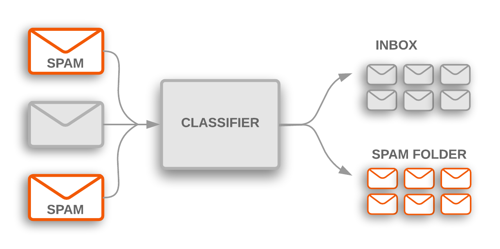

## Table of Contents

## What is a text span in the context of machine learning?

In machine learning, a text span refers to a specific part of a piece of text that is selected for analysis or processing. This could be a single word, a phrase, or a longer sequence of text within a larger document. Text spans are important in tasks like named entity recognition, where the goal is to identify and classify specific pieces of text that represent names of people, organizations, or locations, among other things.

For example, in a sentence like "Apple Inc. is planning to open a new store in New York," the text spans of interest might be "Apple Inc." and "New York." These spans are crucial for understanding the context and extracting meaningful information from the text. Machine learning models use various algorithms to identify these spans accurately, often relying on training data that is annotated with the correct spans to learn from.

## How does text span identification differ from traditional text classification?

Text span identification and traditional text classification are two different tasks in machine learning. Text span identification focuses on finding and marking specific parts of a text, like words or phrases, that are important for a certain task. For example, if you want to find all the names of people in a document, text span identification would help you highlight those names. It's about picking out the exact pieces of text that matter.

On the other hand, traditional text classification is about putting a whole piece of text into a category. Instead of focusing on specific parts, it looks at the entire text to decide what it's about. For example, you might classify an email as "spam" or "not spam" based on its entire content. Text classification uses the overall meaning and context of the text to make its decision, rather than zooming in on specific spans.

Both tasks use [machine learning](/wiki/machine-learning), but they need different kinds of data and algorithms. Text span identification often needs detailed annotations showing exactly where the important spans are, while text classification might just need examples of texts labeled with their categories. This difference in focus and data requirements makes them distinct approaches in the world of natural language processing.

## What are the common applications of text span machine learning?

Text span machine learning is commonly used in tasks like named entity recognition. This is where computers learn to pick out specific pieces of text, like names of people, places, or organizations, from a bigger document. For example, if you have a news article, the computer can highlight all the names of people mentioned in it. This helps in understanding who is involved in the story without reading the whole thing. It's also useful in things like making summaries or answering questions about a text, by focusing on the important parts.

Another common use is in sentiment analysis, where text span identification helps find the parts of a text that show positive or negative feelings. Instead of looking at the whole text, the computer can zoom in on words or phrases that really show what the writer feels. This can be helpful for businesses that want to know what customers think about their products, by looking at reviews or social media posts. By [picking](/wiki/asset-class-picking) out the key parts, they can quickly see if people are happy or unhappy.

Text span machine learning is also important in tasks like coreference resolution, where the goal is to figure out when different words or phrases in a text refer to the same thing. For example, if a text says "John went to the store. He bought some apples," the computer needs to know that "He" refers to "John." By identifying these spans, the computer can better understand the relationships between different parts of the text, making it easier to process and analyze.

## Can you explain the basic process of training a model to identify text spans?

Training a model to identify text spans involves a few key steps. First, you need a lot of text examples where the important spans are already marked. This is called annotated data. For example, if you're trying to find names of people, you would have texts where all the names are highlighted. You feed this data into the model so it can learn what to look for. The model uses this data to find patterns that help it guess where the spans might be in new texts.

Once the model has seen enough examples, it starts making predictions. It looks at new texts and tries to highlight the spans just like it was taught. To make sure it's doing a good job, you compare its guesses to the correct answers. If it's not doing well, you might need to give it more examples or adjust how it learns. Over time, with enough practice, the model gets better at finding the right spans in any text it sees.

## What are some popular datasets used for text span machine learning tasks?

One popular dataset for text span machine learning is the CoNLL-2003 dataset. This dataset is often used for named entity recognition tasks. It contains news articles from the Reuters Corpus, where names of people, organizations, and locations are marked. This helps models learn to find these names in new texts. Another commonly used dataset is the OntoNotes 5.0 dataset. It's bigger and includes texts from different sources like news, conversations, and web data. It's useful for tasks like named entity recognition and coreference resolution because it has lots of different examples.

The SQuAD (Stanford Question Answering Dataset) is another important dataset for text span identification, especially for question-answering tasks. In SQuAD, you have questions and paragraphs, and the answers to the questions are marked as spans within the paragraphs. This helps models learn to find the right answers quickly. For sentiment analysis, the SemEval datasets are often used. These datasets have texts with positive or negative words and phrases marked, helping models learn to find the parts of a text that show feelings.

## What are the main challenges faced when identifying text spans in natural language processing?

One of the main challenges in identifying text spans is dealing with the complexity and variability of human language. Words and phrases can have multiple meanings depending on the context, making it hard for a model to know which parts to focus on. For example, the word "bank" could refer to a financial institution or the side of a river. Additionally, languages have different rules and structures, so a model that works well for one language might struggle with another. This means that models need a lot of diverse training data to learn how to handle these differences.

Another challenge is the accuracy of the span boundaries. It's not always clear where a span should start and end. For instance, if you're trying to identify the name "John Smith," should you include the title "Mr." or not? This can affect how well the model performs, especially in tasks like named entity recognition or question answering. To overcome these challenges, researchers use advanced techniques like fine-tuning models on specific tasks and using more sophisticated algorithms that can better understand context and nuances in language.

## How do different machine learning models approach the problem of text span identification?

Different machine learning models approach text span identification in various ways, but a common method is using sequence labeling techniques. For example, models like Conditional Random Fields (CRFs) and Long Short-Term Memory networks (LSTMs) are often used. These models look at each word in a sentence and decide if it's part of a span or not. They do this by considering the context of the word, like the words before and after it. This helps them understand if a word like "Apple" is referring to the fruit or the company. By training on lots of examples where the spans are marked, these models learn to make better guesses about where the spans should be in new texts.

Another approach is using transformer-based models like BERT (Bidirectional Encoder Representations from Transformers). These models are good at understanding the whole context of a sentence, not just the words around a specific span. They use a technique called attention, which helps them focus on different parts of the text to figure out what's important. For example, if you're trying to find the answer to a question in a paragraph, BERT can look at the whole paragraph to find the right span. These models are trained on huge amounts of text data, so they can handle a wide variety of language tasks, including identifying text spans accurately.

## What evaluation metrics are typically used to assess the performance of text span identification models?

The most common evaluation metric for text span identification models is the F1 score. The F1 score is a way to measure how well a model finds the right spans. It looks at two things: precision, which is how many of the spans the model found are actually correct, and recall, which is how many of the correct spans the model found. The F1 score is the harmonic mean of precision and recall, which means it balances both. You can calculate it with this formula: $$F1 = 2 \times \frac{\text{precision} \times \text{recall}}{\text{precision} + \text{recall}}$$. A higher F1 score means the model is doing a better job at finding the right spans.

Another metric often used is the exact match score. This is simpler than the F1 score because it just checks if the span the model found is exactly the same as the correct span. If the model's span matches perfectly, it gets a point. If not, it doesn't. This can be useful for tasks like question answering where getting the exact right span is important. Both of these metrics help researchers see how well their models are working and where they need to improve.

## How can transfer learning be applied to improve text span identification?

Transfer learning can help make text span identification better by using what a model has already learned from one task to help it with another task. For example, a model might be trained on a big dataset like Wikipedia to understand language in general. Then, you can take that model and fine-tune it on a smaller dataset that's specifically for finding text spans, like names of people or places. This way, the model doesn't have to start from scratch. It already knows a lot about language, so it can focus on learning the specific details of finding spans.

Using transfer learning can save time and make the model work better because it's building on what it already knows. Instead of needing a huge amount of data just for text spans, you can use a model that's already good at understanding language and just teach it a bit more. This is especially helpful when you don't have a lot of data for the specific task you're working on. By starting with a model that's already smart, you can get good results faster and with less effort.

## What are the latest advancements in text span machine learning techniques?

One of the latest advancements in text span machine learning is the use of transformer-based models like BERT and its variants. These models are really good at understanding the whole context of a sentence, not just the words around a specific span. They use something called attention, which helps them focus on different parts of the text to figure out what's important. For example, if you're trying to find the answer to a question in a paragraph, BERT can look at the whole paragraph to find the right span. These models are trained on huge amounts of text data, so they can handle a wide variety of language tasks, including identifying text spans accurately.

Another advancement is the use of fine-tuning techniques to improve text span identification. Fine-tuning means taking a model that's already good at understanding language and teaching it a bit more about a specific task, like finding text spans. This way, the model doesn't have to start from scratch. It already knows a lot about language, so it can focus on learning the specific details of finding spans. Using fine-tuning can save time and make the model work better because it's building on what it already knows. This is especially helpful when you don't have a lot of data for the specific task you're working on. By starting with a model that's already smart, you can get good results faster and with less effort.

## How does the context affect the accuracy of text span identification?

Context is really important when trying to find the right text spans. Imagine you're looking for names of people in a story. If the model doesn't understand the whole story, it might get confused. For example, if it sees the word "bank," it needs to know if it's talking about a river or a place to keep money. The words around "bank" help the model figure this out. If the model can see the whole sentence or paragraph, it's more likely to pick the right spans because it understands the bigger picture.

Using advanced models like BERT helps a lot with this. These models look at the entire text, not just the words next to the span. They use something called attention to focus on different parts of the text that might be important. This helps them understand the context better and pick out the right spans more accurately. For example, if you're trying to answer a question about a paragraph, BERT can look at the whole paragraph to find the right answer. This makes the model much better at finding the important parts of the text.

## What future developments can we expect in the field of text span machine learning?

In the future, we can expect text span machine learning to get even better at understanding language. One big area of improvement will be in making models that can handle different languages more easily. Right now, models work best on the languages they were trained on, but in the future, they might be able to switch between languages without needing as much training. This would make them more useful for people all over the world. Another exciting development will be in using less data to train these models. Right now, you need a lot of examples to teach a model how to find text spans, but new techniques might let us use smaller datasets and still get good results.

Also, we might see more use of advanced techniques like few-shot learning and meta-learning. These methods let models learn new tasks with just a few examples, which could make it easier to teach them to find different kinds of text spans without starting over from scratch. For example, if a model already knows how to find names of people, it might be able to quickly learn to find names of places too. This would make text span identification faster and more flexible. Overall, these advancements will make text span machine learning more powerful and easier to use in everyday applications.

## References & Further Reading

[1]: Tjong Kim Sang, E. F., & De Meulder, F. (2003). ["Introduction to the CoNLL-2003 Shared Task: Language-Independent Named Entity Recognition."](https://aclanthology.org/W03-0419/) In Proceedings of the Seventh Conference on Natural Language Learning at HLT-NAACL 2003.

[2]: Pradhan, S., et al. (2013). ["Towards Robust Linguistic Analysis using OntoNotes."](https://aclanthology.org/W13-3516/) Proceedings of the Seventeenth Conference on Computational Natural Language Learning.

[3]: Rajpurkar, P., et al. (2016). ["SQuAD: 100,000+ Questions for Machine Comprehension of Text."](https://aclanthology.org/D16-1264/) Proceedings of the 2016 Conference on Empirical Methods in Natural Language Processing (EMNLP).

[4]: Pennington, J., Socher, R., & Manning, C. D. (2014). ["GloVe: Global Vectors for Word Representation."](https://aclanthology.org/D14-1162/) Proceedings of the 2014 Conference on Empirical Methods in Natural Language Processing (EMNLP).

[5]: Devlin, J., Chang, M. W., Lee, K., & Toutanova, K. (2019). ["BERT: Pre-training of Deep Bidirectional Transformers for Language Understanding."](https://arxiv.org/abs/1810.04805) Proceedings of the 2019 Conference of the North American Chapter of the Association for Computational Linguistics: Human Language Technologies.