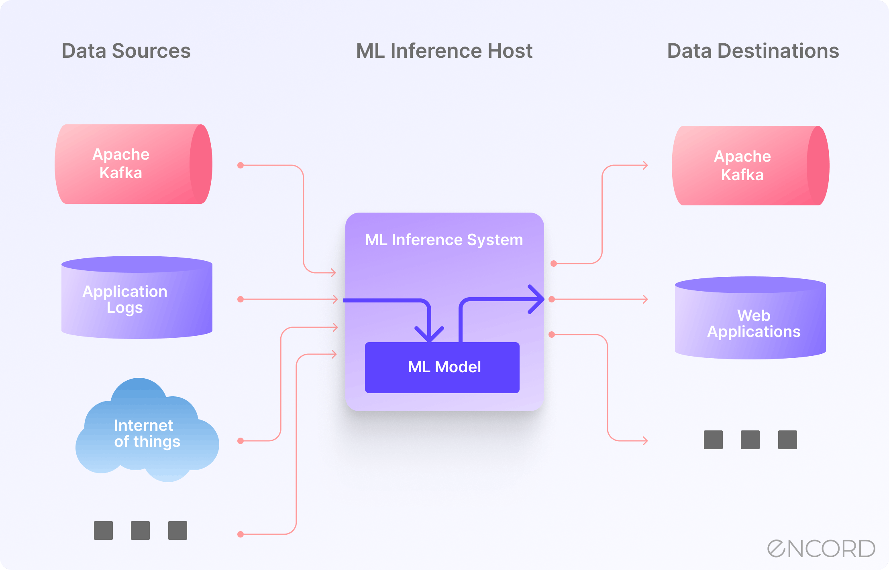

## Table of Contents

## What is a Textual Inference Model?

A Textual Inference Model is a type of artificial intelligence that helps computers understand and reason about the relationships between pieces of text. It tries to figure out if one piece of text can be logically concluded from another piece of text. For example, if you have the sentence "John went to the store," a textual inference model might be able to infer that "John left his house" because going to the store usually means leaving home.

These models are important for many applications, like search engines, where they help understand what a user is really asking for. They also help in machine translation, where understanding the implied meaning can make translations more accurate. Textual inference models use complex algorithms and lots of data to learn how to make these inferences, and they are constantly improving as technology advances.

## How do Textual Inference Models work in machine learning?

Textual Inference Models in machine learning work by using algorithms to understand the relationships between different pieces of text. They are trained on large amounts of data, which helps them learn patterns and connections. For example, if the model sees many examples where "It rained" leads to "The ground is wet," it will start to understand that rain usually makes the ground wet. These models use techniques like natural language processing (NLP) to break down sentences into smaller parts and analyze them.

Once trained, these models can take a piece of text, called the premise, and another piece of text, called the hypothesis, and decide if the hypothesis can be logically concluded from the premise. They do this by comparing the meanings of the words and the structure of the sentences. If the model decides that the hypothesis follows from the premise, it will output a high confidence score. If not, the score will be low. This process helps computers understand human language better and make more accurate predictions or translations.

## What are the main applications of Textual Inference Models?

Textual Inference Models are used in many important ways. One main use is in search engines. When you type a question into a search engine, the engine uses these models to understand what you really want to know. For example, if you search for "best places to eat in New York," the search engine can use textual inference to understand you're looking for restaurants and not just any places to eat. This makes the search results more accurate and helpful.

Another big use is in machine translation. When you use a tool to translate text from one language to another, textual inference helps make the translation better. It can figure out the meaning behind the words and translate the ideas, not just the words. This is important because languages don't always translate directly, and understanding the context can make a big difference.

Textual Inference Models also help in areas like question answering and text summarization. In question answering, these models can understand a question and find the right answer from a large amount of text. For example, if you ask, "Who was the first person on the moon?" the model can find the answer "Neil Armstrong" from a document. In text summarization, the model can read a long piece of text and create a shorter version that keeps the main ideas. This is useful for quickly understanding long documents or articles.

## Can you explain the basic components of a Textual Inference Model?

The basic components of a Textual Inference Model include a text encoder, a reasoning module, and a decision layer. The text encoder takes the input texts, such as the premise and the hypothesis, and converts them into a format that the model can understand. This often involves breaking down the sentences into smaller parts like words or phrases and turning them into numerical vectors. These vectors capture the meaning of the text in a way that computers can process.

The reasoning module is where the model tries to understand the relationship between the premise and the hypothesis. It uses the encoded vectors to compare the meanings and see if the hypothesis logically follows from the premise. This part of the model can use different techniques, like attention mechanisms or logical rules, to figure out if the inference makes sense. The decision layer then takes the output from the reasoning module and turns it into a final prediction. It might output a score that shows how confident the model is that the hypothesis can be inferred from the premise. This score helps the model decide whether to accept or reject the hypothesis.

## What is the RAHP model and how does it relate to Textual Inference?

The RAHP model, which stands for "Recognizing Assumptions in Human Persuasion," is a special kind of model used in the field of natural language processing. It focuses on understanding the assumptions people make when they try to persuade others. For example, if someone says, "You should buy this car because it's fast," they are assuming that speed is important to the person they are talking to. The RAHP model tries to figure out these hidden assumptions by looking at the text.

RAHP relates to textual inference because both are about understanding hidden meanings in text. Textual inference models try to see if one piece of text can be logically concluded from another. RAHP takes this a step further by trying to understand the assumptions behind the text. Both types of models use similar techniques, like breaking down sentences and comparing meanings, to understand what people are really saying. This makes RAHP a useful tool in areas like advertising, where understanding what people assume can help make messages more effective.

## How does the RAHP model improve upon traditional Textual Inference techniques?

The RAHP model improves upon traditional Textual Inference techniques by focusing on understanding the assumptions people make in their communication. While traditional Textual Inference models try to figure out if one piece of text can be logically concluded from another, RAHP goes deeper by analyzing the underlying assumptions that lead to those conclusions. For example, if someone says, "You should eat this fruit because it's healthy," a traditional model might just check if the fruit being healthy is a valid conclusion. RAHP, however, would also look at the assumption that the person values health, which is not directly stated but important for understanding the full message.

This deeper understanding of assumptions makes RAHP particularly useful in contexts like persuasion and advertising, where knowing what people assume can help craft more effective messages. By identifying these hidden assumptions, RAHP can help tailor communication to better align with the audience's beliefs and values. This approach adds a new layer of insight to the analysis of text, making it a powerful tool for anyone looking to understand and influence human behavior through language.

## What are the key challenges faced when implementing Textual Inference Models?

Implementing Textual Inference Models comes with several key challenges. One big challenge is understanding the many ways people can say the same thing. For example, "It's raining cats and dogs" means the same as "It's pouring," but the words are very different. Textual Inference Models need to learn all these different ways of saying things, which can be hard because there are so many possibilities. Another challenge is understanding context. Words can mean different things depending on the situation. For example, "bank" can mean a place to put money or the side of a river. The model needs to figure out which meaning is right from the context, which is not always easy.

Another challenge is handling long and complex texts. When the text gets longer, it's harder for the model to keep track of all the information and understand how it fits together. This is especially true for texts that have many sentences or paragraphs. The model also needs to be good at understanding logical relationships between different parts of the text. For example, if one sentence says "John is taller than Mike," and another says "Mike is taller than Sam," the model should be able to infer that "John is taller than Sam." Getting all these things right takes a lot of training data and smart algorithms.

## How can one evaluate the performance of a Textual Inference Model?

Evaluating the performance of a Textual Inference Model involves checking how well it can figure out if one piece of text can be logically concluded from another. A common way to do this is by using a dataset that has pairs of sentences, called the premise and the hypothesis, along with labels that say if the hypothesis can be inferred from the premise. The model makes predictions on these pairs, and its performance is measured using metrics like accuracy, which shows the percentage of correct predictions, and F1 score, which is a balance between precision and recall. Precision measures how many of the model's positive predictions were correct, while recall measures how many of the actual positive cases the model caught. A good model will have high scores in these metrics.

Another way to evaluate these models is through human evaluation. People read the model's predictions and rate how well the model did. This can be more accurate because people understand language better than computers, but it's also more time-consuming and expensive. Sometimes, we also look at how the model performs on different types of text, like news articles or social media posts, to see if it works well in different situations. By using both automatic metrics and human judgments, we can get a good idea of how well a Textual Inference Model is doing and where it needs to improve.

## What datasets are commonly used for training and testing Textual Inference Models?

Common datasets for training and testing Textual Inference Models include the Stanford Natural Language Inference (SNLI) and the Multi-Genre Natural Language Inference (MultiNLI) datasets. The SNLI dataset has pairs of sentences, where one sentence is the premise and the other is the hypothesis. Each pair comes with a label that says if the hypothesis is true (entailment), false (contradiction), or not related (neutral) based on the premise. The SNLI dataset is large, with around 570,000 pairs, which helps the model learn a lot about different ways people can say things. The MultiNLI dataset is similar but includes texts from different sources like fiction, government reports, and telephone conversations. This variety helps the model understand different kinds of language and contexts.

Another useful dataset is the Recognizing Textual Entailment (RTE) dataset series, which was used in several RTE challenges. These datasets also have premise-hypothesis pairs with labels for entailment or non-entailment. The RTE datasets are smaller than SNLI and MultiNLI but still valuable for testing how well a model can handle different types of text. For example, RTE-1 has about 800 pairs, while RTE-5 has around 600 pairs. Using these datasets, researchers can train their Textual Inference Models and see how well they perform on different kinds of text and in different situations.

## How do advanced techniques like deep learning enhance Textual Inference Models?

Deep learning helps Textual Inference Models understand and predict better by using big neural networks that can learn from lots of data. These networks are good at finding patterns in text that simpler models might miss. For example, [deep learning](/wiki/deep-learning) models can learn how words relate to each other and how sentences are built. This helps the model understand not just the words, but also the meaning behind them. By using techniques like Long Short-Term Memory (LSTM) networks or Transformers, deep learning can keep track of long pieces of text and understand how different parts of the text connect to each other.

These advanced techniques make Textual Inference Models more accurate and able to handle different kinds of text. For instance, a model using deep learning can better understand the context of a sentence and the subtle differences between similar words. This is important for tasks like translating languages or answering questions, where understanding the full meaning of the text is key. By training on large datasets, deep learning models can also adapt to new types of text and situations, making them more flexible and useful in real-world applications.

## What are some of the latest research developments in the field of Textual Inference?

Recent research in Textual Inference has focused on improving models to better understand the nuances of human language. One significant development is the use of large language models like BERT and its variants, which have shown remarkable performance in understanding context and making accurate inferences. These models use a technique called "pre-training" on vast amounts of text data, followed by "fine-tuning" on specific tasks like textual inference. This approach helps them capture subtle linguistic patterns and improve their ability to infer logical relationships between sentences. Researchers are also exploring ways to make these models more explainable, so we can understand why they make certain predictions, which is important for building trust and improving the models further.

Another exciting area of research is the integration of external knowledge into Textual Inference Models. By incorporating information from knowledge graphs or databases, these models can make more informed inferences, especially when dealing with factual or domain-specific texts. For example, if a model knows from a knowledge graph that "Paris is the capital of France," it can better understand and infer related statements. This approach is particularly useful in specialized fields like medicine or law, where understanding specific terminology and facts is crucial. Researchers are also working on making these models more efficient, so they can run on devices with limited computing power, expanding their use in everyday applications.

## How can Textual Inference Models be integrated into larger natural language processing systems?

Textual Inference Models can be integrated into larger natural language processing systems to help these systems understand and process text better. For example, in a search engine, a Textual Inference Model can help figure out what a user really means when they type in a query. The model can look at the words and understand the context, which helps the search engine give more accurate results. In a chatbot or virtual assistant, Textual Inference Models can understand what a user is asking and give better answers. By adding these models to bigger systems, the systems can understand language more like a human does, making them more useful and helpful.

Another way Textual Inference Models are used in larger systems is in machine translation. When translating from one language to another, understanding the meaning behind the words is important. A Textual Inference Model can help by figuring out the logical relationships between sentences in the original text and making sure the translation keeps those relationships. This makes translations more accurate and natural-sounding. In text summarization, these models can also help by understanding the main ideas in a long piece of text and creating a shorter summary that keeps the important points. By using Textual Inference Models, larger natural language processing systems can work better and give more useful results to users.

## References & Further Reading

[1]: Bowman, S. R., Angeli, G., Potts, C., & Manning, C. D. (2015). ["A large annotated corpus for learning natural language inference."](https://aclanthology.org/D15-1075/) Proceedings of the 2015 Conference on Empirical Methods in Natural Language Processing.

[2]: Williams, A., Nangia, N., & Bowman, S. R. (2018). ["A Broad-Coverage Challenge Corpus for Sentence Understanding through Inference."](https://aclanthology.org/N18-1101/) Proceedings of the 2018 Conference of the North American Chapter of the Association for Computational Linguistics: Human Language Technologies.

[3]: Devlin, J., Chang, M. W., Lee, K., & Toutanova, K. (2019). ["BERT: Pre-training of Deep Bidirectional Transformers for Language Understanding."](https://arxiv.org/abs/1810.04805) arXiv preprint arXiv:1810.04805.

[4]: MacCartney, B., & Manning, C. D. (2009). ["An Extended Model of Natural Logic."](https://aclanthology.org/W09-3714/) Proceedings of the Eighth International Conference on Computational Semantics. 

[5]: Dagan, I., Glickman, O., & Magnini, B. (2005). ["The PASCAL Recognising Textual Entailment Challenge."](https://link.springer.com/chapter/10.1007/11736790_9) In Machine Learning Challenges Workshop.

[6]: Chen, Q., Zhu, X., Ling, Z., Wei, S., Jiang, H., & Inkpen, D. (2016). ["Enhanced LSTM for Natural Language Inference."](https://aclanthology.org/P17-1152/) Proceedings of the 55th Annual Meeting of the Association for Computational Linguistics.

[7]: ["Natural Language Inference (NLI) - An overview."](https://towardsdatascience.com/natural-language-inference-an-overview-57c0eecf6517/) Towards Data Science. 

[8]: Kiesel, J., Hagen, M., & Stein, B. (2017). ["State of the Art in Textual Entailment Studies"](https://aclanthology.org/P18-1022/) - State of the Art in Computational Advances.