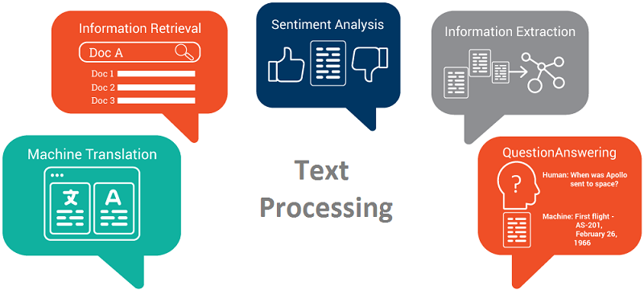

## Table of Contents

## What is textual meaning in the context of machine learning?

In machine learning, textual meaning refers to the process of understanding and interpreting the content of text data. This involves using algorithms and models to extract useful information from text, such as sentiment, topics, or specific entities. For example, when a machine learning model reads a customer review, it tries to understand if the review is positive or negative, and what specific aspects of the product the reviewer is talking about. This is important because text data is everywhere, from social media posts to news articles, and being able to process and understand it can help in many applications, like improving customer service or analyzing public opinion.

To achieve this, machine learning models often use techniques like natural language processing (NLP). NLP helps computers to read, understand, and generate human language. One common approach in NLP is to convert text into a format that machines can work with, often using numerical representations. For instance, a model might use word embeddings, where words are converted into vectors in a high-dimensional space, allowing the model to understand relationships between words. This way, the model can learn that words like "happy" and "joyful" are similar, while "happy" and "sad" are different. By doing this, the machine can better grasp the textual meaning and make more accurate predictions or classifications based on the text it processes.

## How does machine learning interpret textual data?

Machine learning interprets textual data by using special techniques to understand words and sentences. One common way is through natural language processing (NLP), which helps computers read and make sense of human language. When a machine reads a text, like a customer review or a tweet, it tries to figure out what the words mean and how they relate to each other. For example, if someone writes "I love this product," the machine tries to understand that "love" means the person likes the product a lot. This is done by turning words into numbers, which machines can work with better.

One way to turn words into numbers is by using something called word embeddings. Imagine each word as a point in a big space. Words that mean similar things, like "happy" and "joyful," are close together in this space. This helps the machine understand that these words are related. For instance, if a review says "The movie was joyful," the machine can guess that the reviewer liked the movie because "joyful" is near "happy" in its space. By doing this, the machine can pick up on the overall meaning of the text and make predictions or decisions based on what it reads.

## What are the basic techniques used to extract meaning from text?

One basic technique to extract meaning from text is called tokenization. Tokenization breaks down a piece of text into smaller parts, like words or sentences. For example, if you have the sentence "The cat is on the mat," tokenization would split it into individual words: "The," "cat," "is," "on," "the," "mat." This helps the machine understand the structure of the text and makes it easier to process.

Another technique is called stop word removal. Stop words are common words like "the," "is," and "and" that don't add much meaning to the text. By removing these words, the machine can focus on the more important words that [carry](/wiki/carry-trading) the main message. For example, after removing stop words from "The cat is on the mat," you might be left with "cat on mat," which still conveys the main idea but is simpler for the machine to work with.

A third technique is called stemming or lemmatization. These methods reduce words to their root form. Stemming cuts off the ends of words to get to the root, so "running" might become "run." Lemmatization is a bit more sophisticated and uses the context of the word to find its base form, so "better" might become "good." This helps the machine see that different forms of a word mean the same thing, making it easier to understand the overall meaning of the text.

## What role do algorithms play in understanding textual meaning?

Algorithms are like the brains behind understanding what text means in [machine learning](/wiki/machine-learning). They take the text and use different methods to figure out what the words and sentences are trying to say. For example, an algorithm might use something called a [neural network](/wiki/neural-network) to read a sentence and guess if it's positive or negative. It does this by looking at patterns in the words and how they are used together. The more the algorithm practices with different texts, the better it gets at understanding what they mean.

One important part of these algorithms is how they turn words into numbers. This is called word embedding, and it helps the machine see how words relate to each other. For instance, if you have the words "happy" and "joyful," the algorithm might place them close together in a big space, showing they mean similar things. This way, when the machine reads a sentence like "The party was joyful," it can understand that the party was probably a happy event. By using these algorithms, machines can pick up on the meaning of text and make smart guesses about what it's all about.

## How can machine learning models be trained to recognize textual meaning?

Machine learning models can be trained to recognize textual meaning by feeding them lots of examples of text. These examples, called training data, help the model learn what different words and sentences mean. For instance, if you want the model to understand customer reviews, you would show it many reviews and tell it whether they are positive or negative. The model looks for patterns in the words and how they are used, and over time, it gets better at figuring out what the text means. This process is called supervised learning because the model is guided by examples that have been labeled with the correct answers.

One way to help the model understand text is by using word embeddings. This means turning words into numbers that the machine can work with. For example, the model might use a technique called Word2Vec to create these embeddings. Imagine each word as a point in a big space, where words that mean similar things are close together. So, "happy" and "joyful" would be near each other. By doing this, the model can see how words relate to each other and understand the overall meaning of the text better. With enough practice and the right algorithms, the model can become very good at recognizing what different texts are trying to say.

## What are some common challenges in processing textual data for meaning?

One common challenge in processing textual data for meaning is dealing with the complexity and ambiguity of human language. Words can have multiple meanings, and the same sentence can be interpreted differently depending on the context. For example, the word "bank" can refer to a financial institution or the side of a river. Machine learning models need to be trained on large and diverse datasets to understand these nuances, but even then, they might struggle with less common uses of language or slang.

Another challenge is handling different languages and dialects. Each language has its own rules and structures, and what works well for one language might not work for another. Translating text into a common language can help, but this adds another layer of complexity because translations are not always perfect. Additionally, dialects and regional variations can make it hard for a model trained on standard language to understand text from different regions. To overcome these challenges, machine learning models need to be carefully designed and trained with a wide variety of text examples to improve their ability to understand and process textual meaning accurately.

## How do different machine learning models approach the task of textual meaning differently?

Different machine learning models approach the task of understanding textual meaning in unique ways. For example, traditional models like Naive Bayes and Support Vector Machines (SVMs) often rely on simpler techniques like bag-of-words or term frequency-inverse document frequency (tf-idf) to represent text. These methods count how often words appear in a document and use that information to classify the text. While these models are good at handling structured data and can be quick to train, they might struggle with understanding the context and the relationships between words, which are important for grasping the deeper meaning of text.

On the other hand, more advanced models like neural networks, especially those using [deep learning](/wiki/deep-learning), take a different approach. These models often use techniques like word embeddings, which turn words into vectors in a high-dimensional space. This helps the model see how words relate to each other. For example, Recurrent Neural Networks (RNNs) and their more advanced versions like Long Short-Term Memory (LSTM) networks can understand sequences of words and keep track of context over long texts. Transformer models, like BERT, go even further by using attention mechanisms to focus on different parts of the text, allowing them to capture complex relationships and nuances in language. These models are much better at understanding the subtleties of human language but require more data and computational power to train effectively.

## What advanced techniques are used to enhance the understanding of textual meaning?

Advanced techniques like deep learning and neural networks help machines understand text better. One popular method is using transformer models, like BERT, which use something called attention mechanisms. These mechanisms let the model focus on different parts of the text to understand how words relate to each other. For example, when reading a sentence, the model can pay more attention to important words and less to others, helping it grasp the overall meaning. This is much better than older methods that just count how often words appear, because it can understand context and the relationships between words.

Another advanced technique is transfer learning, where a model trained on one task is used to help with another. For example, a model trained on a large amount of general text can be fine-tuned to understand specific types of text, like medical reports or legal documents. This saves time and resources because the model already knows a lot about language and just needs to learn the specifics of the new task. By using these advanced techniques, machines can get much better at understanding what text means, even when the text is complex or uses specialized language.

## How does the concept of context influence the extraction of textual meaning?

Context plays a big role in understanding what text means. When we read words, we don't just see them one by one; we look at how they fit together in a sentence or a whole document. For example, the word "bank" could mean a place to keep money or the side of a river. If you read "She deposited money in the bank," the context tells you it's about money, not a river. Machines need to understand this context to get the right meaning from text. They use special methods, like looking at the words around the one they're trying to understand, to figure out what's being talked about.

Advanced machine learning models, like those using neural networks, are really good at understanding context. They can look at whole sentences or even longer pieces of text to see how everything fits together. For instance, a model might use something called an attention mechanism to focus on different parts of the text. This helps it see which words are important for understanding the meaning. By doing this, the machine can better understand complex ideas and the subtleties of human language, making it more accurate in figuring out what text means.

## What are the latest developments in machine learning for textual meaning analysis?

The latest developments in machine learning for textual meaning analysis include the rise of large language models like GPT-3 and its successors. These models are trained on huge amounts of text data from the internet, which helps them understand a wide variety of language patterns and contexts. They use transformer architectures, which are good at understanding the relationships between words in a sentence. This allows them to generate human-like text and answer questions about the meaning of text more accurately than ever before. For example, these models can now understand and generate text in multiple languages and handle complex tasks like summarization and translation.

Another important development is the use of fine-tuning and transfer learning. This means taking a big model that's already been trained on a lot of general text and then teaching it to be good at a specific task, like understanding medical reports or legal documents. This saves time and resources because the model already knows a lot about language and just needs to learn the specifics of the new task. Researchers are also working on making these models more transparent and explainable, so it's easier to understand how they come up with their answers. This is important for building trust in the models and making sure they are used responsibly.

## How can machine learning be used to improve semantic analysis in natural language processing?

Machine learning can improve semantic analysis in natural language processing by using advanced models like neural networks to understand the meaning of text better. These models can look at whole sentences or even longer pieces of text to see how everything fits together. For example, they use something called an attention mechanism to focus on different parts of the text. This helps the model see which words are important for understanding the meaning. By doing this, the machine can better understand complex ideas and the subtleties of human language, making it more accurate in figuring out what text means.

Another way machine learning helps is by using large language models like GPT-3. These models are trained on huge amounts of text from the internet, which helps them understand a wide variety of language patterns and contexts. They can generate human-like text and answer questions about the meaning of text more accurately than ever before. For example, these models can now understand and generate text in multiple languages and handle complex tasks like summarization and translation. By using these advanced techniques, machines can get much better at understanding what text means, even when the text is complex or uses specialized language.

## What future trends are expected in the field of textual meaning and machine learning?

In the future, we can expect machine learning models to get even better at understanding what text means. One big trend will be the use of even larger and more powerful language models. These models will be trained on more data from the internet, which will help them understand a wider variety of languages and contexts. They will be able to handle more complex tasks, like understanding long documents or answering questions about them. This will make them more useful in areas like customer service, where they can understand and respond to customer queries more accurately.

Another trend will be the focus on making these models more transparent and explainable. Right now, it can be hard to understand how these models come up with their answers. In the future, researchers will work on ways to make it easier to see how the models think. This will help build trust in the models and make sure they are used responsibly. For example, if a model is used in a hospital to help doctors understand patient records, it will be important for the doctors to know how the model came to its conclusions. By making these models more transparent, we can use them more confidently in important areas like healthcare and law.

## References & Further Reading

[1]: Jurafsky, D., & Martin, J. H. (2020). ["Speech and Language Processing"](https://web.stanford.edu/~jurafsky/slp3/) (3rd ed.). Draft chapters available online.

[2]: Devlin, J., Chang, M. W., Lee, K., & Toutanova, K. (2019). ["BERT: Pre-training of Deep Bidirectional Transformers for Language Understanding."](https://aclanthology.org/N19-1423/) arXiv preprint arXiv:1810.04805.

[3]: Mikolov, T., Chen, K., Corrado, G., & Dean, J. (2013). ["Efficient Estimation of Word Representations in Vector Space."](https://arxiv.org/abs/1301.3781) arXiv preprint arXiv:1301.3781.

[4]: Goldberg, Y. (2017). ["Neural Network Methods for Natural Language Processing."](https://link.springer.com/book/10.1007/978-3-031-02165-7) Synthesis Lectures on Human Language Technologies.

[5]: Vaswani, A., Shazeer, N., Parmar, N., Uszkoreit, J., Jones, L., Gomez, A. N., ... & Polosukhin, I. (2017). ["Attention is All You Need."](https://arxiv.org/abs/1706.03762) Advances in neural information processing systems.

[6]: Manning, C. D., Raghavan, P., & Schütze, H. (2008). ["Introduction to Information Retrieval."](https://nlp.stanford.edu/IR-book/information-retrieval-book.html) Cambridge University Press.

[7]: Pennington, J., Socher, R., & Manning, C. D. (2014). ["GloVe: Global Vectors for Word Representation."](https://aclanthology.org/D14-1162/) Proceedings of the 2014 conference on empirical methods in natural language processing (EMNLP).

[8]: LeCun, Y., Bengio, Y., & Hinton, G. (2015). ["Deep Learning."](https://www.nature.com/articles/nature14539) Nature, 521(7553), 436-444.