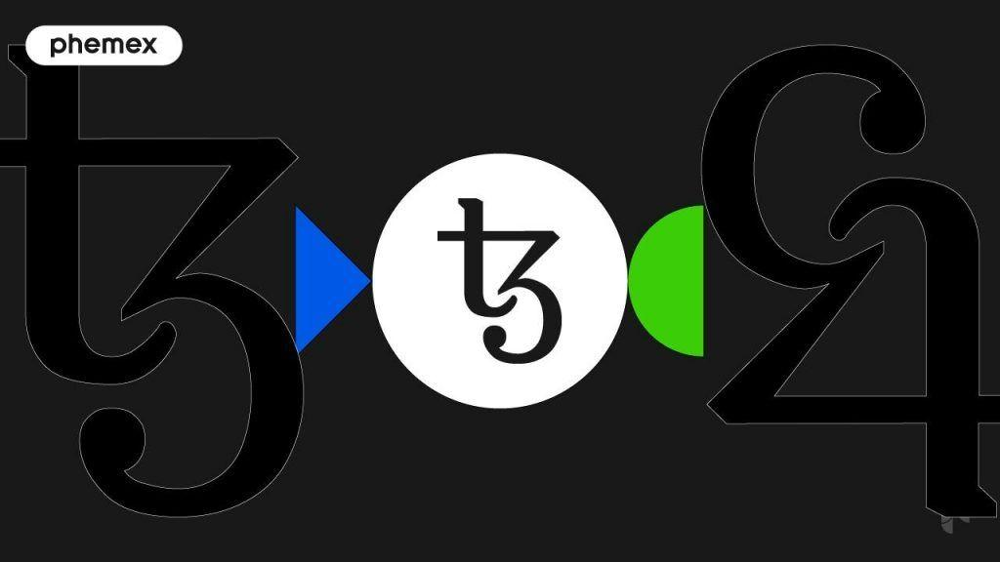

## Table of Contents

## What is Tezos (XTZ) and why was it created?

Tezos (XTZ) is a type of cryptocurrency, similar to Bitcoin or Ethereum. It was created to make it easier for people to build and use decentralized applications, which are apps that run on a network of computers instead of a single company's servers. The special thing about Tezos is that it can change and improve itself over time without splitting into different versions, which is a problem that other cryptocurrencies sometimes face.

The creators of Tezos, Arthur and Kathleen Breitman, wanted to solve some of the big problems they saw in other cryptocurrencies. They thought that if the people using a cryptocurrency could vote on changes and updates, it would be more fair and less likely to cause big fights or splits in the community. That's why they built Tezos with a system where everyone who holds XTZ can vote on changes to the network, making it a more democratic and adaptable cryptocurrency.

## How does Tezos differ from other cryptocurrencies like Bitcoin and Ethereum?

Tezos is different from Bitcoin and Ethereum because it can update itself without causing splits in the community. Bitcoin and Ethereum sometimes face big disagreements when they want to change or improve their systems. These disagreements can lead to splits where some people use the old version and others use the new version, creating two separate cryptocurrencies. Tezos avoids this problem by letting everyone who holds XTZ vote on changes. If most people agree, the change happens smoothly, and everyone keeps using the same Tezos network.

Another way Tezos differs is in how it encourages people to help keep the network running. Bitcoin uses a system called "mining," where people use powerful computers to solve math problems and get rewarded with new bitcoins. Ethereum is moving to a different system, but it used to work similarly. Tezos, on the other hand, uses a system called "baking," where people who hold XTZ can help validate transactions and create new blocks. They get rewarded with more XTZ, but it's less energy-intensive than mining, making it more environmentally friendly.

## What is the native cryptocurrency of Tezos and what is it used for?

The native [cryptocurrency](/wiki/cryptocurrency) of Tezos is called XTZ, also known as Tez. People use XTZ for a few important things on the Tezos network. First, they use it to pay for transactions, like sending money to someone else or using a decentralized app. Second, XTZ is used for something called "baking," which is how people help keep the Tezos network running smoothly. When people bake, they get rewarded with more XTZ.

XTZ is also important because it lets people vote on changes to the Tezos network. If someone has XTZ, they can vote on new ideas and updates. This helps make sure that everyone who uses Tezos has a say in how it grows and changes. This voting system is one of the big reasons why Tezos is different from other cryptocurrencies.

## How does the Tezos blockchain work?

The Tezos blockchain is like a big, shared notebook where everyone can see and add new pages, but no one can change the old ones. It works by having a group of people, called "bakers," who help add new pages to the notebook. These bakers use their computers to check and approve new transactions, like sending XTZ from one person to another. When a baker adds a new page, they get rewarded with more XTZ. This system is called "proof of stake," and it's different from other cryptocurrencies like Bitcoin, which use a lot of energy to solve math problems.

What makes Tezos special is that it can change and improve itself without causing big fights or splits in the community. If someone has an idea for a new feature or a way to make Tezos better, they can write it up and share it with everyone. Then, people who hold XTZ can vote on whether they like the idea or not. If most people agree, the change gets added to the Tezos network, and everyone keeps using the same notebook. This voting system helps keep Tezos fair and adaptable, making it easier for the community to work together and grow.

## What is the significance of Tezos' self-amending protocol?

Tezos' self-amending protocol is a big deal because it lets the Tezos network change and improve itself without causing big fights or splits in the community. In other cryptocurrencies, when people want to make changes, they sometimes disagree so much that they end up using different versions of the cryptocurrency. This can be confusing and messy. But with Tezos, everyone who holds XTZ can vote on changes. If most people agree, the change happens smoothly, and everyone keeps using the same Tezos network.

This self-amending feature makes Tezos more flexible and easier to update than other cryptocurrencies. It means that Tezos can keep getting better over time without causing problems for the people who use it. This is important because it helps keep the community together and makes it easier for developers to build new things on the Tezos network. By letting everyone have a say in how Tezos grows and changes, it stays fair and adaptable, which is a big part of what makes Tezos special.

## How can someone acquire Tezos (XTZ)?

Someone can acquire Tezos (XTZ) in a few different ways. One common way is by using a cryptocurrency exchange, which is like an online marketplace where you can buy and sell different cryptocurrencies. To do this, you need to sign up for an account on an exchange that supports Tezos, like Coinbase or Binance. After that, you can deposit money into your account, usually in the form of dollars or another cryptocurrency, and then use that money to buy XTZ. It's a bit like buying something on an online store, but instead of getting a physical item, you get XTZ in your digital wallet.

Another way to get XTZ is through something called "baking" or "delegating." If you already have some XTZ, you can help keep the Tezos network running by becoming a baker or by delegating your XTZ to someone else who is baking. Bakers get rewarded with more XTZ for adding new transactions to the Tezos blockchain. If you delegate your XTZ, you let someone else bake on your behalf, and you still get a share of the rewards. This can be a good way to earn more XTZ over time without having to buy it all at once.

## What are the steps to set up a Tezos wallet?

To set up a Tezos wallet, first you need to choose a wallet that works with Tezos. There are different types of wallets, like software wallets that you can download on your computer or phone, and hardware wallets that are like a special USB drive that keeps your XTZ safe. Some popular Tezos wallets are TezBox, Kukai, and Ledger. Once you've picked a wallet, go to their website and follow the instructions to download and install it. Make sure you're using the official website to avoid any scams.

After you've installed the wallet, you'll need to create a new account. This usually involves setting up a password and writing down a special set of words called a "recovery phrase" or "seed phrase." This phrase is very important because it can help you get your XTZ back if you lose your wallet or forget your password. Keep this phrase safe and don't share it with anyone. Once your account is set up, you can start using your wallet to send and receive XTZ, and even participate in baking or delegating if you want to help the Tezos network and earn more XTZ.

## What are smart contracts on Tezos and how are they used?

Smart contracts on Tezos are like special computer programs that run on the Tezos blockchain. They're called "smart" because they can do things automatically, like making sure a deal between two people happens the way it's supposed to. For example, if you want to buy something from someone else, a smart contract can make sure you get the item only after you've paid the right amount of XTZ. This makes things fair and safe for everyone involved.

People use smart contracts on Tezos for all sorts of things, like creating new cryptocurrencies, running decentralized apps, and even voting on changes to the Tezos network. Because smart contracts run on the blockchain, they're very hard to change or cheat, which makes them trustworthy. This is why they're so useful for building things that need to be fair and secure, like financial apps or games where everyone needs to follow the same rules.

## How does the governance model of Tezos work, and how can token holders participate?

The governance model of Tezos is a way for people who hold XTZ to help decide how the Tezos network should change and grow. It works by letting anyone with XTZ vote on new ideas and updates. If someone thinks of a way to make Tezos better, they can write it up and share it with everyone. Then, people who hold XTZ can vote on whether they like the idea or not. If most people agree, the change gets added to the Tezos network. This helps keep Tezos fair and adaptable because everyone gets a say in how it changes.

Token holders can participate in the governance of Tezos by voting on these proposals. To vote, they need to have some XTZ in their wallet. They can then use their wallet to see the proposals and cast their votes. Voting happens in different rounds, and if a proposal gets enough votes, it moves forward to the next round. If it keeps getting enough votes, it eventually becomes part of the Tezos network. This way, everyone who holds XTZ can help shape the future of Tezos.

## What are some of the major use cases and applications built on Tezos?

Tezos is used for many different things, one of which is creating new cryptocurrencies. People can use Tezos to make their own digital money, called tokens, which they can use for things like raising money for projects or rewarding people in games. These tokens are built on the Tezos blockchain, which makes them safe and easy to use. Another big use of Tezos is for decentralized finance, or DeFi. This means people can use Tezos to borrow, lend, or trade money without needing a bank or other middleman. It's like having a bank that runs on the internet, and it's all powered by smart contracts on Tezos.

Another important use of Tezos is for decentralized apps, or dApps. These are apps that run on the Tezos blockchain, which means they're not controlled by any one company. People use dApps for things like playing games, buying and selling digital art, or even voting on things. Because they're on the blockchain, dApps are very secure and hard to cheat. This makes them great for things where you need to trust that everyone is playing by the same rules.

## What are the potential risks and challenges associated with investing in Tezos?

Investing in Tezos, like any cryptocurrency, comes with some risks and challenges. One big risk is that the value of XTZ can go up and down a lot. This means you could lose money if the price goes down after you buy it. Another risk is that the technology behind Tezos is still new and can have problems or bugs. If something goes wrong with the Tezos network, it could affect the value of XTZ or make it hard to use. Also, since cryptocurrencies are not controlled by governments or banks, they can be targets for hackers who might try to steal your XTZ.

Another challenge is understanding how Tezos works. It's a complicated system with things like baking, smart contracts, and voting. If you don't understand these things, it can be hard to make good decisions about when to buy or sell XTZ. Plus, the rules and laws about cryptocurrencies are different in different places. This can make it tricky to know if it's legal to invest in Tezos where you live. It's important to do a lot of research and be careful before you decide to invest in Tezos or any other cryptocurrency.

## How does Tezos handle scalability and what future developments are planned?

Tezos handles scalability by using a system called "proof of stake," which is different from other cryptocurrencies like Bitcoin that use "proof of work." In proof of stake, people who hold XTZ can help keep the network running by baking or delegating their XTZ. This system uses less energy and can handle more transactions at once than proof of work, which makes Tezos more scalable. But, like any blockchain, Tezos still has limits on how many transactions it can process, and the team is always working on ways to make it even better.

In the future, Tezos plans to keep improving its scalability through updates and upgrades. One big idea is something called "sharding," which would split the Tezos network into smaller parts to handle more transactions at the same time. Another plan is to make the baking process even faster and more efficient. The Tezos community is always coming up with new ideas and voting on them, so the network can keep getting better over time. This means that Tezos should be able to handle more users and transactions in the future, making it a more useful and powerful blockchain.

## References & Further Reading

[1]: Good, A., & Öksüz, H. (2022). ["Tezos: A Self-Amending Crypto-Ledger."](https://www.semanticscholar.org/paper/Tezos-%3A-A-Self-Amending-Crypto-Ledger-Position-Goodman-Faire/f7907be464ef4c8aa74aacb6b4f4b043be5bb123) Tezos Whitepaper.

[2]: Bonneau, J., Miller, A., Clark, J., Narayanan, A., Kroll, J. A., & Felten, E. W. (2015). ["Research Perspectives and Challenges for Bitcoin and Cryptocurrencies."](https://ieeexplore.ieee.org/document/7163021) IEEE Symposium on Security and Privacy.

[3]: Wahby, R. S., Tzialla, I., Shemer, H., Croman, K., Bentov, I., & Boneh, D. (2020). ["Fast and Scalable Proofs of Program Execution."](https://eprint.iacr.org/2017/1132.pdf) 29th USENIX Security Symposium.

[4]: Zhang, R., Xue, R., & Liu, L. (2019). ["Security and Privacy on Blockchain."](https://dl.acm.org/doi/10.1145/3316481) ACM Computing Surveys (CSUR).

[5]: Buterin, V. (2014). ["A Next-Generation Smart Contract and Decentralized Application Platform."](https://ethereum.org/content/whitepaper/whitepaper-pdf/Ethereum_Whitepaper_-_Buterin_2014.pdf) Ethereum Whitepaper.