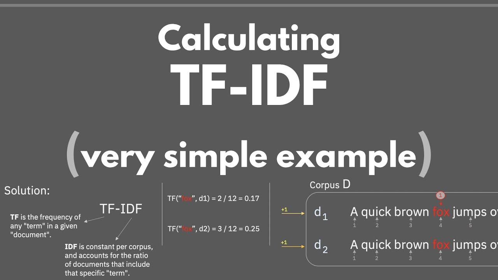

## Table of Contents

## What is Tf.Example and why is it used in machine learning?

Tf.Example is a format used in machine learning, especially with TensorFlow, to store and organize data. It's like a special way of packing data so that it's easy for machine learning models to use. Think of it as a suitcase where you can put different kinds of things like numbers, words, and lists, all in one place. This makes it easier to handle big sets of data and get them ready for training models.

The reason Tf.Example is used is because it helps keep data organized and consistent. When you're working with lots of different kinds of information, it can get messy. Tf.Example helps by putting everything into a standard format. This makes it simpler to feed the data into a machine learning model and makes sure that the model gets the right kind of information it needs to learn and make predictions.

## How does Tf.Example help in organizing data for machine learning models?

Tf.Example helps in organizing data for machine learning models by providing a structured way to store different types of data in a single format. Imagine you have a bunch of different pieces of information like numbers, words, and lists. Tf.Example acts like a special container where you can neatly pack all these different pieces. This makes it easy to handle and process the data because everything is in the same format, no matter what kind of information it is.

When you use Tf.Example, you can easily label and categorize each piece of data. For example, if you're working on a project to predict house prices, you might have data like the number of bedrooms, the size of the house, and the location. With Tf.Example, you can tag each piece of information with a name, like "bedrooms" or "size", so the [machine learning](/wiki/machine-learning) model knows exactly what each piece of data represents. This helps the model learn better because it gets clear and organized information, which leads to more accurate predictions.

## What are the basic components of a Tf.Example message?

A Tf.Example message is made up of two main parts: features and values. The features are like labels that tell you what kind of information is stored, and the values are the actual data that goes with those labels. For example, if you're storing the number of bedrooms in a house, "bedrooms" would be the feature, and the actual number, like 3, would be the value.

Each feature in a Tf.Example message can hold different types of data. You can store numbers, text, or even lists of numbers. This flexibility makes it easy to put all sorts of information into one place. When you're setting up your data for a machine learning model, you can use a Tf.Example message to organize everything neatly, so the model can understand and use the data properly.

## How can you create a Tf.Example in Python?

To create a Tf.Example in Python, you first need to import the necessary TensorFlow library and set up your data. Let's say you want to store information about a house, like the number of bedrooms and the size in square feet. You would start by creating a dictionary where the keys are the feature names and the values are the actual data. For example, you might have a dictionary with keys "bedrooms" and "size", and values 3 and 1500 respectively.

Once you have your dictionary ready, you can convert it into a Tf.Example message. You do this by using the `tf.train.Example` class from TensorFlow. You'll need to wrap each value in a `tf.train.Feature` and then put all these features into a `tf.train.Features` object. Finally, you create the `tf.train.Example` with these features. Here's how you might do it in code:

```python
import tensorflow as tf

# Sample data
data = {
    "bedrooms": 3,
    "size": 1500
}

# Convert data to Tf.Example
feature = {
    "bedrooms": tf.train.Feature(int64_list=tf.train.Int64List(value=[data["bedrooms"]])),
    "size": tf.train.Feature(int64_list=tf.train.Int64List(value=[data["size"]]))
}

tf_example = tf.train.Example(features=tf.train.Features(feature=feature))

# Print the serialized Tf.Example
print(tf_example.SerializeToString())
```

## What is the role of features in Tf.Example and how are they defined?

Features in Tf.Example are like labels that help organize and describe the data you're storing. They tell the machine learning model what each piece of data means, so the model can use it correctly. For example, if you're storing information about a house, you might have features like "bedrooms" and "size". These features act as names for the different pieces of information, making it easy for the model to understand and use the data.

To define features in a Tf.Example, you first need to create a dictionary with the feature names as keys and the data as values. Then, you wrap each value in a special object called `tf.train.Feature`, which tells TensorFlow what type of data it is. For instance, if you have a number, you would use `tf.train.Int64List` to store it. After wrapping all your values, you combine them into a `tf.train.Features` object, which is then used to create the final `tf.train.Example`. This process ensures that your data is neatly organized and ready for your machine learning model.

## How do you convert a dataset into Tf.Example format?

To convert a dataset into Tf.Example format, you start by organizing your data into a dictionary where the keys are the names of your features and the values are the actual data points. For example, if you have data about houses, you might have keys like "bedrooms" and "size", with values like 3 and 1500. Each piece of data needs to be wrapped in a `tf.train.Feature` object, which tells TensorFlow what type of data it is. Numbers can be wrapped in `tf.train.Int64List` or `tf.train.FloatList`, and text can be wrapped in `tf.train.BytesList`.

Once you have all your data wrapped in `tf.train.Feature` objects, you combine them into a `tf.train.Features` object. This object is then used to create the final `tf.train.Example` message. This process ensures that all your data is neatly packed and labeled, making it easy for machine learning models to understand and use. Here's a simple example of how you might do this in code:

```python
import tensorflow as tf

# Sample data
data = {
    "bedrooms": 3,
    "size": 1500
}

# Convert data to Tf.Example
feature = {
    "bedrooms": tf.train.Feature(int64_list=tf.train.Int64List(value=[data["bedrooms"]])),
    "size": tf.train.Feature(int64_list=tf.train.Int64List(value=[data["size"]]))
}

tf_example = tf.train.Example(features=tf.train.Features(feature=feature))

# Print the serialized Tf.Example
print(tf_example.SerializeToString())
```

By following these steps, you can convert any dataset into the Tf.Example format, making it ready for use in TensorFlow machine learning models.

## What are the advantages of using Tf.Example for large-scale machine learning?

Using Tf.Example for large-scale machine learning makes handling big sets of data easier. It helps keep data organized and consistent, no matter how big the dataset is. When you have lots of different kinds of information, like numbers, text, and lists, Tf.Example packs everything into a standard format. This means you can work with large amounts of data without getting confused or making mistakes. It's like having a special box where you can neatly store all your data, so it's ready to be used by machine learning models.

Another advantage is that Tf.Example makes it simple to label and categorize each piece of data. This is important for large-scale machine learning because it helps models understand what each piece of information means. For example, if you're predicting house prices, you can clearly label data like "bedrooms" and "size". This clarity helps models learn better and make more accurate predictions. By using Tf.Example, you can manage and process large datasets more efficiently, which is key for big machine learning projects.

## How does Tf.Example integrate with TensorFlow's data processing pipelines?

Tf.Example integrates smoothly with TensorFlow's data processing pipelines by providing a standardized format that can be easily read and processed. When you create a dataset in Tf.Example format, you can use TensorFlow's tools like `tf.data.Dataset` to load and process the data. This means you can efficiently handle large datasets because Tf.Example helps keep everything organized and ready for the machine learning model. For example, you can use `tf.data.TFRecordDataset` to read Tf.Example messages from TFRecord files, which are commonly used for storing large datasets in TensorFlow.

Once your data is in Tf.Example format and part of a TensorFlow pipeline, you can easily apply transformations and preprocessing steps. TensorFlow provides functions like `tf.io.parse_example` to extract features from Tf.Example messages, allowing you to prepare the data for training or inference. This integration makes it simple to manage and process data at scale, ensuring that your machine learning models get the right kind of information they need to learn and make predictions accurately.

## What are some common pitfalls to avoid when working with Tf.Example?

One common pitfall when working with Tf.Example is not properly handling different data types. When you're setting up your data, you need to make sure each piece of information is wrapped in the right kind of `tf.train.Feature`. For example, if you have a number, you should use `tf.train.Int64List` or `tf.train.FloatList`, and for text, you should use `tf.train.BytesList`. If you mix these up, your machine learning model might not understand the data correctly, which can lead to errors or poor performance.

Another mistake to avoid is not keeping track of the feature names and their meanings. When you create a Tf.Example, you label each piece of data with a feature name, like "bedrooms" or "size". It's important to keep a record of what these names mean so that when you're processing the data later, you know exactly what each piece represents. If you forget or mix up these names, it can confuse your model and make it hard to get good results.

## How can Tf.Example be used to handle different data types and structures?

Tf.Example is great for handling different data types and structures because it lets you store all kinds of information in one place. You can use it to store numbers, like the number of bedrooms in a house, which you would wrap in `tf.train.Int64List`. You can also store text, like the name of the house's location, which goes in `tf.train.BytesList`. If you have more complex data, like a list of numbers, you can use `tf.train.FloatList` to store them. This flexibility makes Tf.Example perfect for organizing data for machine learning models, no matter what kind of information you have.

When you're setting up your data in Tf.Example, you give each piece of information a name, like "bedrooms" or "location". This helps the machine learning model understand what each piece of data means. For example, if you're working on a project to predict house prices, you might have data about the number of bedrooms, the size of the house, and the location. By using Tf.Example, you can neatly pack all this information into one message, making it easy for the model to use and process the data correctly.

## What are advanced techniques for optimizing the performance of models using Tf.Example?

One advanced technique for optimizing the performance of models using Tf.Example is to use efficient data loading and preprocessing. When working with large datasets, it's important to make sure your data pipeline is fast and efficient. You can use `tf.data.Dataset` to load Tf.Example messages from TFRecord files, which are designed for high-performance data storage. By using techniques like prefetching and parallel processing, you can speed up how quickly your data is loaded and processed. For example, you can use `tf.data.Dataset.prefetch` to start loading the next batch of data while the current batch is being processed. This helps keep your model training smoothly and reduces the time it takes to train.

Another technique is to use feature engineering to create more informative features from your Tf.Example data. This can help your model learn better and make more accurate predictions. For instance, if you're predicting house prices and you have the size of the house in square feet, you might create a new feature that represents the size in square meters. This can be done by applying a simple transformation to the existing data. By carefully selecting and engineering your features, you can provide your model with the most useful information, which can lead to better performance. For example, you might use code like this to create a new feature:

```python
import tensorflow as tf

# Sample data
data = {
    "size_sqft": 1500
}

# Convert data to Tf.Example
feature = {
    "size_sqft": tf.train.Feature(int64_list=tf.train.Int64List(value=[data["size_sqft"]])),
    "size_sqm": tf.train.Feature(float_list=tf.train.FloatList(value=[data["size_sqft"] * 0.092903]))
}

tf_example = tf.train.Example(features=tf.train.Features(feature=feature))
```

## How can you debug and troubleshoot issues related to Tf.Example in a machine learning pipeline?

When you're working with Tf.Example in a machine learning pipeline, one of the first things to do if you run into issues is to check your data. Make sure you're using the right type of `tf.train.Feature` for each piece of data. For example, if you're storing a number, use `tf.train.Int64List` or `tf.train.FloatList`, and if you're storing text, use `tf.train.BytesList`. If you mix these up, your model might not understand the data correctly. You can use `tf.io.parse_example` to see how your data looks after it's been loaded, which can help you spot any mistakes.

Another way to troubleshoot is to use logging and print statements to see what's happening at different steps in your pipeline. For example, you can print out the serialized Tf.Example message to check if it matches what you expect. If you're having trouble with how your data is being processed, you might want to add logging to see if the features are being extracted correctly. By carefully checking each step, you can find where things are going wrong and fix them. Here's an example of how you might do this:

```python
import tensorflow as tf

# Sample data
data = {
    "bedrooms": 3,
    "size": 1500
}

# Convert data to Tf.Example
feature = {
    "bedrooms": tf.train.Feature(int64_list=tf.train.Int64List(value=[data["bedrooms"]])),
    "size": tf.train.Feature(int64_list=tf.train.Int64List(value=[data["size"]]))
}

tf_example = tf.train.Example(features=tf.train.Features(feature=feature))

# Print the serialized Tf.Example
print(tf_example.SerializeToString())

# Parse the example to check features
parsed_features = tf.io.parse_example(tf_example.SerializeToString(), features={
    "bedrooms": tf.io.FixedLenFeature([], tf.int64),
    "size": tf.io.FixedLenFeature([], tf.int64)
})

print(parsed_features)
```

## References & Further Reading

[1]: Abadi, M., Barham, P., Chen, J., Chen, Z., Davis, A., Dean, J., ... & Zheng, X. (2016). ["TensorFlow: A System for Large-Scale Machine Learning."](https://arxiv.org/abs/1603.04467) In 12th {USENIX} Symposium on Operating Systems Design and Implementation ({OSDI} 16).

[2]: ["Hands-On Machine Learning with Scikit-Learn, Keras, and TensorFlow"](https://www.amazon.com/Hands-Machine-Learning-Scikit-Learn-TensorFlow/dp/1098125975) by Aurélien Géron

[3]: Goodfellow, I., Bengio, Y., & Courville, A. (2016). ["Deep Learning."](https://www.deeplearningbook.org/) MIT Press.

[4]: Liu, L., Jiang, Q., Fu, Y., & Duan, N. (2020). ["Efficient and Effective Neural Models for Large-Scale Online Shopper Intention Detection."](https://advanced.onlinelibrary.wiley.com/doi/full/10.1002/adfm.202424526) In Proceedings of the 2020 Conference of the Association for Computational Linguistics (ACL).