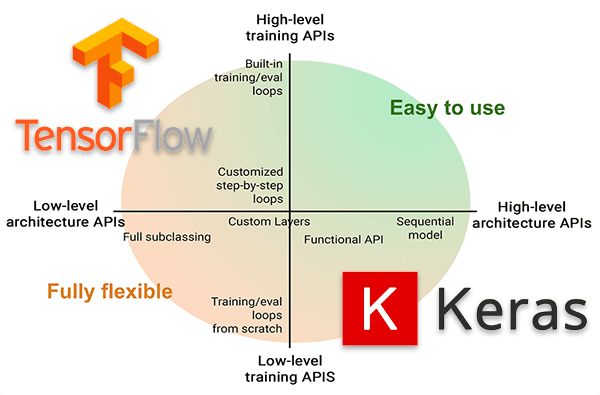

## Table of Contents

## What is Tf.Keras and why is it important in machine learning?

Tf.Keras is a high-level API for building and training machine learning models, specifically designed to work with TensorFlow, a popular open-source machine learning framework. It makes the process of creating neural networks and other models easier by providing a user-friendly interface that simplifies many of the complex tasks involved in machine learning. With Tf.Keras, users can quickly design models, experiment with different architectures, and efficiently train them on large datasets.

The importance of Tf.Keras in machine learning lies in its ability to democratize the field by making it more accessible to beginners and experts alike. It allows users to focus more on the creative aspects of model design and less on the technical details of implementation. This ease of use does not come at the cost of performance; Tf.Keras is built on top of TensorFlow, which means it can leverage TensorFlow's powerful capabilities for distributed training, GPU acceleration, and more. As a result, Tf.Keras has become a go-to tool for many in the machine learning community, helping to accelerate research and development in the field.

## How do you install Tf.Keras and set up a basic environment?

To install Tf.Keras, you first need to install TensorFlow, as Tf.Keras is included in TensorFlow. You can install TensorFlow using pip, which is a package installer for Python. Open your command line or terminal and type ```pip install tensorflow```. This command will download and install TensorFlow along with Tf.Keras. Once the installation is complete, you can verify it by opening a Python interpreter and typing ```import tensorflow as tf```. If no error messages appear, TensorFlow and Tf.Keras are correctly installed.

To set up a basic environment for using Tf.Keras, you'll need a text editor or an Integrated Development Environment (IDE) like Jupyter Notebook, PyCharm, or Visual Studio Code. These tools help you write and run Python code easily. Create a new Python file or notebook and start by importing TensorFlow with ```import tensorflow as tf```. Then, you can use Tf.Keras to build a simple model. For example, to create a basic neural network, you might write ```model = tf.keras.Sequential([tf.keras.layers.Dense(10, activation='relu', input_shape=(4,)), tf.keras.layers.Dense(3, activation='softmax')])```. This code sets up a model with two layers, ready for further training and evaluation.

## What are the basic components of a Tf.Keras model?

A Tf.Keras model is made up of layers, which are the building blocks of the model. Each layer takes in data, processes it, and passes it on to the next layer. The most common type of layer is the Dense layer, which applies weights to the input data and uses an activation function to produce an output. For example, you can create a Dense layer with `model.add(tf.keras.layers.Dense(units=64, activation='relu'))`. Layers can be stacked together to form a Sequential model, which is a linear stack of layers where each layer has exactly one input tensor and one output tensor.

Another important component is the model's architecture, which defines how the layers are connected. In a Sequential model, the architecture is straightforward as layers are added one after the other. For more complex models, you might use the Functional API, which allows you to define more flexible architectures where layers can have multiple inputs and outputs. The architecture is crucial because it determines how the model processes data and learns from it. For example, a simple Sequential model might look like `model = tf.keras.Sequential([tf.keras.layers.Dense(10, activation='relu', input_shape=(4,)), tf.keras.layers.Dense(3, activation='softmax')])`.

The final key components are the loss function, optimizer, and metrics. The loss function measures how well the model is doing, with lower values indicating better performance. Common loss functions include mean squared error for regression tasks and categorical crossentropy for classification tasks. The optimizer adjusts the model's weights during training to minimize the loss. Popular optimizers include Adam and SGD. Metrics, like accuracy, help you evaluate the model's performance but do not affect training. You can compile a model with `model.compile(optimizer='adam', loss='categorical_crossentropy', metrics=['accuracy'])`. These components work together to train the model and make it useful for making predictions.

## How do you build a simple neural network using Tf.Keras?

To build a simple neural network using Tf.Keras, start by importing TensorFlow with ```import tensorflow as tf```. Then, you can create a Sequential model, which is a straightforward way to stack layers. For example, you might want a neural network to classify some data into three categories. You can set up the model with ```model = tf.keras.Sequential([tf.keras.layers.Dense(10, activation='relu', input_shape=(4,)), tf.keras.layers.Dense(3, activation='softmax')])```. The first layer has 10 neurons and uses the ReLU activation function, while the second layer has 3 neurons (one for each category) and uses the softmax activation function to output probabilities.

Next, you need to compile the model to prepare it for training. This involves specifying the optimizer, loss function, and any metrics you want to track. For example, you can compile the model with ```model.compile(optimizer='adam', loss='categorical_crossentropy', metrics=['accuracy'])```. The Adam optimizer will adjust the model's weights to minimize the categorical crossentropy loss, which is suitable for multi-class classification. The accuracy metric will help you see how well the model is performing during training. After compiling, you can train the model on your data using the `fit` method, like ```model.fit(x_train, y_train, epochs=10, validation_data=(x_val, y_val))```. This command trains the model for 10 epochs, using validation data to monitor performance. Once trained, you can use the model to make predictions on new data with the `predict` method.

## What are the different types of layers available in Tf.Keras?

In Tf.Keras, there are many types of layers that you can use to build your neural network. Some of the most common layers include the Dense layer, which is a fully connected layer where every neuron in the layer is connected to every neuron in the previous layer. You can create a Dense layer with ```model.add(tf.keras.layers.Dense(units=64, activation='relu'))```. Another important layer is the Convolutional layer, used mainly in image processing tasks. It applies filters to the input to extract features, and you can add it with ```model.add(tf.keras.layers.Conv2D(filters=32, kernel_size=(3, 3), activation='relu', input_shape=(28, 28, 1)))```. There are also Pooling layers, like MaxPooling2D, which reduce the spatial dimensions of the input, helping to make the model more efficient. You can add a MaxPooling2D layer with ```model.add(tf.keras.layers.MaxPooling2D(pool_size=(2, 2)))```.

Other useful layers include the LSTM (Long Short-Term Memory) layer, which is great for processing sequences of data, like text or time series. You can add an LSTM layer with ```model.add(tf.keras.layers.LSTM(units=50, return_sequences=True, input_shape=(10, 1)))```. The Dropout layer is used to prevent overfitting by randomly setting a fraction of input units to 0 at each update during training. You can add a Dropout layer with ```model.add(tf.keras.layers.Dropout(rate=0.2))```. There are also Embedding layers, which are useful for converting positive integers (indexes) into dense vectors of fixed size, often used in natural language processing tasks. You can add an Embedding layer with ```model.add(tf.keras.layers.Embedding(input_dim=1000, output_dim=64, input_length=10))```. Each of these layers serves a specific purpose and can be combined in various ways to create powerful neural networks.

## How do you compile a model in Tf.Keras, and what are the key parameters involved?

To compile a model in Tf.Keras, you use the `compile` method. This is where you tell the model how to learn from the data. The main things you need to set are the optimizer, the loss function, and any metrics you want to keep track of. You can do this with a line of code like ```model.compile(optimizer='adam', loss='categorical_crossentropy', metrics=['accuracy'])```. The optimizer is like a coach that helps the model adjust its weights to do better. The loss function is like a score that tells the model how well it's doing, with lower scores being better. Metrics are like extra scores that help you see how the model is doing but don't affect the training directly.

The key parameters in the `compile` method are the optimizer, loss function, and metrics. The optimizer can be something like 'adam' or 'sgd', which are methods to update the model's weights. The loss function could be 'categorical_crossentropy' for classification tasks or 'mean_squared_error' for regression tasks. It measures how far off the model's predictions are from the actual answers. Metrics, like 'accuracy', give you a way to check how well the model is doing during and after training. Choosing the right parameters depends on what you're trying to do with your model, but these three are the most important ones to get right.

## What methods can be used to train a Tf.Keras model and how do you evaluate its performance?

To train a Tf.Keras model, you use the `fit` method. This method takes in your training data and tells the model to learn from it. You can use a command like ```model.fit(x_train, y_train, epochs=10, validation_data=(x_val, y_val))``` to train the model. The `epochs` parameter says how many times the model should go through the entire training dataset. The `validation_data` parameter lets you check how the model is doing on a different set of data that it hasn't seen during training. This helps you see if the model is learning well or just memorizing the training data. You can also use other parameters like `batch_size` to control how much data the model looks at in one go, which can affect how fast and well it learns.

To evaluate the performance of a Tf.Keras model, you use the `evaluate` method. This method lets you see how well the model does on new data it hasn't seen before. You can run ```model.evaluate(x_test, y_test)``` to get the loss and any other metrics you set up when you compiled the model. This gives you numbers like accuracy or mean squared error that tell you how well the model is doing. You can also use the `predict` method to make predictions on new data and see how those predictions match up with the actual answers. By comparing these predictions to the true values, you can get a sense of how good the model is at making guesses.

## How do you implement regularization techniques in Tf.Keras to prevent overfitting?

Regularization helps stop your model from overfitting, which is when it does great on the training data but not so well on new data. One common way to do this in Tf.Keras is by using L2 regularization. This adds a penalty to the loss function based on the size of the weights in your model. The bigger the weights, the bigger the penalty. You can add L2 regularization to a layer with ```model.add(tf.keras.layers.Dense(64, kernel_regularizer=tf.keras.regularizers.l2(0.01)))```. The `0.01` is how strong the penalty is. Another way is to use L1 regularization, which works similarly but can make some weights zero, which can simplify your model. You can use it with ```model.add(tf.keras.layers.Dense(64, kernel_regularizer=tf.keras.regularizers.l1(0.01)))```.

Another popular regularization technique is Dropout. Dropout randomly turns off some neurons during training, which helps the model not rely too much on any single neuron. You can add a Dropout layer with ```model.add(tf.keras.layers.Dropout(0.2))```, where `0.2` means 20% of the neurons will be turned off during each training step. Early stopping is also a good way to prevent overfitting. It stops training when the model stops getting better on the validation data. You can set it up with ```early_stopping = tf.keras.callbacks.EarlyStopping(monitor='val_loss', patience=5)``` and use it in the `fit` method with ```model.fit(x_train, y_train, epochs=100, validation_data=(x_val, y_val), callbacks=[early_stopping])```. These techniques help your model learn in a way that works better on new data, not just the data it was trained on.

## What are callbacks in Tf.Keras and how can they be used to improve model training?

Callbacks in Tf.Keras are tools you can use to do things while your model is training. They let you control what happens during training, like stopping early if the model stops getting better, saving the best version of your model, or changing how the model learns. You can use callbacks to make your training better by keeping an eye on how the model is doing and making changes on the fly.

One common callback is Early Stopping, which stops training when the model's performance on validation data stops improving. You can set it up with ```early_stopping = tf.keras.callbacks.EarlyStopping(monitor='val_loss', patience=5)``` and use it in the `fit` method like ```model.fit(x_train, y_train, epochs=100, validation_data=(x_val, y_val), callbacks=[early_stopping])```. This helps prevent overfitting because it stops training before the model starts to memorize the training data too much. Another useful callback is ModelCheckpoint, which saves the best version of your model during training. You can use it with ```model_checkpoint = tf.keras.callbacks.ModelCheckpoint('best_model.h5', save_best_only=True, monitor='val_accuracy')```. This way, you can always use the best version of your model even if later training steps don't do as well.

## How can you use Tf.Keras for transfer learning and fine-tuning pre-trained models?

Transfer learning is like using a trained model as a starting point for a new task. In Tf.Keras, you can do this by taking a model that was trained on a big dataset, like images of lots of different things, and then tweaking it to work on your specific problem. For example, if you want to recognize different types of dogs, you could start with a model that's good at recognizing general objects. You'd keep the early layers of this model, which are good at picking out basic features like edges and shapes, and then add new layers at the end to focus on dog features. You can load a pre-trained model with ```base_model = tf.keras.applications.MobileNetV2(weights='imagenet', include_top=False, input_shape=(224, 224, 3))``` and then add your own layers like ```model = tf.keras.Sequential([base_model, tf.keras.layers.GlobalAveragePooling2D(), tf.keras.layers.Dense(10, activation='softmax')])```.

Fine-tuning is when you take that pre-trained model and adjust not just the new layers you added, but also some of the original layers. This can make your model even better at your specific task. To do this, you first freeze the early layers of the pre-trained model so they don't change during training, and then you train the new layers you added. After that, you can unfreeze some of the later layers of the pre-trained model and train them too, but with a smaller learning rate so you don't mess up what the model already knows. You can freeze layers with ```for layer in base_model.layers[:-4]: layer.trainable = False``` and then compile and train the model with ```model.compile(optimizer=tf.keras.optimizers.Adam(1e-5), loss='categorical_crossentropy', metrics=['accuracy'])``` and ```model.fit(x_train, y_train, epochs=10, validation_data=(x_val, y_val))```. This way, you get to use the power of a big, trained model and make it even better for your own use.

## What are some advanced architectures you can build with Tf.Keras, such as RNNs and CNNs?

In Tf.Keras, you can build advanced architectures like Recurrent Neural Networks (RNNs) and Convolutional Neural Networks (CNNs) to tackle different kinds of problems. RNNs are great for dealing with sequences of data, like text or time series. You can build an RNN using layers like LSTM or GRU. For example, to create an LSTM model for text classification, you might use ```model = tf.keras.Sequential([tf.keras.layers.Embedding(input_dim=10000, output_dim=128, input_length=100), tf.keras.layers.LSTM(64, return_sequences=True), tf.keras.layers.LSTM(32), tf.keras.layers.Dense(1, activation='sigmoid')])```. This model starts with an Embedding layer to turn words into numbers, followed by two LSTM layers to process the sequence, and ends with a Dense layer to make a prediction. RNNs can remember past inputs, which is useful for understanding things like the order of words in a sentence.

CNNs are really good at tasks involving images or other grid-like data. They use convolutional layers to look for patterns in the data. For example, to build a CNN for image classification, you could use ```model = tf.keras.Sequential([tf.keras.layers.Conv2D(32, (3, 3), activation='relu', input_shape=(28, 28, 1)), tf.keras.layers.MaxPooling2D((2, 2)), tf.keras.layers.Conv2D(64, (3, 3), activation='relu'), tf.keras.layers.MaxPooling2D((2, 2)), tf.keras.layers.Conv2D(64, (3, 3), activation='relu'), tf.keras.layers.Flatten(), tf.keras.layers.Dense(64, activation='relu'), tf.keras.layers.Dense(10, activation='softmax')])```. This model has several convolutional layers to detect features, followed by pooling layers to reduce the data size, and ends with dense layers to classify the image. CNNs are powerful because they can automatically learn to recognize things like edges, shapes, and more complex patterns in images.

## How do you optimize and scale Tf.Keras models for production environments?

To optimize and scale Tf.Keras models for production environments, you need to make sure they run fast and can handle lots of data. One way to do this is by using TensorFlow's built-in tools like TensorFlow Serving, which is a system that helps you serve your model to many users at the same time. You can also use techniques like quantization, which makes your model smaller and faster by using fewer bits to store its weights. Another important thing is to use batch processing, where you process a bunch of data at once instead of one piece at a time. This can make your model much faster. You can set up batch processing in the `fit` method with ```model.fit(x_train, y_train, batch_size=32, epochs=10)```.

Another way to optimize your Tf.Keras model for production is by using model pruning, which removes parts of the model that don't help much. This can make the model smaller and faster. You can also use TensorFlow Lite to convert your model into a format that's easier to run on mobile devices or other smaller systems. To do this, you can use ```converter = tf.lite.TFLiteConverter.from_keras_model(model) tflite_model = converter.convert()```. For very big datasets, you might want to use distributed training, where you use multiple computers to train your model at the same time. TensorFlow has tools like `tf.distribute` that can help with this. By using these techniques, you can make sure your Tf.Keras model works well in a production environment, even when lots of people are using it at once.