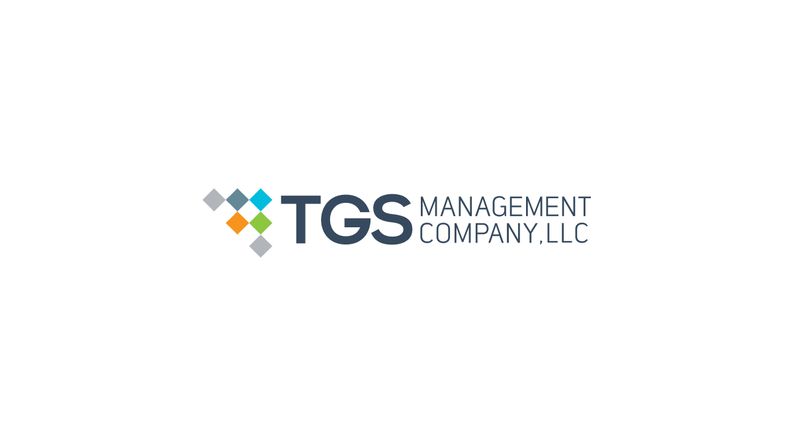

Algorithmic trading refers to the use of computer algorithms to automate investment strategies across financial markets. By replacing human decision-making, these systems aim to execute complex trades at speeds and volumes beyond human capability, utilizing pre-set conditions, mathematical models, and historical data analysis. Algorithmic trading is significant in modern financial markets due to its potential for increasing both the efficiency and accuracy of trade executions. It plays a pivotal role in enhancing market liquidity and ensuring tighter spreads, thus benefiting all market participants.

TGS Management Company is recognized as a key player in the field of algorithmic trading. Established as a pioneer, TGS has focused on developing sophisticated algorithms that have a substantial impact on the buy and sell sides of the financial markets. The company is known for employing data-driven approaches and advanced technologies to facilitate trades, setting benchmarks for both performance and innovation in the industry.



This discussion aims to explore the profound influence and strategic methodologies employed by TGS Management Company within the algorithmic trading ecosystem. By examining its cutting-edge strategies, the narrative will shed light on how TGS not only contributes to but often leads, the evolution of trading practices and financial technologies. Understanding TGS's influence provides insights into broader industry trends and the future direction of algorithmic trading.

Algorithmic trading holds great significance for both institutional and retail investors. Institutional investors, including hedge funds and investment banks, leverage these systems to optimize their large-scale transactions, achieving greater market impact with reduced transaction costs. For retail investors, algorithmic trading ensures that their orders can be executed at competitive prices due to the increased liquidity and improved market efficiency. Consequently, this democratizes trading opportunities, allowing investors of all sizes to participate more effectively.

In anticipation of a more detailed exploration of TGS Management Company's history and methodologies, this introduction sets the groundwork for a comprehensive understanding of its strategies and industry impact. As we navigate through TGS's evolution and the technological forefront it occupies, we embark on a journey to appreciate the intricate world of algorithmic trading and its ever-growing relevance in global finance.

## Table of Contents

## History of TGS Management Company

TGS Management Company was founded in the early 1980s, emerging as a pioneer in the developing field of algorithmic trading. The company's establishment coincided with a period characterized by the increasing intersection of technology and financial markets. In its formative years, TGS laid the groundwork for its future prominence by focusing on developing sophisticated trading algorithms that leveraged computational power to analyze and act on market data.

A significant milestone in TGS's history was the transition from manual trading practices to fully automated trading systems. This evolution facilitated the execution of trades at speeds and complexities unattainable by human traders, distinguishing TGS as a leader in the nascent algo trading industry. 

One of the notable figures in TGS's history is its co-founder, Monroe Trout. Known for his expertise in [quantitative trading](/wiki/quantitative-trading), Trout's leadership was instrumental in shaping the company's innovative approach. Under his guidance, TGS achieved significant success by capitalizing on statistical [arbitrage](/wiki/arbitrage) opportunities, a strategy that involved exploiting price differentials between related securities.

Throughout its history, TGS Management Company has garnered several achievements and recognitions. The firm has been acknowledged for its role in enhancing market [liquidity](/wiki/liquidity-risk-premium) and contributing to the efficiency of financial markets. These achievements are underscored by the company's ongoing commitment to refining its algorithms and adopting cutting-edge technologies.

The trading algorithms employed by TGS have evolved considerably over the years. Initially centered on basic statistical methods, these algorithms have grown in sophistication to incorporate [machine learning](/wiki/machine-learning) and [artificial intelligence](/wiki/ai-artificial-intelligence) techniques. This evolution has enabled TGS to better predict market movements and adapt to shifting dynamics, maintaining its competitive edge.

The continuous refinement of their algorithms and strategic foresight has positioned TGS as a benchmark in [algorithmic trading](/wiki/algorithmic-trading), setting industry standards and influencing trading practices globally.

## Algorithmic Trading Strategies at TGS

Algorithmic trading strategies at TGS Management Company are sophisticated, employing a combination of market-making, [statistical arbitrage](/wiki/statistical-arbitrage), and trend-following techniques. These strategies leverage proprietary technologies and tools that have been developed in-house. Market-making involves providing liquidity by placing both buy and sell orders for a financial instrument, allowing TGS to capitalize on the spread between the buying and selling prices.

Statistical arbitrage at TGS is another critical component, employing mathematical models to identify and exploit inefficiencies in market pricing. This approach typically involves the use of mean-reversion models, which predict that asset prices will return to their historical average over time. The formula for a simple mean-reversion strategy might be:

$$
\text{Signal} = \frac{(P_t - \mu)}{\sigma}
$$

where $P_t$ is the current price, $\mu$ is the mean of the price series, and $\sigma$ is the standard deviation. If the signal exceeds a certain threshold, it may indicate a trade opportunity.

Trend-following strategies, on the other hand, are designed to capture gains by identifying an upward or downward movement in the market. These strategies often rely on [momentum](/wiki/momentum) indicators such as moving averages or the moving average convergence divergence (MACD).

TGS's ability to adapt these strategies to changing market conditions is crucial to their success. Their algorithms are continually updated to reflect new data and market dynamics, utilizing machine learning techniques. Machine learning models are often employed to enhance prediction accuracy and algorithmic efficiency. An example in Python might involve the use of libraries such as scikit-learn for implementing decision trees or neural networks:

```python
from sklearn.tree import DecisionTreeRegressor

# Example dataset
X = [[0], [1], [2], [3]]
y = [0, 0.5, 1.5, 2.0]

# Fit a decision tree model
model = DecisionTreeRegressor()
model.fit(X, y)

# Predict new data points
predictions = model.predict([[1.5]])
```

For TGS, data-driven decision-making is integral to their operations. The company places significant emphasis on analyzing vast datasets to unearth patterns and insights that drive trading decisions. This data-centric approach allows TGS to refine their trading algorithms continuously and maintain a competitive edge in the fast-paced financial markets. Through sophisticated data analytics and real-time processing, TGS can respond swiftly to market fluctuations, ensuring robust and profitable trading operations.

## Technological Innovations and Infrastructure

TGS Management Company integrates cutting-edge technology into its trading activities, ensuring efficiency and competitiveness in high-frequency trading ([HFT](/wiki/high-frequency-trading-strategies)). Their investment in state-of-the-art technology infrastructure is critical for executing rapid transactions and processing large volumes of market data in real-time. This infrastructure supports latency-sensitive operations, enabling quick decision-making, which is paramount in high-frequency trading environments.

Artificial intelligence (AI) and machine learning (ML) play pivotal roles in TGS's algorithm development. By leveraging these technologies, the company can identify complex trading patterns and develop robust predictive models. Machine learning algorithms, particularly those focusing on [deep learning](/wiki/deep-learning) and [reinforcement learning](/wiki/reinforcement-learning), allow for the continuous improvement and adaptation of their trading strategies. For instance, reinforcement learning can optimize trading strategies by iteratively learning from market feedback, maximizing returns while minimizing risk.

A typical implementation to develop such models could utilize Python libraries like TensorFlow or PyTorch. Here is a simplified example that demonstrates a basic reinforcement learning algorithm:

```python
import numpy as np

class SimpleTradingEnv:
    def __init__(self):
        self.current_step = 0
        self.stock_price = np.random.rand(100)  # Sample stock price data
        self.holdings = 0  # Holdings of the stock, initially 0

    def step(self, action):
        if action == 1 and self.holdings == 0:  # Buy action
            self.holdings = 1
        elif action == 0 and self.holdings == 1:  # Sell action
            self.holdings = 0
        reward = self.holdings * self.stock_price[self.current_step]
        self.current_step += 1
        return self.stock_price[self.current_step], reward

env = SimpleTradingEnv()
for i in range(env.stock_price.size - 1):
    action = np.random.choice([0, 1])
    stock_price, reward = env.step(action)
    print(f'Step: {i}, Action: {action}, Stock Price: {stock_price:.2f}, Reward: {reward:.2f}')
```

TGS's focus extends to collaborations with tech companies and research institutions, which is crucial for staying at the forefront of technological advancements. These partnerships facilitate the exchange of knowledge and resources, driving innovation in trading algorithms and strategies. Collaborative efforts often lead to the development of proprietary technologies that offer competitive advantages in analyzing and interpreting vast datasets.

Cybersecurity is a major focal point for TGS Management Company. In an era where cyber threats are prevalent, protecting sensitive financial data is paramount. The company utilizes advanced encryption methods and state-of-the-art security protocols to safeguard its data and trading operations. Regular audits and the implementation of cybersecurity best practices ensure their systems are resilient against potential threats.

In summary, TGS leverages leading-edge technology, robust infrastructure, and strategic partnerships to enhance their algorithmic trading endeavors. AI and ML are central to refining their models, while a strong emphasis on cybersecurity ensures the protection of their digital assets.

## TGS Management Company's Impact on the Financial Industry

TGS Management Company plays a significant role in the financial industry through its algorithmic trading activities, which have a distinct influence on market liquidity and price discovery. By employing advanced trading algorithms, TGS provides liquidity to the markets, facilitating smoother transactions and enabling efficient price formation. This liquidity injection is crucial as it supports not only the functioning of financial markets but also benefits participants by narrowing bid-ask spreads, ultimately lowering transaction costs for traders.

TGS's contributions extend beyond liquidity enhancement. The firm has been pivotal in shaping algorithmic trading practices across the industry. Through its innovative strategies and technological advancements, TGS sets benchmarks followed by other market participants, thereby fostering a culture of continuous evolution and adaptation in trading methodologies. Their efforts in refining tactics such as statistical arbitrage and [trend following](/wiki/trend-following) have collective implications on algorithmic trading benchmarks.

Algorithmic trading, however, is not without ethical and regulatory challenges. TGS Management Company must navigate these landscapes carefully, ensuring compliance with financial regulations while maintaining a competitive edge. The use of high-speed, automated trading strategies has drawn scrutiny regarding market fairness and transparency. Critics argue that such practices might lead to market manipulation or undue advantage to technologically advanced firms. In response, firms like TGS are under constant pressure to demonstrate ethical conduct and transparency in their operations.

Moreover, TGS is an active participant in the ongoing debate concerning market fairness. The firm’s practices contribute to discussions around ensuring equal access to market data and trading infrastructure, which are vital in promoting a level playing field for all market participants. The company's engagement in these debates highlights its commitment to responsible and fair trading practices, which is crucial for maintaining investor trust and confidence in the financial markets.

Looking towards the future, TGS Management Company is anticipated to continue its trajectory of innovation and advancement within the algorithmic trading landscape. The integration of artificial intelligence and machine learning into trading algorithms is poised to revolutionize strategy development further, enhancing decision-making processes and adapting to evolving market conditions. Such advancements promise not only to bolster TGS's competitive position but also to drive progress throughout the financial industry, reinforcing its leading role in shaping the future of trading.

## Challenges and Criticisms

Algorithmic trading firms such as TGS Management Company face numerous challenges in the dynamic environment of financial markets. A primary challenge is maintaining the effectiveness of trading algorithms amid shifting market conditions and regulatory landscapes. The constant evolution of these conditions requires firms to continuously adapt their strategies to sustain profitability and compliance.

Criticisms of TGS Management Company often focus on the perceived lack of transparency and fairness associated with high-frequency trading (HFT) operations. Critics argue that firms utilizing sophisticated algorithms might have an unfair advantage over traditional investors, potentially leading to market manipulation or exacerbating market [volatility](/wiki/volatility-trading-strategies). TGS has addressed these concerns by participating in discussions around regulatory frameworks and adopting measures to ensure equitable market participation. The firm actively collaborates with regulatory bodies to shape policies promoting transparency and fairness across the industry.

Regulatory changes pose significant impacts on TGS's operations, particularly with evolving laws governing trading practices and technology use. For instance, stricter regulations on HFT and dark pools necessitate adjustments in algorithm design to comply with new norms. TGS often invests in legal expertise and engages with policymakers to anticipate regulatory shifts, ensuring they are well-prepared to modify their operations accordingly without compromising competitive edge.

High-speed trading presents inherent market risks, including liquidity fluctuations and potential flash crashes. These events can stem from algorithms executing trades at speeds too rapid for human intervention, leading to drastic price movements in short timeframes. To manage these risks, TGS implements robust risk management protocols and leverages advanced monitoring systems to detect and mitigate potential issues in real-time.

Commitment to ethical trading practices remains a cornerstone of TGS's operational ethos. The company emphasizes responsible algorithm development, ensuring that their trading strategies do not exploit systemic vulnerabilities or negatively impact market stability. By maintaining a focus on ethical considerations, TGS endeavors to uphold the integrity of financial markets while pursuing their business objectives.

## Conclusion

TGS Management Company has cemented its status as a formidable entity in the algorithmic trading landscape, applying its advanced methodologies and insightful strategies to influence financial markets significantly. Algorithmic trading, fundamentally revolutionizing modern finance, allows for the swift execution of trades based on complex algorithms, optimizing efficiency and precision. TGS Management Company has harnessed this transformative power, underscoring the critical role that algorithmic trading plays for both institutional and retail investors. By leveraging high-frequency trading and advanced machine learning techniques, the company has continually set new standards for automated trading systems.

Throughout its history, TGS has consistently demonstrated a commitment to technological and strategic progress. This dedication has not only propelled its success but has also spurred broader advancements in the trading industry. The firm has developed and refined proprietary technologies, contributing to the evolution and refinement of algorithmic trading practices. Its systematic approach to decision-making—informed by robust data analytics and machine learning—has enabled TGS to remain agile and responsive to ever-changing market conditions.

As the financial sector faces ongoing challenges and rapid advancements, TGS Management Company encourages sustained innovation to maintain competitiveness and foster growth. The company exemplifies a forward-thinking ethos that prioritizes adaptation and optimization in algorithmic trading strategies. This approach suggests a promising future wherein continued enhancements in technology and strategy will drive both profitability and stability within financial markets.

Looking ahead, TGS Management Company is poised to maintain its leadership position in algorithmic trading. By prioritizing research and development and embracing cutting-edge technologies, TGS is likely to play a prominent role in shaping the future of financial markets. The company's ongoing contributions to the refinement of trading strategies and its steadfast commitment to ethical practices will be crucial as the landscape of algorithmic trading continues to evolve. As the industry progresses, TGS's pioneering spirit and innovations will undoubtedly continue to drive significant developments, ensuring a vibrant future for algorithmic trading.

## References & Further Reading

[1]: Aldridge, I. (2013). ["High-Frequency Trading: A Practical Guide to Algorithmic Strategies and Trading Systems."](https://www.wiley.com/en-us/High+Frequency+Trading%3A+A+Practical+Guide+to+Algorithmic+Strategies+and+Trading+Systems%2C+2nd+Edition-p-9781118343500) Wiley.

[2]: Chan, E. P. (2009). ["Quantitative Trading: How to Build Your Own Algorithmic Trading Business."](https://github.com/ftvision/quant_trading_echan_book) Wiley.

[3]: Lopez de Prado, M. (2018). ["Advances in Financial Machine Learning."](https://www.amazon.com/Advances-Financial-Machine-Learning-Marcos/dp/1119482089) Wiley.

[4]: Kissell, R. (2013). ["The Science of Algorithmic Trading and Portfolio Management."](https://www.sciencedirect.com/book/9780124016897/the-science-of-algorithmic-trading-and-portfolio-management) Academic Press.

[5]: Bouchaud, J.-P., & Potters, M. (2003). ["Theory of Financial Risk and Derivative Pricing: From Statistical Physics to Risk Management."](https://www.cambridge.org/core/books/theory-of-financial-risk-and-derivative-pricing/5BBBA04CE72ED9E5E7C1C028D9A94FCB) Cambridge University Press.

[6]: Jansen, S. (2020). ["Machine Learning for Algorithmic Trading - Second Edition."](https://www.amazon.com/Machine-Learning-Algorithmic-Trading-alternative/dp/1839217715) Packt Publishing.

[7]: Narang, R. (2013). ["Inside the Black Box: A Simple Guide to Quantitative and High-Frequency Trading."](https://onlinelibrary.wiley.com/doi/book/10.1002/9781118662717) Wiley.