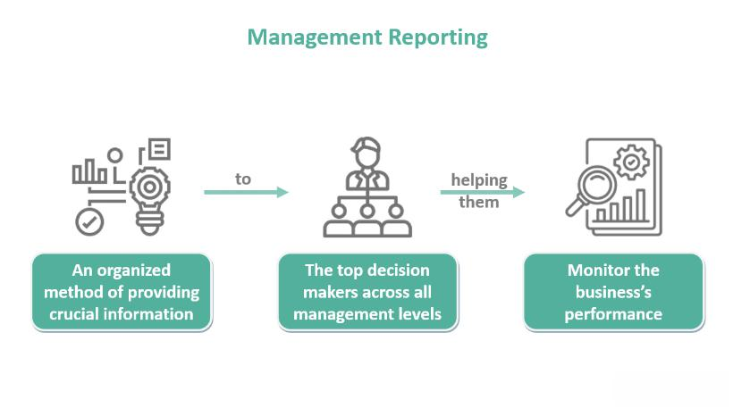

Algorithmic trading has revolutionized modern financial markets, allowing investment firms to execute complex, data-driven strategies at speeds that were previously unimaginable. At the forefront of this transformation is TGS Management, a quantitative hedge fund renowned for its discreet yet highly effective trading methodologies. Established in 1989 in Princeton, New Jersey, by Frederick Taylor, David Gelbaum, and Andrew Shechtel, this firm has made a significant impact in the investment management industry through its groundbreaking use of statistical arbitrage and algorithmic strategies. 

TGS Management has successfully carved out a distinctive niche, emphasizing the application of sophisticated mathematical models and algorithms to exploit market inefficiencies. The firm's commitment to secrecy, combined with its innovative approach, has allowed it to maintain a competitive edge while keeping its strategic operations away from prying eyes. 



In this article, we'll explore the elements that have contributed to TGS Management's success in algorithmic trading, offering insights into its historical context, strategic methodologies, and the broader societal impact of its founders through philanthropic endeavors and political engagements.

## Table of Contents

## The Foundation and Legacy of TGS Management

TGS Management was established by Frederick Taylor, David Gelbaum, and Andrew Shechtel after the dissolution of Princeton-Newport Partners (PNP), which faced legal hurdles despite being a pioneer as the first quantitative hedge fund. The closure of PNP acted as a catalyst for the founders, who seized the opportunity to create TGS, leveraging the expertise and experience they had acquired at PNP, thereby retaining much of its talent and investor base.

The company name, TGS, is an abbreviation derived from the initials of its founders: Taylor, Gelbaum, and Shechtel. This trio's experience at PNP laid a solid foundation for TGS's commitment to exploiting market inefficiencies through quantitative strategies. Their vision allowed TGS to quickly establish itself in the industry by focusing on statistical [arbitrage](/wiki/arbitrage) during its early years.

Statistical arbitrage involves identifying and capitalizing on price discrepancies across related financial instruments. By using sophisticated mathematical models and computational power, TGS adeptly exploited these market anomalies. This strategy fueled TGS's rapid profitability, enabling the firm to return capital to external investors. By doing so, TGS achieved enough financial independence to concentrate on refining and executing its internal strategies, marked by proprietary trading models and advanced technology.

TGS Management not only filled the void left by PNP but also innovatively advanced quantitative methods in finance, building a legacy that underscores its founders’ acumen in statistical finance and [algorithmic trading](/wiki/algorithmic-trading).

## Algorithmic Trading Strategies at TGS

TGS Management's impressive track record in algorithmic trading can be attributed to its reliance on sophisticated mathematical and statistical models designed to identify market inefficiencies. These models help the firm exploit temporary price discrepancies across various markets—an approach known as [statistical arbitrage](/wiki/statistical-arbitrage).

Statistical arbitrage involves using statistical models to identify mispricings between related securities and profiting from the expected convergence of their prices. This strategy often relies on high-frequency trading, where algorithms execute a multitude of trades within fractions of a second. For instance, if two historically correlated stocks, Stock A and Stock B, deviate from their typical pricing relationship, TGS algorithms may detect this discrepancy and initiate trades to capitalize on the expected normalization of their prices.

Consider a simple example using a [pair trading](/wiki/pair-trading) strategy, a subset of statistical arbitrage. Let's assume historical data indicates a stable spread between the prices of Stock A and Stock B. If the spread widens, the algorithm might short the overpriced stock and go long on the underpriced one, anticipating a return to the mean:

```python
import numpy as np

# Historical price data for Stock A and Stock B
stock_a_prices = np.array([100, 102, 101, 104, 105])
stock_b_prices = np.array([98, 97, 99, 100, 102])

# Calculate the price spread
spread = stock_a_prices - stock_b_prices

# Determine if the spread is statistically significant
spread_mean = np.mean(spread)
spread_std = np.std(spread)

# Define the threshold for trades
threshold = spread_mean + 2 * spread_std

# Identify moments to trade
trade_signals = spread > threshold

print("Trade Signals:", trade_signals)
```

This Python code demonstrates how statistical models are employed to detect trading opportunities based on historical price spreads. Algorithms like this are crucial for executing strategies that involve thousands of data points and require real-time decision-making processes.

The secretive nature of TGS Management extends to these trading algorithms and strategies, keeping them closely guarded. This secrecy provides the firm with a competitive advantage, allowing for unfettered operation and exploration of unique investment methodologies without the risk of replication by competitors. TGS's independence allows the firm to remain agile, continuously refining its approaches to stay ahead in the highly competitive landscape of [quantitative trading](/wiki/quantitative-trading).

## Recruitment and Talent Acquisition

TGS Management stands out for its rigorous approach to recruitment and talent acquisition. The firm has consistently prioritized recruiting individuals with robust quantitative skill sets, including software engineers and PhDs specializing in mathematics, physics, computer science, and engineering. This keen attention to intellectual capital has positioned TGS as a formidable entity in the algorithmic trading space, enabling it to devise cutting-edge strategies and maintain a competitive edge.

The competitive landscape of finance, particularly in quantitative [hedge fund](/wiki/hedge-fund-trading-strategies)s, demands exceptional talent, and TGS has demonstrated its willingness to invest significantly in securing top performers. The firm competes with industry giants such as Renaissance Technologies and Citadel, often outbidding them to attract leading minds in quantitative fields. One example of this commitment to excellence is the hiring of an International Mathematical Olympiad gold medalist, a clear testament to the caliber of intellect that TGS seeks.

This strategic emphasis on acquiring high-level expertise aligns with TGS's operational philosophy, where innovative and effective algorithmic trading strategies are the bedrock of its success. By fostering an environment that attracts and retains elite professionals, TGS ensures that it remains at the forefront of financial innovation. The diverse skill set brought in by these recruits contributes to TGS's ability to stay adaptive and responsive to the ever-evolving dynamics of global financial markets.

The rigorous hiring process at TGS reflects a deep understanding that the essence of successful algorithmic trading lies not just in sophisticated computational technology but also in the brilliant minds that design and refine it. Thus, the firm's focus on recruiting and nurturing exceptional talent remains a driving force behind its innovative success in algorithmic trading.

## Philanthropic Efforts and Political Engagement

The founders of TGS Management have garnered recognition for their philanthropic endeavors, reflecting a deep commitment to using financial success for societal benefit. Through various subsidiaries of the company, significant charitable contributions have been made, often anonymously. One of the noteworthy areas of their philanthropy is funding initiatives aimed at curing Huntington's disease. This effort is indicative of their strategic focus on supporting research and development targeting complex medical challenges, which often require substantial investments.

In addition to their philanthropic initiatives, TGS Management has participated actively in political engagement. In the early 2000s, the firm took part in lobbying efforts, focused on advocating for tax policies that favor charitable contributions. They specifically pushed for enhanced tax treatments for donations that target rare diseases, highlighting their commitment to fostering a fiscal environment conducive to philanthropic giving. These efforts underscore a dual strategy of direct financial support and advocacy for systemic policy changes, amplifying the impact of their contributions.

Through these activities, TGS demonstrates a broader commitment to social responsibility, leveraging its financial acumen and resources to effect positive change beyond purely financial markets. This involvement in philanthropy and politics illustrates the firm's understanding of its potential influence across multiple facets of society, and its dedication to steering that influence toward meaningful outcomes.

## Conclusion

TGS Management illustrates the profound influence of algorithmic trading within the financial industry, effectively harnessing quantitative expertise to innovate strategically. The hedge fund's success stems partly from a pervasive culture of secrecy, ensuring that its unique trading strategies remain protected from competitors' eyes. This cautious approach allows TGS to leverage intricate mathematical models and statistical methods without external interference, maintaining a robust edge in algorithmic trading. 

Equally crucial is TGS's commitment to acquiring top-tier talent. By recruiting professionals with strong quantitative backgrounds, including those with prestigious awards like International Mathematical Olympiad medals, TGS sustains a team capable of pioneering advanced trading algorithms and methods. This strategic focus on intellectual capital fortifies its standing as a prominent player in the hedge fund world.

Beyond financial markets, TGS's role extends through its substantial contributions to philanthropy and its active engagement in policy discussions. The firm's founders have directed generous donations toward initiatives like Huntington's disease research, aiming to translate financial achievements into tangible social impact. TGS's involvement in advocating for beneficial tax policies underscores its dedication to leveraging its financial prowess for broader societal benefits.

TGS Management continues to adeptly navigate global market complexities, affirming its status as a multifaceted entity that transcends mere financial pursuits. Through a blend of secrecy, talent acquisition, and social responsibility, TGS exemplifies an enduring influence that extends beyond profit margins to encompass meaningful change.

## References & Further Reading

[1]: ["Quantitative Finance and Risk Management: A Physicist's Approach"](https://www.researchgate.net/publication/303410924_Quantitative_Finance_and_Risk_Management_A_Physicist's_Approach) by Jan W. Dash

[2]: Chinco, A., & Fos, V. (2016). ["The sound of many funds rebalancing."](https://papers.ssrn.com/sol3/papers.cfm?abstract_id=2764941) The Review of Financial Studies, 29(9), 2625-2667.

[3]: ["The New Financial Order: Risk in the 21st Century"](https://www.jstor.org/stable/j.ctt7rhkh) by Robert J. Shiller

[4]: Daskalaki, C., Kostakis, A., & Skiadopoulos, G. (2014). ["Are there common factors in individual stock futures returns?"](https://papers.ssrn.com/sol3/papers.cfm?abstract_id=2056186) Journal of Financial Markets, 19, 29-53.

[5]: Zumbach, G. (2004). ["Volatility Clustering in Financial Markets: Empirical Facts and Agent-Based Models."](https://link.springer.com/chapter/10.1007/978-3-540-34625-8_10) In Lecture Notes in Physics, 650.