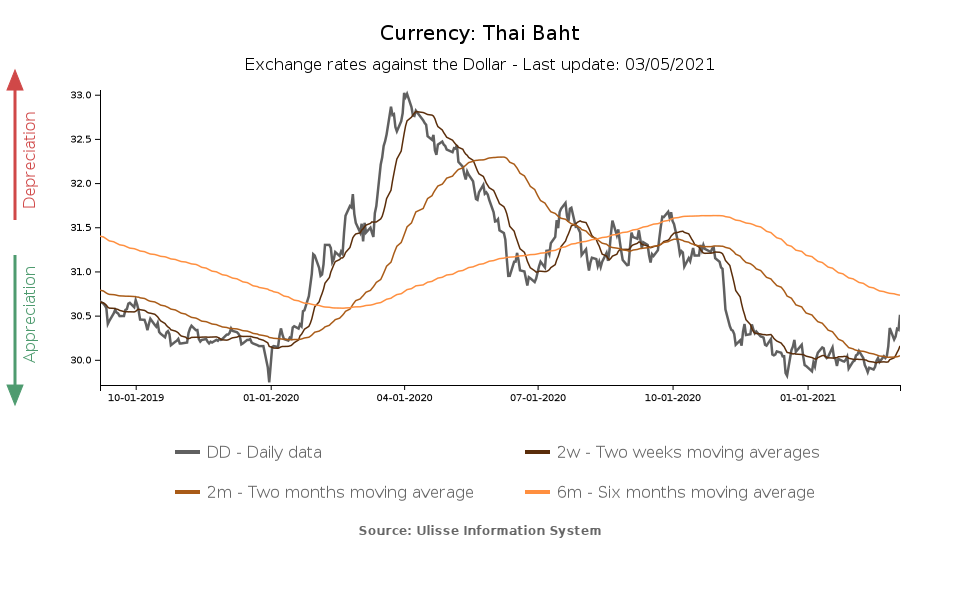

## Table of Contents

## What is the Thai Baht and when was it first introduced?

The Thai Baht is the official currency of Thailand. It is used every day by people in Thailand to buy things like food, clothes, and other things they need. The symbol for the Thai Baht is ฿, and it is divided into 100 satang.

The Thai Baht was first introduced a long time ago in 1897. Before that, Thailand used different kinds of money. In 1897, the government decided to use the Baht as the main money for the country. Since then, the Baht has been used and is still used today in Thailand.

## How has the design of the Thai Baht changed over time?

The design of the Thai Baht has changed a lot since it was first introduced in 1897. At the beginning, the Baht was made of silver and had the image of the king on one side. Over the years, the Baht started to be made from different materials like nickel and copper. The designs on the coins also changed to show different kings and important symbols of Thailand. For example, some coins had images of temples or elephants, which are very important in Thai culture.

Banknotes of the Thai Baht have also changed a lot. When they were first made, the banknotes were quite simple and showed the king's picture. As time went on, the banknotes became more colorful and included more detailed pictures. They started to show not just the king, but also important places in Thailand like the Grand Palace or famous Thai people. The security features on the banknotes also got better to stop people from making fake money. Today, the Thai Baht banknotes are very colorful and have many different designs that show the rich culture and history of Thailand.

## What are the different denominations of the Thai Baht?

The Thai Baht comes in different sizes of money, called denominations. For coins, you can find 25 satang, 50 satang, 1 Baht, 2 Baht, 5 Baht, and 10 Baht. The satang is a smaller unit of the Baht, where 100 satang equals 1 Baht. These coins are used for smaller purchases, like buying snacks or paying for bus fares.

For banknotes, the Thai Baht has bigger denominations. You can find banknotes of 20 Baht, 50 Baht, 100 Baht, 500 Baht, and 1000 Baht. These banknotes are used for bigger purchases, like buying clothes or paying for meals at a restaurant. Each banknote has a different color and design, making it easy to tell them apart.

## How is the Thai Baht managed by the Bank of Thailand?

The Bank of Thailand is in charge of the Thai Baht. They make sure that the money in Thailand is safe and works well. The Bank of Thailand decides how much money should be in the country. They do this by controlling how much money banks can lend and by setting interest rates. If they think there is too much money, they might make it harder for banks to lend money. If they think there is not enough money, they might make it easier.

The Bank of Thailand also makes sure that the Thai Baht stays strong compared to other countries' money. They watch the exchange rate, which is how much one Baht is worth in other currencies like the US Dollar. If the Baht is getting too weak, the Bank of Thailand might buy Baht to make it stronger. If the Baht is getting too strong, they might sell some Baht to make it weaker. This helps keep the Thai economy stable and helps people in Thailand buy things from other countries.

## What major historical events have influenced the value of the Thai Baht?

The value of the Thai Baht has been affected by many big events in history. One important event was the Asian Financial Crisis in 1997. During this time, many countries in Asia had problems with their money. The Thai Baht lost a lot of its value because people were worried about Thailand's economy. The government had to ask for help from other countries to fix the problem. This crisis showed how important it is for Thailand to keep its money strong and stable.

Another event that changed the value of the Thai Baht was the global financial crisis in 2008. This crisis started in the United States but affected many countries around the world, including Thailand. People were worried about their money, so they started to sell the Thai Baht, which made it weaker. The Bank of Thailand had to work hard to make the Baht strong again. These events show that the value of the Thai Baht can be influenced by what happens in Thailand and around the world.

## How does the Thai Baht compare to other currencies in Southeast Asia?

The Thai Baht is one of the stronger currencies in Southeast Asia. When you compare it to other currencies like the Indonesian Rupiah or the Vietnamese Dong, the Thai Baht is usually worth more. For example, 1 Thai Baht can buy more Indonesian Rupiah or Vietnamese Dong. This makes the Thai Baht a bit stronger and more stable than some of its neighbors' currencies. People in Thailand can buy things from other countries more easily because their money is worth more.

The Thai Baht is also different from the Singapore Dollar and the Malaysian Ringgit, which are also strong in the region. The Singapore Dollar is usually the strongest currency in Southeast Asia, and it is often worth more than the Thai Baht. The Malaysian Ringgit is closer to the Thai Baht in value but can change a lot depending on what is happening in Malaysia's economy. Even though the Thai Baht is not as strong as the Singapore Dollar, it is still a reliable currency that people trust in the region.

## What was the impact of the 1997 Asian Financial Crisis on the Thai Baht?

The 1997 Asian Financial Crisis had a big impact on the Thai Baht. Before the crisis, the Thai Baht was fixed to the US Dollar, which means its value did not change much compared to the Dollar. But in 1997, people started to worry about Thailand's economy. They thought the Thai Baht was too strong and that Thailand had too much debt. So, they started selling the Thai Baht, which made its value drop a lot. On July 2, 1997, Thailand had to let the Baht float freely, which means its value could change based on what people thought it was worth. This made the Baht lose about half its value very quickly.

The crisis caused a lot of problems for Thailand. Many businesses and banks in Thailand had borrowed money in US Dollars, thinking the Thai Baht would stay strong. When the Baht got weaker, it became much harder for them to pay back their loans. This led to many businesses going bankrupt and banks failing. The government had to ask for help from the International Monetary Fund (IMF) to fix the economy. It took Thailand many years to recover from the crisis, but it learned important lessons about keeping its money stable and strong.

## How have economic policies in Thailand affected the stability of the Thai Baht?

Economic policies in Thailand have played a big role in keeping the Thai Baht stable. The government and the Bank of Thailand work together to make rules that help the economy grow and keep the Baht strong. For example, they control how much money is in the country by setting interest rates. If they think there is too much money, they might raise interest rates to make people save more and spend less. If they think there is not enough money, they might lower interest rates to make people borrow more and spend more. These policies help to keep the economy balanced and the Baht stable.

Another way economic policies affect the Thai Baht is through managing the exchange rate. The Bank of Thailand watches how the Baht compares to other currencies, like the US Dollar. If the Baht starts to get too weak, the Bank might buy Baht to make it stronger. If the Baht gets too strong, they might sell some Baht to make it weaker. This helps keep the Baht at a good value, which is important for businesses and people in Thailand. By carefully managing these policies, Thailand can keep its economy and its currency stable.

## What role does the Thai Baht play in Thailand's international trade?

The Thai Baht is very important for Thailand's international trade. When Thai businesses want to sell things to other countries, they often get paid in other currencies like the US Dollar or the Euro. They then need to change that money into Thai Baht to use it in Thailand. This exchange helps Thai companies make money and grow their business. If the Thai Baht is strong, it can make Thai products more expensive for other countries, which might make it harder to sell them. But if the Baht is weak, Thai products can be cheaper and easier to sell abroad.

On the other hand, when Thailand buys things from other countries, it needs to use other currencies. This means changing Thai Baht into another currency like the US Dollar. A strong Thai Baht makes it cheaper for Thailand to buy things from other countries, which can be good for the economy. But if the Baht is weak, it can make buying things from abroad more expensive. The Bank of Thailand works hard to keep the Baht at a good value so that Thailand can both sell and buy things easily in the global market.

## How does the fluctuation of the Thai Baht affect foreign investment in Thailand?

The value of the Thai Baht going up and down can change how much foreign investors want to put their money into Thailand. When the Thai Baht is strong, it can make it more expensive for foreign investors to buy things in Thailand. This might make them think twice about investing because they will get less value for their money. But when the Thai Baht is weak, it can be a good time for foreign investors. Their money can buy more in Thailand, which might encourage them to invest more.

The Thai government and the Bank of Thailand try to keep the Baht stable to help attract foreign investment. If the Baht is too unstable, it can scare away investors because they don't want to lose money if the currency changes a lot. A stable Baht makes it easier for foreign investors to plan their investments and feel confident about putting their money into Thailand's economy. This can help Thailand grow and create more jobs for its people.

## What are the current economic challenges facing the Thai Baht?

The Thai Baht faces some challenges right now because of what is happening in the world and in Thailand. One big challenge is the global economy. When other countries have problems, it can make the Thai Baht weaker. For example, if the US Dollar gets stronger, the Thai Baht might lose value. Also, if there are big events like wars or pandemics, it can make people worried about their money, which can affect the Thai Baht too.

Another challenge is inside Thailand. The country's economy needs to grow, but sometimes it can be slow. If businesses in Thailand are not doing well, it can make the Thai Baht weaker. The government and the Bank of Thailand have to work hard to keep the economy strong and the Baht stable. They do this by making good rules and watching how much money is in the country. But it can be hard because many things can change quickly.

## What future trends might impact the value and use of the Thai Baht?

In the future, the value and use of the Thai Baht could be affected by many things. One big thing is how the world's economy changes. If other countries' economies grow fast, it might make the Thai Baht weaker because people might want to use other currencies more. But if Thailand's economy does well, the Baht could get stronger. Also, new technology like digital money could change how people use the Thai Baht. If more people start using digital money, it might make the Baht less important for everyday buying and selling.

Another trend that could impact the Thai Baht is how Thailand deals with its own problems. If the government makes good rules and helps businesses grow, the Baht could stay strong. But if there are problems like too much debt or slow growth, it might make the Baht weaker. Also, things like climate change and natural disasters can hurt Thailand's economy, which would affect the Baht. The Bank of Thailand will need to keep watching these trends and make smart choices to keep the Baht stable and useful for people in Thailand.

## References & Further Reading

[1]: Talukdar, K. M., & Mandal, P. (2020). ["The Evolution of Currency: From Barter to the Thai Baht."](https://www.mendeley.com/catalogue/d918f4aa-38cf-3f86-8e61-0984d4deb55d/) In New Frontiers in Finance (pp. 151-168). Springer, Cham.

[2]: Bank of Thailand. (2022). ["Economic and Financial Statistics."](https://www.bot.or.th/en/statistics.html) Retrieved from the Bank of Thailand Official Website.

[3]: Fung, K. C., Ho, F., & Zhu, L. (2019). ["Foreign Exchange Markets in Asia."](https://pmc.ncbi.nlm.nih.gov/articles/PMC7426176/) Edward Elgar Publishing.

[4]: Choudhry, M. (2017). ["An Introduction to Algorithmic Trading: Basic to Advanced Concepts Explained."](https://archive.org/details/introductiontoal0000lesh) John Wiley & Sons.

[5]: Mulherin, J. H. (2000). ["Global Financial Markets," in A. Mullineux (Ed.), Handbook of International Banking."](https://www.springer.com/series/15011) Edward Elgar Publishing.