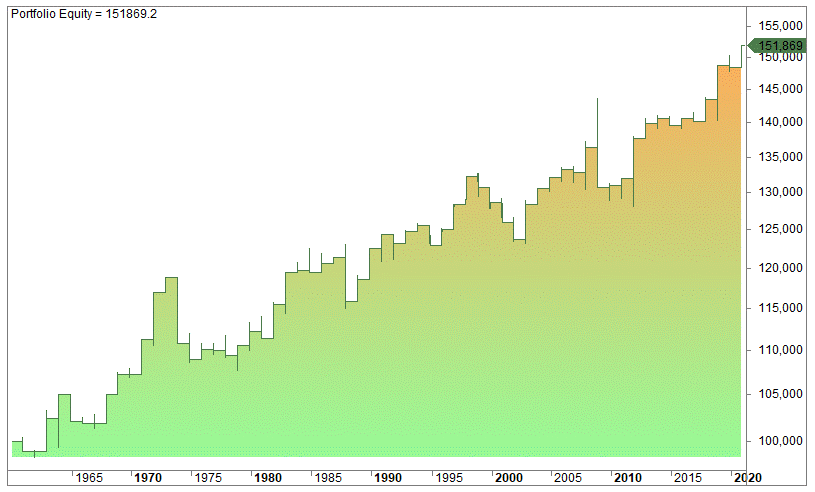

As Thanksgiving approaches, market participants often turn their attention to the potential impact of this holiday on stock market performance. The Thanksgiving effect refers to a seasonal anomaly observed in financial markets, where stocks tend to exhibit a positive trend during the days surrounding Thanksgiving. This period, characterized by a mix of optimism and holiday sentiment, has historically presented opportunities for traders to enhance their portfolios.

Algorithmic trading, with its emphasis on precise execution and data-driven decision-making, provides a unique lens through which to analyze and potentially capitalize on the Thanksgiving effect. By examining historical performance data and employing backtested trading strategies, algorithmic traders can identify patterns and trends that might otherwise be obscured by noise in the market. The use of algorithms allows for the efficient processing of large datasets, enabling traders to uncover subtle market dynamics that align with the Thanksgiving effect.



The advantage of employing algorithmic trading strategies during this period lies in their ability to optimize trade timing and execution, reducing the impact of emotional decision-making. For instance, traders can program algorithms to initiate trades based on historical patterns observed in Thanksgiving periods, allowing them to systematically exploit these trends.

This article aims to provide a comprehensive understanding of the Thanksgiving effect and its implications for algorithmic trading. Through an analysis of backtested strategies and historical performance, traders can refine their approach to this seasonal anomaly, maximizing their potential returns. By leveraging data-driven insights, algorithmic traders can effectively navigate the market dynamics associated with Thanksgiving, seizing trading opportunities as they arise.

## Table of Contents

## The Thanksgiving Effect: An Overview

Thanksgiving is observed annually on the fourth Thursday of November, marking a notable period for the U.S. stock markets. The holiday introduces unique trading conditions, primarily distinguished by the market closure on Thanksgiving Day and a shortened trading session on the subsequent Friday, known as Black Friday. These conditions contribute to what's sometimes referred to as the "Thanksgiving effect"—a market phenomenon characterized by a historical trend of positive stock performance during this period.

Historically, the week surrounding Thanksgiving has exhibited a tendency for stock prices to rise, resulting in the Thanksgiving effect. This pattern has been documented across various market indices, suggesting that the holiday brings about a temporary bullish sentiment among investors. Analysts attribute this trend to several factors, including increased consumer spending during the holiday season, the closing of positions by fund managers to improve year-end reports, and reduced trading volumes leading to volatility that can skew market prices upward.

Many traders actively seek to capitalize on this seasonal trend, attempting to bolster their portfolios by exploiting the predictable nature of market behaviors during this period. For instance, some traders might enter positions prior to Thanksgiving and [exit](/wiki/exit-strategy) afterward, aiming to capture the general uptick in stock prices.

Both manual and automated trading strategies can benefit from the Thanksgiving effect. Manual traders might employ traditional technical analysis to identify entry and exit points based on historical data. In contrast, automated systems can programmatically detect these opportunities, ensuring trades are executed with precision and consistency. Understanding these recurring market dynamics can be essential for implementing strategies that optimize returns during the Thanksgiving period.

In summary, the Thanksgiving effect presents both opportunities and challenges for traders. Recognizing and leveraging the predictable patterns associated with this holiday can significantly impact trading outcomes, making it a focal point for strategy development for those aiming to enhance performance during this time.

## Backtested Strategies for Thanksgiving

Backtesting has been instrumental in uncovering effective strategies to leverage the Thanksgiving effect in stock markets. By analyzing historical data, traders can identify patterns and optimize their approaches, particularly using [algorithmic trading](/wiki/algorithmic-trading) systems for precision and consistency.

**Strategy 1** involves entering trades at the close of the Monday before Thanksgiving and exiting by the first trading day of December. This strategy is based on the premise that market sentiments are generally positive during this period, due to anticipated holiday spending and investor optimism. The risk/reward ratio for this strategy can vary depending on market conditions and individual stock volatility. Historically, backtests have shown that this period often yields positive returns, offering a favorable risk/reward balance for traders with a low to moderate risk appetite.

**Strategy 2** suggests buying at the close of the Friday before Thanksgiving and selling at the close of Black Friday. This shorter timeframe strategy capitalizes on the enthusiasm surrounding Black Friday, a major shopping event that can lead to increased stock valuations, particularly for retail companies. While the strategy offers a more concentrated risk due to its shorter duration, it also provides an opportunity for quick gains when executed effectively. This strategy might appeal to traders with a higher risk tolerance who are seeking rapid returns.

To implement these strategies effectively, algorithmic systems can be employed. These systems utilize historical data to automate trade execution, minimizing emotional biases and human error. By coding algorithms to streamline these trades, traders can ensure consistent application of strategies. Here is an example of Python code that could be used to automate such strategies:

```python
import pandas as pd
import numpy as np

def enter_position(data, start_day):
    # Enter position at the end of the specified start_day
    entry_price = data.loc[start_day, 'Close']
    return entry_price

def exit_position(data, end_day):
    # Exit position at the end of the specified end_day
    exit_price = data.loc[end_day, 'Close']
    return exit_price

def strategy(data, start_day, end_day):
    entry_price = enter_position(data, start_day)
    exit_price = exit_position(data, end_day)
    return_percentage = ((exit_price - entry_price) / entry_price) * 100
    return return_percentage

# Example of getting historical data for backtesting
# data = pd.read_csv('historical_stock_data.csv', parse_dates=['Date'], index_col='Date')

# strategy_output = strategy(data, '2022-11-21', '2022-12-01')
# print(f'Return Percentage: {strategy_output}%')
```

It's important to tailor these backtested strategies to individual circumstances and to consider transaction costs, which can impact net returns. Furthermore, continual [backtesting](/wiki/backtesting) and strategy refinement are necessary, as market dynamics evolve and historical patterns may not always predict future performance effectively. This analytical approach offers traders the ability to select strategies that align with their financial goals and risk preferences.

## Implications for Algorithmic Trading

Algorithmic trading significantly enhances the ability of traders to capitalize on the Thanksgiving effect through automated and precise execution strategies. By leveraging historical Thanksgiving performance data and integrating it with current market conditions, algorithms can be designed to systematically execute trades with minimal emotional influence. This computational precision is crucial, as it allows traders to exploit temporary market inefficiencies with consistency.

One of the main advantages of algorithmic trading in this context is its suitability for high-frequency trading platforms. The Thanksgiving effect, while subtle, presents a predictable pattern that can be optimized for short-term gains. These small but consistent edges are ideal for algorithms running on such platforms. Implementing automated strategies requires a detailed understanding of historical price movements and [volatility](/wiki/volatility-trading-strategies) patterns surrounding Thanksgiving.

Automated backtesting tools serve as a backbone for developing effective algorithmic strategies. By simulating trades based on historical data, traders can refine entry and exit points, minimize drawdowns, and maximize returns. For example, consider a backtesting scenario coded in Python:

```python
import pandas as pd
import numpy as np

def thanksgiving_strategy(df):
    # Simulating a strategy that buys just before Thanksgiving and sells after
    df['Position'] = np.where((df.index.strftime('%m-%d') == '11-22'), 1, 0)
    df['Returns'] = df['Close'].pct_change()
    df['Strategy'] = df['Position'].shift(1) * df['Returns']
    return df['Strategy'].cumsum().plot()

# Assuming 'data' is a DataFrame with stock prices, indexed by date
thanksgiving_results = thanksgiving_strategy(data)
```

This simple Python snippet illustrates how a strategy can be tested by entering trades around a specific period, such as the days leading to Thanksgiving. By analyzing cumulative returns, traders can assess the viability of their strategy and make necessary adjustments. 

Moreover, the ongoing optimization of algorithmic strategies is vital. As market conditions fluctuate, algorithms need to adapt by recalibrating parameters such as timeframes for entering and exiting trades, leverage, and risk management protocols. The ability to update algorithms quickly based on new insights ensures ongoing relevance and can maintain a trader's competitive edge.

Overall, algorithmic trading facilitates the effective exploitation of the Thanksgiving effect, providing traders with tools to execute high-speed, data-driven strategies. As technology advances, the continuous improvement and adaptation of these algorithms will be essential for sustained success in capturing seasonal market anomalies.

## Conclusion and Final Thoughts

The Thanksgiving effect is increasingly recognized as a seasonal anomaly that traders can exploit for potential gains. By understanding and leveraging the patterns associated with Thanksgiving, traders have a unique opportunity to capitalize on short-term positive trends typically observed around this holiday. The ability to anticipate these trends can be particularly advantageous, allowing traders to make informed decisions.

Algorithmic trading stands out as a highly effective approach to exploiting the Thanksgiving effect. Its precision and efficiency minimize human error and emotional decision-making, which are often the Achilles' heel of manual trading. Algorithmic systems can quickly analyze large datasets, execute trades at optimal times, and adjust strategies based on real-time market conditions. This precision is critical given the typically narrow window of opportunity to capitalize on the Thanksgiving effect.

Integrating historical performance data and backtested strategies is crucial for enhancing profitability during this period. Backtesting provides a window into how certain strategies would have performed in the past, thereby helping traders refine their approaches and minimize risks. For instance, a backtested strategy might reveal that entering trades on the Monday before Thanksgiving and exiting by the first trading day in December has historically yielded positive results. By incorporating such data-driven insights, traders can increase their chances of success.

Understanding market seasonality is key to developing robust trading strategies. Thanksgiving presents a unique opportunity as part of broader seasonal trading patterns, which, if successfully navigated, can significantly enhance a trader's portfolio performance. Recognizing these patterns involves not only acknowledging historical trends but also adapting to current market conditions, ensuring strategies remain effective.

As markets evolve, ongoing evaluation and adaptation of strategies are essential for sustained trading success. What worked in the past may not always work in the future, making it imperative for traders to continuously optimize their strategies based on current data and trends. This adaptability, combined with algorithmic precision, provides a formidable framework for leveraging the Thanksgiving effect and achieving long-term success in trading.

In conclusion, the Thanksgiving effect offers a tangible opportunity for traders, particularly those utilizing algorithmic trading. By embracing historical insights and adapting to ongoing market changes, traders can effectively exploit this seasonal anomaly and potentially achieve enhanced returns.

## References & Further Reading

[1]: ["Advances in Financial Machine Learning"](https://www.amazon.com/Advances-Financial-Machine-Learning-Marcos/dp/1119482089) by Marcos Lopez de Prado

[2]: ["Evidence-Based Technical Analysis: Applying the Scientific Method and Statistical Inference to Trading Signals"](https://www.amazon.com/Evidence-Based-Technical-Analysis-Scientific-Statistical/dp/0470008741) by David Aronson

[3]: ["Machine Learning for Algorithmic Trading"](https://github.com/stefan-jansen/machine-learning-for-trading) by Stefan Jansen

[4]: ["Quantitative Trading: How to Build Your Own Algorithmic Trading Business"](https://books.google.com/books/about/Quantitative_Trading.html?id=j70yEAAAQBAJ) by Ernest P. Chan