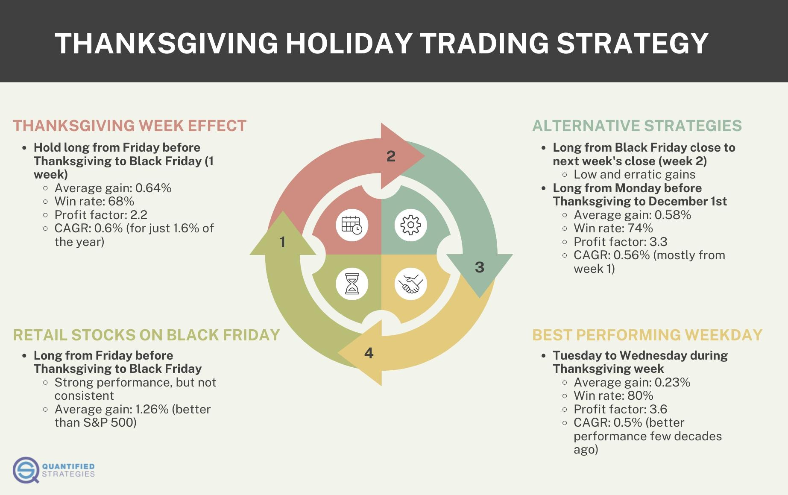

## Table of Contents

## What is the Thanksgiving Holiday Effect in trading?

The Thanksgiving Holiday Effect in trading refers to a pattern where stock market returns tend to be higher around the Thanksgiving holiday in the United States. This effect is observed because many traders and investors take time off during the holiday, leading to lower trading volumes. With fewer people trading, the market can experience less volatility and sometimes positive returns as the reduced activity can lead to a more stable market environment.

This phenomenon is not guaranteed every year, but historical data has shown that the days leading up to and following Thanksgiving often see an uptick in stock prices. Traders and investors might take advantage of this trend by adjusting their strategies around this time, perhaps holding onto their stocks a bit longer or making specific trades based on the expected holiday effect. However, it's important to remember that past performance does not guarantee future results, and other factors can influence market behavior during this period.

## How does the Thanksgiving holiday impact stock market performance?

The Thanksgiving holiday can make the stock market go up a bit. This happens because many people take time off for the holiday, so fewer people are buying and selling stocks. When fewer people trade, the market can be less wild and sometimes the prices go up. This is called the Thanksgiving Holiday Effect. It's not something that happens every year, but it has been seen in the past.

Even though the market might go up around Thanksgiving, it's not a sure thing. Other things can change how the market acts during this time. For example, big news or events can still make the market go up or down. So, while some people might try to use the Thanksgiving Holiday Effect to help them decide what to do with their stocks, they need to remember that it's just one part of a bigger picture.

## What historical data supports the existence of the Thanksgiving Holiday Effect?

Historical data shows that the stock market often goes up around Thanksgiving. For example, a study by the Stock Trader's Almanac found that the S&P 500 has had positive returns in the week before Thanksgiving more often than not. This trend has been seen over many years, suggesting that the market tends to do well during this time.

Another piece of data comes from looking at the days right after Thanksgiving. The market has often started the week after the holiday with gains. This could be because people are in a good mood after the holiday and feel more positive about investing. While these patterns don't happen every single year, they have been strong enough over time to support the idea of the Thanksgiving Holiday Effect.

## Are there specific sectors or stocks that are more affected by the Thanksgiving Holiday Effect?

Some sectors and stocks might feel the Thanksgiving Holiday Effect more than others. Retail stocks often do well around Thanksgiving because of Black Friday and Cyber Monday sales. People start shopping for the holidays, so stores like Walmart and Amazon might see their stock prices go up. Also, companies that make food and drinks, like Coca-Cola and Kraft Heinz, can see a boost because people buy more for Thanksgiving dinners and parties.

Other sectors might not see as much of an effect. For example, tech companies or industrial firms might not have a big change in their stock prices just because of the holiday. But if there's good news or a new product around that time, their stocks could still go up. So, while some sectors like retail and consumer goods might be more influenced by the Thanksgiving Holiday Effect, it's not a rule that applies to every stock or sector.

## How can traders prepare for the Thanksgiving Holiday Effect?

Traders can get ready for the Thanksgiving Holiday Effect by looking at what happened in past years. They should check how the stock market did around Thanksgiving before and see if there are patterns. For example, if retail stocks like Walmart and Amazon usually go up because of holiday shopping, traders might want to buy those stocks before the holiday. They should also keep an eye on food and drink companies, as these can do well too because of Thanksgiving dinners.

It's also important for traders to not bet everything on the Thanksgiving Holiday Effect. The market can be tricky, and other things can change how it acts. So, while it might be a good idea to think about this effect, traders should also have other plans. They could set up stop-loss orders to limit any losses if the market doesn't go up like expected. And they should keep checking the news for anything that might affect the market, even during the holiday time.

## What are the psychological factors contributing to the Thanksgiving Holiday Effect?

The Thanksgiving Holiday Effect can be influenced by how people feel during the holiday season. Many people are in a good mood because they get to spend time with family and friends, and this positive feeling can make them more likely to invest in the stock market. When people are happy, they might think the future looks bright and decide to buy more stocks, which can push the market up.

Another psychological factor is that fewer people are trading during the holiday. With many traders taking time off, the market can become less busy and less wild. This can make people feel more confident about investing because there's less chance of big, sudden changes in stock prices. So, the calm and happy atmosphere around Thanksgiving can lead to a more stable and sometimes rising market.

## How does trading volume change around Thanksgiving, and what does this indicate?

Around Thanksgiving, the trading volume in the stock market usually goes down. This happens because many traders and investors take time off to be with their families and enjoy the holiday. When fewer people are trading, the number of stocks being bought and sold drops, which means the trading volume is lower than usual.

This lower trading volume can make the market feel calmer and less wild. With fewer people making trades, there's less chance for big, sudden changes in stock prices. This can make investors feel more confident and might even help push stock prices up a bit, which is part of what people call the Thanksgiving Holiday Effect.

## Can the Thanksgiving Holiday Effect be observed in other financial markets besides stocks?

The Thanksgiving Holiday Effect can also be seen in other financial markets, like bonds and commodities. Just like with stocks, fewer people trade these things around Thanksgiving because they are busy with the holiday. This can make the bond market and commodity markets less busy and sometimes more stable. For example, the price of gold or oil might not change as much as usual because fewer people are buying and selling.

Even though the Thanksgiving Holiday Effect is most talked about with stocks, it can affect other markets too. People might feel happier and more confident around the holiday, which can make them more likely to invest in bonds or buy commodities. But, like with stocks, it's not a sure thing that these markets will go up just because it's Thanksgiving. Other things can still change how these markets act during the holiday time.

## What are the differences in the Thanksgiving Holiday Effect between the U.S. and other countries?

The Thanksgiving Holiday Effect is mostly seen in the U.S. because Thanksgiving is a big holiday there. People in the U.S. take time off to be with family and friends, so fewer people trade stocks and other things. This can make the market less busy and sometimes the prices go up a bit. In other countries, Thanksgiving isn't a holiday, so people keep trading like normal. This means the Thanksgiving Holiday Effect doesn't really happen in other countries because their markets don't slow down around that time.

Even though the Thanksgiving Holiday Effect is mainly a U.S. thing, other countries might see similar effects around their own big holidays. For example, during Christmas or New Year's, markets in other countries might also get less busy because people take time off. But these effects would be tied to those specific holidays and not to Thanksgiving, which is unique to the U.S. So, while the idea of holiday effects on markets can happen in different places, the Thanksgiving Holiday Effect itself is mostly a U.S. phenomenon.

## How reliable is the Thanksgiving Holiday Effect as a trading strategy?

The Thanksgiving Holiday Effect can sometimes help traders make good choices, but it's not something they can always count on. It's based on the idea that the stock market often goes up a bit around Thanksgiving because fewer people are trading. This can make the market less wild and sometimes the prices go up. But this doesn't happen every year, and other things can change how the market acts during this time. So, while some traders might use this effect to help them decide what to do, they should be careful and not bet everything on it.

Traders should look at past years to see if the Thanksgiving Holiday Effect has worked before. They might see that retail and food stocks often do well around this time because of holiday shopping and dinners. But even if it has worked in the past, it's not a sure thing for the future. Traders need to have other plans and be ready for surprises. Using the Thanksgiving Holiday Effect as part of a bigger plan can be okay, but it's not a strategy that works all by itself.

## What are the potential risks of trading based on the Thanksgiving Holiday Effect?

Trading based on the Thanksgiving Holiday Effect can be risky because it's not something that happens every year. Just because the stock market has gone up around Thanksgiving in the past doesn't mean it will do the same thing every time. Other things, like big news or events, can still make the market go up or down, even during the holiday. So, if traders bet all their money on the market going up just because it's Thanksgiving, they might lose a lot if the market doesn't follow the expected pattern.

Another risk is that the Thanksgiving Holiday Effect might make traders too confident. They might think the market will always be calm and go up a bit around this time, but that's not always true. If traders don't have other plans and just rely on this effect, they could be caught off guard by sudden changes in the market. It's important for traders to be ready for anything and not put all their eggs in one basket, even if the Thanksgiving Holiday Effect has worked before.

## How have algorithmic trading and high-frequency trading influenced the Thanksgiving Holiday Effect?

Algorithmic trading and high-frequency trading have changed how the Thanksgiving Holiday Effect works. These kinds of trading use computers to buy and sell stocks very quickly, even when fewer people are trading around Thanksgiving. Because of this, the market might not get as calm as it used to during the holiday. The computers keep trading, so the market can still be busy and might not go up as much as it did in the past when there was less trading.

Even though algorithmic and high-frequency trading can make the market less predictable around Thanksgiving, the holiday effect can still happen. If the computers follow patterns from past years, they might help push the market up a bit. But it's harder to count on the Thanksgiving Holiday Effect now because these fast trading systems can react to new information quickly and change how the market acts, even during the holiday time.

## References & Further Reading

[1]: ["Advances in Financial Machine Learning"](https://www.amazon.com/Advances-Financial-Machine-Learning-Marcos/dp/1119482089) by Marcos Lopez de Prado

[2]: ["Evidence-Based Technical Analysis: Applying the Scientific Method and Statistical Inference to Trading Signals"](https://www.amazon.com/Evidence-Based-Technical-Analysis-Scientific-Statistical/dp/0470008741) by David Aronson

[3]: ["Machine Learning for Algorithmic Trading"](https://github.com/stefan-jansen/machine-learning-for-trading) by Stefan Jansen

[4]: ["Quantitative Trading: How to Build Your Own Algorithmic Trading Business"](https://books.google.com/books/about/Quantitative_Trading.html?id=j70yEAAAQBAJ) by Ernest P. Chan