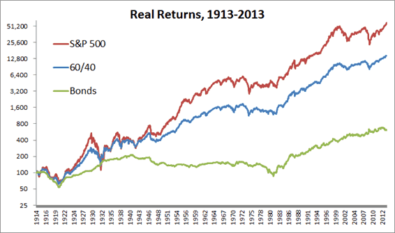

## Table of Contents

## What is a benchmark portfolio?

A benchmark portfolio is a standard set of investments that people use to compare how well their own investments are doing. It's like a yardstick that helps investors see if they are doing better or worse than a common set of investments. For example, if you have a portfolio of stocks, you might compare it to a benchmark like the S&P 500 to see if your choices are beating the market.

These benchmarks are often made up of well-known indexes or a mix of different types of investments. They are important because they give investors a clear way to measure performance. If your portfolio is doing better than the benchmark, it means your investment choices are working well. If it's doing worse, it might be time to rethink your strategy.

## What does the 60/40 portfolio consist of?

A 60/40 portfolio is a type of investment mix where 60% of the money is put into stocks and 40% is put into bonds. This mix is popular because it tries to balance the risk and reward. Stocks can grow a lot but can also lose value quickly, while bonds are usually safer but don't grow as much. By having both, the portfolio aims to grow over time while keeping some safety.

People like the 60/40 portfolio because it's simple and has worked well for a long time. It's a good choice for someone who wants to invest without spending too much time watching the market. The stocks part can help the portfolio grow, and the bonds part can help protect it when the stock market goes down. This mix can change a bit depending on what someone wants, but the basic idea stays the same.

## Why is the 60/40 portfolio considered a benchmark?

The 60/40 portfolio is considered a benchmark because it's a simple and effective way to invest that many people use. It's easy to understand and follow, which makes it a good standard to compare other investment strategies against. When people want to see if their own mix of investments is doing well, they often look at how it stacks up against a 60/40 portfolio. This helps them decide if they're taking the right amount of risk and getting good returns.

Over many years, the 60/40 portfolio has shown that it can grow money while also keeping it safe. It's not too risky because it has a good balance of stocks and bonds. This balance has worked well for a long time, so it's a trusted way to invest. That's why many investors and financial advisors use it as a benchmark to see if other portfolios are doing better or worse.

## How does the 60/40 portfolio balance risk and return?

The 60/40 portfolio balances risk and return by mixing stocks and bonds in a way that tries to get the best of both worlds. Stocks can grow a lot, but they can also lose value quickly. This is why the portfolio puts 60% of the money into stocks. This part helps the portfolio grow over time. But because stocks can be risky, the portfolio also puts 40% into bonds. Bonds are usually safer and don't lose as much value when the market goes down. This part helps protect the money when things get tough.

By having both stocks and bonds, the 60/40 portfolio aims to grow while also keeping some safety. When the stock market is doing well, the 60% in stocks can make the portfolio grow a lot. But if the stock market goes down, the 40% in bonds can help keep the losses smaller. This mix makes the portfolio less risky than having all the money in stocks, but it can still grow more than if it was all in bonds. It's a simple way to try to get good returns without taking too much risk.

## What are the historical performance statistics of the 60/40 portfolio?

The 60/40 portfolio has done well over many years. From 1926 to 2020, it had an average yearly return of about 8.8%. This means if you put $100 into a 60/40 portfolio in 1926, it would have grown to around $450,000 by 2020. The portfolio did better than inflation, which is important because it means the money kept its value over time. It also did better than just having all the money in bonds, but not as well as having all the money in stocks.

But the 60/40 portfolio also had some bad years. The worst year was 1931, when it lost about 27%. There were other years with big losses too, like 2008 when it lost about 22%. These bad years show that even though the 60/40 portfolio is safer than just having stocks, it can still lose money. But over the long run, it has been a good way to grow money while keeping some safety.

## How does the 60/40 portfolio perform during different market conditions?

The 60/40 portfolio does well when the stock market is going up. Because it has 60% in stocks, it can grow a lot during these times. The bonds part, which is 40%, doesn't grow as much but it's there to help if the stock market goes down. So, when the market is doing well, the 60/40 portfolio can make good money because the stocks are doing well.

But when the stock market goes down, the 60/40 portfolio can lose money too. The 60% in stocks will lose value, but the 40% in bonds can help make the losses smaller. Bonds are usually safer, so they don't lose as much when the market is bad. This mix helps the portfolio not lose as much money as if it was all in stocks. Over time, the 60/40 portfolio has shown it can handle different market conditions pretty well, growing when the market is up and not losing too much when the market is down.

## What are the advantages of using a 60/40 portfolio?

The 60/40 portfolio is easy to understand and follow. It's a simple way to invest that many people like because it doesn't need a lot of time to watch the market. You just put 60% of your money into stocks and 40% into bonds. This mix has worked well for a long time, so it's a trusted way to grow your money. It's also a good way to see if other ways of investing are doing better or worse, because many people use it as a benchmark.

Another big advantage is that the 60/40 portfolio balances risk and reward. The 60% in stocks can help your money grow a lot when the stock market is doing well. But stocks can also lose value quickly, so the 40% in bonds helps keep your money safer. Bonds don't grow as much as stocks, but they don't lose as much when the market goes down. This mix means you can grow your money over time while also keeping some safety, which is why many people like it.

## What are the potential drawbacks of the 60/40 portfolio?

One potential drawback of the 60/40 portfolio is that it might not grow as much as a portfolio with more stocks. If the stock market is doing really well, having only 60% in stocks means you might miss out on bigger gains. This can be a problem if you want your money to grow a lot over time. Also, the 60/40 mix might not be the best for everyone. Some people might want to take more risk for more reward, or they might want to be safer and have more bonds. The 60/40 split is a one-size-fits-all approach that might not fit everyone's needs.

Another issue is that the 60/40 portfolio can still lose money when the stock market goes down. Even though the 40% in bonds helps, the 60% in stocks can still make the portfolio lose value. This can be hard for people who don't like to see their money go down, even if it's less than if they had all their money in stocks. Also, the 60/40 portfolio might not do as well in times when both stocks and bonds are not doing well. This can happen if there's a big economic problem that affects both stocks and bonds at the same time.

## How should one rebalance a 60/40 portfolio?

Rebalancing a 60/40 portfolio means making sure it stays at 60% stocks and 40% bonds. Over time, the value of stocks and bonds can change. If stocks do really well, you might end up with more than 60% in stocks. To fix this, you sell some stocks and buy more bonds until you're back to 60% stocks and 40% bonds. If bonds do better, you might have more than 40% in bonds. Then, you sell some bonds and buy more stocks to get back to the right mix.

You should rebalance your 60/40 portfolio once or twice a year. Some people do it every six months, and others do it once a year. It's a good idea to check your portfolio and see if it's still at 60% stocks and 40% bonds. If it's not, you make the changes to get it back to the right mix. This helps keep your portfolio balanced and working the way you want it to.

## Can the 60/40 portfolio be customized for individual investor needs?

Yes, the 60/40 portfolio can be changed to fit what each person wants. Not everyone is the same, so you can make the portfolio more or less risky. If you want to take more risk for more reward, you can put more than 60% in stocks and less than 40% in bonds. If you want to be safer, you can put more in bonds and less in stocks. You can also pick different kinds of stocks and bonds to match what you believe in or what you want to do with your money.

For example, if you care a lot about the environment, you can choose stocks and bonds from companies that are good for the planet. Or if you want to invest in certain countries or industries, you can do that too. The key is to think about what you want and then change the 60/40 mix to fit your goals. This way, the portfolio can still be simple but also right for you.

## How does the 60/40 portfolio compare to other investment strategies?

The 60/40 portfolio is a middle-of-the-road choice when you compare it to other ways to invest. It's not as risky as having all your money in stocks, but it can still grow more than if you had all your money in bonds. Some people like to take more risk and put all their money in stocks, hoping to make a lot of money. But this can be scary because stocks can lose value fast. On the other hand, some people want to be very safe and put all their money in bonds. This is less risky, but it also means their money won't grow as much. The 60/40 portfolio tries to find a good balance between these two extremes.

Another way to invest is to use a target-date fund, which changes the mix of stocks and bonds as you get closer to a certain date, like when you want to retire. This can be good because it gets safer over time, but it might not grow as much as the 60/40 portfolio in the early years. There are also more complex strategies like using ETFs or mutual funds that focus on certain parts of the market or use fancy ways to try to beat the market. These can be good if you know a lot about investing, but they can also be hard to understand and might not work as well as the simple 60/40 mix. The 60/40 portfolio is easy to understand and follow, which is why many people like it even when there are other choices out there.

## What future trends might impact the effectiveness of the 60/40 portfolio?

One big thing that might change how well the 60/40 portfolio works in the future is low interest rates. When interest rates are low, bonds don't make as much money. This means the 40% of the portfolio that's in bonds might not help as much to keep the money safe. If this happens, the whole portfolio might not grow as much or be as safe as it used to be. People might need to think about putting more money into stocks or finding other ways to keep their money safe.

Another thing to watch out for is how the stock market and the bond market move together. Usually, when stocks go down, bonds go up, which helps the 60/40 portfolio stay balanced. But if both stocks and bonds start going down at the same time, the portfolio could lose more money than people expect. This can happen if there's a big problem in the economy that affects everything. So, it's important to keep an eye on how these markets are doing and maybe change the mix of stocks and bonds to fit what's happening in the world.

## References & Further Reading

[1]: Bergstra, J., Bardenet, R., Bengio, Y., & Kégl, B. (2011). ["Algorithms for Hyper-Parameter Optimization."](https://dl.acm.org/doi/10.5555/2986459.2986743) Advances in Neural Information Processing Systems 24.

[2]: ["Advances in Financial Machine Learning"](https://www.amazon.com/Advances-Financial-Machine-Learning-Marcos/dp/1119482089) by Marcos Lopez de Prado

[3]: ["Evidence-Based Technical Analysis: Applying the Scientific Method and Statistical Inference to Trading Signals"](https://www.amazon.com/Evidence-Based-Technical-Analysis-Scientific-Statistical/dp/0470008741) by David Aronson

[4]: ["Machine Learning for Algorithmic Trading"](https://github.com/stefan-jansen/machine-learning-for-trading) by Stefan Jansen

[5]: ["Quantitative Trading: How to Build Your Own Algorithmic Trading Business"](https://books.google.com/books/about/Quantitative_Trading.html?id=j70yEAAAQBAJ) by Ernest P. Chan