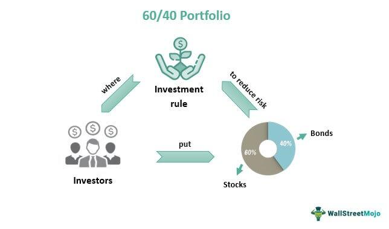

Algorithmic trading refers to the use of computer algorithms to automatically execute trading orders based on predefined criteria. These algorithms utilize mathematical models and high-speed access to financial markets to execute orders at optimal prices, thereby minimizing costs and maximizing profits. In modern financial markets, algorithmic trading is significant due to its ability to process large volumes of data at speeds unattainable by human traders. This capability not only enhances market efficiency but also provides liquidity, thereby reducing bid-ask spreads.

Historically, the 60/40 benchmark represents a well-established portfolio management strategy, allocating 60% of the portfolio to equities and 40% to bonds. This approach aims to balance growth from equities with the stability offered by bonds, potentially leading to optimal returns with moderated risk levels. The enduring appeal of the 60/40 rule lies in its simple yet effective diversification, which has long influenced traditional investment strategies and financial planning.



In the context of algorithmic trading, the 60/40 rule's relevance emerges from its foundational role in evaluating portfolio performance. Although algorithmic trading often ventures beyond conventional asset allocation due to its ability to implement complex and rapid trading strategies, the 60/40 benchmark serves as a critical point of reference. It allows traders to assess the performance of algorithmic strategies against a diversified yet straightforward standard, aiding in strategy validation and decision-making.

Understanding benchmarks like the 60/40 rule is crucial for evaluating trading strategies, particularly in the dynamic landscape of algorithmic trading. Benchmarks provide an objective standard against which the effectiveness and efficiency of various trading strategies can be measured. They enable traders to determine whether their algorithms are outperforming traditional strategies, such as the 60/40 mix, considering varying market conditions and risk factors.

This introduction sets the stage for a detailed exploration of how the 60/40 benchmark can be mapped to algo trading strategies, examining its applicability, the challenges involved, and the evolution of these strategies in light of technological advancements. Understanding whether and how algorithmic strategies can align with traditional benchmarks like the 60/40 rule is essential for modern traders seeking to optimize their performance in increasingly complex markets.

## Table of Contents

## Understanding the 60/40 Portfolio Benchmark

The 60/40 portfolio benchmark is a well-established asset allocation model rooted in the principles of diversification and risk management. Historically, the rationale behind the 60/40 portfolio's development lies in its ability to balance growth potential with risk mitigation. This strategy typically involves allocating 60% of a portfolio's assets to equities and 40% to bonds, which aims to provide both capital appreciation and income generation.

Equities are generally associated with higher risk and the potential for substantial returns, making them a crucial component for capital growth. The choice of a 60% allocation to equities is based partly on historical data indicating that stocks tend to deliver higher returns over long periods. On the other hand, bonds, with a 40% allocation, typically offer lower risk and relatively stable returns. They act as a stabilizing force, providing regular income and reducing the overall [volatility](/wiki/volatility-trading-strategies) of the portfolio.

The emergence of the 60/40 allocation as a standard strategy can be attributed to its performance track record across different economic cycles. By combining growth-focused equities with the stability of fixed-income securities, the 60/40 model aspires to achieve an optimal risk-reward balance, making it suitable for a wide range of investors, particularly those with moderate risk tolerance.

One of the primary benefits of the 60/40 benchmark is risk diversification. In a diversified portfolio, the overall risk is diminished, as different asset classes often demonstrate low or negative correlations. For example, during an economic downturn, equities might suffer, while bond prices could rise as investors flee to safety, which can offset some of the losses incurred.

Moreover, the potential for stable returns over time makes the 60/40 strategy appealing to investors aiming for long-term growth without excessive exposure to market volatility. Historical data supports the notion that a balanced approach can yield consistent performance, even amid fluctuations in the economic and market landscape.

This benchmark has significantly influenced traditional financial planning and investment decision-making, often serving as a foundational strategy for constructing diversified portfolios. Financial advisors and individual investors alike frequently turn to the 60/40 model as a guideline to maintain a disciplined approach to asset allocation, catering to both growth and income needs.

The widespread acceptance of the 60/40 benchmark is also reflected in its use as a reference point for evaluating the performance of other portfolio strategies. By providing a standard against which other allocations are measured, the 60/40 model helps investors assess the effectiveness of different investment approaches tailored to specific objectives and risk profiles.

## Algorithmic Trading: A Brief Overview

Algorithmic trading refers to the use of computer algorithms and software to execute financial trades at high speed and frequency, leveraging the power of technology and data analytics. By predefining criteria for trades, algorithmic systems can execute orders faster and more efficiently than human traders, offering advantages like minimizing market impact, exploiting market events and inefficiencies, and reducing the cost of trades.

There are several types of [algorithmic trading](/wiki/algorithmic-trading) strategies, each designed to exploit different market opportunities. One popular strategy is [arbitrage](/wiki/arbitrage), which involves buying and selling the same asset in different markets to profit from price discrepancies. For example, consider an asset priced at \$100 in Market A and \$102 in Market B. An arbitrage strategy would involve buying from Market A and simultaneously selling in Market B, pocketing the \$2 difference.

Trend following is another common strategy, where algorithms identify and capitalize on persistent market movements or trends. For instance, if a stock exhibits a prolonged upward movement, a trend-following algorithm might initiate long positions to benefit from the trend's continuation. Conversely, it would short sell in case of a downtrend.

Mean reversion strategies are based on the statistical assumption that asset prices tend to return to their historical averages. If a stock deviates significantly from its average price, an algorithmic system might predict a reversal and take positions to benefit from a price correction towards the mean.

Technology and data analytics are pivotal in the advancement of algorithmic trading. High-frequency trading ([HFT](/wiki/high-frequency-trading-strategies)), a subset of algorithmic trading, leverages powerful computing resources to execute thousands of orders within microseconds, based on real-time data analysis and direct market access (DMA). Machine learning and [artificial intelligence](/wiki/ai-artificial-intelligence) further enhance this process by enabling systems to learn from large datasets, adapt to new market conditions, and refine strategies without human intervention.

The effectiveness of algorithmic trading is evaluated using various performance metrics and benchmarks. Key metrics include the Sharpe ratio, which measures risk-adjusted returns, and the Sortino ratio, which assesses downside risk. Additionally, maximum drawdown, a measure of the largest peak-to-trough drop in a portfolio's value, is used to evaluate a strategy's risk exposure. Algorithmic trading practitioners often compare strategy performance against established benchmarks like market indices or specific risk-adjusted performance yardsticks to ensure their strategies yield optimized returns relative to market conditions.

These automated trading methodologies continue to reshape the financial landscape, fostering a more efficient market environment through enhanced [liquidity](/wiki/liquidity-risk-premium), tighter spreads, and improved price discovery. However, they also require rigorous monitoring and regulation to mitigate systemic risks and ensure market stability.

## Mapping the 60/40 Benchmark to Algo Trading

Algorithmic trading has revolutionized the way financial markets operate, often outpacing the traditional human-driven trading strategies. In this context, adapting established benchmarks like the 60/40 model, which traditionally allocates 60% of a portfolio to equities and 40% to bonds, presents a unique challenge. This section explores how this benchmark is integrated into algorithmic trading environments, the inherent challenges, and the tools and metrics used for comparison.

### Adapting the 60/40 Benchmark in Algo Trading

#### Challenges and Considerations

Implementing the [60/40 portfolio](/wiki/60-40-portfolio-vs-SP-500) strategy in algorithmic trading involves several challenges. Firstly, the static nature of the 60/40 allocation may not align well with the dynamic and fast-paced environment of algorithmic trading, which often requires more flexible risk management and rapid adjustments to market conditions. Additionally, the traditional asset classes of equities and bonds may not fully capitalize on the diverse instruments available to algorithmic traders, such as derivatives, currencies, and commodities.

Another significant consideration involves transaction costs and liquidity risks. Algorithmic trades typically involve high volumes and frequency, which can exacerbate these issues, especially for bond allocations that may offer less liquidity than equities do.

#### Performance Analysis 

The performance of algorithmic strategies against the 60/40 benchmark can vary under different market conditions. In bull markets, a traditional 60/40 portfolio may enjoy favorable returns due to rising equity prices. However, algorithmic strategies, particularly those using trend-following techniques, might underperform if they cannot react swiftly to market shifts.

Conversely, in bearish or volatile markets, algorithms may outperform a static 60/40 portfolio by leveraging strategies such as mean reversion or arbitrage, which can capitalize on short-term price inefficiencies. The adaptability of algorithmic models makes them capable of achieving optimal performance even as fixed allocations struggle with market downturns.

#### Tools and Metrics for Comparison

To evaluate the performance of algorithmic trading against the 60/40 benchmark, various tools and metrics are employed. Key performance indicators include the Sharpe Ratio, which measures risk-adjusted return, and the Sortino Ratio, which differentiates harmful volatility from total overall volatility. Algorithms might also be assessed using the Calmar Ratio, which considers drawdowns in performance comparison.

Python and other programming languages facilitate quantitative process implementation. For example, the following Python snippet uses libraries like `numpy` and `pandas` to calculate the Sharpe Ratio:

```python
import numpy as np
import pandas as pd

def sharpe_ratio(returns, risk_free_rate=0.01):
    excess_returns = returns - risk_free_rate
    return np.mean(excess_returns) / np.std(excess_returns)

# Example data
returns = pd.Series([0.02, 0.01, 0.03, 0.015, 0.025])
sharpe = sharpe_ratio(returns)
print(f'Sharpe Ratio: {sharpe}')
```

In addition to statistical metrics, forward testing and [backtesting](/wiki/backtesting) remain essential tools. These processes test the trading algorithms under historical and real-time data scenarios to compare their performance relative to the 60/40 benchmark.

Adapting the 60/40 benchmark to fit algorithmic trading environments requires reconsidering traditional strategies to accommodate the complexities and speed of modern markets. While it presents specific challenges, the application of rigorous performance metrics and advanced technology ensures that this historical portfolio model remains relevant in today's algorithmic strategies.

## Case Studies and Practical Applications

Algorithmic trading has progressively integrated traditional financial benchmarks into its frameworks, including the well-known 60/40 portfolio benchmark. This benchmark, representing 60% in equities and 40% in bonds, has been utilized by various firms to guide their algorithmic trading strategies with varying degrees of success.

### Successes and Failures

One notable success story involves a mid-sized [hedge fund](/wiki/hedge-fund-trading-strategies) that integrated the 60/40 benchmark within its algorithmic trading systems to stabilize returns in volatile markets. By employing [machine learning](/wiki/machine-learning) algorithms that adjusted the equity and bond allocation dynamically, the fund managed to achieve a stable Sharpe ratio of 1.5 over five years, aligning their performance with or exceeding that of traditional 60/40 portfolios. This demonstrated how adaptability and technological integration could enhance the benchmark's efficacy.

Conversely, a financial advisory firm encountered challenges due to the fixed nature of the 60/40 model in an algorithmic environment. Their rigid adherence to the benchmark led to underperformance during periods when bonds yielded exceptionally low or negative returns, raising questions about the benchmark's applicability in certain market conditions. This instance highlighted the need for flexibility and market-awareness within algorithmic frameworks.

### Technological Advancements

Advancements in technology have significantly influenced alignment strategies with the 60/40 benchmark. The use of big data and artificial intelligence allows for real-time analysis of market conditions, enabling strategies to adapt allocations dynamically. For instance, leveraging natural language processing (NLP) can enhance sentiment analysis, predicting equity performance and adjusting the equity component of the portfolio accordingly. Additionally, high-frequency trading platforms can execute trades swiftly to average out entry points across volatile periods, smoothing out returns relative to static strategies.

### Potential Modifications and Optimizations

To optimize the application of the 60/40 benchmark in algorithmic trading, several modifications can be considered:

1. **Dynamic Rebalancing Algorithms:** Implement algorithms capable of adjusting the allocation based on predictive analytics regarding interest rates and market volatility. Python libraries such as `pandas` and `scikit-learn` can be used to develop models that predict optimal allocation shifts.

   ```python
   import pandas as pd
   from sklearn.linear_model import LinearRegression

   # Assume df is a DataFrame containing historical market data
   X = df[['interest_rate', 'market_volatility']]
   y = df['optimal_equity_allocation']

   model = LinearRegression().fit(X, y)
   predicted_allocation = model.predict(new_market_conditions)
   ```

2. **Inclusion of Alternative Assets**: Incorporating alternative assets like commodities or real estate into the portfolio could diversify risk further. This may involve setting up separate algorithms to monitor and trade these assets, ensuring they complement the primary 60/40 assets.

3. **Currency and Geographical Diversification**: Integrating currency models to hedge against forex risks, especially for bonds, and expanding the equities to include international markets may also improve returns by spreading risks across different economies and political landscapes.

These strategies underline the importance of innovation and adaptability in applying traditional benchmarks like the 60/40 model within algorithmic trading. As markets evolve, so too must the strategies that seek to navigate them, suggesting a continual evaluation and updating of algorithms to align with shifting economic realities.

## Pros and Cons of Using the 60/40 Benchmark in Algo Trading

The 60/40 portfolio benchmark, consisting of a 60% allocation to equities and 40% to bonds, has been a staple of traditional portfolio management due to its promise of balanced risk and steady returns. Its integration into algorithmic trading frameworks offers both significant benefits and notable challenges.

### Advantages

**Historical Performance and Diversification**  
The traditional 60/40 benchmark is celebrated for its historically solid performance, providing a balance between growth (from equities) and stability (from bonds). For algorithmic trading, adopting this benchmark can serve as an anchoring strategy, offering insight into risk diversification and enabling the automation of rebalancing efforts. This mix can result in smoother equity curves, accommodating the inherent volatility of equity markets with the relative steadiness of bonds.

**Benchmarking Benefits**  
Using a well-known benchmark allows algorithmic traders to track the relative performance of their strategies more effectively. This standard can aid in identifying outperformance or underperformance, thereby facilitating data-driven strategy adjustments.

### Limitations

**Market Dynamics**  
Modern financial markets are characterized by rapid changes and increased complexity. A static 60/40 distribution may not adequately respond to the nuances of current market volatility, especially in environments with unprecedented low bond yields or prolonged equity bull runs. Algorithmic strategies that rely solely on such traditional benchmarks risk becoming outdated.

**Algo Constraint**  
Algorithmic trading thrives on exploiting inefficiencies and adapting to micro trends, utilizing high-frequency data that a static benchmark may not sufficiently capture. Algorithms driven by machine learning or quantitative analysis may require more dynamic and complex benchmarks to fully leverage their capabilities.

### Alternatives and Considerations

**Dynamic Allocation Models**  
Traders could consider more dynamic models such as risk-parity portfolios or volatility targeting, which adjust asset allocations based on market conditions and risk profiles. These alternatives may offer improved alignment with algo traders' objectives, catering to both risk management and return enhancement.

**Factor-Based Strategies**  
Incorporating [factor](/wiki/factor-investing)-based investment strategies, such as value, [momentum](/wiki/momentum), or quality, can provide additional layers of diversification and are conducive to algorithmic adaptation. These factors can be integrated into algorithms for more nuanced risk-return management.

### Risk Mitigation Strategies

To mitigate the risks associated with the static nature of the 60/40 benchmark in algorithmic trading, traders might:

- **Continuous Monitoring and Rebalancing**: Employ algorithms that can dynamically adjust allocations based on real-time data and predictive analytics.

- **Integration with Advanced Metrics**: Use metrics like the Sharpe Ratio, Alpha, and Beta to quantify performance relative to the 60/40 benchmark and refine trading strategies accordingly.

- **Scenario Analysis and Stress Testing**: Conduct thorough scenario analyses and stress tests to forecast performance across a range of market conditions, adjusting strategies as necessary to maintain robust returns.

Employing the 60/40 benchmark in algorithmic trading provides a structured starting point, but successful adaptation requires integrations of flexibility and modern financial insights, ensuring robust performance across varying market landscapes.

## Conclusion

The 60/40 portfolio benchmark has long served as a vital tool for evaluating trading strategies, offering a balanced approach to asset allocation through its mix of equities and bonds. Its enduring relevance underscores the need for objective measures in assessing the performance of both traditional and algorithmic trading strategies. Benchmarks like the 60/40 model provide a framework for understanding risk-adjusted returns, a crucial consideration given the inherent volatility across financial markets.

Algorithmic trading continues to advance, propelled by technological innovations and pattern recognition capabilities. Despite this evolution, traditional benchmarks remain valuable as they offer stability and a reference point in a rapidly shifting landscape. While algorithms can generate rapid trades across diverse asset classes, the integration of a benchmark like the 60/40 model helps in maintaining focus on long-term goals and risk management.

Traders are encouraged to periodically reassess their benchmarks to ensure alignment with current market conditions. As market dynamics shift, so too should the evaluation metrics used to judge performance, reflecting changes in volatility, interest rates, and economic cycles. The 60/40 benchmark should be dissected and possibly re-engineered to fit a more nuanced understanding of these modern complexities.

Looking ahead, benchmarks will continue to play a critical role in trading innovations. They help define the success parameters and drive the development of more sophisticated trading algorithms. As financial instruments become increasingly complex, the role of benchmarks in providing clarity and context will become ever more crucial, ensuring that both new traders and seasoned professionals remain adequately informed on their strategies’ effectiveness.

## References & Further Reading

[1]: Bergstra, J., Bardenet, R., Bengio, Y., & Kégl, B. (2011). ["Algorithms for Hyper-Parameter Optimization."](https://dl.acm.org/doi/10.5555/2986459.2986743) Advances in Neural Information Processing Systems 24.

[2]: ["Advances in Financial Machine Learning"](https://www.amazon.com/Advances-Financial-Machine-Learning-Marcos/dp/1119482089) by Marcos Lopez de Prado

[3]: ["Evidence-Based Technical Analysis: Applying the Scientific Method and Statistical Inference to Trading Signals"](https://www.amazon.com/Evidence-Based-Technical-Analysis-Scientific-Statistical/dp/0470008741) by David Aronson

[4]: ["Machine Learning for Algorithmic Trading"](https://github.com/stefan-jansen/machine-learning-for-trading) by Stefan Jansen

[5]: ["Quantitative Trading: How to Build Your Own Algorithmic Trading Business"](https://books.google.com/books/about/Quantitative_Trading.html?id=j70yEAAAQBAJ) by Ernest P. Chan