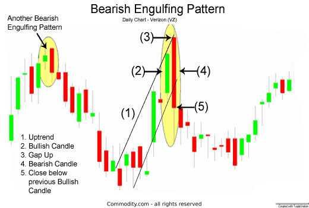

## Table of Contents

## What is a bearish engulfing candlestick pattern?

A bearish engulfing candlestick pattern is a sign that a stock's price might go down. It happens when you see two candles on a chart. The first candle is small and shows that the price went up a little. The second candle is big and shows that the price went down a lot. The big candle completely covers the small candle, which is why it's called "engulfing."

This pattern often shows up at the end of an upward trend. It tells traders that buyers were in control at first, but then sellers took over strongly. When traders see this pattern, they might decide to sell their stocks because they think the price will keep going down. It's a helpful sign for people who want to predict what might happen next with the stock price.

## How does a bearish engulfing pattern form on a chart?

A bearish engulfing pattern forms on a chart when there are two specific candlesticks next to each other. The first candlestick is smaller and has a closing price that is higher than its opening price, which means the price went up a bit that day. This small candlestick shows that buyers were in charge for a short time. The second candlestick is much bigger and has a closing price that is lower than its opening price, meaning the price dropped a lot that day. Importantly, the body of this second, larger candlestick completely covers or "engulfs" the body of the first, smaller candlestick.

This pattern usually appears at the end of an upward trend in the price of a stock or other asset. It signals that the sellers have taken over from the buyers, showing a strong shift in market sentiment. When traders see this bearish engulfing pattern, they might start to think that the price will continue to go down. So, they might decide to sell their stocks to avoid losing money if the price keeps dropping.

## What does a bearish engulfing pattern signify in terms of market sentiment?

A bearish engulfing pattern shows that the market's mood might be changing from happy to worried. It happens when a small candle that goes up is followed by a big candle that goes down and covers the first one. This tells us that at first, people wanted to buy more, but then suddenly, a lot of people wanted to sell, and they were stronger than the buyers.

When traders see this pattern, they think that the price of the stock might start going down. It's like a warning sign that the good times might be over, and it could be time to sell before the price drops more. So, a bearish engulfing pattern means that people are feeling less confident about the stock's future, and it might be the start of a downward trend.

## Can you explain the difference between a bearish engulfing pattern and a bullish engulfing pattern?

A bearish engulfing pattern and a bullish engulfing pattern are two types of candlestick patterns that show opposite things about what might happen next with a stock's price. A bearish engulfing pattern happens when a small candle that goes up is followed by a big candle that goes down and covers the first one. This means that at first, buyers were in control, but then sellers took over strongly, suggesting that the price might start going down.

On the other hand, a bullish engulfing pattern is the opposite. It happens when a small candle that goes down is followed by a big candle that goes up and covers the first one. This shows that at first, sellers were in control, but then buyers came back strongly, suggesting that the price might start going up. So, while a bearish engulfing pattern warns that the price might fall, a bullish engulfing pattern suggests that the price might rise.

## What are the key components needed to identify a bearish engulfing pattern?

To spot a bearish engulfing pattern, you need to look for two main things on a chart. The first thing is a small candle that goes up. This means the price of the stock started low and ended higher, showing that buyers were in control for that period. The second thing is a big candle that comes right after the small one and goes down. This big candle needs to start higher than where the small candle ended and end lower than where the small candle started. This shows that sellers took over strongly after the buyers, and the big candle completely covers or "engulfs" the small one.

This pattern usually shows up when the price of a stock has been going up for a while. When you see this pattern, it's a sign that the trend might be changing. The big candle that goes down tells you that the sellers are now stronger than the buyers, which could mean the price will start to go down. Traders use this pattern to decide if they should sell their stocks to avoid losing money if the price keeps dropping.

## How reliable is the bearish engulfing pattern as a trading signal?

The bearish engulfing pattern can be a helpful sign for traders, but it's not perfect. It works best when it shows up after a stock's price has been going up for a while. When traders see this pattern, it tells them that the sellers might be taking over, and the price could start to go down. But, it's important to remember that this pattern doesn't always mean the price will go down right away. Sometimes, the price might keep going up for a bit before it starts to drop.

Because of this, many traders use the bearish engulfing pattern along with other signs and tools to make better guesses about what the price will do next. They might look at other patterns, use special lines on the chart, or check the overall mood of the market. By using more than just the bearish engulfing pattern, traders can feel more sure about their choices. So, while the bearish engulfing pattern can be a good hint, it's usually best to use it with other information to make smarter trading decisions.

## What are some common mistakes traders make when interpreting bearish engulfing patterns?

One common mistake traders make when interpreting bearish engulfing patterns is relying too much on the pattern alone. They might see the pattern and immediately think the price will go down, but they forget to look at other important things like the overall market mood, other chart patterns, or special lines on the chart. For example, if the whole market is doing well and going up, a bearish engulfing pattern might not mean as much. Traders need to consider these other signs to get a better idea of what might happen next with the stock's price.

Another mistake is not waiting for confirmation before making a trade. Sometimes, after seeing a bearish engulfing pattern, traders rush to sell their stocks, thinking the price will drop right away. But the price might go up a bit more before it starts to fall. A smart trader waits to see if the next candle also shows that the price is going down. This extra check, called confirmation, helps make sure the bearish engulfing pattern is a good sign that the price will really go down. By waiting for this confirmation, traders can avoid making quick decisions that might cost them money.

## In what market conditions is a bearish engulfing pattern most effective?

A bearish engulfing pattern works best when the stock's price has been going up for a while. This pattern shows up at the top of an upward trend, signaling that the good times might be over. When traders see this pattern after a long period of the price going up, it tells them that sellers are starting to take over from the buyers. This change in who's in control can mean the price might start to go down, making it a helpful warning for traders.

The pattern is also more effective when the overall market mood matches the pattern. If the whole market is feeling nervous or unsure, a bearish engulfing pattern can be a stronger sign that the stock's price will go down. But if the market is doing well and feeling happy, the pattern might not be as important. Traders should look at the bigger picture, like what the market is doing and what other signs are saying, to decide if the bearish engulfing pattern is a good clue for what might happen next with the stock's price.

## How can traders use bearish engulfing patterns in conjunction with other technical indicators?

Traders can use bearish engulfing patterns along with other technical indicators to make better guesses about what might happen next with a stock's price. For example, they might look at moving averages, which are lines on the chart that show the average price over a certain time. If a bearish engulfing pattern shows up right when the price crosses below a moving average, it can be a stronger sign that the price will go down. Another useful tool is the Relative Strength Index (RSI), which tells traders if a stock is overbought or oversold. If the RSI is high and showing that the stock might be overbought, and then a bearish engulfing pattern appears, it can mean the price is more likely to drop soon.

Volume is also an important thing to check. If a bearish engulfing pattern happens with a lot of trading volume, it means more people are selling, making the pattern a more reliable sign. Traders might also use support and resistance levels, which are price levels where the stock often stops going up or down. If a bearish engulfing pattern forms near a resistance level, it can be a good hint that the price won't go higher and might start to fall. By using these other indicators with the bearish engulfing pattern, traders can feel more confident about their trading decisions and avoid making quick choices based on just one sign.

## What are the psychological factors behind the formation of a bearish engulfing pattern?

A bearish engulfing pattern shows a big change in how people feel about a stock. At first, the small candle that goes up means buyers were feeling good and thought the price would keep going up. They were happy to buy the stock and thought it was a good deal. But then, the big candle that goes down shows that sellers suddenly took over. Maybe they saw the price go up too much and thought it was too high, or maybe they heard bad news about the company. Whatever the reason, they wanted to sell their stocks fast, and this made the price drop a lot.

This change from happy buyers to worried sellers can make other traders feel nervous too. When they see the bearish engulfing pattern, they might start to think the price will keep going down. This can make more people want to sell their stocks before the price drops even more. The pattern shows that the mood of the market changed quickly from feeling good to feeling worried, and this can start a trend where the price keeps going down because more and more people want to sell.

## Can you provide examples of successful trades based on bearish engulfing patterns?

In early 2020, a trader noticed a bearish engulfing pattern on the chart of a tech company that had been doing well for a while. The stock's price had been going up, but then a small candle that went up was followed by a big candle that went down and covered the first one. The trader saw this pattern and decided to sell their shares. A few days later, the stock's price started to drop a lot because of bad news about the company. The trader made a good choice and avoided losing money by selling when they saw the bearish engulfing pattern.

Another example happened in late 2021 with a popular retail company. The stock had been going up for months, but then a bearish engulfing pattern showed up on the chart. The trader saw the small candle going up followed by the big candle going down and decided to wait for a bit more proof before selling. The next day, another candle showed the price was still going down. Feeling sure about the pattern, the trader sold their shares. The stock's price kept dropping over the next few weeks, and the trader was happy they sold when they did, making a profit and avoiding bigger losses.

## How does the bearish engulfing pattern fit into broader trading strategies and risk management?

Traders often use the bearish engulfing pattern as part of their bigger trading plan. They don't just look at this pattern alone. Instead, they use it with other tools like moving averages, RSI, and volume to make smarter choices. For example, if a bearish engulfing pattern shows up and the stock's price is also below a key moving average, it can be a strong sign to sell. Traders also watch the overall market mood and other news to see if the pattern fits with what's happening around it. By using the bearish engulfing pattern this way, traders can feel more confident about when to sell their stocks.

Risk management is super important when using the bearish engulfing pattern. Traders need to be careful and not jump to sell their stocks just because they see the pattern. They should wait for more proof, like another candle going down, before making a move. This helps them avoid selling too soon and missing out on any last price jumps. Traders also set stop-loss orders, which are like safety nets that automatically sell the stock if the price drops too much. This way, they can limit how much money they might lose if the pattern doesn't work out as expected. Using the bearish engulfing pattern wisely, along with good risk management, helps traders make better decisions and protect their money.

## What is the psychology behind the bearish engulfing pattern?

The bearish engulfing pattern is a key indicator of a shift in market sentiment, reflecting a transition from a bullish to a bearish outlook. This pattern emerges when the market dynamics initially favor buyers, as signified by a smaller bullish candle. This candle demonstrates that buyers are present and influencing the price, pushing it upward, although not forcefully enough to maintain control.

The transformation occurs with the appearance of the subsequent larger bearish candle. This candle entirely engulfs the body of the previous bullish candle, which is indicative of a robust influx of seller activity. The sellers' force is substantial enough to reverse the bullish momentum, overpowering the buyers and leading to a shift in market control. As a result, this engulfs the preceding bullishness, marking the possibility of the inception of a downtrend.

This shift can be mathematically represented by considering the size and position of the candles involved. For a valid bearish engulfing pattern, the opening price of the bearish candle should be higher than or equal to the closing price of the bullish candle, and the closing price should be lower than or equal to the opening price of the bullish candle. This can be expressed as:

$$
\text{Open}_{bearish} \geq \text{Close}_{bullish}
$$
$$
\text{Close}_{bearish} \leq \text{Open}_{bullish}
$$

The psychological impact of this pattern is profound because it represents a clear defeat of buying sentiment, which can incite fear and fresh selling pressure among investors. Consequently, the bearish engulfing pattern becomes a self-fulfilling prophecy as more traders recognize the shift and act on it, thereby reinforcing the downtrend. Understanding this psychological and technical dynamic allows traders to anticipate and react to potential market reversals effectively.

## References & Further Reading

[1]: Bulkowski, T. (2008). ["Encyclopedia of Candlestick Charts."](https://onlinelibrary.wiley.com/doi/book/10.1002/9781119202288) Wiley Trading.

[2]: Lazzara, C. (2017). ["Technical Analysis of Stock Trends"](https://api.pageplace.de/preview/DT0400.9781351631440_A37415506/preview-9781351631440_A37415506.pdf) by Robert D. Edwards, John Magee, and W.H.C. Bassetti.

[3]: Murphy, J. J. (1999). ["Technical Analysis of the Financial Markets: A Comprehensive Guide to Trading Methods and Applications."](https://www.amazon.com/Technical-Analysis-Financial-Markets-Comprehensive/dp/0735200661) New York Institute of Finance.

[4]: Pring, M. J. (2002). ["Technical Analysis Explained: The Successful Investor's Guide to Spotting Investment Trends and Turning Points."](https://www.amazon.com/Technical-Analysis-Explained-Fifth-Successful/dp/0071825177) McGraw-Hill.

[5]: Schwager, J. D. (2017). ["A Complete Guide to Volume Price Analysis."](https://books.google.com/books/about/A_Complete_Guide_to_the_Futures_Market.html?id=b7zVDQAAQBAJ) Panoma Press.

[6]: Aronson, D. R. (2006). ["Evidence-Based Technical Analysis: Applying the Scientific Method and Statistical Inference to Trading Signals."](https://www.amazon.com/Evidence-Based-Technical-Analysis-Scientific-Statistical/dp/0470008741) John Wiley & Sons.