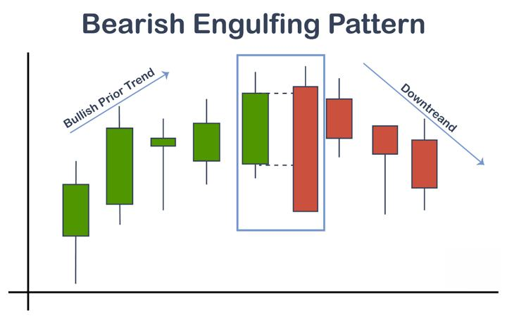

Algorithmic trading, often referred to as algo trading, represents the integration of robust computational processes in executing trade orders. This domain is characterized by its rapid evolution, leveraging technological advancements to analyze markets and execute trades with precision and efficiency. Among the various analytical tools and patterns employed by traders, the bearish engulfing candle stands out as a particularly potent indicator of market reversals.

The bearish engulfing candle is a pivotal tool in technical analysis. It suggests a potential reversal from an uptrend to a downtrend, providing traders with critical insights into market dynamics. This pattern is identified when a smaller bullish candle is immediately followed by a larger bearish candle, completely engulfing the first candle's body. Such a formation points to a decisive shift in market sentiment from bullish to bearish, indicating that sellers have gained control and are likely to drive prices downward.



In this article, we will explore the properties of the bearish engulfing candle and its significance in algo trading. We will discuss how traders can utilize this pattern, embedded within automated systems, to signal potential trend reversals. Moreover, we will examine the underlying psychology of this pattern, illustrating how it reflects the transition in market sentiment and provides a strategic advantage when integrated into trading strategies.

Understanding the nuances of the bearish engulfing candle and employing it effectively can enhance trading strategies. This pattern is not only an illustrative example of price action dynamics but is also a fundamental component in the algorithmic trader's toolkit, aiding in identifying profitable trading opportunities.

## Table of Contents

## Understanding the Bearish Engulfing Candle

A bearish engulfing candle is an integral pattern in technical analysis, primarily signaling a potential reversal during an uptrend. The pattern is composed of two candlesticks: a smaller bullish candle followed by a larger bearish candle. The key feature of this pattern is that the body of the bearish candle completely engulfs the body of the previous bullish candle. This occurrence demonstrates that the sellers have wrested control from the buyers, suggesting a shift in market dynamics.

The formation begins with an uptrend where buyer enthusiasm pushes prices higher, resulting in a bullish candle. However, the entry of strong selling pressure leads to the formation of the subsequent bearish candle, which opens above the previous close and closes below the prior open. This engulfing action underscores a significant power shift, hinting that sellers are now dominating the scene and possibly marking a turn in the market trend. 

The bearish engulfing pattern is often interpreted as a sign of weakening bullish [momentum](/wiki/momentum) and increasing bearish sentiment. Traders perceive this as an indication that the market may be primed for a downward movement, making it a crucial signal for those looking to capitalize on potential reversals.

The recognition and interpretation of this pattern can be automated in trading algorithms, enhancing the decision-making process by quickly identifying these potential reversals. Additionally, traders frequently use bearish engulfing patterns in conjunction with other technical indicators to increase predictive accuracy and account for the pattern's limitations in certain market conditions.

## The Psychology Behind the Bearish Engulfing Pattern

The bearish engulfing pattern is a key indicator of a shift in market sentiment, reflecting a transition from a bullish to a bearish outlook. This pattern emerges when the market dynamics initially favor buyers, as signified by a smaller bullish candle. This candle demonstrates that buyers are present and influencing the price, pushing it upward, although not forcefully enough to maintain control.

The transformation occurs with the appearance of the subsequent larger bearish candle. This candle entirely engulfs the body of the previous bullish candle, which is indicative of a robust influx of seller activity. The sellers' force is substantial enough to reverse the bullish momentum, overpowering the buyers and leading to a shift in market control. As a result, this engulfs the preceding bullishness, marking the possibility of the inception of a downtrend.

This shift can be mathematically represented by considering the size and position of the candles involved. For a valid bearish engulfing pattern, the opening price of the bearish candle should be higher than or equal to the closing price of the bullish candle, and the closing price should be lower than or equal to the opening price of the bullish candle. This can be expressed as:

$$
\text{Open}_{bearish} \geq \text{Close}_{bullish}
$$
$$
\text{Close}_{bearish} \leq \text{Open}_{bullish}
$$

The psychological impact of this pattern is profound because it represents a clear defeat of buying sentiment, which can incite fear and fresh selling pressure among investors. Consequently, the bearish engulfing pattern becomes a self-fulfilling prophecy as more traders recognize the shift and act on it, thereby reinforcing the downtrend. Understanding this psychological and technical dynamic allows traders to anticipate and react to potential market reversals effectively.

## Integrating Bearish Engulfing Candles in Algo Trading

In [algorithmic trading](/wiki/algorithmic-trading), the ability to swiftly recognize and respond to candlestick patterns such as the bearish engulfing candle is crucial for effective strategy enhancement. This pattern serves as an indicator of potential market reversals, which can be particularly useful in capitalizing on downward market movements. Automated trading systems can be programmed to identify these patterns and execute trades based on predefined criteria, minimizing the time delay associated with manual trading.

To effectively integrate bearish engulfing candles into an algorithmic trading strategy, traders often employ additional technical indicators to confirm the pattern's validity. Two commonly used indicators are the Relative Strength Index (RSI) and the Moving Average Convergence Divergence (MACD). The RSI is a momentum oscillator that measures the speed and change of price movements, typically used to identify overbought or oversold conditions. When an asset is overbought (typically RSI > 70), it might be a good candidate for a short position. Conversely, an oversold asset (RSI < 30) might indicate a buying opportunity. By confirming a bearish engulfing pattern with an RSI that indicates overbought conditions, traders increase the probability of a successful trade.

The MACD, on the other hand, is a trend-following momentum indicator that shows the relationship between two moving averages of a security’s price. It is calculated by subtracting the 26-period Exponential Moving Average (EMA) from the 12-period EMA. A nine-day EMA of the MACD, known as the signal line, is then plotted on top of the MACD line, which can function as a trigger for buy or sell signals. In the context of a bearish engulfing pattern, a cross of the MACD line below the signal line can serve as an additional confirmation for entering a short position.

Below is an example of how one might code a basic algorithmic strategy in Python to detect bearish engulfing patterns and confirm with the RSI and MACD indicators:

```python
import pandas as pd
import numpy as np
import ta

def detect_bearish_engulfing(data):
    bearish_engulfing = (data['Close'] < data['Open'].shift(1)) & (data['Open'] > data['Close'].shift(1))
    return bearish_engulfing

def main():
    # Load market data
    data = pd.read_csv('market_data.csv')
    data['RSI'] = ta.momentum.RSIIndicator(data['Close']).rsi()
    macd = ta.trend.MACD(data['Close'])
    data['MACD'] = macd.macd()
    data['Signal'] = macd.macd_signal()

    # Detect bearish engulfing patterns
    data['BearishEngulfing'] = detect_bearish_engulfing(data)

    # Confirm with RSI and MACD
    trade_signals = data[
        (data['BearishEngulfing']) &
        (data['RSI'] > 70) &
        (data['MACD'] < data['Signal'])
    ]

    # Display trade signals
    print(trade_signals)

if __name__ == "__main__":
    main()
```

This code identifies bearish engulfing patterns, cross-references them with RSI and MACD data, and prints instances where all conditions align, indicating a potential opportunity for executing a short trade. Although this example provides a fundamental framework, traders should consider other factors and adjust parameters to suit the nuances of specific markets or trading environments. Additionally, robust [backtesting](/wiki/backtesting) and risk management are essential for ensuring that the strategy performs effectively in live market conditions.

## The Advantages and Limitations of the Bearish Engulfing Pattern

The bearish engulfing pattern serves as a crucial analytical tool for traders due to its potential to act as an early warning signal for trend reversals. This candlestick pattern is particularly valued for its simplicity and its ability to visually depict a shift in market sentiment from bullish to bearish. By forming when a larger bearish candle completely engulfs the preceding smaller bullish candle, it indicates a definitive control shift towards the sellers. This characteristic makes the pattern useful in alerting traders to possible market downturns, enabling them to position their strategies accordingly.

Nevertheless, despite its strengths, the bearish engulfing pattern does have limitations. One significant drawback is its susceptibility to producing false signals, especially prevalent in volatile or sideways markets where price movements are erratic and lack a clear directional trend. In such environments, the pattern may incorrectly suggest a reversal, leading traders to make ill-timed decisions. 

To mitigate the risk of false signals, traders typically rely on this pattern in conjunction with other technical indicators and analytical tools. For instance, incorporating Relative Strength Index (RSI) or Moving Average Convergence Divergence (MACD) can help validate the strength of the bearish signal, ensuring more accurate confirmations of market conditions. By combining the bearish engulfing pattern with these additional indicators, traders can refine their strategies, enhance prediction accuracy, and effectively manage risks.

In practice, a combined approach could involve using a Python script to automate the detection of bearish engulfing patterns and cross-reference them with RSI and MACD values. Here is a simple example:

```python
import yfinance as yf  # For more datasets, visit: https://paperswithbacktest.com/datasets
import pandas as pd

# Load historical data for a stock
data = yf.download("AAPL", start="2023-01-01", end="2023-10-01")
data['RSI'] = RSI(data['Close'])
data['MACD'], data['Signal'] = MACD(data['Close'])

# Detecting Bearish Engulfing Pattern
def is_bearish_engulfing(candle_prev, candle_curr):
    return (
        candle_curr['Open'] > candle_prev['Close'] 
        and candle_curr['Close'] < candle_prev['Open']
    )

bearish_engulfing = []
for i in range(1, len(data)):
    if is_bearish_engulfing(data.iloc[i-1], data.iloc[i]):
        if data['RSI'][i] > 70 and data['MACD'][i] < data['Signal'][i]:  
            bearish_engulfing.append(data.index[i])

# Display detected patterns
print("Bearish Engulfing Dates with Confirmation:", bearish_engulfing)
```

Through such integrated approaches, traders can leverage the advantages of the bearish engulfing pattern, while minimizing its limitations, thereby optimizing their trading outcomes.

## Examples of Bearish Engulfing Patterns in Market Scenarios

Bearish engulfing patterns have been observed in various market scenarios, providing traders with potential indicators of market reversals. These patterns are often considered particularly significant when they occur at market tops or resistance levels. By analyzing historical data, traders can understand how bearish engulfing candles can anticipate changes in market direction. 

### Case Study: The 2011 Gold Market Correction

In 2011, the gold market experienced a significant reversal after a prolonged uptrend. The bearish engulfing pattern was observed on September 5, 2011, following a peak in gold prices. On that day, the price of gold opened at a higher level than the previous day's close but then closed significantly lower, forming a bearish engulfing candle. This marked the beginning of a substantial downturn, with gold prices falling sharply over the following months. The pattern highlighted a shift in market sentiment from bullish to bearish, signaling traders about the potential downtrend.

### Case Study: Apple Inc. (AAPL) Stock in 2015

On April 28, 2015, Apple Inc.'s stock exhibited a bearish engulfing pattern. The stock had been on a steady rise, reaching a local high, when a bearish engulfing candle formed. The stock opened at a high price, suggesting continued bullish momentum, but then fell throughout the day, closing lower than the previous day's open. This reversal was followed by a decline in AAPL's stock price over the next few weeks. The bearish engulfing pattern effectively signaled a temporary top in the market, warning traders of the shift toward bearish sentiment.

### Analysis of the Forex Market: EUR/USD Pair

A bearish engulfing pattern can also be observed in the Forex market. For the EUR/USD pair, one such instance was recorded on January 10, 2017. After a brief upward movement, the pair formed a bearish engulfing candle, which corresponded with a strong resistance level. The sentiment-driven reversal was evident as the market transitioned from a bullish trajectory to a bearish one. This particular pattern preceded a sustained decline in the EUR/USD exchange rate, offering traders an opportunity to capitalize on the ensuing downtrend.

These historical examples underscore the bearish engulfing candle's utility in predicting potential market reversals. While not infallible, recognizing and understanding these patterns can offer traders insightful information on changing market dynamics.

## Conclusion

The bearish engulfing candle is a powerful tool in the algo trader's arsenal, offering insights into potential market reversals. This candlestick pattern is valued for its ability to signal shifts in market sentiment from bullish to bearish, which can be particularly useful in algorithmic trading strategies. By identifying a bearish engulfing pattern, traders are alerted to a possible downtrend, allowing them to adjust their positions accordingly to capitalize on market movements.

However, it is crucial for traders to recognize that while the bearish engulfing candle provides valuable indications, it should not be relied upon in isolation. The financial markets are inherently complex, and a single pattern like the bearish engulfing candle can sometimes produce false signals, especially in volatile or sideways market conditions. Therefore, traders are encouraged to use this pattern in conjunction with other technical indicators such as the Relative Strength Index (RSI) or the Moving Average Convergence Divergence (MACD) to confirm the pattern's validity. Additionally, sound risk management practices, including setting stop-loss orders and position sizing, are essential in mitigating potential losses and ensuring sustainable trading growth.

By understanding and effectively using the bearish engulfing pattern alongside a comprehensive set of trading tools and strategies, traders can significantly enhance their trading outcomes. This pattern, when integrated properly into an algorithmic trading system, can provide timely market insights, offering traders the opportunity to optimize their strategies and improve their decision-making processes. In conclusion, while the bearish engulfing candle is a potent indicator, it should be seen as a component of a broader analytical framework rather than a standalone solution for market prediction.

## References & Further Reading

[1]: Bulkowski, T. (2008). ["Encyclopedia of Candlestick Charts."](https://onlinelibrary.wiley.com/doi/book/10.1002/9781119202288) Wiley Trading.

[2]: Lazzara, C. (2017). ["Technical Analysis of Stock Trends"](https://api.pageplace.de/preview/DT0400.9781351631440_A37415506/preview-9781351631440_A37415506.pdf) by Robert D. Edwards, John Magee, and W.H.C. Bassetti.

[3]: Murphy, J. J. (1999). ["Technical Analysis of the Financial Markets: A Comprehensive Guide to Trading Methods and Applications."](https://www.amazon.com/Technical-Analysis-Financial-Markets-Comprehensive/dp/0735200661) New York Institute of Finance.

[4]: Pring, M. J. (2002). ["Technical Analysis Explained: The Successful Investor's Guide to Spotting Investment Trends and Turning Points."](https://www.amazon.com/Technical-Analysis-Explained-Fifth-Successful/dp/0071825177) McGraw-Hill.

[5]: Schwager, J. D. (2017). ["A Complete Guide to Volume Price Analysis."](https://books.google.com/books/about/A_Complete_Guide_to_the_Futures_Market.html?id=b7zVDQAAQBAJ) Panoma Press.

[6]: Aronson, D. R. (2006). ["Evidence-Based Technical Analysis: Applying the Scientific Method and Statistical Inference to Trading Signals."](https://www.amazon.com/Evidence-Based-Technical-Analysis-Scientific-Statistical/dp/0470008741) John Wiley & Sons.