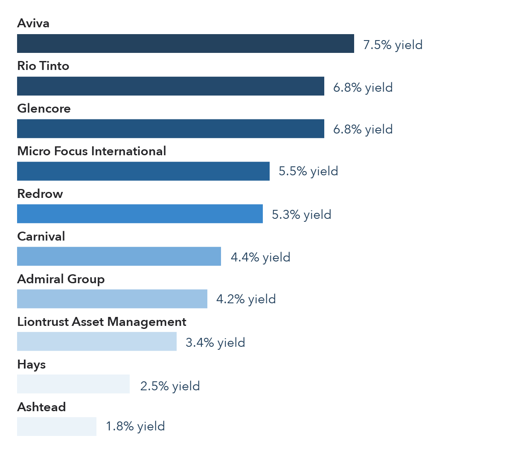

## Table of Contents

## What are dividend stocks and why are they important for investors?

Dividend stocks are shares in companies that regularly pay out a portion of their earnings to shareholders. These payments, called dividends, are usually given out every three months. Many companies, especially big and stable ones, do this to share their profits with the people who own their stock. Dividend stocks are different from other stocks because they give investors a regular income, not just the chance that the stock price will go up.

Dividend stocks are important for investors because they can provide a steady income. This is especially helpful for people who are retired or need money regularly. Also, dividends can make up a big part of the total return an investor gets from their stocks over time. Even if the stock price doesn't go up much, the dividends can still add up to a lot of money. Plus, when companies pay dividends, it often shows that they are doing well and are confident about their future, which can make investors feel more secure about their investment.

## How do dividends work and how often are they paid out?

Dividends are payments that companies give to their shareholders from their profits. When a company makes money, it can choose to keep some of it to grow the business or give some back to the people who own its stock. This payment is called a dividend. The company's board of directors decides how much to pay and when. They usually announce this decision and set a date when shareholders need to own the stock to get the dividend. This date is called the ex-dividend date.

Most companies pay dividends every three months, which is called quarterly. But some companies might pay them every six months, once a year, or even more often. It depends on the company's policy. When the dividend is paid, it goes straight into the shareholder's account if they have it set up that way, or they get a check in the mail. This regular income can be really helpful for people who need money coming in regularly, like retirees.

## What makes a UK stock a good candidate for dividend investing?

A UK stock is a good candidate for dividend investing if it has a strong history of paying dividends regularly. This means the company has been giving money back to its shareholders every year, or even every three months, for a long time. It's also important that the company can keep paying these dividends, even if the economy is not doing well. Companies in stable industries, like utilities or consumer goods, often make good dividend stocks because they have steady earnings that let them pay out dividends reliably.

Another thing to look for is a high dividend yield, which is the percentage of the stock's price that the dividend represents. A high yield can mean more money coming in for the investor, but it's important to check why the yield is high. Sometimes it's because the stock price has gone down, which might mean the company is having problems. Also, look for companies that are growing their dividends over time. This shows that the company is doing well and is confident about its future, which is a good sign for dividend investors.

## Can you list some of the top UK dividend stocks currently available?

Some of the top UK dividend stocks right now are from big companies like Unilever, National Grid, and British American Tobacco. Unilever makes everyday products like soap and ice cream. They have a good history of paying dividends and their business is stable because people always need their products. National Grid is a utility company that provides electricity and gas. They are a good choice for dividend investing because they have steady earnings and can keep paying dividends even when the economy is not doing well. British American Tobacco makes cigarettes and other tobacco products. Even though their industry is shrinking, they still make a lot of money and pay high dividends.

Another good UK dividend stock is GlaxoSmithKline, a big pharmaceutical company. They make medicines and vaccines, and their business is strong because people always need healthcare. They have a long history of paying dividends and they keep increasing them over time. Also, consider investing in companies like Legal & General Group, which is in the insurance and financial services business. They have a high dividend yield and a good track record of paying dividends. These companies are all good choices for people looking to get regular income from their investments.

## What are the key financial metrics to look at when evaluating dividend stocks?

When looking at dividend stocks, one important thing to check is the dividend yield. This is how much money you get back from the dividend compared to the price of the stock. A high yield can be good, but you need to be careful. Sometimes a high yield happens because the stock price has gone down a lot, which might mean the company is having trouble. Another key metric is the payout ratio, which shows how much of the company's earnings are being paid out as dividends. If the payout ratio is too high, like over 100%, it might mean the company can't keep paying those dividends for long.

You should also look at the company's earnings growth. If a company is making more money over time, it's more likely to keep paying and even increase its dividends. The debt-to-equity ratio is another thing to consider. This shows how much debt the company has compared to what it owns. A high debt level can make it harder for the company to pay dividends, especially if things get tough. Lastly, check the company's history of paying dividends. A long track record of steady or growing dividends is a good sign that the company is reliable and can keep paying dividends in the future.

## How does the tax treatment of dividends affect investment decisions in the UK?

In the UK, the tax treatment of dividends can really affect how people decide to invest. Dividends are taxed differently than other income. There's a special tax-free allowance for dividends, which means you can get some dividend money without paying tax on it. But if your dividends go over this allowance, you'll have to pay tax. The tax rate depends on what other income you have. If you're a basic rate taxpayer, you pay a lower rate on dividends than if you're a higher or additional rate taxpayer. This means that people who earn less might find dividend stocks more attractive because they keep more of the money they get from dividends.

Because of this tax treatment, investors might choose dividend stocks if they want to get some income without pushing their total income into a higher tax bracket. For example, someone close to the higher tax threshold might prefer dividends to keep their tax bill down. But it's not just about the tax. Investors also need to think about the overall health of the company paying the dividends. A good dividend stock should have a strong business and be able to keep paying dividends over time. So, while tax can guide investment choices, it's just one part of the bigger picture when picking dividend stocks.

## What are the risks associated with investing in dividend stocks?

Investing in dividend stocks can be a good way to get regular income, but there are risks to think about. One big risk is that a company might cut or stop paying dividends. This can happen if the company runs into money problems or if the economy takes a downturn. When dividends get cut, it can really hurt the stock's price because investors were counting on that money. Also, if a company is paying out a lot of its earnings as dividends, it might not have enough money left to grow the business or handle tough times. This can make the company weaker in the long run.

Another risk is that high dividend yields might look good at first, but they can be a warning sign. A high yield often happens when the stock price goes down a lot, which might mean the company is in trouble. If you invest in a stock just because it has a high yield without looking at why the yield is high, you could lose money if the company's problems get worse. It's important to look at the whole picture, including the company's financial health and future growth, not just the dividend. So while dividend stocks can be a good part of an investment plan, it's key to understand these risks and pick your stocks carefully.

## How can reinvesting dividends impact long-term investment growth?

Reinvesting dividends can really help your investments grow over time. When you get dividends, instead of taking the money out, you can use it to buy more shares of the same stock. This means you'll own more of the company, and in the future, you'll get even more dividends because you have more shares. Over many years, this can make a big difference. It's like a snowball rolling down a hill, getting bigger and bigger. The more shares you own, the more dividends you get, and the more you can reinvest, leading to even more growth.

This strategy is called compounding, and it's powerful because it lets your money grow faster. Imagine you start with a small snowball at the top of a hill. As it rolls down, it picks up more snow and gets bigger. Reinvesting dividends works the same way. Even if the dividends are small at first, over time they can add up to a lot. This is especially true if the company keeps growing and increasing its dividends. So, by reinvesting dividends, you're not just getting a little extra money now; you're setting yourself up for much bigger gains in the future.

## What are the differences between high-yield and growth-oriented dividend stocks?

High-yield dividend stocks are stocks that pay a lot of money back to investors compared to the price of the stock. They usually have a high dividend yield, which is the percentage of the stock's price that the dividend represents. These stocks are often from companies that are not growing very fast but are stable and make enough money to pay big dividends. Investors who need regular income, like retirees, might like high-yield dividend stocks because they give more money back right away. But, there's a risk with high-yield stocks. Sometimes, a high yield can mean the company is having problems, and the stock price has gone down a lot.

Growth-oriented dividend stocks are from companies that are growing and making more money over time. These companies might not pay as high a dividend right now, but they usually increase their dividends as the company grows. The dividend yield might be lower than with high-yield stocks, but the company's growth can make the stock price go up, and the dividends can get bigger over time. Investors who are looking for their investments to grow in value, as well as get some income, might choose growth-oriented dividend stocks. These stocks can be a good choice if you're willing to wait for the dividends to grow and the stock price to rise.

## How do economic conditions influence the performance of UK dividend stocks?

Economic conditions can really change how well UK dividend stocks do. When the economy is doing well, companies make more money and can pay bigger dividends to their shareholders. This makes dividend stocks more attractive because investors get more money back. But if the economy starts to struggle, like during a recession, companies might not make as much money. This can make it hard for them to keep paying the same dividends. They might cut the dividends or stop paying them altogether, which can make the stock price go down and disappoint investors who were counting on that income.

Different industries can be affected differently by economic conditions. For example, companies in stable industries like utilities or consumer goods might keep paying dividends even when the economy is bad because people always need their products. But companies in industries that are more sensitive to the economy, like luxury goods or travel, might have a harder time. Their profits can drop a lot during tough economic times, which can lead to dividend cuts. So, when thinking about investing in UK dividend stocks, it's important to look at how the economy is doing and how it might affect the companies you're interested in.

## What are some advanced strategies for managing a portfolio of UK dividend stocks?

One advanced strategy for managing a portfolio of UK dividend stocks is to use a dividend reinvestment plan (DRIP). With a DRIP, instead of taking the dividend money out, you use it to buy more shares of the same stock. This can help your investment grow faster over time because you'll own more shares and get even more dividends in the future. It's like planting a seed and watching it grow into a big tree. Another strategy is to diversify your portfolio across different industries. This means you don't put all your money into one type of company. If one industry has a tough time, the other industries might still do well, and you'll still get dividends from them. It's like not putting all your eggs in one basket.

Another strategy is to focus on companies with a strong history of increasing their dividends. These are called dividend aristocrats. They are usually stable companies that have been able to grow their dividends for many years, even during tough economic times. By investing in these companies, you can get a growing stream of income over time. You can also use a strategy called sector rotation, where you move your money from one industry to another based on which sectors are doing well at different times. This can help you take advantage of economic cycles and keep your dividends coming in. It's like changing your clothes depending on the weather.

## How can investors use sector analysis to enhance their dividend stock selection in the UK market?

Investors can use sector analysis to pick better dividend stocks in the UK by looking at which industries are doing well and which ones are not. Different sectors can perform differently depending on the economy. For example, when the economy is strong, sectors like technology or consumer goods might grow a lot and pay bigger dividends. But when the economy is weak, more stable sectors like utilities or healthcare might keep paying good dividends because people always need their services. By understanding which sectors are likely to do well, investors can choose stocks that are more likely to keep paying dividends, even if the economy changes.

Another way to use sector analysis is to look at the trends in different industries. Some sectors might be growing because of new technology or changes in what people want. For example, if there's a big push for renewable energy, companies in that sector might do well and increase their dividends. On the other hand, sectors that are shrinking, like traditional energy, might cut their dividends. By keeping an eye on these trends, investors can move their money into the sectors that are growing and likely to keep paying good dividends. This can help them build a portfolio that gives them a steady and growing stream of income.

## What is the understanding of dividend stocks?

Dividend stocks are a crucial component of many investment portfolios, particularly for those investors seeking a regular income and stability. When a company generates profits, it can either reinvest them in its operations or distribute them to shareholders in the form of dividends. These dividends provide shareholders with a return on their investment, often leading to a predictable income stream. This characteristic makes dividend stocks appealing, especially for individuals looking to supplement their income.

In the UK, the appeal of dividend stocks is enhanced by companies that issue dividends on a quarterly basis. This frequency allows shareholders to receive portions of their earnings more often than the typical annual or semi-annual distributions. This regular income flow can be advantageous for personal budgeting and financial planning.

When considering investment in dividend stocks, it is essential to comprehend several key financial metrics. The dividend yield, calculated as the annual dividend per share divided by the price per share, is one such critical metric. It provides an indication of the return on investment relative to the stock's price and is expressed as:

$$
\text{Dividend Yield} = \left( \frac{\text{Annual Dividend per Share}}{\text{Price per Share}} \right) \times 100\%
$$

A higher dividend yield might be attractive, but it is crucial to investigate the underlying causes, as it could also signal potential risks if driven by a declining stock price.

Another important metric is the payout ratio, which measures the proportion of earnings a company returns to its shareholders as dividends. It is expressed as:

$$
\text{Payout Ratio} = \left( \frac{\text{Dividends Paid}}{\text{Net Income}} \right) \times 100\%
$$

The payout ratio provides insight into how much of the company's profits are being used to support dividend payments. A very high payout ratio might indicate that a company is paying out more than it can sustainably afford, posing risks to dividend continuity during economic downturns.

Lastly, the stability and financial health of a company play a significant role in its ability to maintain regular dividend payments. Companies with strong balance sheets, low debt levels, and consistent earnings growth are often better positioned to provide reliable dividends. Investors should conduct thorough analyses of a company's financial statements and operational metrics to assess long-term viability.

In summary, dividend stocks are beneficial for generating regular income and enhancing portfolio stability. However, investors must be diligent in evaluating the dividend yield, payout ratio, and overall financial health of potential investments to make informed decisions.

## How can dividend stocks be integrated into algo trading strategies?

Integrating dividend stocks into algorithmic trading strategies requires a methodical approach to maximize returns and minimize risks. The process begins with the identification of high-yield, stable dividend stocks, which can be effectively achieved through quantitative analysis and screening processes. These processes involve analyzing various financial metrics to ascertain the viability of a stock as part of the trading strategy.

One key metric is the dividend yield, calculated as:

$$
\text{Dividend Yield} = \left( \frac{\text{Annual Dividends Per Share}}{\text{Price Per Share}} \right) \times 100
$$

A higher dividend yield implies that a company is returning a significant portion of its earnings to shareholders, which may indicate financial stability and commitment to shareholder returns. However, this must be balanced with an analysis of the payout ratio, which shows the percentage of earnings paid to shareholders as dividends, ensuring that dividends are sustainable over time.

Algorithms play a crucial role in automating the investment process. They can be programmed to monitor changes in dividend yields, company announcements, and indicators of financial health such as EBITDA (earnings before interest, taxes, depreciation, and amortization) and cash flow. Here is an example of a simple Python script snippet that could be used to select stocks with a dividend yield above a certain threshold:

```python
import yfinance as yf  # For more datasets, visit: https://paperswithbacktest.com/datasets

# Define the stock tickers and the yield threshold
tickers = ['BP.L', 'SJP.L', 'DRX.L']
yield_threshold = 4.0

# Download stock data
data = yf.Tickers(tickers)

# Filter stocks based on dividend yield
high_yield_stocks = {}
for ticker in tickers:
    dividend_yield = data.tickers[ticker].info['dividendYield'] * 100
    if dividend_yield > yield_threshold:
        high_yield_stocks[ticker] = dividend_yield

print("High yield stocks:", high_yield_stocks)
```

Developing strategies that incorporate both dividend aspects and price movements or market trends enhances returns. For example, algorithms can use moving averages and [momentum](/wiki/momentum) indicators to optimize entry and exit points, thus integrating technical analysis into dividend stock trading. This dual approach ensures that trades are not solely relying on dividend metrics but also aligning with broader market movements.

Moreover, algorithms can be designed to rebalance portfolios dynamically. This involves adjusting the composition of the portfolio to maintain a desired balance, factoring in dividend reinvestment, and compounding effects over time. For instance, if a particular dividend stock's price appreciates significantly, the algorithm might sell part of that holding and redistribute the funds to maintain portfolio balance or purchase additional shares of undervalued dividend stocks.

Dynamic portfolio rebalancing can be implemented in code by evaluating weightings of each stock periodically and adjusting holdings based on pre-defined criteria. Here is a pseudocode example illustrating this concept:

```python
def rebalance_portfolio(portfolio, threshold):
    for stock in portfolio:
        current_weight = portfolio[stock]['value'] / portfolio['total_value']
        if current_weight > threshold:
            # Calculate excess and redistribute
            excess_value = (current_weight - threshold) * portfolio['total_value']
            # Code to sell excess_value worth of stock and redistribute to other holdings
```

This approach to algorithmic trading, integrating dividend-focused strategies with broader market analysis, allows traders to efficiently manage their investments, leveraging both stable income from dividends and opportunistic capital gains.

## References & Further Reading

[1]: Bergstra, J., Bardenet, R., Bengio, Y., & Kégl, B. (2011). ["Algorithms for Hyper-Parameter Optimization."](https://papers.nips.cc/paper/4443-algorithms-for-hyper-parameter-optimization) Advances in Neural Information Processing Systems 24.

[2]: ["Advances in Financial Machine Learning"](https://www.amazon.com/Advances-Financial-Machine-Learning-Marcos/dp/1119482089) by Marcos Lopez de Prado

[3]: ["Evidence-Based Technical Analysis: Applying the Scientific Method and Statistical Inference to Trading Signals"](https://www.amazon.com/Evidence-Based-Technical-Analysis-Scientific-Statistical/dp/0470008741) by David Aronson

[4]: ["Machine Learning for Algorithmic Trading"](https://github.com/stefan-jansen/machine-learning-for-trading) by Stefan Jansen

[5]: ["Quantitative Trading: How to Build Your Own Algorithmic Trading Business"](https://books.google.com/books/about/Quantitative_Trading.html?id=j70yEAAAQBAJ) by Ernest P. Chan