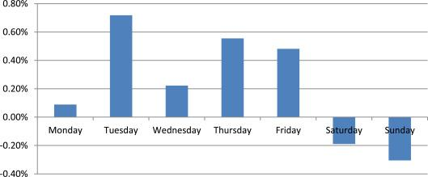

## Table of Contents

## What is the Day of the Week Effect?

The Day of the Week Effect is a pattern in stock market returns where certain days of the week tend to have higher or lower returns than others. This effect suggests that the day on which you buy or sell stocks can impact your investment returns. For example, some studies have found that stock returns are often higher on Fridays and lower on Mondays. This pattern has been observed in many different stock markets around the world.

Researchers are not completely sure why the Day of the Week Effect happens. One theory is that it might be due to how people feel at the start and end of the workweek. People might be more optimistic and willing to take risks on Fridays, leading to higher stock prices. On the other hand, they might be more cautious or pessimistic on Mondays, causing stock prices to drop. Another theory suggests that it could be related to how traders and investors manage their portfolios over the weekend, leading to different buying and selling behaviors on different days.

## How does the Day of the Week Effect apply to financial markets?

The Day of the Week Effect is a pattern seen in financial markets where stock returns can be different depending on the day of the week. For example, stocks might go up more on Fridays and go down more on Mondays. This pattern has been noticed in many stock markets around the world. It means that the day you choose to buy or sell stocks could affect how much money you make or lose.

People are not completely sure why this happens. One idea is that people's feelings change over the week. They might feel happier and more willing to take risks on Fridays, which could push stock prices up. On Mondays, they might feel more worried or less hopeful, causing stock prices to drop. Another idea is that traders and investors might do different things with their money over the weekend, which affects how they buy and sell stocks on different days.

## What are cryptocurrencies and how do they differ from traditional currencies?

Cryptocurrencies are digital or virtual currencies that use cryptography to secure their transactions and to control the creation of new units. They operate on decentralized networks, usually based on blockchain technology, which means they are not controlled by any central authority like a government or a bank. Bitcoin, created in 2009, was the first cryptocurrency and remains the most well-known, but there are now thousands of different cryptocurrencies, each with its own features and uses.

Traditional currencies, like the US dollar or the Euro, are issued and regulated by governments and central banks. They are physical, in the form of coins and banknotes, and digital, in the form of bank account balances. Unlike cryptocurrencies, traditional currencies have a central authority that can control the money supply, set interest rates, and implement monetary policies. This central control can provide stability and trust in the currency, but it also means that governments can influence the value of the currency through their policies.

## Is there evidence of a Day of the Week Effect in the cryptocurrency market?

There is some evidence that the Day of the Week Effect might happen in the cryptocurrency market, but it's not as clear as in traditional stock markets. Some studies have found that cryptocurrencies like Bitcoin might have higher returns on certain days of the week, like Mondays or Fridays. However, other studies have not found a strong pattern, and the results can be different depending on which cryptocurrency is being looked at and the time period of the study.

One reason why the Day of the Week Effect might be harder to see in cryptocurrencies is because they are traded 24/7. Traditional stock markets have set hours and days when they are open, which can lead to patterns in trading behavior. Cryptocurrencies don't have these set times, so the patterns might be less obvious. Also, the cryptocurrency market is still new and can be very unpredictable, which makes it harder to find clear patterns like the Day of the Week Effect.

## Which cryptocurrencies are most commonly studied for the Day of the Week Effect?

The cryptocurrencies most commonly studied for the Day of the Week Effect are Bitcoin and Ethereum. These two are the biggest and most popular cryptocurrencies, so researchers often look at them to see if there are any patterns in how their prices change from day to day. Bitcoin, being the first and most well-known cryptocurrency, gets a lot of attention, and many studies focus on whether its returns are higher or lower on certain days of the week.

Ethereum is also studied a lot because it's the second biggest cryptocurrency and has a lot of trading activity. Researchers want to know if Ethereum's prices follow the same patterns as Bitcoin or if they are different. Some studies have found that both Bitcoin and Ethereum might have higher returns on Mondays or Fridays, but the results can be different depending on the time period and other factors. Overall, these two cryptocurrencies are the main ones researchers look at when studying the Day of the Week Effect in the crypto market.

## How can investors use the Day of the Week Effect to make trading decisions in the crypto market?

Investors can use the Day of the Week Effect to help decide when to buy or sell cryptocurrencies like Bitcoin and Ethereum. If studies show that these cryptocurrencies tend to have higher returns on certain days, like Mondays or Fridays, investors might want to buy on days with lower returns and sell on days with higher returns. For example, if research suggests that Bitcoin often goes up on Fridays, an investor might buy Bitcoin earlier in the week and sell it on Friday to make a profit.

However, using the Day of the Week Effect for trading decisions in the crypto market is not always easy. The cryptocurrency market is open 24/7, so the patterns can be harder to spot than in traditional stock markets. Also, the crypto market can be very unpredictable, and what works one week might not work the next. So, while looking at the Day of the Week Effect can give investors some ideas, it's important to use other information and be careful when making trading decisions.

## What are the potential risks of relying on the Day of the Week Effect for cryptocurrency trading?

Relying on the Day of the Week Effect for cryptocurrency trading can be risky because the crypto market is very unpredictable. Just because a study says that Bitcoin might go up on Fridays doesn't mean it will happen every Friday. The market can change quickly, and what worked last week might not work this week. If an investor makes decisions based only on the Day of the Week Effect, they might end up losing money if the pattern doesn't happen as expected.

Another risk is that the Day of the Week Effect in cryptocurrencies is not as clear as in traditional stock markets. The crypto market is open all the time, so it's harder to see clear patterns. Some studies might find a pattern, but other studies might not see the same thing. If an investor puts too much trust in these patterns, they might miss other important information that could affect the price of the cryptocurrency. So, it's important to use the Day of the Week Effect carefully and not rely on it too much when making trading decisions.

## How has the Day of the Week Effect in the crypto market changed over time?

The Day of the Week Effect in the crypto market has changed a lot over time. When Bitcoin first started, some people noticed that it might go up more on certain days, like Mondays or Fridays. But as more people started trading cryptocurrencies and the market got bigger, these patterns became harder to see. The crypto market is always open, so it's different from stock markets that close on weekends. This makes it tough to find clear patterns like the Day of the Week Effect.

Now, studies show that the Day of the Week Effect in cryptocurrencies can be different depending on when you look at it. Some recent studies might find a small pattern, but it's not as strong as it used to be. The crypto market is still new and can change a lot, so what was true a few years ago might not be true now. Investors need to be careful and not rely too much on old patterns when making trading decisions.

## What are the underlying factors that might cause the Day of the Week Effect in cryptocurrency markets?

The Day of the Week Effect in cryptocurrency markets might happen because of how people feel and act on different days. For example, people might be more excited and willing to take risks on Fridays, which could make cryptocurrency prices go up. On the other hand, they might feel more worried or less hopeful on Mondays, causing prices to drop. This is similar to what happens in traditional stock markets, where people's moods can affect their trading decisions.

Another reason could be how traders and investors manage their money over the weekend. Some might buy or sell cryptocurrencies at the end of the week to get ready for the weekend, which can create patterns in the market. Since the crypto market is open all the time, these patterns might be harder to see, but they can still happen. The crypto market is also new and can change a lot, so the Day of the Week Effect might not be as clear or strong as in other markets.

## How do global events and market sentiment influence the Day of the Week Effect in cryptocurrencies?

Global events and market sentiment can really change how the Day of the Week Effect works in cryptocurrencies. If something big happens in the world, like a new law about cryptocurrencies or a big economic change, it can make people feel differently about buying and selling. This can mess up the usual patterns of the Day of the Week Effect. For example, if there's good news on a Monday, people might feel more excited and buy more, making prices go up even if they usually go down on Mondays.

Market sentiment, or how people feel about the market, also plays a big role. If everyone is feeling hopeful and thinks cryptocurrency prices will go up, they might buy more on certain days, making those days have higher returns. But if people are worried or scared, they might sell more on other days, causing prices to drop. Since the crypto market can change quickly, these feelings can make the Day of the Week Effect harder to predict and rely on for trading decisions.

## What advanced statistical methods are used to analyze the Day of the Week Effect in the crypto market?

To study the Day of the Week Effect in the crypto market, researchers use advanced statistical methods like regression analysis. This method helps them see if there's a pattern in how cryptocurrency prices change on different days of the week. They look at a lot of data over time and use math to figure out if, for example, Bitcoin goes up more on Fridays than on other days. This can be tricky because the crypto market is always open and can be very unpredictable, so researchers need to be careful and use a lot of data to make sure their findings are right.

Another method they use is time series analysis. This helps them understand how cryptocurrency prices move over time and if there are any repeating patterns. They can look at daily, weekly, or even hourly data to see if there's a Day of the Week Effect. Time series analysis can show if the patterns change over time or if they stay the same. Since the crypto market is new and can change a lot, using these advanced methods helps researchers get a better idea of what's happening and if the Day of the Week Effect is real or just a coincidence.

## How can machine learning and AI be utilized to predict and exploit the Day of the Week Effect in cryptocurrency trading?

Machine learning and AI can help predict the Day of the Week Effect in cryptocurrency trading by looking at a lot of data and finding patterns that people might miss. These smart computer programs can learn from past prices and trading information to guess if, for example, Bitcoin might go up on Fridays. They can use this information to help traders decide when to buy or sell. Since the crypto market changes a lot, machine learning can keep learning and getting better at predicting these patterns over time.

Using AI to exploit the Day of the Week Effect means using these predictions to make trading decisions. If the AI thinks that a cryptocurrency will have higher returns on a certain day, a trader might buy it before that day and sell it on that day to make a profit. But it's important to remember that the crypto market can be very unpredictable, so even the best AI can't always get it right. Traders should use AI as one tool among many and be careful not to rely on it too much when making decisions.

## References & Further Reading

[1]: Caporale, G. M., & Plastun, A. (2017). ["The Day of the Week Effect in the Crypto Currency Market."](https://papers.ssrn.com/sol3/papers.cfm?abstract_id=3056229) Journal of Risk and Financial Management.

[2]: Selvanathan, E. A., & Selvanathan, S. (2016). ["The Day of the Week Effect: Recent Evidence from Europe."](https://research-repository.uwa.edu.au/en/publications/the-impact-of-external-debt-on-growth-evidence-from-highly-indebt) Managerial Finance.

[3]: Cakici, N., & Chatterjee, S. (1991). ["Seasonal Anomalies in the Turkish Stock Market."](https://www.researchgate.net/publication/317151382_Alternative_Profitability_Measures_and_Cross_Section_of_Expected_Stock_Returns_International_Evidence) Journal of Financial Management & Analysis.

[4]: Aruoba, S. B., & Diebold, F. X. (2010). ["Real-Time Macroeconomic Monitoring: Real Activity, Inflation, and Interactions."](https://www.nber.org/papers/w15657) National Bureau of Economic Research.

[5]: Chan, E. P. (2009). ["Quantitative Trading: How to Build Your Own Algorithmic Trading Business."](https://github.com/ftvision/quant_trading_echan_book) Wiley Finance.