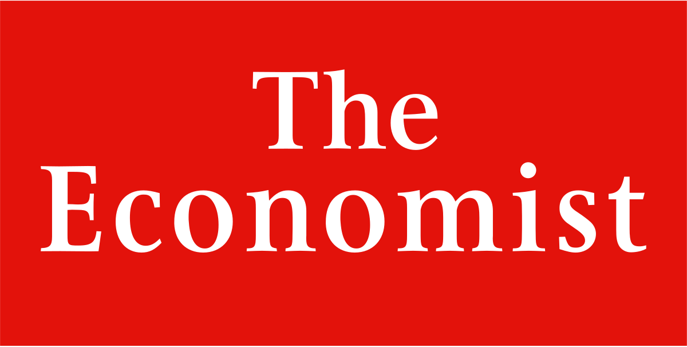

In recent decades, algorithmic trading has transformed financial markets, marking a profound shift in how trading is conducted across the globe. As technology has advanced, the use of complex algorithms in trading strategies has grown significantly, leading to both opportunities and challenges. The Economist has been at the forefront of documenting these changes, consistently exploring both the benefits and challenges posed by the rise of machines in trading. With their in-depth analyses, The Economist provides invaluable insights into the rapid evolution and influence of algorithmic trading.

The rise of algorithmic trading heralds a new era in financial markets, fundamentally altering how trades are executed by increasing speed, efficiency, and transparency. These algorithms, capable of executing thousands of trades per second based on predefined criteria, control significant portions of the trading volume on stock exchanges worldwide. The Economist's articles have often highlighted the dual nature of these changes, celebrating increased liquidity and market efficiency while also warning of potential risks such as market volatility and the ethical implications of algorithm-driven decisions.

This article explores the role The Economist has played in analyzing algorithmic trading, offering comprehensive insights into its impact on global markets and the implications for future market trends. By examining this transformation, we gain a clearer understanding of how algorithmic trading has rearranged aspects of financial stability and governance. Join us as we uncover insights from The Economist's coverage of algorithmic trading, seeking to provide a well-rounded exploration of this pivotal financial phenomenon.

## Table of Contents

## The Rise of Algorithmic Trading

Algorithmic trading has become a dominant force in stock markets worldwide, fundamentally altering the landscape of financial trading. Its widespread adoption is primarily attributed to technological advancements, which have significantly enhanced the speed and efficiency of market transactions. At its core, [algorithmic trading](/wiki/algorithmic-trading) employs complex mathematical models and automated systems to execute trades at speeds and frequencies that are impossible for human traders.

The Economist has consistently reported on the evolution of algorithmic trading, underscoring the substantial portion of trading [volume](/wiki/volume-trading-strategy) now controlled by algorithms. The publication has emphasized how these algorithms, driven by pre-defined and high-frequency strategies, execute large volumes of trades based on quantitative models and real-time market data analysis. This automation reduces transaction costs and mitigates the risks associated with human error, thereby increasing market efficiency.

Technological advancements, particularly in computing power and data processing capabilities, have been pivotal to the growth of algorithmic trading. The development of advanced algorithms capable of analysing market conditions and executing trades within milliseconds has transformed how trades are conducted. Notably, the expansion of high-frequency trading ([HFT](/wiki/high-frequency-trading-strategies)) reflects the significant role technology plays in today's financial markets. High-frequency trading, a subset of algorithmic trading, utilizes powerful algorithms to conduct a large number of trades at extremely high speeds, capitalizing on minute price discrepancies that exist for fractions of a second.

The Economist has documented key milestones in the history of algorithmic trading, highlighting its rapid rise from a nascent concept to a critical element of modern financial markets. One particularly notable milestone occurred in the late 1980s and early 1990s, when the introduction of computerized trading systems revolutionized market dynamics. These systems enabled traders to execute orders electronically, laying the groundwork for the sophisticated algorithms used today.

Subsequently, the early 2000s saw the proliferation of electronic communication networks (ECNs) and direct market access (DMA), further facilitating the growth of algorithmic trading. These innovations allowed institutional investors to trade large blocks of securities directly with one another, bypassing traditional stock exchanges and thus reducing trading costs and latency.

The financial crisis of 2008 also marked a turning point, as it prompted greater scrutiny of algorithmic trading practices and their impact on market stability. During this period, The Economist examined the role of algorithms in exacerbating market [volatility](/wiki/volatility-trading-strategies). The infamous "Flash Crash" of May 6, 2010, where the Dow Jones Industrial Average plunged approximately 1,000 points within minutes before recovering, highlighted the need for robust regulatory frameworks. It was a watershed moment that underscored both the power and potential pitfalls of algorithmic trading.

In conclusion, the rise of algorithmic trading is a testament to the transformative power of technology in financial markets. Through insightful reporting, The Economist has illuminated the trajectory of algorithmic trading, shedding light on its advantages, challenges, and implications for market participants globally. The publication continues to play a critical role in informing investors, regulators, and policymakers about the ongoing developments and future prospects of algorithmic trading.

## The Role of The Economist in Analyzing Algo Trading

The Economist has played a pivotal role in elucidating the complexities of algorithmic trading. By regularly publishing articles on this transformative technology, it has provided comprehensive analyses that cater to both investors and policymakers. The magazine's coverage spans various dimensions of algorithmic trading, from its influence on financial stability to its impact on market dynamics.

One of the key insights offered by The Economist is the examination of how algorithmic trading affects [liquidity](/wiki/liquidity-risk-premium) in financial markets. Algorithms, driven by vast computational power and advanced statistical models, have increased the speed and volume of trades. This rapid trading can enhance liquidity by narrowing bid-ask spreads and increasing market depth, potentially leading to more efficient price discovery. However, The Economist has also reported on the paradox where, during times of market stress, algorithms may exacerbate price swings, as seen in events like the 2010 Flash Crash. This highlights the dual nature of algorithmic trading's impact on financial stability.

Moreover, The Economist explores the ethical and governance issues associated with algorithm-driven market decisions. The deployment of high-frequency trading (HFT) algorithms raises questions about fairness and transparency. The publication discusses how these algorithms can potentially lead to market manipulation, where certain players might gain an unfair advantage by exploiting small price discrepancies at high speeds. Thus, The Economist underscores the importance of robust regulatory frameworks to mitigate these risks, a point further addressed in its discussions on market governance.

Notable articles from The Economist have critically analyzed case studies where algorithmic trading has had significant effects. By highlighting these cases, the publication provides valuable lessons on the potential consequences of unchecked algorithmic activity. It also illustrates how algorithmic trading technologies are continually evolving, emphasizing the need for adaptive policy responses.

Overall, the magazine serves as a crucial resource for understanding the intricate landscape of algorithmic trading. The Economist's investigative reporting educates stakeholders about both the opportunities and the challenges presented by this technology, contributing meaningfully to the ongoing discourse in the financial world.

## Impact on Market Functionality and Governance

Algorithmic trading has fundamentally altered market functionality by enhancing liquidity and transforming price formation mechanisms. As financial markets became increasingly complex, the introduction of algorithms allowed for more efficient trading processes. Algorithms can process vast amounts of data at speeds unattainable by human traders, leading to increased trading volumes and smoother market operations.

The Economist has consistently highlighted concerns related to the governance of algorithmic trading. One significant issue is the potential for market instability triggered by algorithmic errors or "flash crashes," where rapid selling by algorithms can lead to sharp market downturns. These incidents raise ethical and practical questions about the reliance on machines in decision-making processes, particularly when it comes to unforeseen disruptions that could impact financial stability.

An example provided by The Economist is the 2010 Flash Crash, during which the Dow Jones Industrial Average experienced a sudden and severe drop in value, only to recover swiftly within minutes. Investigations revealed that automated trading programs significantly contributed to the extreme volatility witnessed during the event. This case illustrates the need for robust governance frameworks to manage the risks inherent in algorithm-driven environments.

The Economist also discusses the ethical implications of algorithmic trading, particularly the use of high-frequency trading (HFT) strategies. HFT involves executing numerous small trades at lightning speed to capture minuscule profits that accumulate over time. Critics argue that HFT can create an uneven playing field, where firms with superior technology can exploit their speed advantage over traditional investors. This raises questions about market fairness and the ethical considerations of profiting from such trades.

To maintain market integrity and fairness, The Economist suggests that regulatory bodies need to develop adaptive strategies that can keep pace with technological advancements. This includes implementing measures such as circuit breakers to prevent flash crashes, mandating rigorous testing of trading algorithms, and enforcing transparency requirements for HFT firms.

Furthermore, The Economist features expert opinions suggesting a collaborative approach to governance, where regulators, technologists, and market participants work together to devise solutions that address both the benefits and risks associated with algorithmic trading. This collaborative governance model aims to balance innovation with the need for oversight, ensuring that markets remain robust and equitable for all participants.

In summary, while algorithmic trading has improved market efficiencies, it necessitates ongoing scrutiny concerning ethical practices and governance. Sustainable market functionality hinges upon regulatory frameworks that adapt to technological advancements, ensuring that the benefits of algorithmic trading are realized without compromising market stability and fairness.

## Regulatory Responses and Challenges

As algorithmic trading continues to evolve, regulatory bodies worldwide face a host of new challenges aimed at ensuring fair and stable financial markets. The Economist has highlighted the complexities of crafting effective policies to mitigate risks associated with algorithmic trading, such as market manipulation and systemic instability.

One of the primary concerns expressed by The Economist is the potential for algorithmic trading to cause or exacerbate market disruptions. Algorithms, due to their inherent speed and complex decision-making capabilities, have been implicated in events like the "Flash Crash" of 2010, where a substantial, rapid decline in the U.S. stock market ensued. This highlighted the need for robust regulatory frameworks capable of monitoring and controlling such high-speed trading activities.

Regulators have responded with various measures. The introduction of circuit breakers, which temporarily halt trading during sharp price movements, is one mechanism designed to prevent cascading losses during extreme volatility. Additionally, The Economist has discussed initiatives like minimum resting times for orders and restrictions on order-to-trade ratios, aimed at curbing excessive market churn attributed to high-frequency trading.

Globally, different regulatory bodies have approached the challenges posed by algorithmic trading from unique angles. In the European Union, the Markets in Financial Instruments Directive II (MiFID II) sets stringent requirements for algorithmic trading, including the need for firms to test algorithms under changing market conditions and to have effective risk controls in place. Meanwhile, in the United States, the Securities and Exchange Commission (SEC) has focused on increasing transparency through requirements for detailed reporting on algorithmic strategies.

The Economist has noted the ongoing debate among policymakers about the balance between fostering innovation and maintaining market stability. While algorithmic trading can enhance liquidity and reduce transaction costs, it also necessitates vigilant oversight to prevent abuse and maintain investor confidence.

Looking ahead, The Economist suggests that international cooperation may be essential in addressing the cross-border nature of modern financial markets. Harmonized standards and shared regulatory frameworks could help mitigate risks that transcend individual markets, thereby better safeguarding global financial stability.

In summary, while algorithmic trading presents numerous opportunities for efficiency and performance improvements in financial markets, it simultaneously imposes significant regulatory challenges. Through detailed analyses and insights, The Economist contributes to the broader understanding of how regulators worldwide are adapting to these evolving dynamics and preparing for future developments.

## The Future of Algorithmic Trading

Algorithmic trading, which leverages complex algorithms to automate and optimize trading strategies, is poised to further shape the landscape of financial markets. As technological innovations advance, its impact on market structures is expected to deepen, particularly with the integration of [artificial intelligence](/wiki/ai-artificial-intelligence) (AI) and [machine learning](/wiki/machine-learning) (ML). The Economist has consistently highlighted how these developments may redefine traditional trading paradigms and create new avenues for market participants.

### AI and Machine Learning in Algorithmic Trading

AI and ML have become increasingly pivotal in enhancing the capabilities of algorithmic trading systems. These technologies facilitate the processing of vast datasets to identify patterns and trends that might escape human analysis. Machine learning models, such as [deep learning](/wiki/deep-learning) networks, can adapt to new information, allowing trading algorithms to continuously improve their decision-making processes.

The use of AI in algorithmic trading enhances the ability to predict market movements with greater accuracy and speed. The Economist has reported on the shift towards more sophisticated AI models that can process [alternative data](/wiki/best-alternative-data) sources, such as social media sentiment and news feeds, in real time. This trend suggests a future where trading decisions are not only based on historical price data but also on a broader array of dynamic, real-world influences.

### Potential Developments

Looking forward, several key developments are anticipated:

1. **Increased Automation**: Trading systems are expected to become more autonomous, reducing the need for human intervention even in complex decision-making scenarios. This may lead to greater market efficiency and liquidity, although it also raises questions about oversight and control.

2. **Enhanced Predictive Capabilities**: By employing more advanced AI techniques, algorithms will improve in forecasting economic indicators and stock performance, potentially leading to higher returns on investment.

3. **Integration with Blockchain**: The potential integration of blockchain technology with algorithmic trading platforms may enhance transaction security and transparency. Smart contracts on blockchain networks could automate trading protocols with minimal human involvement, increasing trust and reliability in trade execution.

4. **Regulatory Technology (RegTech)**: As regulatory environments evolve, AI and ML will be instrumental in developing technologies to ensure compliance with financial regulations. Algorithms can be designed to automatically adjust trading strategies to align with changing regulatory standards, mitigating risks of non-compliance.

### Ethical and Societal Implications

The progression of AI-driven algorithmic trading poses ethical and societal challenges. The Economist has explored issues related to market fairness and the potential for AI to exacerbate existing market inequalities. As algorithms become more complex, the lack of transparency in how decisions are made can lead to unforeseen market consequences, such as flash crashes or systemic risks.

Addressing these concerns requires ongoing dialogue between technologists, financial institutions, and regulators. Collaborative efforts can help to establish standards and guardrails that ensure technological advancements in trading contribute positively to market health and stability.

### Conclusion

The future of algorithmic trading is intricately linked with the progress of AI and related technologies. As these tools become more ingrained in financial markets, they offer the promise of unprecedented efficiency and insight. However, realizing these benefits will necessitate careful consideration of their broader impact on market structures and regulatory frameworks. The Economist continues to provide crucial analysis and foresight, underscoring the transformative potential and challenges of algorithmic trading as it evolves in the digital age.

## Conclusion

Algorithmic trading has fundamentally altered the landscape of global financial markets over recent decades, driven by technological advancements and increasingly sophisticated strategies. The Economist has emerged as a crucial platform for disseminating information and providing critical analysis on this transformative trend. By consistently exploring the intricate layers of algorithmic trading, The Economist offers invaluable insights into its multifunctional role in the economy.

The publication's ongoing analysis addresses not just the operational aspects of algorithmic trading but also the broader implications for investors and financial institutions. As technology evolves and new challenges arise, The Economist continues to assess the shifting dynamics, offering readers a comprehensive understanding that informs both practice and policy.

The rapid development of algorithmic trading technologies poses both opportunities and risks. Future trends will likely be driven by AI and machine learning, further complicating market operations and introducing novel considerations for market participants. In this ever-changing environment, The Economist remains an essential resource, fostering informed discussion and guiding stakeholders through the complexities of modern financial markets.

As we look toward the future of algorithmic trading, The Economist’s dedication to rigorous, nuanced analysis ensures that it will continue to serve as a trusted source for insights. Its commitment to exploring emerging trends and their ramifications helps investors and institutions navigate the evolving landscape, maintaining a crucial role in shaping informed discourse in financial markets for years to come.

## References & Further Reading

[1]: Bergstra, J., Bardenet, R., Bengio, Y., & Kégl, B. (2011). ["Algorithms for Hyper-Parameter Optimization."](https://papers.nips.cc/paper/4443-algorithms-for-hyper-parameter-optimization) Advances in Neural Information Processing Systems 24.

[2]: ["Advances in Financial Machine Learning"](https://www.amazon.com/Advances-Financial-Machine-Learning-Marcos/dp/1119482089) by Marcos Lopez de Prado

[3]: ["Evidence-Based Technical Analysis: Applying the Scientific Method and Statistical Inference to Trading Signals"](https://www.amazon.com/Evidence-Based-Technical-Analysis-Scientific-Statistical/dp/0470008741) by David Aronson

[4]: ["Machine Learning for Algorithmic Trading"](https://github.com/stefan-jansen/machine-learning-for-trading) by Stefan Jansen

[5]: ["Quantitative Trading: How to Build Your Own Algorithmic Trading Business"](https://books.google.com/books/about/Quantitative_Trading.html?id=j70yEAAAQBAJ) by Ernest P. Chan