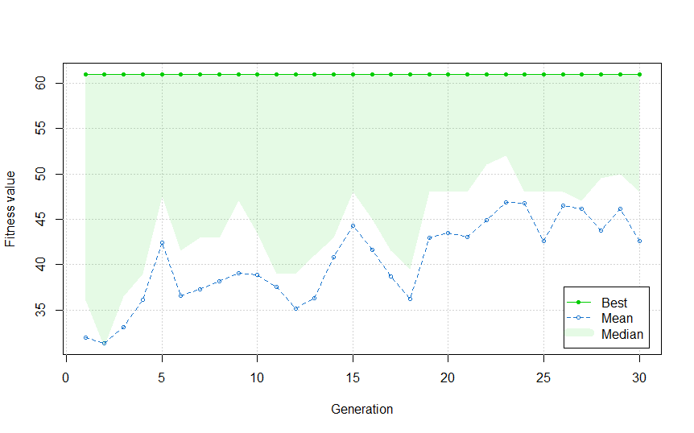

## Table of Contents

## What is the Knapsack Problem?

The Knapsack Problem is a classic problem in computer science and operations research. Imagine you have a backpack (or knapsack) and you want to fill it with items that have different weights and values. The goal is to choose the items to put in the backpack so that the total value is as high as possible, but the total weight does not exceed the backpack's weight limit. This problem is tricky because you need to find the best combination of items without going over the weight limit.

There are different versions of the Knapsack Problem. The most common one is the 0/1 Knapsack Problem, where you can either take an item or leave it; you can't take a fraction of an item. Another version is the Fractional Knapsack Problem, where you can take parts of items. Solving the Knapsack Problem can be useful in real life, like when packing a suitcase for a trip or deciding which projects to take on when you have limited time and resources. It's a great example of how to balance different factors to make the best decision.

## Why is the Knapsack Problem important in computer science and operations research?

The Knapsack Problem is important in computer science and operations research because it helps us understand how to make the best choices when we have limited resources. Imagine you're packing a bag for a trip and you want to bring the most valuable things without making the bag too heavy. This problem teaches us how to balance what we want with what we can carry, which is something we face in many real-life situations.

In computer science, the Knapsack Problem is also used to test and develop algorithms. It's a great example of a problem that is easy to explain but hard to solve perfectly, especially when you have a lot of items to choose from. By studying this problem, scientists and programmers learn how to create better ways to solve other hard problems, like scheduling tasks or managing resources in a factory. This makes the Knapsack Problem a key tool for improving how we use computers to make smart decisions.

## What are the different types of Knapsack Problems?

There are several types of Knapsack Problems, and each one has its own rules. The most common type is the 0/1 Knapsack Problem. In this version, you can either take an item completely or leave it behind. You can't take a part of an item. Imagine you're packing a bag for a trip and you have to decide if you want to take your whole camera or leave it at home. This problem is tricky because you need to find the best combination of items to get the highest value without going over the weight limit.

Another type is the Fractional Knapsack Problem. In this version, you can take parts of items. For example, if you have a bottle of water, you can take half of it if that helps you stay under the weight limit. This makes the problem easier to solve because you can always get the best value by taking the most valuable items first, even if it means taking only a part of them.

There's also the Bounded Knapsack Problem, where you can take multiple copies of the same item, but only up to a certain number. And there's the Unbounded Knapsack Problem, where you can take as many copies of an item as you want. Each type of Knapsack Problem helps us understand different ways to make the best choices when we have limited space or resources.

## How can the 0/1 Knapsack Problem be formulated mathematically?

The 0/1 Knapsack Problem can be thought of like this: you have a backpack that can hold a certain amount of weight, and you want to fill it with items that each have a weight and a value. The goal is to pick items so that the total value is as high as you can make it, but the total weight doesn't go over the backpack's limit. To make this into a math problem, you can use something called a "decision variable" for each item. This variable can be either 0 or 1, where 0 means you don't take the item and 1 means you do take it. Let's say you have n items, and you call these variables x1, x2, x3, and so on up to xn.

The math problem then becomes about finding the best values for these variables. You want to make the total value as high as possible, so you add up the values of the items you take. If an item i has a value vi, then the total value you get is v1*x1 + v2*x2 + ... + vn*xn. But you also need to make sure the total weight doesn't go over the limit. If an item i has a weight wi, then the total weight you take is w1*x1 + w2*x2 + ... + wn*xn, and this needs to be less than or equal to the backpack's weight limit, which we can call W. So, the 0/1 Knapsack Problem is about finding the best way to set x1, x2, ..., xn to 1 or 0 to get the highest total value without going over the weight limit W.

## What are the basic algorithms for solving the Knapsack Problem?

One way to solve the Knapsack Problem is by using a method called "greedy algorithm." This method is like choosing the most valuable items first and putting them in the backpack until you can't add any more without going over the weight limit. It's simple and fast, but it might not always give you the best answer. For example, if you have a very valuable item that's just a bit too heavy, the greedy algorithm might skip it and choose less valuable items instead, which could lead to a lower total value.

Another way to solve it is with "dynamic programming." This method breaks down the problem into smaller parts and solves each part step by step. It's like building a table where each entry tells you the best value you can get for a certain weight limit. By filling out this table, you can figure out the best way to pack your backpack. This method is more complex than the greedy algorithm, but it always finds the best solution for the 0/1 Knapsack Problem.

There's also a method called "branch and bound," which is a bit like exploring different paths to see which one leads to the best solution. It starts with all possible choices and then cuts off paths that can't lead to a better solution than what you've already found. This method can be very effective for solving the Knapsack Problem, but it can take more time and memory than the other methods.

## How can you implement a brute-force solution to the Knapsack Problem in R?

To implement a brute-force solution to the Knapsack Problem in R, you need to check every possible combination of items to see which one gives the highest total value without going over the weight limit. Start by making a function that takes in the weights and values of the items and the weight limit of the backpack. Inside this function, you'll use a loop to go through all possible ways to pick items. For each way, you'll add up the weights and values of the items you picked. If the total weight is less than or equal to the weight limit, you'll keep track of that total value. After checking all the ways, you'll return the highest value you found and the items that give you that value.

Here's how you can write this in R. First, create a function called `knapsack_brute_force` that takes `weights`, `values`, and `weight_limit` as inputs. Inside the function, you'll use the `expand.grid` function to create all possible combinations of taking or not taking each item. Then, loop through these combinations, calculate the total weight and total value for each, and check if the total weight is within the limit. Keep track of the highest value that fits within the weight limit. Finally, return the highest value and the combination of items that gives you that value. This method will work, but it can be slow if you have a lot of items because it has to check every single possibility.

## What is dynamic programming and how can it be applied to solve the Knapsack Problem in R?

Dynamic programming is a way to solve problems by breaking them into smaller pieces and solving each piece step by step. Imagine you're trying to climb a mountain. Instead of looking at the whole mountain at once, you focus on getting to the next ledge, and then the next, until you reach the top. In the Knapsack Problem, dynamic programming helps you figure out the best way to pack your backpack by considering all possible ways to pack smaller parts of it first. You create a table where each entry shows the best value you can get for a certain weight limit up to that point. By filling out this table, you can work out the best way to pack the whole backpack.

To apply dynamic programming to solve the Knapsack Problem in R, you can write a function that creates a matrix to store the best values for different weights and items. Start by making a matrix with rows representing the items and columns representing different weight limits up to the backpack's limit. Fill in this matrix by considering each item one by one. For each item, you decide whether to include it or not, based on what gives the highest value without going over the weight limit. At the end, the value in the bottom right corner of the matrix will be the best total value you can get, and you can trace back through the matrix to see which items to include. This method is much faster than checking every possible combination, especially when you have a lot of items.

## How can you implement a dynamic programming solution to the Knapsack Problem in R?

To solve the Knapsack Problem using dynamic programming in R, you can create a function that builds a matrix to store the best values for different weights and items. Imagine you have a backpack with a weight limit, and you want to fill it with items that each have a weight and a value. Start by making a matrix where the rows represent the items and the columns represent different weights up to the backpack's limit. You fill this matrix by looking at each item one at a time. For each item, you decide whether to include it or not, based on what gives the highest value without going over the weight limit. By the end, the value in the bottom right corner of the matrix will be the best total value you can get.

Here's how you can do this in R: Create a function called `knapsack_dynamic_programming` that takes `weights`, `values`, and `weight_limit` as inputs. Inside the function, make a matrix filled with zeros, where the number of rows is one more than the number of items, and the number of columns is one more than the weight limit. Loop through each item and each possible weight up to the limit. For each cell in the matrix, you decide if it's better to include the current item or not. If including the item doesn't go over the weight limit, you compare the value of including it with the value of not including it and choose the higher one. After filling the matrix, the value in the last row and last column will be the highest value you can get, and you can trace back through the matrix to see which items to include.

## What are the time and space complexities of different algorithms for the Knapsack Problem?

The brute-force method for solving the Knapsack Problem checks every possible way to pack the backpack. This means if you have n items, it looks at 2^n different ways. So, the time it takes grows very fast as you add more items. The space it uses isn't too bad, though, because it only needs to keep track of the best value and the items that give that value, which doesn't grow with the number of items.

Dynamic programming for the Knapsack Problem is much faster than brute force. It creates a table where each entry shows the best value you can get for a certain weight up to the backpack's limit. If you have n items and a weight limit of W, it takes about n*W steps to fill this table. The space it uses is also about n*W because it needs to store the whole table. So, while it's slower than the greedy method, it's much faster than brute force and always finds the best answer.

The greedy algorithm is the quickest way to solve the Knapsack Problem, but it doesn't always give the best answer. It looks at each item once and decides whether to take it or not, so it takes about n steps to finish. The space it uses is small, just enough to keep track of the items you've chosen, which doesn't grow with the number of items. But remember, the greedy method might not pack your backpack in the best way possible.

## How can you optimize the dynamic programming solution for the Knapsack Problem in R?

To optimize the dynamic programming solution for the Knapsack Problem in R, you can use a technique called memoization. This means you keep track of the answers to smaller parts of the problem so you don't have to solve them again. Imagine you're climbing a mountain and you mark the best path to each ledge so you don't have to figure it out again if you come back to that spot. In R, you can use a matrix to store these answers. Instead of recalculating the best value for each weight and item, you look up the answer if you've already found it. This can make your program run faster, especially if you have a lot of items.

Another way to optimize is by using only as much space as you need. Instead of creating a big matrix to store all possible weights and items, you can use a smaller one that only keeps track of the current and previous rows. This is like climbing the mountain with a smaller map that only shows the path you're on right now. In R, this means you only need a vector of length equal to the weight limit, and you update it as you go through the items. This saves memory and can make your program run faster because it's working with less data.

## What are some advanced techniques or heuristics for solving large-scale Knapsack Problems?

When you have a lot of items in the Knapsack Problem, using simple methods like brute force or even dynamic programming can take too long. That's where advanced techniques and heuristics come in. One popular method is called "branch and bound." This method is like exploring different paths to see which one leads to the best solution. It starts by looking at all possible choices and then cuts off paths that can't lead to a better solution than what you've already found. This way, it doesn't have to check every single possibility, which makes it faster for large-scale problems.

Another advanced technique is using "metaheuristics," which are smart ways to search for good solutions without checking every possibility. For example, "genetic algorithms" mimic how living things evolve to find good solutions. They start with a bunch of random ways to pack the backpack and then mix and change them to create better ones. Over time, they get closer to the best solution. Another metaheuristic is "simulated annealing," which is like slowly cooling metal to find the best shape. It starts by trying a lot of different ways to pack the backpack and slowly gets pickier about which changes to accept, hoping to end up with a really good solution. These methods don't always find the perfect answer, but they can find very good ones much faster than checking every possibility.

## How can you test and validate your R implementation of the Knapsack Problem solution?

To test and validate your R implementation of the Knapsack Problem solution, you can use different sets of items and weight limits to see if your function gives the right answers. Start by making up some small examples where you can easily figure out the best way to pack the backpack by hand. For example, if you have three items with weights and values, you can check if your function picks the right items and gives the right total value. You can also use bigger examples to see if your function still works well when there are more items. If you have a solution that you know is correct, like one from a textbook or a website, you can compare your function's results to that solution to make sure they match.

Another way to validate your R implementation is by using automated tests. In R, you can write test scripts that run your function with different inputs and check if the outputs are what you expect. For example, you can use the `testthat` package to write tests that check if your function gives the right value and picks the right items for different scenarios. Running these tests can help you catch any mistakes in your code. It's also a good idea to test your function with edge cases, like when the weight limit is zero or when all the items are too heavy to fit in the backpack. By checking your function in lots of different situations, you can be more confident that it works correctly.

## What is the Knapsack Problem and how can it be understood?

The Knapsack problem is a pivotal challenge in combinatorial optimization, focusing on maximizing the total value of items that can be fit into a knapsack with a given weight limit. Formally, the problem can be defined as follows: given a set of items, each with a weight $w_i$ and a value $v_i$, determine the number of each item to include in a collection so that the total weight does not exceed a given limit $W$, while the total value is as large as possible. The objective is to maximize the function:

$$

\max \sum_{i=1}^{n} v_i \cdot x_i 
$$

subject to:

$$

\sum_{i=1}^{n} w_i \cdot x_i \leq W
$$

where $x_i$ is the decision variable that indicates the number of units of item $i$ to include, and it can either be binary (0/1) in the case of the 0/1 Knapsack problem, or any integer for the bounded/unbounded variants.

The Knapsack problem has several variations, the most common being the 0/1 Knapsack problem where each item can be selected at most once (i.e., $x_i \in \{0, 1\}$), the bounded Knapsack problem where there are limited copies of each item, and the unbounded Knapsack problem which allows unlimited quantities of each item. Despite the variety in types, all these problems remain NP-complete, meaning that no polynomial-time algorithm is known to solve all cases optimally, especially as the number of items increases.

The problem can be intuitively visualized by imagining a hiker trying to fill a knapsack with the most valuable combination of items without overloading it. Each decision to include or exclude an item is constrained by the total weight capacity of the knapsack, making the challenge how best to allocate available capacity for maximum value.

The complexity and computational demands of the Knapsack problem have made it a key example in the study of optimization, algorithm design, and computational complexity theory. Its solutions and variations find applications in resource allocation, financial decision-making, and logistical planning, among other fields.

## How can you implement a solution in R using Simulated Annealing?

Simulated annealing is a versatile optimization technique inspired by the annealing process in metallurgy, where a metal is heated and then slowly cooled to reduce defects and optimize its structure. In the context of solving the Knapsack problem using R, simulated annealing helps in approximating the global optimum by probabilistically accepting solutions that may not be optimal initially but have the potential to lead to an overall better solution.

In R, the implementation of simulated annealing can be performed using a function conceptually similar to 'knap.sann' (a hypothetical function here), which requires defining the following parameters:

1. **Vectors of Weights and Values**: These vectors represent the properties of the items to be considered for inclusion in the knapsack. The weights vector $w$ contains the weights of the items, while the values vector $v$ encompasses the associated values. 

2. **Weight Capacity**: This parameter defines the maximum capacity of the knapsack. It represents the constraint under which the solution must maximize the total value.

3. **Number of Iterations**: The algorithm iterates through possible solutions, with each iteration potentially yielding a new candidate solution. The number of iterations influences how thoroughly the solution space is explored.

4. **Initial Temperature**: At the start of the simulated annealing process, a high "temperature" decreases over time. This initial temperature facilitates the exploration of a wide solution space by allowing worse solutions to be accepted at the beginning, preventing the algorithm from getting stuck in local optima.

5. **Temperature Decrease Rate**: This parameter determines how quickly the temperature is lowered in successive iterations. A slow decrease rate allows for more exploration, potentially leading to a better approximation of the global optimum.

The simulated annealing process can be described mathematically as follows: At each iteration, a new solution $x'$ is considered based on the current solution $x$. The change in energy $\Delta E$, which represents the change in the objective function value from $x$ to $x'$, is calculated. The probability of accepting $x'$ as the new current solution is then evaluated using the Metropolis criterion, represented as:

$$
P(\text{accept}) = \exp\left(-\frac{\Delta E}{T}\right)
$$

where $T$ is the current temperature. If this probability exceeds a random number generated between 0 and 1, the candidate solution is accepted.

The R code implementation would iterate over this process, updating solutions and gradually cooling down the temperature until a specified stopping criterion is met. By carefully tuning the temperature decrease rate and the number of iterations, the simulated annealing algorithm can effectively find a solution that closely approximates the global optimum for the Knapsack problem.

## What are the practical considerations and how can efficiency be achieved?

R is particularly adept at handling operations involving matrices, making it a suitable choice for implementing algorithms that require extensive matrix manipulations. Nevertheless, translating mathematical formulations into R code can sometimes be non-trivial, especially for complex algorithms such as simulated annealing applied to combinatorial optimization problems like the Knapsack problem.

A crucial aspect of the simulated annealing algorithm is the temperature decrease rate. This parameter plays a significant role in determining the probability of accepting an inferior solution as the algorithm progresses. The temperature schedule, often represented with a cooling function, controls how the "temperature" is reduced over time. A common cooling schedule is exponential decay:

$$
T_k = T_0 \times \alpha^k
$$

where $T_k$ is the temperature at iteration $k$, $T_0$ is the initial temperature, and $\alpha$ (0 < $\alpha$ < 1) is the cooling rate. A slower decrease (i.e., a higher $\alpha$) may provide better global optimization but will require more iterations.

The R implementation of the Knapsack problem using simulated annealing is efficient, leveraging R's strengths in data handling and statistical computing. However, there is potential for improvement. The existing code is well-documented, aiding in understanding and further development. Yet, optimizing the algorithm for speed and performance could involve translating parts of the solution into a language such as C++ using Rcpp or Python, both of which may offer better performance for certain operations.

Moreover, exploring parallel computing capabilities in R can improve efficiency for larger problem instances. Implementing parallel processing can reduce computational time significantly, especially for numerous iterations or when dealing with a large set of potential solution spaces.

Overall, while the current implementation is functional, evaluating alternative programming languages or incorporating hybrid approaches may lead to substantial performance gains, facilitating more extensive and complex problem-solving in algorithmic trading applications.

## References & Further Reading

[1]: Martello, S., & Toth, P. (1990). [Knapsack Problems: Algorithms and Computer Implementations](https://dl.acm.org/doi/abs/10.5555/98124). Wiley.

[2]: Cormen, T. H., Leiserson, C. E., Rivest, R. L., & Stein, C. (2009). [Introduction to Algorithms](https://books.google.com/books/about/Introduction_to_Algorithms_third_edition.html?id=i-bUBQAAQBAJ). MIT Press.

[3]: Kirkpatrick, S., Gelatt, C. D., & Vecchi, M. P. (1983). ["Optimization by Simulated Annealing."](https://www.science.org/doi/10.1126/science.220.4598.671) Science, 220(4598), 671-680.

[4]: Dorsey, R. E., & Mayer, W. J. (1995). ["Genetic algorithms for estimation problems with multiple optima, non-differentiability, and other irregular features."](https://www.jstor.org/stable/1392521) Journal of Business & Economic Statistics, 13(1), 53-66.

[5]: Maringer, D. (2005). [Portfolio Management with heuristic optimization](https://link.springer.com/book/10.1007/b136219). Springer.

[6]: Michalewicz, Z. (1996). [Genetic Algorithms + Data Structures = Evolution Programs](https://link.springer.com/book/10.1007/978-3-662-03315-9). Springer-Verlag. 

[7]: R Core Team. (2021). [R: A Language and Environment for Statistical Computing](https://www.scienceopen.com/book?vid=b164ea90-95d2-43bf-9710-99753c479112). R Foundation for Statistical Computing.