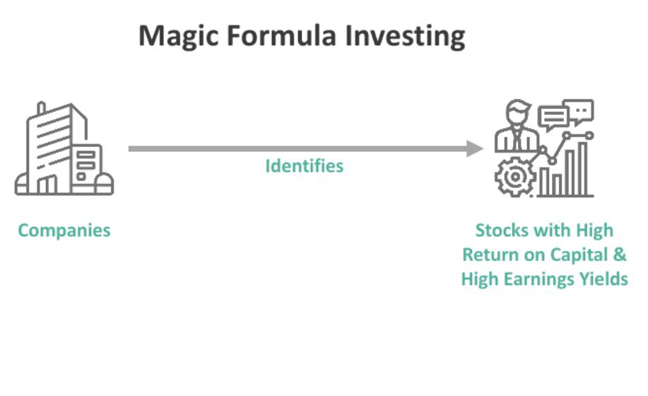

In the fast-paced world of investing, the pursuit of effective strategies continues to captivate traders and investors alike. Among these strategies, the Magic Investing Formula has gained popularity, particularly when applied to algorithmic trading. This article aims to explore the Magic Formula, its underlying mechanics, advantages, potential drawbacks, and how it integrates with algorithmic trading practices. By gaining insights into these aspects, you will be better equipped to determine whether this strategy is suitable for your investment approach. Let's commence our examination of the Magic Investing Formula as it pertains to algorithmic trading.

## Table of Contents



## Understanding the Magic Investing Formula

The Magic Formula is an investment strategy developed by Joel Greenblatt, designed to streamline the process of identifying potentially high-performing stocks through a quantitative framework. At its core, the Magic Formula ranks companies based on two key financial metrics: Return on Invested Capital (ROIC) and Earnings Yield (EY). These metrics serve as indicators of a company's efficiency in generating profits from its capital and how attractive its earnings are relative to its price.

Return on Invested Capital (ROIC) measures how well a company generates cash flow relative to the capital it has invested in its business operations. It is defined as:

$$
\text{ROIC} = \frac{\text{Net Operating Profit After Taxes (NOPAT)}}{\text{Invested Capital}}
$$

A higher ROIC suggests that the company is efficient in allocating its resources to gain superior profits, indicating robust operational performance.

Earnings Yield (EY) is a valuation metric calculated as the inverse of the Price-to-Earnings ratio (P/E ratio), expressed as:

$$
\text{Earnings Yield} = \frac{\text{Earnings Before Interest and Taxes (EBIT)}}{\text{Enterprise Value}}
$$

This metric helps investors determine how much earnings they are getting per dollar invested. A higher EY implies that a stock is undervalued, offering a higher potential return relative to its market price.

The Magic Formula's strength lies in its simplicity, systematically guiding investors to choose stocks of fundamentally sound companies that trade at appealing valuations. This quantitative approach minimizes the influence of emotional decision-making that often affects investment choices. By focusing on companies that consistently score well in ROIC and EY, investors can accumulate a portfolio with the potential for superior long-term returns. The Magic Formula thereby serves as a tool for simplifying stock selection, ensuring focus remains on candidates likely to perform well financially, all while filtering out market noise and psychological bias.

## Algorithmic Trading and the Magic Formula

Algorithmic trading is a method of executing trades using pre-defined rules and models, often executed with the aid of computer algorithms at speeds and frequencies that are beyond the reach of human traders. This process leverages the advanced computational capabilities to automate trading decisions, capturing opportunities with greater precision and speed. The integration of the Magic Investing Formula with [algorithmic trading](/wiki/algorithmic-trading) creates a robust framework for modern investment strategies.

The Magic Formula, developed by Joel Greenblatt, employs a rules-based approach that is well-suited for algorithmic trading. It ranks companies based on two key financial metrics: Return on Invested Capital (ROIC) and Earnings Yield (EY). This quantitative, rules-based strategy aligns seamlessly with algorithmic processes, enabling streamlined stock selection without subjective bias.

Algorithms can efficiently parse large datasets, quickly identifying stocks that meet the Magic Formula criteria. This is particularly advantageous in today's data-driven trading environments, where speed and accuracy are crucial. For instance, with the use of Python, algorithms can be written to scan thousands of stocks, apply the Magic Formula metrics, and rank the stocks rapidly. Here's a simplified example of how this could be implemented:

```python
import pandas as pd

# Sample DataFrame with company financials
data = pd.DataFrame({
    'Company': ['Company A', 'Company B', 'Company C'],
    'EBIT': [100, 200, 150],
    'CapitalEmployed': [500, 1000, 600],
    'EnterpriseValue': [450, 850, 550]
})

data['ROIC'] = data['EBIT'] / data['CapitalEmployed']
data['EY'] = data['EBIT'] / data['EnterpriseValue']

# Rank companies based on ROIC and Earnings Yield
data['ROIC_rank'] = data['ROIC'].rank(ascending=False)
data['EY_rank'] = data['EY'].rank(ascending=False)

# Magic Formula final rank is the sum of both ranks
data['MagicFormula_rank'] = data['ROIC_rank'] + data['EY_rank']

# Select top companies based on the Magic Formula rank
top_companies = data.nsmallest(2, 'MagicFormula_rank')
```

The simplicity of the Magic Formula aligns well with the inherent capabilities of algorithmic systems to automate rebalancing and continuous monitoring. Rebalancing ensures that the portfolio remains aligned with current data, adapting to changes efficiently. For traders and investors looking to augment their decision-making process with automation, the Magic Formula presents a solid option. Its operational ease enables a structured, repeatable investment process that mitigates emotional biases and optimizes transaction speed and accuracy.

In summary, the synergy between the Magic Investing Formula and algorithmic trading offers a heightened level of precision and efficiency for stock selection and portfolio management, making it an appealing strategy for technologically inclined investors.

## Implementing the Magic Formula in Your Portfolio

To effectively implement the Magic Formula in your investment portfolio, the process begins with defining a suitable stock universe. Generally, this universe comprises mid to large-cap companies. These stocks tend to offer more stability and [liquidity](/wiki/liquidity-risk-premium), aligning well with the strategy's requirements for potential long-term performance.

Once the stock universe is established, each company's Return on Invested Capital (ROIC) and Earnings Yield (EY) must be evaluated. These two metrics form the core of the Magic Formula's ranking system. ROIC measures how efficiently a company uses its capital to generate profits, while EY indicates the potential returns on investment relative to the stock's price. Companies are subsequently ranked based on a combination of these metrics.

The next step involves selecting the top candidates—typically 20 to 30 stocks—from the ranked list. This selection aims to balance concentration and diversification. To manage risk, it is crucial to maintain diversification across different sectors. A portfolio diversified across industries can help mitigate sector-specific risks that might adversely affect returns.

Regular position adjustments are also essential. Monitoring and adjusting positions allow investors to capture tax advantages. Selling losses slightly before the one-year mark can provide opportunities to offset gains with losses, optimizing tax obligations. This strategy leverages the tax code to improve net returns, a critical component of managing an efficient portfolio.

Over the long term, investors should rebalance their portfolios annually. The rebalancing process involves updating the rankings based on the latest financial data and ensuring that the portfolio remains aligned with the strategy's criteria. Rebalancing helps to maintain the portfolio's intended risk and return profile by periodically resetting it to the desired asset allocation.

This systematic approach, emphasizing objective metrics and periodic adjustments, can enhance the potential for consistent returns when employing the Magic Formula in an investment strategy.

## Criticisms and Considerations

Despite its appeal, the Magic Investing Formula is not without its criticisms and considerations. Critics argue that its simplistic approach may overlook vital qualitative factors, such as the strength of a company's management or prevailing industry trends. These elements can significantly impact a company's performance and are not adequately captured by purely quantitative metrics like Return on Invested Capital (ROIC) and Earnings Yield (EY).

Another point of contention is the formula's tendency to favor small-cap stocks. While these stocks can offer substantial growth potential, they also come with higher [volatility](/wiki/volatility-trading-strategies) compared to more established, large-cap stocks. This volatility introduces additional risk, which may not be suitable for all investors, especially those with a lower risk tolerance.

Furthermore, the importance of a robust [backtesting](/wiki/backtesting) framework is frequently highlighted. Without rigorous backtesting, investors may fall prey to data biases, such as overfitting, where a strategy appears successful in historical simulations but fails in real-world applications. To mitigate this, it is crucial to use comprehensive backtesting techniques that account for various market conditions and to validate the strategy using out-of-sample data.

Therefore, while the Magic Formula presents a straightforward and appealing approach to investing, it is essential to employ it as part of a broader risk management strategy. Investors should consider supplementing it with qualitative analysis and other investment strategies to account for factors the formula may overlook. This diversification can help balance the risks inherent in focusing solely on quantitative metrics.

## Conclusion

The Magic Investing Formula offers investors a compelling strategy characterized by simplicity and quantitative rigor. This approach, defined by its reliance on clear numerical metrics, provides a straightforward process for stock selection, making it accessible to both novice and experienced investors. Its compatibility with algorithmic trading systems further enhances its appeal, as algorithms can efficiently handle data analysis and execution tasks at high speeds, aligning perfectly with the Magic Formula's rules-based nature. This synergy between the formula and algorithmic trading enables more efficient portfolio management, allowing investors to implement and adjust their strategies seamlessly.

Despite the potential benefits, investors should approach the Magic Formula with a degree of caution. As with any investment strategy, reliance solely on the Magic Formula could expose one to unforeseen risks. To mitigate this, incorporating qualitative analysis alongside quantitative data is essential. Factors such as management quality, industry dynamics, and macroeconomic trends provide context that the Magic Formula might overlook. Additionally, robust backtesting is crucial to verify the strategy's validity and effectiveness across various market conditions, reducing the impact of data biases and ensuring more reliable outcomes.

Ultimately, the Magic Formula can be a valuable component of a diversified investment toolkit. When combined with comprehensive risk management practices and supplementary analytical methods, it holds the potential to enhance investment returns. Thus, while the Magic Formula is not a panacea, it offers a structured framework that can be instrumental in elevating one's investment strategy.

## References & Further Reading

[1]: Greenblatt, J. (2005). ["The Little Book That Still Beats the Market."](https://books.google.com/books/about/The_Little_Book_That_Still_Beats_the_Mar.html?id=M5HxYZaNQEQC) Wiley.

[2]: Lopez de Prado, M. (2018). ["Advances in Financial Machine Learning."](https://www.amazon.com/Advances-Financial-Machine-Learning-Marcos/dp/1119482089) Wiley.

[3]: Chan, E. P. (2009). ["Quantitative Trading: How to Build Your Own Algorithmic Trading Business."](https://github.com/ftvision/quant_trading_echan_book) Wiley.

[4]: Jansen, S. (2020). ["Machine Learning for Algorithmic Trading."](https://github.com/stefan-jansen/machine-learning-for-trading) Packt Publishing.

[5]: Aronson, D. R. (2007). ["Evidence-Based Technical Analysis: Applying the Scientific Method and Statistical Inference to Trading Signals."](https://www.amazon.com/Evidence-Based-Technical-Analysis-Scientific-Statistical/dp/0470008741) Wiley.