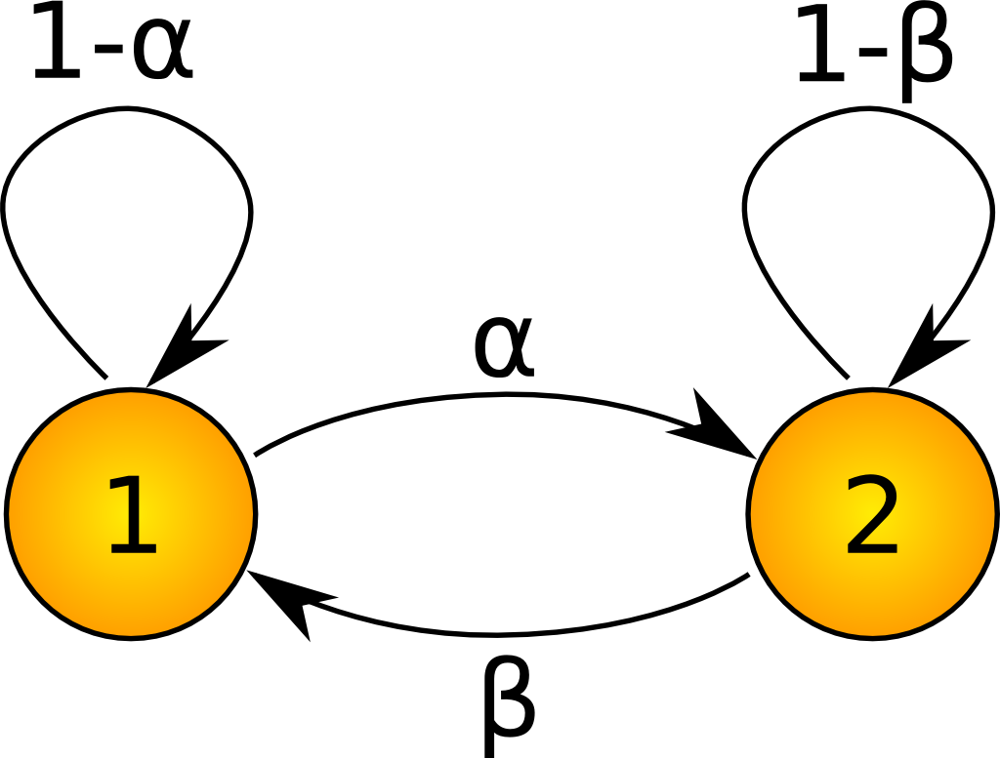

## Table of Contents

## What is the basic definition of a Markov property?

The Markov property is a concept used in probability and statistics. It says that the future state of a system depends only on its current state, not on how it got there. Imagine you are playing a board game. Where you move next depends only on where you are now, not on all the previous moves you made.

This idea is really useful in many areas, like predicting weather or stock prices. For example, if you want to guess tomorrow's weather, you only need to know today's weather, not the weather from last week or last month. This makes things simpler because you don't need to keep track of a long history of events.

## How does the Markov property apply to stochastic processes?

In stochastic processes, the Markov property means that the future behavior of the process depends only on its current state, not on the sequence of events that led to that state. Think of a stochastic process like a random walk where each step is determined by chance. If the process has the Markov property, knowing where you are now is enough to predict where you might go next, without needing to know all the past steps you took to get there.

This property is very helpful because it simplifies the analysis and modeling of these processes. For example, in a Markov chain, which is a type of stochastic process, you can calculate the probability of moving from one state to another based only on the current state. This makes it easier to predict future states and to simulate the process over time, without having to keep track of the entire history of the system.

## Can you explain the concept of a martingale in simple terms?

A martingale is a special kind of betting strategy or a way to think about certain types of random events. Imagine you're at a casino playing a fair game, where the odds are even. If you keep betting the same amount each time, your expected winnings after each bet should be zero. This means that over time, your total wealth should stay about the same, not going up or down in a predictable way. That's the basic idea of a martingale.

In more technical terms, a martingale is a sequence of random variables where the expected value of the next variable, given all the past values, is equal to the current value. Think of it like this: if you know everything that has happened up to now, your best guess for what will happen next is that it will be the same as now. This concept is used in finance to model things like stock prices, where the future price is unpredictable based on past prices alone.

## What are the key differences between a Markov process and a martingale?

A Markov process and a martingale are both used to describe how things change over time, but they focus on different aspects. A Markov process is all about the current state. It says that to predict what will happen next, you only need to know where you are right now. Imagine you're playing a game where your next move depends only on your current position on the board, not on how you got there. This makes Markov processes useful for modeling things like weather patterns or stock market trends, where the past isn't needed to predict the future.

On the other hand, a martingale is about the expected value staying the same over time. It's like betting in a fair game where, on average, you neither win nor lose money over time. If you know everything that has happened so far, your best guess for the next step is that it will be the same as now. Martingales are often used in finance to model things like stock prices, where the future price is unpredictable based on past prices alone. So, while a Markov process focuses on the current state to predict the future, a martingale focuses on the expected value staying constant.

In summary, the key difference is that a Markov process is about using the current state to predict the future, while a martingale is about the expected value not changing over time. Both concepts help us understand and model random events, but they do so in different ways.

## How do Markov chains utilize the Markov property?

Markov chains use the Markov property to predict what will happen next based only on where things are right now. Imagine you're playing a game where you move from one spot to another. In a Markov chain, to guess where you'll go next, you just need to know your current spot. You don't need to remember all the places you've been before. This makes it easier to predict things like weather or traffic because you only need to focus on the present situation.

For example, if you're using a Markov chain to predict the weather, you only need to know if it's sunny, cloudy, or raining today. Based on that, you can estimate the chances of it being sunny, cloudy, or raining tomorrow. The past weather doesn't matter for your prediction. This simplicity is why Markov chains are so useful in many areas, from predicting stock prices to modeling how diseases spread. They help us make sense of the future by focusing on the present.

## What conditions must be met for a sequence to be considered a martingale?

A sequence is considered a martingale if it meets a couple of key conditions. First, the sequence must be adapted to some information. This means that at any point in time, the value of the sequence depends only on the information available up to that time. Imagine you're keeping track of your money while betting at a casino. The amount of money you have at any moment depends only on what has happened so far, not on future bets.

Second, the expected value of the next step in the sequence, given all the information up to now, must be equal to the current value. In other words, if you know everything that has happened up to this point, your best guess for what will happen next is that it will be the same as now. Going back to the casino example, if you're playing a fair game, your expected winnings after each bet should be zero, meaning your total wealth should stay about the same on average. This condition is what makes a martingale useful for modeling things like fair games or certain financial markets where the future is unpredictable based on past events alone.

## How can the Markov property be used in financial modeling?

In financial modeling, the Markov property helps us understand how things like stock prices might change over time. It says that to guess what will happen next with a stock, you only need to look at where it is right now, not at all the ups and downs it went through before. Imagine you're trying to predict if a stock will go up or down tomorrow. With the Markov property, you only need to know today's price. This makes things simpler because you don't need to keep track of a long history of prices.

This property is really useful for building models that try to predict future stock prices or other financial events. For example, in a Markov chain model, you can set up rules that say, if the stock is at a certain price today, what are the chances it will be at different prices tomorrow? This helps financial analysts and investors make better guesses about the future without getting bogged down by too much past data. It's like focusing on the present moment to make smarter decisions about what might happen next.

## What are some common applications of martingales in finance and gambling?

In finance, martingales are used to model things like stock prices or investment returns. Imagine you're trying to predict how much money you'll have in the future from investing in stocks. A martingale helps you see that, on average, your expected return should be the same as your current wealth if the market is fair. This idea is useful for things like option pricing, where people use it to figure out how much an option should cost based on the unpredictable nature of stock prices. It helps investors understand that even if prices go up and down, the expected value of their investments stays steady over time.

In gambling, martingales are used to understand betting strategies. A classic example is the "martingale betting system," where you double your bet after every loss, hoping to win back all your losses plus a profit with one win. However, this strategy doesn't change the fact that each bet is a martingale, meaning your expected winnings should be zero if the game is fair. Casinos use the concept of martingales to ensure their games are fair, which means that over time, the house's expected profit stays the same, and gamblers' expected winnings remain at zero. This helps gamblers and casinos understand the risks and rewards of different betting strategies.

## Can you describe the mathematical formulation of the Markov property?

The Markov property can be described mathematically using something called conditional probability. Imagine you have a sequence of random events, and you want to predict what will happen next. The Markov property says that the probability of the next event, given all the past events, is the same as the probability of the next event given just the current event. In math terms, if you have a sequence of random variables $X_0, X_1, X_2, \ldots$, the Markov property is written as $P(X_{n+1} = x_{n+1} | X_0 = x_0, X_1 = x_1, \ldots, X_n = x_n) = P(X_{n+1} = x_{n+1} | X_n = x_n)$. This equation means that to predict the future, you only need to know the present.

This idea makes things easier to calculate because you don't need to keep track of everything that happened before. For example, if you're using a Markov chain to model how a stock price might change, you only need to know today's price to guess tomorrow's price. You don't need to remember all the prices from last week or last month. This simplification is why the Markov property is so useful in many areas, from predicting weather to understanding how diseases spread. It helps us focus on what's happening now to make better guesses about what will happen next.

## How does the optional stopping theorem relate to martingales?

The optional stopping theorem is a really important idea when you're working with martingales. It says that under certain conditions, if you stop a martingale at some point and look at its value, the expected value at that stopping point is the same as the expected value at the start. Imagine you're playing a fair game and you decide to stop playing at some point. If the game is fair, the average amount of money you have when you stop should be the same as the amount you started with.

This theorem is super useful in finance and gambling because it helps us understand what happens when we make decisions based on random events. For example, if you're investing in stocks and you have a rule for when to sell, the optional stopping theorem can help you see if that rule will affect your expected returns. It's like a tool that tells us that even if we stop a fair game at different times, the game stays fair overall.

## What advanced techniques exist for analyzing Markov processes with the Markov property?

One advanced technique for analyzing Markov processes is called the Monte Carlo simulation. Imagine you're trying to predict what might happen in the future with something like the stock market or weather patterns. With Monte Carlo simulation, you run lots of different scenarios, kind of like playing out many games of chance. Each game starts from where things are now and follows the rules of the Markov process. By doing this many times, you can see all the different ways things might go and figure out what's most likely to happen next. This technique is really helpful because it lets you see the big picture and make better guesses about the future.

Another technique is called the transition matrix method. Think of a transition matrix like a big chart that shows all the possible moves you can make in a game, and how likely each move is. If you know where you are now, you can use this chart to see where you might go next. By doing some math with the matrix, you can figure out not just the next step, but also what might happen many steps into the future. This is useful for things like figuring out long-term trends in population growth or how diseases might spread. It helps you see patterns that you might miss if you just looked at one step at a time.

## How can the convergence of martingales be proven and what are its implications in probability theory?

Proving the convergence of martingales involves showing that the sequence of random variables will eventually settle down to a stable value. One common way to do this is by using something called the martingale convergence theorem. This theorem says that if the expected value of the absolute difference between the martingale at any two steps gets smaller and smaller over time, then the martingale will converge. Imagine you're watching a ball rolling down a hill. If the ball's speed keeps getting slower and slower, it will eventually stop at the bottom. That's kind of like how a martingale can settle down to a final value if the changes between steps keep getting smaller.

The implications of martingale convergence in probability theory are really important. It helps us understand how random events can eventually lead to a predictable outcome. For example, in finance, if stock prices follow a martingale, knowing that they will converge can help investors make better decisions about when to buy or sell. In gambling, it can tell you that even if you keep betting, your total wealth will eventually stop changing much if the game is fair. This idea of convergence helps us see the long-term behavior of random processes, making it easier to predict and plan for the future.

## What are the benefits of using the Markov property in trading models?

Implementing the Markov property in trading models offers several benefits, particularly regarding computational efficiency, model simplification, and predictive accuracy.

One of the primary advantages is the improvement of computational efficiency and simplification of model structures. Markov-based models operate under the assumption that future states depend solely on the current state, and not on the sequence of events that preceded it. Mathematically, this is expressed as:

$$
P(X_{n+1} = x | X_n = x_n, X_{n-1} = x_{n-1}, \ldots, X_1 = x_1) = P(X_{n+1} = x | X_n = x_n)
$$

This property allows modelers to ignore the historical data within the state transitions beyond the current state, significantly reducing the complexity of the calculations required. Consequently, models can process data more quickly and efficiently, allowing for faster decision-making in trading situations where time is critical.

Moreover, the Markov property facilitates the creation of models that are easier to implement and maintain. Because these models do not require tracking long sequences of past data, they demand less computational power and are often less intricate. This simplification is particularly advantageous in high-frequency trading environments, where the speed of execution is paramount.

Another benefit of using the Markov property in trading models is the potential for enhanced predictive accuracy with fewer required data inputs. Since these models only consider the current state of the system, they can avoid the data overfitting problem that can arise when trying to integrate extensive historical data. Simplified models are less likely to capture noise as meaningful patterns, leading to more robust predictions that are still capable of capturing the essential dynamics of the financial markets.

For example, a Hidden Markov Model (HMM) can be used to detect regime changes in market trends by analyzing the transitions between latent states of market conditions without requiring exhaustive historical data. Python implementation for a basic HMM could look like this:

```python
import numpy as np
from hmmlearn import hmm

# Example market data
data = np.array([[1], [0], [1], [1], [0], [1], [0], [0], [1], [1]])

# Building a Gaussian HMM
model = hmm.GaussianHMM(n_components=2, covariance_type="diag", n_iter=100)

# Fitting model to data
model.fit(data)

# Predicting hidden states
hidden_states = model.predict(data)
print(hidden_states)
```

In this example, the HMM effectively identifies underlying market states without extensive historical data. This capability demonstrates how Markov-based models can maintain predictive accuracy while simplifying data requirements. These benefits make the adoption of the Markov property a compelling choice for those in [algorithmic trading](/wiki/algorithmic-trading) looking to optimize their models.

## References & Further Reading

[1]: Rabiner, L. R. (1989). ["A Tutorial on Hidden Markov Models and Selected Applications in Speech Recognition."](https://ieeexplore.ieee.org/document/18626/?arnumber=18626) Proceedings of the IEEE, 77(2).

[2]: Elliott, R., Aggoun, L., & Moore, J. (1995). ["Hidden Markov Models: Estimation and Control."](https://link.springer.com/book/10.1007/978-0-387-84854-9) Springer.

[3]: Lopez de Prado, M. (2018). ["Advances in Financial Machine Learning."](https://www.amazon.com/Advances-Financial-Machine-Learning-Marcos/dp/1119482089) Wiley.

[4]: Chan, E. P. (2009). ["Quantitative Trading: How to Build Your Own Algorithmic Trading Business."](https://github.com/ftvision/quant_trading_echan_book) Wiley.

[5]: Jansen, S. (2020). ["Machine Learning for Algorithmic Trading."](https://github.com/stefan-jansen/machine-learning-for-trading) Packt Publishing.