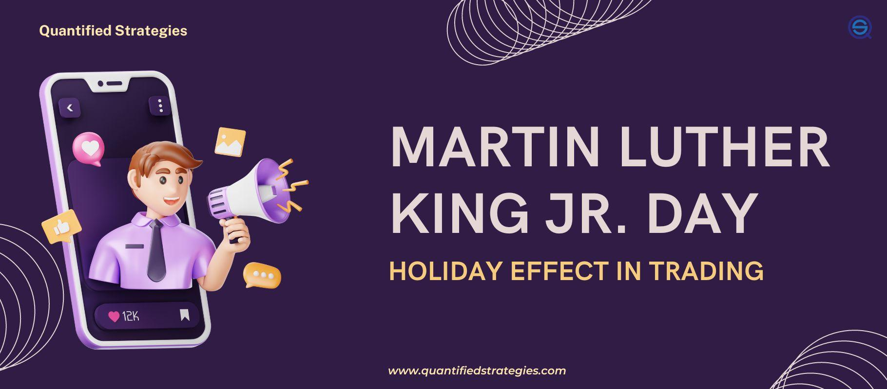

## Table of Contents

## What is Martin Luther King Jr. Day?

Martin Luther King Jr. Day is a special day in the United States. It happens every year on the third Monday of January. This day celebrates the birthday of Martin Luther King Jr., who was born on January 15. He was a very important leader who fought for equal rights for all people, no matter their skin color.

On this day, people remember and honor Martin Luther King Jr.'s work. Schools, government offices, and many businesses close for the day. People often have special events like marches, speeches, and community service projects. These activities help keep Dr. King's dream of equality and justice alive.

## Why is Martin Luther King Jr. Day significant in the United States?

Martin Luther King Jr. Day is very important in the United States because it honors a man who worked hard to make life better for everyone. Martin Luther King Jr. believed that all people should be treated the same, no matter what color their skin is. He led peaceful protests and gave famous speeches, like his "I Have a Dream" speech, to help people understand why equality is important. Because of his efforts, laws were changed to give everyone equal rights.

This day is also special because it reminds us to keep working towards fairness and justice. Every year, on the third Monday of January, people across the country come together to celebrate Dr. King's birthday. They do this by volunteering in their communities, listening to speeches, and joining in marches. It's a time to think about how we can all help make the world a better place, just like Dr. King did.

## How does Martin Luther King Jr. Day affect the stock market?

Martin Luther King Jr. Day is a federal holiday in the United States. This means that on this day, the stock market does not open for trading. The New York Stock Exchange and the NASDAQ, which are two big places where people buy and sell stocks, are closed. This gives people who work in the stock market a day off to remember and honor Martin Luther King Jr.

Because the stock market is closed, no trading happens on Martin Luther King Jr. Day. This can affect the timing of when people can buy or sell stocks. If someone wants to make a trade, they have to wait until the market opens again the next day. This break in trading can sometimes lead to more activity when the market reopens, as people rush to make their trades.

## What is the 'Holiday Effect' in trading?

The 'Holiday Effect' in trading is when the stock market acts differently around holidays. Before a holiday, the market might go up because people are in a good mood and want to buy stocks. They might think the holiday means good news for the economy, so they invest more.

After a holiday, the market can be busy because it was closed for a day. People who wanted to buy or sell stocks during the holiday have to wait until the market opens again. This can make the market move a lot right after the holiday, as everyone tries to do their trades at the same time.

## Can you explain how the Holiday Effect applies to Martin Luther King Jr. Day?

The Holiday Effect means that the stock market can act differently around holidays like Martin Luther King Jr. Day. Before the holiday, the market might go up because people are happy and feel good about the economy. They might buy more stocks because they think the holiday is a good sign for business.

After Martin Luther King Jr. Day, when the market opens again, it can get very busy. People who wanted to trade stocks during the holiday had to wait. So when the market opens, everyone tries to buy or sell at the same time. This can make the stock prices move a lot right after the holiday.

## What are typical trading patterns observed on Martin Luther King Jr. Day?

On Martin Luther King Jr. Day, the stock market is closed, so no trading happens. This means that if someone wants to buy or sell stocks, they have to wait until the market opens again the next day. Because of this, the day before the holiday can be busy. People might buy more stocks because they are in a good mood and think the holiday is a good sign for the economy. This can make the market go up a bit before the holiday.

When the market opens again after Martin Luther King Jr. Day, it can be very busy. Everyone who wanted to trade during the holiday has to do it now. This rush can make the stock prices move a lot right after the holiday. Sometimes, the market might go up or down more than usual because so many people are trying to buy and sell at the same time.

## How do traders prepare for Martin Luther King Jr. Day?

Traders get ready for Martin Luther King Jr. Day by making sure they do all their important trades before the market closes for the holiday. They know the market will be closed, so they plan ahead. They might buy or sell stocks the day before the holiday because they think the market might go up a bit. They also check their portfolios to make sure everything is set for the day off.

After the holiday, traders know the market can be busy. They get ready for a lot of buying and selling when the market opens again. They might set up their trading plans early in the morning to be ready for any big moves in stock prices. They also keep an eye on the news over the holiday to see if anything important happens that could affect the market when it opens.

## What historical data supports the Holiday Effect on Martin Luther King Jr. Day?

Historical data shows that the Holiday Effect can be seen around Martin Luther King Jr. Day. Studies have looked at how the stock market acts before and after this holiday. They found that the market often goes up a little bit the day before Martin Luther King Jr. Day. This is because people feel good about the holiday and might buy more stocks, thinking it's a good sign for the economy.

When the market opens again after Martin Luther King Jr. Day, it can be very busy. Historical data shows that there is often a lot of trading right after the holiday. This happens because people who wanted to trade during the holiday had to wait. So when the market opens, everyone tries to buy or sell at the same time, which can make stock prices move a lot. This busy trading can sometimes lead to bigger changes in the market than usual.

## Are there specific sectors or stocks that are more affected by the Martin Luther King Jr. Day holiday?

The Martin Luther King Jr. Day holiday can affect different sectors and stocks in different ways. Sectors that are more sensitive to economic news and consumer sentiment, like retail and consumer goods, might see more activity before and after the holiday. People might feel good about the holiday and spend more, which can help these sectors.

Stocks that are popular and traded a lot can also be more affected by the holiday. When the market opens again after Martin Luther King Jr. Day, these stocks might see bigger price changes because so many people want to buy or sell them. This can make the market more exciting and unpredictable right after the holiday.

## How can traders use the Holiday Effect to their advantage on Martin Luther King Jr. Day?

Traders can use the Holiday Effect to their advantage by making smart trades before Martin Luther King Jr. Day. They know that the market might go up a little bit the day before the holiday because people feel good about it. So, traders can buy stocks before the holiday, hoping to sell them for a profit when the market goes up. They should also make sure all their important trades are done before the market closes for the holiday, so they don't miss any opportunities.

When the market opens again after Martin Luther King Jr. Day, traders need to be ready for a busy day. They can set up their trading plans early in the morning to take advantage of the big moves in stock prices. Traders might look for stocks that are popular and traded a lot, because these can have bigger price changes right after the holiday. By being prepared and acting quickly, traders can use the Holiday Effect to make smart trades and possibly earn more money.

## What are the risks associated with trading around Martin Luther King Jr. Day?

Trading around Martin Luther King Jr. Day can be risky because the market can be unpredictable. The day before the holiday, the market might go up because people feel good about the holiday. But this can also make the market go down if too many people sell their stocks at the same time. Traders need to be careful because they might think the market will keep going up, but it could suddenly change direction.

When the market opens again after the holiday, it can be very busy. A lot of people want to buy and sell stocks at the same time, which can make stock prices move a lot. This can be good if you guess right, but it can also be bad if you guess wrong. Traders need to be ready for big changes and not take too many risks, or they could lose money.

## How do global markets react to the U.S. Martin Luther King Jr. Day holiday?

When the U.S. celebrates Martin Luther King Jr. Day, the American stock market is closed. This means that no trading happens in the U.S. on that day. But other countries' markets are still open. Sometimes, these global markets can be affected by the U.S. holiday. If people in other countries think the U.S. market will go up after the holiday, they might buy more stocks in their own markets. This can make those markets go up a little bit too.

After Martin Luther King Jr. Day, when the U.S. market opens again, it can be very busy. This can affect global markets because many countries' economies are connected to the U.S. economy. If the U.S. market goes up or down a lot, it can make other markets around the world move in the same way. So, traders in other countries need to watch what happens in the U.S. after the holiday and be ready for their own markets to change.

## References & Further Reading

[1]: ["The Martin Luther King, Jr. Research and Education Institute"](https://kinginstitute.stanford.edu/) - Offers comprehensive resources and information on Dr. Martin Luther King Jr.'s life, work, and legacy.

[2]: Lopez de Prado, M. (2018). ["Advances in Financial Machine Learning"](https://www.amazon.com/Advances-Financial-Machine-Learning-Marcos/dp/1119482089). Wiley.

[3]: Chan, E. P. (2009). ["Quantitative Trading: How to Build Your Own Algorithmic Trading Business"](https://github.com/ftvision/quant_trading_echan_book). Wiley.

[4]: Jansen, S. (2020). ["Machine Learning for Algorithmic Trading: Second Edition"](https://github.com/PacktPublishing/Machine-Learning-for-Algorithmic-Trading-Second-Edition). Packt Publishing.

[5]: Aronson, D. (2006). ["Evidence-Based Technical Analysis: Applying the Scientific Method and Statistical Inference to Trading Signals"](https://www.amazon.com/Evidence-Based-Technical-Analysis-Scientific-Statistical/dp/0470008741). Wiley.

[6]: ["New York Stock Exchange Holiday Schedule"](https://www.nyse.com/markets/hours-calendars) - Provides official trading and market timings, including holiday closures relevant to algorithmic traders.

[7]: ["Nasdaq Trading Calendar"](https://nasdaqtrader.com/trader.aspx?id=Calendar) - Details trading schedules relevant to market participants, with adjustments for holidays like MLK Day.