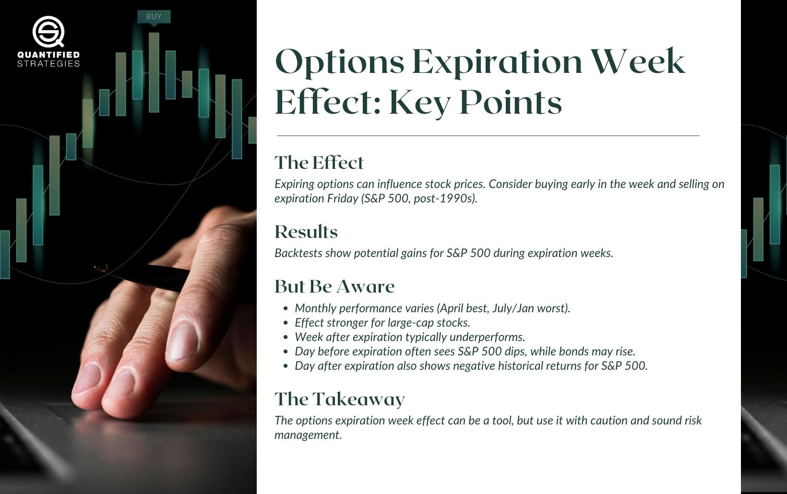

The role of OPEX (Options Expiration) weeks within the stock and options markets has evolved into a critical element for traders and investors alike. Understanding how the options expiration week affects stock prices offers valuable insights that are especially beneficial for algorithmic trading strategies. During OPEX weeks, options contracts reach their expiration date, leading to heightened trading activities and price fluctuations in the market. This behavior is attributed to the need for traders to close or adjust their positions, based on the options contracts they hold, which can cause significant movements in stock prices.

Recognizing these patterns provides a strategic advantage, allowing algorithmic trading systems to exploit short-term inefficiencies and volatility. Traditional and digital traders use algorithms to analyze vast amounts of market data to anticipate price movements that are likely to occur due to the closing of options positions. Algorithmic strategies often rely on such predictable market events to design trades that align with anticipated stock price behavior, ultimately enhancing the potential for profitable opportunities.



This article will cover the mechanisms behind the OPEX week, analyze its effects on stock prices, and explore the methodologies through which algorithmic trading systems can optimize outcomes. By comprehensively examining these elements, traders can better navigate the complexities of OPEX weeks and refine their strategies for improved market performance.

## Table of Contents

## Understanding OPEX and Its Significance

Options Expiration (OPEX) denotes the regular and predictable event when options contracts reach their expiration date, occurring monthly on the Friday preceding the third Saturday. This timing makes OPEX a highly anticipated event among traders and investors as it often coincides with increased market activity and volatility. Such predictability allows traders to plan and adjust their strategies in advance, based on the expected market movements associated with the expiration of options.

The significance of OPEX in trading arises primarily from two factors: 'pin risk' and stock price imbalances. Pin risk refers to the phenomenon where the underlying stock price gravitates towards the strike price of a heavily traded option as the expiration approaches. This clustering of stock prices around certain strikes can lead to significant price moves once options positions are unwound, introducing opportunities for astute traders to capitalize on anticipated short-term price fluctuations.

Stock price imbalances during the OPEX period come from the need for market participants to close out, roll, or exercise their options positions. As these actions are taken, they can create pressure on stock prices to move sharply up or down, depending on the net option positions and market sentiment. For example, if a large number of call options are held in the money, traders who wrote these options may need to purchase the underlying stock to hedge their positions as expiration nears, thus putting upward pressure on prices. Conversely, put option holders might sell to cover their positions, leading to downward pressure.

These dynamics enable traders to exploit predictable patterns associated with OPEX. By understanding the market mechanics around options expiration, traders can identify periods of heightened [volatility](/wiki/volatility-trading-strategies) and potential price movements. Whether through manual analysis or algorithmic strategies, the knowledge of OPEX-related market behavior forms a pivotal part of sophisticated trading paradigms.

## Impacts of OPEX on Stock Prices

During OPEX week, stock prices often experience noticeable fluctuations as a result of the closing of options positions. This occurs because as options approach their expiration date, traders and market makers are required to either exercise or close out their positions, often resulting in larger-than-usual price movements. The rapid settlement of these positions can lead to significant increases in trading [volume](/wiki/volume-trading-strategy) and volatility.

One key aspect of OPEX-induced volatility lies in the phenomenon known as "pin risk." As expiration approaches, stocks tend to gravitate towards strike prices where there is high open interest, a condition known as "pinning." This can create stock price imbalances as traders adjust their positions to align with their desired hedge or speculation goals. These movements can generate pronounced swings in stock prices, especially in the associated underlying stocks.

However, this volatility is a double-edged sword. On one hand, it presents opportunities for investors capable of effectively trading these fluctuations. Skilled traders can capitalize on significant price moves by accurately predicting which stocks are likely to experience the greatest volatility during OPEX week. On the other hand, this increased volatility also presents considerable risk, especially if trades are not carefully managed. This requires a proficient understanding of the market mechanisms at play and a robust risk management strategy.

Empirical studies and market observations have demonstrated distinct patterns during OPEX weeks. For instance, researchers have found that average stock market returns during OPEX weeks can differ significantly from normal trading weeks. Certain months, such as April, exhibit above-average returns, while others, like July and January, often result in negative impacts on stock prices. This variability necessitates a tactical approach in trading, enabling traders to exploit the unique conditions of each OPEX week.

In summary, the impacts of OPEX on stock prices offer a fertile ground for traders looking to benefit from short-term market inefficiencies. Yet, the enhanced volatility demands a meticulous approach to both trade execution and risk management to avoid potential pitfalls associated with these tumultuous periods. Understanding the intricacies of OPEX weeks can enhance one's trading strategy and potentially lead to significant gains.

## Algorithmic Trading Strategies for OPEX

Algorithmic trading strategies during OPEX weeks are designed to exploit the distinct price patterns that arise due to options expiration. These strategies often rely on the predictability of heightened market activity and the resultant short-term price inefficiencies. A common approach involves purchasing stocks at the beginning of the OPEX week and selling by the close of the expiration day, thereby profiting from temporary price movements that often occur during this time.

To implement these strategies effectively, traders utilize historical data and sophisticated [backtesting](/wiki/backtesting) tools such as Amibroker. These tools allow for the optimization of trading rules based on past market behavior. By analyzing data from previous OPEX weeks, traders can identify recurring patterns and refine entry and [exit](/wiki/exit-strategy) points to maximize returns.

For instance, a simple algorithmic strategy might look like this in Python:

```python
import pandas as pd

# Load historical stock price data
data = pd.read_csv('historical_prices.csv', parse_dates=['date'])
data.set_index('date', inplace=True)

# Define OPEX week start and end
opex_weeks = {'start': pd.Timestamp('2023-09-18'), 'end': pd.Timestamp('2023-09-22')}

# Extract OPEX week data
opex_week_data = data.loc[opex_weeks['start']:opex_weeks['end']]

# Assume a simple strategy of buying at the start and selling at the end of OPEX week
buy_price = opex_week_data.iloc[0]['close']
sell_price = opex_week_data.iloc[-1]['close']

# Calculate profit
profit = sell_price - buy_price
profit_percentage = (profit / buy_price) * 100

print(f'Profit for OPEX week: {profit:.2f} ({profit_percentage:.2f}%)')
```

This script provides a rudimentary framework that could be expanded to incorporate more sophisticated elements such as stop-loss limits, position sizing, and risk management. Additionally, employing [machine learning](/wiki/machine-learning) techniques to identify more subtle market trends could further enhance the profitability and robustness of these strategies.

An essential aspect of developing OPEX-specific trading algorithms is continuous refinement through backtesting. By rigorously testing strategies under various market conditions and adjusting parameters accordingly, traders can identify the most lucrative approach for each OPEX week. Through this process, algorithmic traders aim to achieve a favorable risk-reward ratio while navigating the inherent volatility of OPEX periods.

## Case Studies and Backtested Results

Various studies and analyses provide robust evidence for the existence of an Options Expiration (OPEX) week effect, particularly noticeable since the 1990s. This effect is characterized by distinct changes in stock market behavior, mainly influenced by the expiration of options contracts. A variety of academic studies and proprietary research confirm that strategic trading during this period can yield significant benefits if properly executed.

### Evidence from Studies
Research conducted by finance scholars has demonstrated that OPEX weeks tend to manifest unique return patterns, predominantly driven by shifts in demand and supply dynamics as options reach maturity. The necessity for options traders to hedge or unwind positions during these weeks contributes to abnormal trading volumes and volatility, influencing stock prices.

A notable study by Stoll and Whaley (1987) and subsequent research have shown that these weeks exhibit return behaviors that can deviate from typical trading weeks. Particularly, post-1990 data reveals that stock indices like the S&P 500 display statistically significant variations in expected returns during OPEX weeks compared to non-OPEX weeks.

### Backtesting Results
Backtesting strategies focused on historical data have reinforced these findings. By simulating trading scenarios based on past OPEX week data, several patterns have emerged:

- **S&P 500 Performance**: Algorithmic trading strategies that invest in the S&P 500 at the beginning of OPEX weeks and exit at expiration have been backtested to exhibit above-average weekly returns. However, these returns are not uniformly distributed across all months.

- **Monthly Variability**: The effectiveness of trading strategies varies by month, suggesting a seasonal component to the OPEX effect. For example, certain months such as April consistently show better returns, while others, like July, present more challenges for generating positive returns. This highlights the importance of a nuanced approach to trading around OPEX weeks.

Below is a simplified Python code snippet for performing a backtest analysis on historical S&P 500 data to identify potential patterns during OPEX weeks:

```python
import pandas as pd
import numpy as np

# Assume 'data' is a DataFrame with 'Date' and 'Close' columns for S&P 500
# Load your historical data here
data = pd.read_csv('sp500_data.csv', parse_dates=['Date'])

# Function to determine OPEX Fridays
def is_opex_friday(date):
    return date.weekday() == 4 and 15 <= date.day <= 21

# Filter data for OPEX weeks
data['OPEX'] = data['Date'].apply(lambda x: is_opex_friday(x))
opex_data = data[data['OPEX']]

# Calculate weekly returns
opex_data['Return'] = opex_data['Close'].pct_change(periods=5)

# Analyze average returns during OPEX weeks
average_return = opex_data['Return'].mean()
print(f"Average return during OPEX weeks: {average_return:.2%}")
```

### Adaptation to Market Conditions
While the historical effectiveness of these strategies is compelling, traders must remain flexible in their approach. Market conditions can shift due to macroeconomic factors or regulatory changes, affecting the reliability of traditional patterns. Continuous backtesting and strategy revision based on the latest data and insights are critical for maintaining a competitive advantage.

Employing adaptive trading algorithms that react to real-time data and adjusting parameters based on ongoing market analysis can help mitigate risks associated with unexpected market movements. Ultimately, the goal is to refine strategies continually, leveraging historical insights while remaining dynamically responsive to current and future market environments.

## Seasonal Considerations and Best Practices

During Options Expiration (OPEX) weeks, traders face varying opportunities that depend significantly on the month in which they occur. Historical data suggests that certain months, such as April, tend to yield better returns, whereas months like July and January often show diminished performance. This variability underscores the importance of understanding seasonal patterns within OPEX periods.

### Seasonal Trading Calendar

Creating a seasonal trading calendar is an effective strategy to enhance decision-making during OPEX weeks. By analyzing historical performance data from each month, traders can identify patterns and potential opportunities. This calendar acts as a guideline, highlighting months with historically positive performance, like April, and advising caution during months with negative trends, such as July and January.

For instance, statistical analysis or Python programming can be employed to calculate monthly returns during OPEX weeks across multiple years. Using data analysis libraries such as Pandas and NumPy, traders can build detailed performance models:

```python
import pandas as pd
import numpy as np

# Sample data: Monthly OPEX returns over several years
data = {
    'Month': ['January', 'February', 'March', 'April', 'May', 'June', 'July', 'August', 'September', 'October', 'November', 'December'],
    'Average_Return': [-1.2, 2.4, 1.5, 5.0, 1.8, 0.5, -2.0, 0.3, 2.1, 3.9, 4.1, 3.0]
}

df = pd.DataFrame(data)
positive_trend_months = df[df['Average_Return'] > 0]

print("Months with Positive Trends during OPEX Weeks:")
print(positive_trend_months)
```

### Monitoring and Adjusting Positions

Swift monitoring and position adjustments are vital to capitalizing on the opportunities presented by OPEX weeks. As volatility can increase significantly, automated trading systems or alert tools can help traders react promptly to changing market conditions.

Maintaining flexibility is crucial. Utilization of real-time data feeds and trading platforms with advanced analytics allows traders to adapt strategies instantaneously. By deploying machine learning algorithms for predictive modeling, traders can better estimate likely market moves and adjust their positions accordingly.

### Risk Management

Risk management is an integral part of trading during OPEX weeks. Tools such as stop-loss orders and position sizing can mitigate potential downsides. By leveraging historical data to establish risk parameters, traders can protect capital while maximizing potential gains.

Overall, understanding seasonal performance patterns and utilizing strategic tools to monitor and manage trades can significantly enhance a trader’s effectiveness during OPEX weeks. Exploring algorithmic enhancements and continuously refining these techniques will allow traders to adapt to evolving market conditions and maintain a competitive edge.

## Conclusion

The OPEX week introduces distinct challenges and opportunities for traders, especially those using algorithmic strategies. This period often leads to heightened market volatility due to the expiration of options contracts, which requires traders to be astutely aware of its dynamics. Understanding these dynamics can significantly enhance trading performance, as it allows traders to anticipate potential price movements and market shifts.

Tailoring strategies to options expiration involves recognizing patterns that emerge during this time. Specifically, traders can utilize the predictable increase in volatility and price imbalances to capitalize on short-term trading opportunities. For example, the tendency for prices to "pin" around certain strike prices due to large open interest can be exploited for strategic trades.

Algorithmic strategies benefit from the predictability of OPEX weeks. By employing historical data and executing precise backtests, traders can fine-tune their strategies to optimize profitability. Algorithms can be programmed to enter or exit positions based on key indicators specific to options expiration, reducing the emotional bias inherent in manual trading and allowing for faster reaction times to market movements.

Continuous refinement of these strategies, grounded in rigorous backtesting, is essential for maintaining a competitive edge. Traders should regularly update their algorithms to reflect current market conditions, ensuring adaptability in the face of changing volatility patterns. This may involve recalibrating algorithms to account for variables such as shifting economic indicators or alterations in options market structure.

In summary, while OPEX week presents complexities, it also offers significant trading opportunities. By understanding the expiration dynamics and continuously refining algorithmic strategies, traders can navigate these volatile periods effectively, translating predictable patterns into tangible gains.

## References & Further Reading

[1]: Stoll, H. R., & Whaley, R. E. (1987). ["Program Trading and Expiration Day Effects."](https://www.jstor.org/stable/pdf/4479013.pdf) Financial Analysts Journal, 43(2).

[2]: Options, Futures, and Other Derivatives by John C. Hull.

[3]: ["Advances in Financial Machine Learning"](https://www.amazon.com/Advances-Financial-Machine-Learning-Marcos/dp/1119482089) by Marcos Lopez de Prado.

[4]: ["Trading and Exchanges: Market Microstructure for Practitioners"](https://www.amazon.com/Trading-Exchanges-Market-Microstructure-Practitioners/dp/0195144708) by Larry Harris.

[5]: ["Quantitative Trading: How to Build Your Own Algorithmic Trading Business"](https://books.google.com/books/about/Quantitative_Trading.html?id=j70yEAAAQBAJ) by Ernest P. Chan.