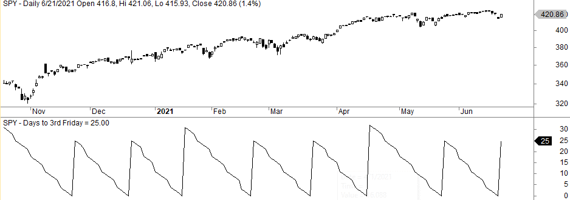

## Table of Contents

## What is the Option Expiration Week?

Option Expiration Week, often called "OpEx Week," is the week when many stock options and futures contracts expire. This happens on the third Friday of each month. During this week, traders and investors pay close attention to the market because the expiring contracts can cause big price movements in stocks and other assets.

The activity during Option Expiration Week can be intense. Many traders will buy or sell stocks to manage their options positions before they expire. This can lead to increased trading volume and volatility in the market. It's a busy time, and understanding what's happening can help investors make better decisions.

## How does Option Expiration Week affect stock prices?

Option Expiration Week can make stock prices move a lot. This is because many options contracts end on the third Friday of the month. When these contracts are about to expire, people who own them might need to buy or sell the stocks to make sure their options work out the way they want. This buying and selling can push stock prices up or down more than usual.

The week can be busy and a bit unpredictable. Traders might try to make the stock price hit a certain level before their options expire. If a lot of people are trying to do this at the same time, it can cause big swings in stock prices. It's like a lot of people trying to get through a door at the same time – it can get crowded and chaotic. So, during Option Expiration Week, it's smart to watch the market closely and be ready for surprises.

## What are the key dates to know during Option Expiration Week?

During Option Expiration Week, the most important day is the third Friday of the month. This is when most options and futures contracts expire. Traders and investors need to pay close attention to this day because it's when they have to decide what to do with their expiring contracts. They might need to buy or sell stocks to make sure their options work out the way they want.

The days leading up to the third Friday can also be important. As the expiration date gets closer, more people might start trading to get ready for it. This can make the market busier and cause stock prices to move more than usual. So, it's a good idea to watch the market closely all week, not just on the expiration day itself.

## Can you explain the concept of 'pinning' in relation to Option Expiration Week?

Pinning is something that can happen to a stock's price during Option Expiration Week. It's when a lot of people who own options try to make the stock price stay at a certain level, like a pin holding something in place. This level is usually the price where their options will be worth the most money when they expire. So, they might buy or sell the stock to keep the price right at that level.

This can make the stock price move in a funny way. Instead of going up or down a lot, it might stay close to that one price all day. It's like a tug-of-war where both sides are trying hard to keep the price from moving too far away. Pinning can make the market a bit unpredictable, so it's something to watch out for during Option Expiration Week.

## What strategies can traders use during Option Expiration Week to maximize gains?

During Option Expiration Week, traders can use a strategy called "gamma scalping" to try to make money. This means they buy and sell the stock to keep their options profitable. If they own options that are close to the current stock price, they might buy the stock if it goes down a bit and sell it if it goes up a bit. This helps them make small profits from the stock's movements and can add up over time.

Another strategy is to look for "pinning" opportunities. Traders might try to push the stock price to a level where a lot of options will expire. If they can guess where this level will be, they can buy or sell the stock to help keep it there. This can be risky, but if they get it right, they can make a good profit from the options that expire at that price.

Lastly, traders can use "straddles" or "strangles" to bet on big price moves. A straddle involves buying both a call option and a put option at the same strike price. A strangle is similar but uses different strike prices. These strategies can be profitable if the stock price moves a lot in either direction during Option Expiration Week. However, they can also lose money if the stock price doesn't move enough, so traders need to be careful and watch the market closely.

## How does increased volatility during Option Expiration Week impact trading?

Increased volatility during Option Expiration Week can make trading more exciting but also more risky. When a lot of options are about to expire, traders might buy or sell stocks more than usual to make sure their options work out. This can make stock prices move up and down a lot more than on normal days. Traders need to be ready for these big swings and might need to change their plans quickly to take advantage of the situation or to protect their money.

This volatility can also mean more chances to make money, but it's important to be careful. Some traders might use strategies like gamma scalping or betting on big price moves with straddles and strangles. These strategies can work well if the stock price moves a lot, but they can also lose money if the price doesn't move enough. So, during Option Expiration Week, it's smart to watch the market closely and be ready to act fast if things change.

## What are the risks associated with trading during Option Expiration Week?

Trading during Option Expiration Week can be risky because the market can be very unpredictable. A lot of options are expiring, and traders might buy or sell stocks a lot to make sure their options work out. This can make stock prices move up and down a lot more than usual. If you're not ready for these big swings, you could lose money. It's like trying to ride a roller coaster without knowing when it's going to go up or down – it can be exciting but also scary.

Another risk is that some trading strategies might not work as well during this week. For example, if you're trying to use a strategy like gamma scalping or betting on big price moves with straddles and strangles, you need the stock price to move a lot. If it doesn't move enough, you could lose money. Also, if you're trying to guess where the stock price will be when options expire and you get it wrong, you could lose money too. So, it's important to be careful and watch the market closely during Option Expiration Week.

## How do institutional investors typically behave during Option Expiration Week?

Institutional investors, like big banks and investment firms, often have a lot of options and futures contracts that expire during Option Expiration Week. They might need to buy or sell a lot of stocks to make sure their options work out the way they want. This can make the market busier and cause stock prices to move more than usual. These big investors have a lot of money and can influence the market a lot, so their actions during this week can make things more unpredictable.

Because they have so much at stake, institutional investors often use special strategies during Option Expiration Week. They might try to keep stock prices at certain levels where their options will be worth the most money. This is called "pinning." They might also use other strategies like gamma scalping to make small profits from the stock's movements. These big investors need to be careful and watch the market closely because their actions can affect not just their own money but the whole market too.

## What historical data supports the Option Expiration Week effect?

Historical data shows that Option Expiration Week can make the stock market move more than usual. Studies have found that the days around the third Friday of the month, when many options expire, often have bigger price swings. This is because a lot of traders and big investors are buying and selling stocks to make sure their options work out. They might try to push stock prices to certain levels, which can make the market more unpredictable.

For example, research by the CBOE (Chicago Board Options Exchange) has shown that the days leading up to and including the third Friday of the month tend to have higher trading volumes and more volatility. This is especially true for stocks that have a lot of options trading. The data suggests that the market can be more active and harder to predict during Option Expiration Week, which is something traders need to keep in mind when planning their moves.

## How can one use technical analysis to navigate Option Expiration Week?

During Option Expiration Week, technical analysis can help traders make better decisions by looking at charts and patterns. One way to use technical analysis is to watch for support and resistance levels. These are prices where the stock has had trouble moving past before. If a stock is near a support level, it might bounce back up, and if it's near a resistance level, it might go back down. During Option Expiration Week, these levels can be even more important because a lot of traders might be trying to keep the stock price at these levels to make their options work out.

Another way to use technical analysis is to look at moving averages. These are lines on a chart that show the average price of a stock over a certain time. If the stock price is above the moving average, it might keep going up, and if it's below, it might keep going down. During Option Expiration Week, moving averages can help traders see the overall trend and decide when to buy or sell. By using these tools, traders can get a better idea of where the stock price might go and make smarter choices during this busy time.

## What are the psychological factors at play during Option Expiration Week?

During Option Expiration Week, traders can feel a lot of pressure because they know their options are about to expire. This can make them act differently than they usually would. They might feel more stressed and make quick decisions to try to make their options work out. This can lead to more buying and selling, which can make the market move a lot. Traders might also feel more competitive, trying to push the stock price to certain levels where their options will be worth the most money.

Another psychological factor is the fear of missing out, or FOMO. Traders might see other people making big moves and feel like they need to do the same. This can make them take more risks than they normally would. Also, the excitement and unpredictability of the market during this week can make traders feel more emotional. They might get excited when the stock price goes up and worried when it goes down. These feelings can make them act in ways that they might not if the market was calmer.

## How might future market regulations impact the Option Expiration Week effect?

Future market regulations could change how Option Expiration Week affects the stock market. If new rules make it harder for traders to buy and sell a lot of stocks quickly, it might make the market less busy and less unpredictable during this week. For example, if there are limits on how much people can trade or new rules about how options can be used, traders might not be able to push stock prices as much. This could make Option Expiration Week less exciting but also less risky.

On the other hand, if regulations make it easier for more people to trade options, Option Expiration Week could get even busier. More traders buying and selling could make stock prices move even more than they do now. It's hard to say exactly how new rules will change things, but any changes in regulations could make a big difference in how traders act and how the market moves during Option Expiration Week.

## References & Further Reading

[1]: Stoll, H. R., & Whaley, R. E. (1987). ["Program Trading and Expiration Day Effects."](https://www.jstor.org/stable/pdf/4479013.pdf) Financial Analysts Journal, 43(2).

[2]: Options, Futures, and Other Derivatives by John C. Hull.

[3]: ["Advances in Financial Machine Learning"](https://www.amazon.com/Advances-Financial-Machine-Learning-Marcos/dp/1119482089) by Marcos Lopez de Prado.

[4]: ["Trading and Exchanges: Market Microstructure for Practitioners"](https://www.amazon.com/Trading-Exchanges-Market-Microstructure-Practitioners/dp/0195144708) by Larry Harris.

[5]: ["Quantitative Trading: How to Build Your Own Algorithmic Trading Business"](https://books.google.com/books/about/Quantitative_Trading.html?id=j70yEAAAQBAJ) by Ernest P. Chan.